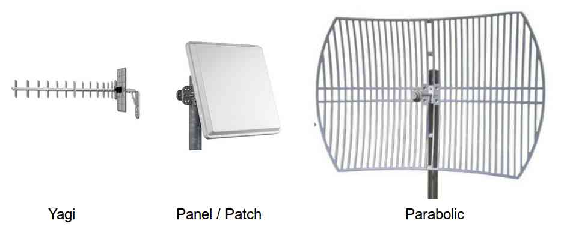

.. _choosing-antenna:

===================
Choosing an Antenna
===================

Your choice of directional antenna will most likely be based upon:

-  size and weight limitations
-  desired transmission distance
-  radio frequency (the antenna should be designed for the radio's frequency)
-  cost

    Images courtesy of `moonblink.com <http://www.moonblink.com/store/cat-900-mhz-wireless-networking-antennas.cfm>`__

Antenna dBi and transmission distance
=====================================

Antennas with higher dBi values will be able to transmit further. A
general rule of thumb (gathered from
`fpvlab.com <http://fpvlab.com/forums/showthread.php?4683-Formula-to-calculate-distance-from-antennas-gains&p=78052&viewfull=1#post78052>`__
and `zytrax.com <http://www.zytrax.com/tech/wireless/calc.htm>`__) is:

-  increasing the antenna gain by 6dBi (i.e. from 2dBi to 8dBi) will double the range
-  increasing the transmitter power by 4x (i.e. from 20mW to 80mW) will double the range

The standard :ref:`3DR radio <copter:common-sik-telemetry-radio>` comes with a 2dBi antenna.

Where to buy
============

Below are some retailers/antennas that users have reported success with:

-  `AirMax 900 16dBi Yagi antenna from ubiquitiwarehouse.com.au <http://ubiquitiwarehouse.com.au/product_info.php?products_id=133&osCsid=154e266c33243489ed9371eb183caf78>`__
   (Australia)
-  `L-Com 900Mhz 8dBi flat patch antenna from readymaderc.com <https://www.readymaderc.com/products/details/900-mhz-8-dbi-flat-patch-antenna-4ft-sma-male-connector>`__
   (USA) (`requires RP SMA female to SMA female adapter <http://www.readymaderc.com/store/index.php?main_page=product_info&cPath=11_45_58&products_id=432>`__)
