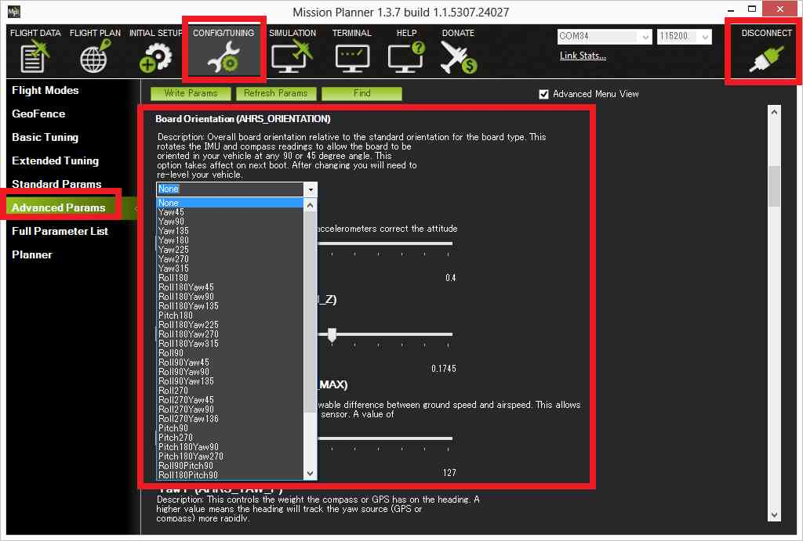
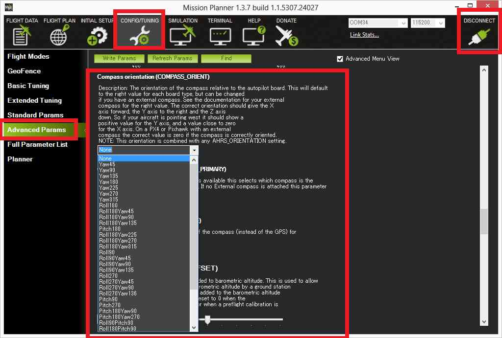
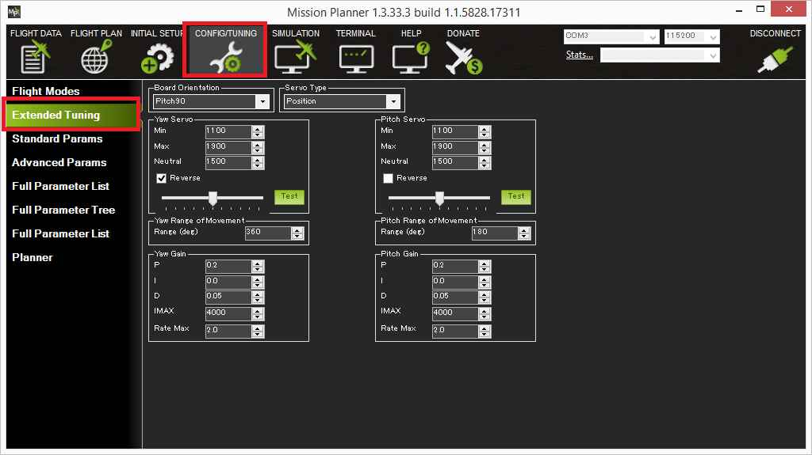

.. _configuration:

=============
Configuration
=============

The antenna tracker requires much of the same basic configuration as
Copter and Plane and then some specific configuration specific to the
antenna tracker. Below are the details of this set-up.

.. _configuration_setting_the_ahrs_orientation:

Setting the AHRS orientation
============================

If the flight controller board could not be mounted so that its forward
direction is aligned with the antenna (as mentioned on the :ref:`Assembling a frame page <frame-assembly>`) the AHRS_ORIENTATION parameter should
be set from the Mission Planner's Config/Tuning >> Advanced Params
screen.

Some commonly used values include:

-  Pitch90 : the flight controller is pointing up at 90 degrees compared
   to the direction of the antenna
-  Pitch270 : the flight controller is pointing down at 90 degrees
   compared to the direction of the antenna

Accelerometer Calibration
=========================

The :ref:`accelerometer calibration <copter:common-accelerometer-calibration>`
is the same as for Copter meaning the flight controller board should be
connected to the Mission planner and then the **Initial Setup \|
Mandatory Hardware \| Accel Calibration** routine should be run which
involves holding the board in 6 separate orientations positions so that
offsets and scaling can be calculated.

.. _configuration_setting_the_compass_orientation:

Setting the Compass orientation
===============================

If an external GPS+compass module is being used but the arrow on the
case could not be aligned so as to point in the same direction as the
antenna, the COMPASS_ORIENTATION parameter should be set.

Some more commonly used values include:

-  Yaw 90 : the arrow on the compass module is pointing off to the right
   at a 90 degree angle clockwise from the direction the antenna is
   pointing.
-  Yaw 270: the arrow is pointing to the left at 90degrees from the
   antenna. I.e. the arrow is rotated at 90deg counter-clockwise from
   where the antenna is pointed.

Compass Calibration
===================

The :ref:`compass calibration <copter:common-compass-calibration-in-mission-planner>`
can be done using the same method as Copter.  Open the Mission Planner's
Initial Setup >> Mandatory Hardware >> Compass screen and push the "Live
Calibration" button and rotate the board until the mission planner says
it has captured enough points to correctly calculate the offsets.

Setting the servo and range of movement
=======================================

For this section it is best to plug in the battery so that the servos
are powered and push the "arming switch" if present.  Connect with the
Mission Planner, go to the CONFIG/TUNING >> Extended Tuning page.

Setting the Yaw servo's min and max pwm values
----------------------------------------------

The green "Test" buttons on this screen work in conjunction with the
Min, Max field values and the slider position.  If the slider is pushed
all the way to the left and the Test button is pushed, the pwm value in
the "Min" field will be sent to the servo.  If the slider is pushed all
the way to the right and the Test button is pushed, the pwm value in the
Max field will be sent to the servo.

If the Yaw (aka pan) servo's minimum and maximum pwm values are known,
they can simply be entered into the Yaw Servo Min and Max fields.  If
they are not know, you can discover them through experimentation.  For
example to discover the minimum, push the slider all the way to the left
and then enter progressively lower pwm values (pushing the Test button
after each change) until you discover the lowest value that causes the
servos to move. Repeat for the Max field by pushing the slider all the
way to the right and entering progressively higher pwm values.

Normally lower pwm values should cause the tracker to point to the right
(i.e. clockwise), higher values will point to the left (i.e.
counter-clockwise).  If this is not the case, the "Reverse" checkbox
should be checked.  Note that changing this checkbox will not affect how
the tracker operates when using the Test button.

The Neutral field is the value that will be output to the servos when
the tracker first begins controlling them after startup.

Setting the Yaw servo's range of movement
-----------------------------------------

In this step we want to discover the heading change that comes from
moving the servos between their minimum and maximum  values. One way to
do this is to:

-  Put the slider all the way to the left (if the Reverse checkbox is
   unchecked) or right (if the Reverse checkbox is checked) and push the
   Test button
-  Rotate the tracker so that its heading (on the MP's Flight Data
   screen) shows close to "0" (i.e. North)
-  Return to the extended tuning page, push the slider all the way to
   the other extreme and push Test
-  The new heading back on the Flight Data screen is the range of
   movement and should be entered into the "Range of movement field".

Setting the Pitch servo's range of movement pwm values
------------------------------------------------------

Repeat the procedures described above to discover the Yaw servo's min
and max values except using the fields and buttons in the "Pitch Servo"
section of the Extended Tuning screen.

Lower pwm values should cause the tracker to aim down, higher pwm values
to aim up.  If this is not the case, the "Reverse" checkbox should be
checked.

Setting the Pitch servo's range of movement
-------------------------------------------

Repeat the procedures used to discover the Yaw servo's range of movement
except that the difference in the Pitch values shown on the Mission
Planner's Flight Data screen should be used.

Manually setting the parameters
-------------------------------

If the mission planner is not being used the parameters below can be
updated manually:

RC1\_ parameters control the pan (aka yaw) servo

RC1_MIN : min pwm value that can be sent to the pan servo

RC1_MAX : max pwm value that can be sent to the pan servo

RC1_REV : set to "-1" if the tracker rotates in the wrong direction

RC2\_ parameters control the tilt (aka pitch) servo

RC2_MIN : min pwm value that can be sent to the tilt servo

RC2_MAX : max pwm value that can be sent to the tilt servo

RC2_REV : set to "-1" if the tracker tilts in the wrong direction (i.e.
tilts down when vehicle is above tracker)

.. tip::

   For continuous rotation set YAW_RANGE equal to 360.  Make sure you
   hardware setup (i.e. the cabling) can handle the tracker turning
   continuous circles.

Tuning
======

YAW2SRV_P, I and D values are set the pan control's gains.

PITCH2SRV_P, I and D values are set the tilt control's gains.
