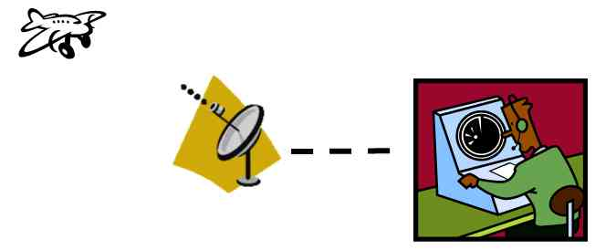
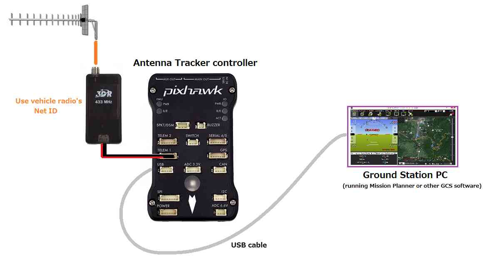
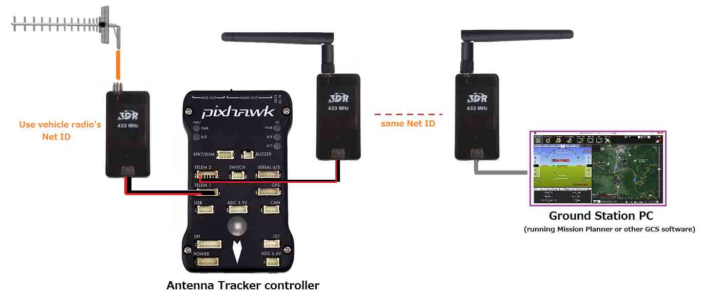

.. _connecting-with-gcs:

===================
Connecting with GCS
===================

This article explains the different mechanisms for connecting the
Antenna Tracker to a GCS (or even multiple GCSs at the same time).

Overview
========

There are a number ways that the Antenna Tracker's connection with the
vehicle can be made accessible to a GCS:

-  Connect a USB cable from the antenna tracker control board to the GCS
   machine
-  Connect a 2nd pair of radios between the antenna tracker control
   board and the GCS machine
-  Connect one additional radio and use the experimental multi-point SiK
   radio software
-  Connect a :ref:`companion computer <dev:companion-computers>` and
   set-up a WiFi access point

Connect with a USB cable
========================

You can simply connect your ground station computer to the autopilot
using a long micro USB cable.

Connect a 2nd pair of radios
============================

A second pair of radios (or even a :ref:`bluetooth data link <copter:common-mission-planner-bluetooth-connectivity>`)
can be used to connect the Antenna Tracker controller to the PC running
the ground station.  

If using a :ref:`SIK radio <copter:common-sik-telemetry-radio>`
the Net IDs of the radios connecting the Antenna Tracker to the PC
should be different than the Net IDs for the radio connecting the vehicle
to the Antenna Tracker. Net IDs can be changed by :ref:`configuring <common-configuring-a-telemetry-radio-using-mission-planner>` them in Mission Planner.

Connect one more radio and use multi-point SiK radio software
=============================================================

Connect a companion computer and set-up a wifi access point
===========================================================
