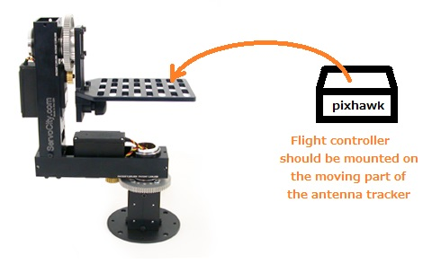
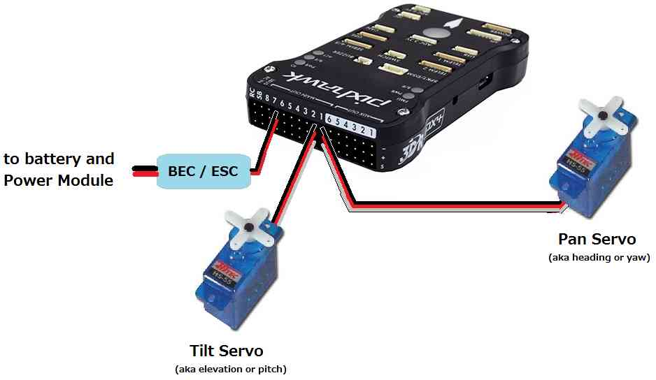
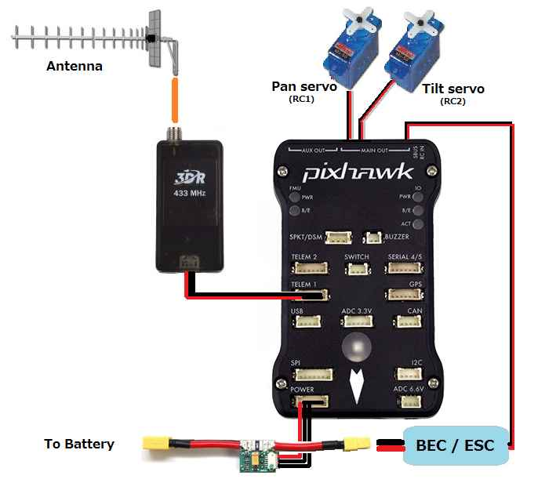

.. _frame-assembly:

==============
Frame Assembly
==============

Any servo based Pan & Tilt gimbal should work.  Ideally the system
should allow 180 degrees of pan rotation in both directions and
90degrees of pitch both up and down.

The servos used can either be regular servos that translate the PWM
input into an absolute angle or continuous rotation servos.

Recommended Frames
==================

The following have been tested and shown to work:

-  `Eagle Eyes Antenna Tracker <http://www.readymaderc.com/store/index.php?main_page=product_info&cPath=11_27&products_id=96>`__

These systems also likely work:

-  `Servo City PT785-S Pan & Tilt System <http://www.servocity.com/html/pt785-s_pan___tilt_system.html#.U_BL3I8c038>`__

Mounting the flight controller board
====================================

The flight controller board (i.e. Pixhawk, APM2, etc) should be mounted
on the moving part of the antenna tracker.

If possible align the front of the flight controller so that it points
exactly in the direction that the antenna is most sensitive.  So for
example, if using a Pixhawk controller and a Yagi antenna, the arrow on
the top of the Pixhawk should point in the same direction as the
antenna.

Alternatively the flight controller can be mounted at any 45deg or 90deg
angle to the antenna and then the AHRS_ORIENTATION parameter can be
changed to account for the difference.  :ref:`See the configuration page for more details <configuration_setting_the_ahrs_orientation>`.

Connecting the servos
=====================

The Pan servo (controls the tracker's heading or yaw) should be
connected to RC1, the Tilt servo (controls elevation or pitch) should be
connected to RC2. A BEC or ESC should be connected to any of the other
RC outputs as shown to provide power for the servos.

Connecting the radio and antenna
================================

The Antenna should be attached to the radio after first removing the
radio's di-pole antenna.  Note that the 3DR and RFD900 radios have a RP
SMA Male adapter (RP = reverse polarity) while antennas can come with a
number of different connectors meaning an adapter (such as `this RP SMA Female to SMA Female adapter <http://www.readymaderc.com/store/index.php?main_page=product_info&cPath=11_45_58&products_id=432>`__)
may be required.

Mounting the GPS and external compass
=====================================

If using a GPS+compass module it should be mounted so that the arrow on
the module points in the same direction as the antenna. If this is not
convenient, the COMPASS_ORIENT parameter can be used to account for
this. :ref:`See the configuration page for more details <configuration_setting_the_compass_orientation>`.  Care
should be taken to ensure the compass is not close to any metal objects.

If using a stand-alone GPS (i.e. not an integrated GPS+compass) the GPS
should be positioned so that its antenna has a clear view of the sky.
Its heading is not important. Some care should be taken to ensure the
cable connected to the flight controller cannot become tangled.
