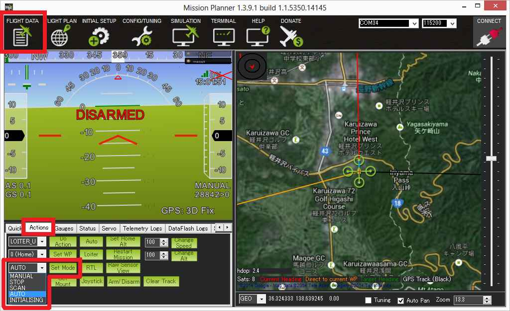

.. _how-to-operate:

==============
How to Operate
==============

This page shows how to control the antenna tracker, mostly using the
Mission Planner.

Control Modes
=============

There are five modes that you can place the antenna tracker in:

-  **Manual**: the operator directly controls the pan and tilt of the
   antenna tracker to manually point it at the vehicle
-  **Stop**: the tracker does not move
-  **Scan**: the tracker automatically scans looking for the vehicle
-  **Auto**: the tracker attempts to track the vehicle, scanning if it
   ever loses contact
-  **Servo_Test**: the servos are moved to the pwm values specified by
   a do-set-servo MAVLink command.  Used by the mission planner's
   extended tuning screen when the user pushes the "test" buttons.

The operator can set the current mode from the Mission Planner's Flight
Data screen's Actions tab's Set Mode button..

