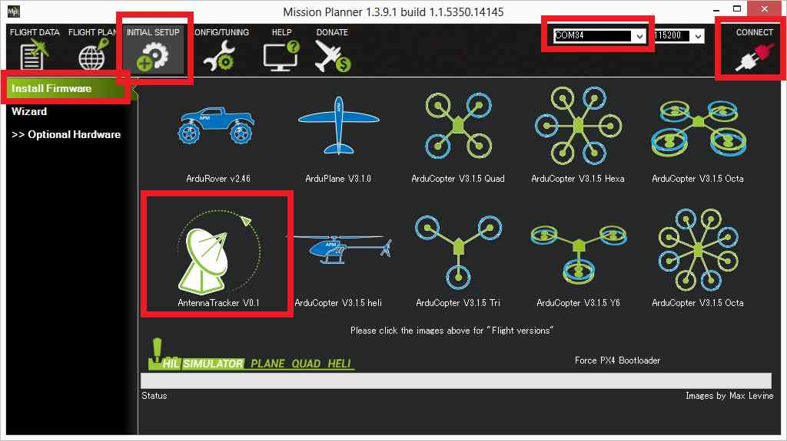

.. _loading-the-firmware:

====================
Loading the Firmware
====================

Before loading Firmware, you need to choose which :ref:`autopilot hardware <common-autopilots>` to use.
All supported autopilots are suitable for use with AntennaTracker.
The antenna tracker firmware can be loaded from the Mission Planner's
**Setup \| Install Firmware** very :ref:`much like any other vehicle <common-loading-firmware-onto-pixhawk>` if ArduPilot firmware is already loaded.

-  Connect the flight control board to the computer using the mini USB cable
-  Select the appropriate COM port on the top right of the screen but do
   not push the Connect button
-  From the **Initial Setup \| Install Firmware** page click on the
   "Antenna Tracker" icon on the bottom left.  Follow any instructions
   that appear and after a minute or so the firmware should be uploaded
   and you should be able to connect with the mission planner and see
   the Flight Data screen's HUD update.
   
If non-ArduPilot firmware is loaded on the autopilot, see :ref:`these instructions <common-loading-firmware-onto-chibios-only-boards>` for instructions to download a version of antennatracker_with_bl.hex firmware and install.

.. note::

   Because the EEPROM format is different between the Antenna Tracker
   firmware and any flight controller software that was previously
   installed on the board (i.e. Copter or Plane) it is likely the EEPROM
   will have been erased by the firmware upload.

