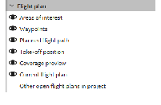
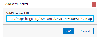

.. _omc-user-manual:

====================================
OPEN MISSION CONTROL SOFTWARE v1.6.0
====================================

March 2019

.. raw:: html

   

.. rubric:: TABLE OF CONTENTS
   :name: table-of-contents
   :class: Manual-Page-Title

`1. Overview <#s1>`__

`1.1. What Is Open Mission Control Software? <#s11>`__

`1.2. Main Steps of a Project Workflow <#s12>`__

`1.3. System Requirements <#s13>`__

`1.4. Starting Open Mission Control Software <#s14>`__

`1.5. User Interface <#s15>`__

`1.5.1. Main Menu <#s151>`__

`1.5.2. Navigation Menu <#s152>`__

`1.5.3. Map <#s153>`__

`1.5.4. Sidebar <#s154>`__

`2. Intended Use and Safety Information <#s2>`__

`2.1. Additional Manual <#s21>`__

`2.2. Intended Use <#s22>`__

`2.3. Remote Control <#s23>`__

`2.4. Software Feature Packages <#s24>`__

`3. Planning a Flight <#s3>`__

`3.1. Overview and Main Steps <#s31>`__

`3.2. Define Area of Interest <#s32>`__

`3.2.1. Polygon <#s321>`__

`3.2.2. Corridor <#s322>`__

`3.2.3. City Grid <#s323>`__

`3.2.4. Square Spiral <#s324>`__

`3.2.5. Tower <#s325>`__

`3.2.6. Building <#s326>`__

`3.2.7. Facade <#s327>`__

`3.2.8. Circle of Interest <#s328>`__

`3.2.9. Panorama <#s329>`__

`3.2.10. Flight Line Indicators <#s3210>`__

`3.3. Define Settings for Take-off Position <#s33>`__

`3.4. Define Emergency Actions <#s34>`__

`3.5. Define General Plan Settings <#s35>`__

`3.6. Select Hardware <#s36>`__

`3.7. Flight Plan Summary <#s37>`__

`3.8. Resolve Warnings <#s38>`__

`3.9. Save a Flight Plan <#s39>`__

`4. Export Flight Plan to Intel® Cockpit Controller <#s4>`__

`5. Previewing, Filtering and Exporting of Recorded Fight Data <#s5>`__

`5.1. Overview and Main Steps <#s51>`__

`5.2. Transfer Data from SD Card to Computer <#s52>`__

`5.3. Preview Data <#s53>`__

`5.4. Define Filter for Source Data <#s54>`__

`5.4.1. Filter by Image Parameters <#s541>`__

`5.4.2. Filter by Area <#s542>`__

`5.5. Check Statistics <#s55>`__

`5.6. Check Hardware Settings <#s56>`__

`5.7. Export Data <#s57>`__

`6. Configuring the Application <#s6>`__

`6.1. Map Layers <#s61>`__

`6.1.1. WMS Server <#s611>`__

`6.1.2. KML/SHP <#s612>`__

`6.1.3. GeoTIFF <#s613>`__

`6.2. Settings <#s62>`__

`6.2.1. General <#s621>`__

`6.2.2. Proxy Settings <#s622>`__

`6.2.3. Surface and Airspace Data <#s623>`__

`6.2.4. Display <#s624>`__

`6.2.5. Folder Locations <#s625>`__

`7. Glossary <#s7>`__

.. raw:: html

   

.. raw:: html

   

.. rubric:: Overview
   :name: s1
   :class: Manual-Heading-1

.. raw:: html

   

.. rubric:: What Is Open Mission Control Software?
   :name: s11
   :class: Manual-Heading-2

Open Mission Control Software is a software solution to plan and perform
flights. It is designed to support flights for:

-  *Inspection Usage* , for example: cell towers, buildings, bridges,
   power lines, pipelines, railways
-  *Survey Usage* , for example: city planning, constructions, mining
-  *Agricultural Usage* , for example: plant counting, crop detection,
   disease detection

The application leads you through the steps to plan your flight and to
preview and export flight data. You can set up your project in advance
before going out to the field.

Open Mission Control Software is intended to support the following
Unmanned Aerial Vehicles (UAV):

-  Intel® Falcon™ 8+ UAS with enabled survey software feature package.

.. raw:: html

   

.. raw:: html

   

.. rubric:: Main Steps of a Project Workflow
   :name: s12
   :class: Manual-Heading-2

The structure of this manual follows the main steps to plan and perform
a project. Each main step is covered in a specific chapter. Each chapter
includes detailed instructions and further information for the required
settings for the step noted.

The main steps to perform a project are:

#. *`See Planning a Flight <#s3>`__*
#. `See Export Flight Plan to Intel® Cockpit Controller <#s4>`__
#. *`See Previewing, Filtering and Exporting of Recorded Fight
   Data <#s5>`__*

.. raw:: html

   

.. raw:: html

   

.. rubric:: System Requirements
   :name: s13
   :class: Manual-Heading-2

.. rubric:: System requirements
   :name: system-requirements
   :class: Manual-TableTitle-1

+--------------------------------------+--------------------------------------+
| Component                            | Requirement                          |
+======================================+======================================+
| *Operating System*                   | 64-bit Microsoft Windows 10          |
+--------------------------------------+--------------------------------------+
| *Java VM*                            | Open Mission Control Software        |
|                                      | contains its own Java VM, so no      |
|                                      | separate installation of Java is     |
|                                      | necessary.                           |
+--------------------------------------+--------------------------------------+
| *3D Graphics Card*                   | -  Graphics card with 400 GFLOPS or  |
|                                      |    higher                            |
|                                      |    (e.g. Intel® HD Graphics 515,     |
|                                      |    Intel® HD Graphics 5300)          |
|                                      | -  Intel® driver recommended         |
|                                      | -  OpenGL support                    |
+--------------------------------------+--------------------------------------+
| *RAM*                                | -  8 GB (Minimum)                    |
|                                      | -  16 GB (Recommended)               |
+--------------------------------------+--------------------------------------+
| *CPU*                                | 2 GHz Multicore (Minimum)            |
+--------------------------------------+--------------------------------------+
| *Disk Space*                         | 5 GB Free Disk Space (Minimum)       |
|                                      |                                      |
|                                      | *NOTE:* The image workflow may       |
|                                      | require several GB of data for each  |
|                                      | flight.                              |
+--------------------------------------+--------------------------------------+
| *Internet connection*                | An Internet connection is needed to  |
|                                      | download map data.                   |
+--------------------------------------+--------------------------------------+
| *Mouse*                              | A mouse with two buttons and         |
|                                      | scrolling wheel is recommended for   |
|                                      | easier map operation.                |
+--------------------------------------+--------------------------------------+
| Intel® Falcon™ 8+ UAS firmware       | Version 1.7 or higher                |
| version                              |                                      |
+--------------------------------------+--------------------------------------+
| Intel® Falcon™ 8+ UAS software       | Enabled Survey Package               |
| package                              |                                      |
+--------------------------------------+--------------------------------------+

+--------------------------------------+--------------------------------------+
| NOTE                                 | If you have a dedicated graphics     |
|                                      | card in your laptop or PC, please    |
|                                      | make sure it is enabled and          |
|                                      | activated for use with Open Mission  |
|                                      | Control Software.                    |
+--------------------------------------+--------------------------------------+

.. raw:: html

   

.. raw:: html

   

.. rubric:: Starting Open Mission Control Software
   :name: s14
   :class: Manual-Heading-2

After successful installation, you will find the Open Mission Control
Software icon on your desktop, as well as the Open Mission Control
Software entry on the Windows start menu.

Double-click the Open Mission Control Software icon on your desktop or
select the Open Mission Control Software entry on the Windows start menu
to start the program.

The application starts with the Welcome screen. See `See User
Interface <#s15>`__ to learn more about the user interface of Open
Mission Control Software.

If you start Open Mission Control Software, you will find a menu at the
bottom of the right *sidebar* that allows you to become familiar with
the application and to get additional help.

#. Get to know Open Mission Control Software

.. raw:: html

   

|image0|

.. raw:: html

   

The following functions are provided:

-  *Open demo project:* Opens a complete defined demo project for your
   first experience of learning how Open Mission Control Software works.
-  *Read user manual:* Opens this user manual.
-  *Quick start guide* : Opens a quick instruction to show in a few
   steps how to work with Open Mission Control Software.
-  *Contact support* : Opens a form to contact Intel support.

.. raw:: html

   

.. raw:: html

   

.. rubric:: User Interface
   :name: s15
   :class: Manual-Heading-2

The following figure shows the user interface of Open Mission Control
Software. Below is a description of the main areas.

#. Open Mission Control Software main screen

.. raw:: html

   

|image1|

.. raw:: html

   

.. rubric:: Areas of the Open Mission Control Software main screen
   :name: areas-of-the-open-mission-control-software-main-screen
   :class: Manual-TableTitle-1

+--------------------------+--------------------------+--------------------------+
|                          | Area name                | Content                  |
+==========================+==========================+==========================+
| 1                        | Main menu                | Provides general         |
|                          |                          | functions to:            |
|                          |                          |                          |
|                          |                          | -  Project               |
|                          |                          | -  Flight plan           |
|                          |                          | -  Dataset               |
|                          |                          | -  Help                  |
|                          |                          | -  Application functions |
|                          |                          |    (minimize, maximize,  |
|                          |                          |    and close)            |
|                          |                          |                          |
|                          |                          | For details, see `See    |
|                          |                          | Main Menu <#s151>`__.    |
+--------------------------+--------------------------+--------------------------+
| 2                        | *Navigation menu*        | Provides the following   |
|                          |                          | sub-menus:               |
|                          |                          |                          |
|                          |                          | -  Top area:             |
|                          |                          | -  Planning              |
|                          |                          | -  Data preview          |
|                          |                          | -  Bottom area:          |
|                          |                          | -  Contact support       |
|                          |                          | -  Map layers            |
|                          |                          | -  Settings              |
+--------------------------+--------------------------+--------------------------+
| 3                        | *Map & Toolbar*          | Provides the following   |
|                          |                          | functions:               |
|                          |                          |                          |
|                          |                          | -  Displays map          |
|                          |                          |    according to the      |
|                          |                          |    settings in the Map   |
|                          |                          |    Layers                |
|                          |                          | -  Displays the defined  |
|                          |                          |    area of interest      |
|                          |                          |    (AOI)                 |
|                          |                          | -  Previews of recorded  |
|                          |                          |    flight data           |
|                          |                          | -  Tools to navigate on  |
|                          |                          |    the map               |
+--------------------------+--------------------------+--------------------------+
| 4                        | *Sidebar*                | Provides functions,      |
|                          |                          | entry fields and         |
|                          |                          | detailed information     |
|                          |                          | according to the         |
|                          |                          | selected mode on the     |
|                          |                          | *Navigation menu.*       |
+--------------------------+--------------------------+--------------------------+

.. raw:: html

   

.. raw:: html

   

.. raw:: html

   

.. raw:: html

   

.. rubric:: Main Menu
   :name: s151
   :class: Manual-Heading-3

The main menu is embedded in the window border at the top left of the
application window. *T* he main menu provides general functions for use
in handling project files, flight plans, datasets, getting support and
exiting the application. The accessibility of some functions depends on
the selected mode.

.. rubric:: Main menu
   :name: main-menu
   :class: Manual-TableTitle-1

+--------------------------------------+--------------------------------------+
| Menu – Sub-menu                      | Function                             |
+======================================+======================================+
| #. Main menu – Project               | -  Create, open, close, clone and    |
|                                      |    rename a project                  |
| |image2|                             | -  Open your local project folder    |
|                                      |    with your system‘s default file   |
|                                      |    browser                           |
|                                      | -  Quit the application              |
+--------------------------------------+--------------------------------------+
| #. Main menu – Flight plan           | -  Create, open, close, save, clone, |
|                                      |    rename and export a flight plan   |
| |image3|                             | -  Recompute the flight lines        |
|                                      | -  Open your local flight plan       |
|                                      |    folder with your system‘s default |
|                                      |    file browser                      |
|                                      | -  Revert changes                    |
+--------------------------------------+--------------------------------------+
| #. Main menu – Dataset               | -  Create, open, close and save a    |
|                                      |    dataset                           |
| |image4|                             | -  Export dataset files (to an       |
|                                      |    application)                      |
|                                      | -  Open your local dataset folder    |
|                                      |    with your system‘s default file   |
|                                      |    browser                           |
+--------------------------------------+--------------------------------------+
| #. Main menu – Help                  | -  Read the user manual or the quick |
|                                      |    start guide                       |
| |image5|                             | -  Open the demo project             |
|                                      | -  Contact support or upload old     |
|                                      |    support requests                  |
|                                      | -  Get general information about     |
|                                      |    Open Mission Control Software     |
+--------------------------------------+--------------------------------------+

.. raw:: html

   

.. raw:: html

   

.. rubric:: Navigation Menu
   :name: s152
   :class: Manual-Heading-3

The *Navigation menu* provides two menus – one in the top area and one
in the bottom area of the left sidebar of the image (see `See Open
Mission Control Software main screen <#s15>`__).

The top menu provides the modes for the main project steps in a logical
sequence. If you select a menu item, the functions and settings that
correspond to that item will appear to the right in the *sidebar* .

The bottom menu provides additional settings to define map and general
settings. If you select a menu item, a new menu with the corresponding
functions and settings in that new menu opens to the right of that
sidebar.

Click |image6| in the upper left corner to expand the *Navigation menu*
.

.. rubric:: Navigation menu (top area)
   :name: navigation-menu-top-area
   :class: Manual-TableTitle-1

+--------------------------------------+--------------------------------------+
| #. Navigation menu (top area)        | -  *Planning:* First step of a       |
|                                      |    project. If selected, all         |
| |image7|                             |    functions and settings for        |
|                                      |    planning a project are provided   |
|                                      |    in the *sidebar* ;                |
|                                      |    see `See Planning a               |
|                                      |    Flight <#s3>`__.                  |
|                                      | -  *Data preview:* If selected, all  |
|                                      |    functions to preview, filter and  |
|                                      |    export the recorded flight data   |
|                                      |    are provided in the *sidebar* ;   |
|                                      |    see `See Previewing, Filtering    |
|                                      |    and Exporting of Recorded Fight   |
|                                      |    Data <#s5>`__.                    |
+--------------------------------------+--------------------------------------+

.. rubric:: Navigation menu (bottom area)
   :name: navigation-menu-bottom-area
   :class: Manual-TableTitle-1

+--------------------------------------+--------------------------------------+
| #. Navigation menu (bottom area)     | -  *Contact support:* Opens a window |
|                                      |    to report a problem to the        |
| |image8|                             |    support.                          |
|                                      | -  *Map layers:* Several layers      |
|                                      |    provide different kinds of        |
|                                      |    information that can be hidden or |
|                                      |    displayed. This allows you to     |
|                                      |    adapt the map according to your   |
|                                      |    project; see `See Map             |
|                                      |    Layers <#s61>`__.                 |
|                                      | -  *Settings:* Provides several      |
|                                      |    types of settings to customize    |
|                                      |    the application to your           |
|                                      |    environment and your practices;   |
|                                      |    see `See Settings <#s62>`__.      |
+--------------------------------------+--------------------------------------+

.. raw:: html

   

.. raw:: html

   

.. rubric:: Map
   :name: 153
   :class: Manual-Heading-3

The *Map* shows the currently selected area of interest. Within this
pane, choose the location of your project and define the area of
interest (AOI). Several functions in the tool bar help you to navigate
within the map and to select the desired area. Use these functions by
selecting the corresponding buttons to the right side of the *map* or
directly by several mouse functions.

General mouse functions

The following functions on the map are accessible via the mouse:

.. rubric:: General mouse functions
   :name: general-mouse-functions
   :class: Manual-TableTitle-1

+--------------------------------------+--------------------------------------+
| Action                               | Function                             |
+======================================+======================================+
| Click and drag                       | Move the entire map                  |
+--------------------------------------+--------------------------------------+
| | Right-click and drag or            | -  Upwards or downwards: Tilt the    |
| | hold shift and click               |    entire map (only available in 3D  |
| | and drag                           |    mode).                            |
|                                      | -  Left or right: Rotate the entire  |
|                                      |    map.                              |
+--------------------------------------+--------------------------------------+
| Scroll or middle-click and drag      | Zoom in or zoom out                  |
+--------------------------------------+--------------------------------------+

Toolbar in planning mode

The following functions are available if you are in the planning mode.

.. rubric:: Functions in planning mode
   :name: functions-in-planning-mode
   :class: Manual-TableTitle-1

Button

Description

*Mouse mode*

|image9|  

Ruler to measure distances and the sizes of areas on the map. Click with
the left mouse button to define the start point. Move to the first
measuring point, the distance is displayed. If you add a third measuring
point (or more), the size of the covered area is displayed. Click the
right mouse button to stop measuring.

*View mode*

|image10|  

Switches the map to 2D mode. The map can be moved upwards and downwards,
to the left and to the right and diagonally. Click and move to drag the
map. Right-click and move to rotate the map.

|image11|  

| Switches the map to 3D mode. In addition to the 2D mode, the map can
  be rotated and tilted. Click and press *shift key* or right-click for
  this.
| If you move the mouse upwards or downwards, the map is tilted.
| If you move the mouse to the left or to the right, the map is rotated
  (Only if Constant direction of rotating and tilting is selected in the
  settings, see `See General <#s621>`__).

|image12|  

Center around your current location and reset orientation, so that North
points upwards. Determined by your chosen project or dataset.

|image13|  

Zooms in to get higher resolution and more details. You can therefore
also use the scrolling wheel of your mouse.

|image14|  

Zooms out to get more overview of the area. You can therefore also use
the scrolling wheel of your mouse.

Search field, additional information and icons on the map pane

.. rubric:: Additional fields and information
   :name: additional-fields-and-information
   :class: Manual-TableTitle-1

+--------------------------------------+--------------------------------------+
| Field/Information                    | Description                          |
+======================================+======================================+
| |image15|                            | Search: Allows you to find locations |
|                                      | on the map. Enter the place name of  |
|                                      | the location in the search field and |
|                                      | click on the magnifier to start the  |
|                                      | search. The requested place is       |
|                                      | centered on the map.                 |
+--------------------------------------+--------------------------------------+
| |image16|                            | *Compass rose:* The red arrow leads  |
|                                      | to the north direction of the map.   |
|                                      | This is helpful, especially if you   |
|                                      | rotate the map in 3D mode.           |
+--------------------------------------+--------------------------------------+
| |image17|                            | Coverage: Gives information on the   |
|                                      | meaning of the coverage preview      |
|                                      | colors if coverage preview is        |
|                                      | activated.                           |
+--------------------------------------+--------------------------------------+
| |image18|                            | *Scale ruler:* This ruler shows the  |
|                                      | current scale of the map and helps   |
|                                      | you to estimate the real dimensions  |
|                                      | of the selected area.                |
+--------------------------------------+--------------------------------------+
| |image19|                            | Coordinates: Shows the current       |
|                                      | coordinates and the coordinate       |
|                                      | system. Click to change coordinates  |
|                                      | manually.                            |
+--------------------------------------+--------------------------------------+
| |image20|                            | *Background Task* s: Indicates by    |
|                                      | rotating if there are currently any  |
|                                      | running background tasks. Click on   |
|                                      | the circular arrow to get            |
|                                      | information on them.                 |
+--------------------------------------+--------------------------------------+

.. rubric:: Icons in planning mode
   :name: icons-in-planning-mode
   :class: Manual-TableTitle-1

+--------------------------------------+--------------------------------------+
| Icon                                 | Description                          |
+======================================+======================================+
| |image21|                            | Take-off position (for details, see  |
|                                      | `See Define Settings for Take-off    |
|                                      | Position <#s33>`__)                  |
+--------------------------------------+--------------------------------------+
| |image22|                            | First waypoint                       |
+--------------------------------------+--------------------------------------+
| |image23|                            | Last waypoint                        |
+--------------------------------------+--------------------------------------+
| |image24|                            | Reference point for altitude (for    |
|                                      | details, see `See Define General     |
|                                      | Plan Settings <#s35>`__)             |
+--------------------------------------+--------------------------------------+

.. raw:: html

   

.. raw:: html

   

.. rubric:: Sidebar
   :name: s154
   :class: Manual-Heading-3

Depending on the selected mode, the options and functions in the sidebar
vary:

-  *Planning:* Leads you through the steps of planning; see `See
   Planning a Flight <#s3>`__.
-  *Data preview:* Allows you to preview, filter and export recorded
   data; see `See Previewing, Filtering and Exporting of Recorded Fight
   Data <#s5>`__

.. raw:: html

   

.. raw:: html

   

.. rubric:: Intended Use and Safety Information
   :name: s2
   :class: Manual-Heading-1

The following sections contain important safety information. Any
personnel operating the Intel® Falcon™ 8+ UAS must read, understand and
accept these warnings and guidelines before operating the Intel® Falcon™
8+ UAS.

Store these instructions so that they are readily available for the
operators.

+--------------------------------------+--------------------------------------+
| .. raw:: html                        | CAUTION: For the safe use of the     |
|                                      | product and prevention of injury to  |
|    
                             | operators and other persons as well  |
|                                      | as prevention of property damage,    |
| |image25|                            | please carefully read and obey these |
|                                      | safety instructions and the entire   |
| .. raw:: html                        | manual before you operate the        |
|                                      | equipment. Clarify any questions you |
|    
                            | have with INTEL® before you operate  |
|                                      | any part of the equipment.           |
+--------------------------------------+--------------------------------------+

Open Mission Control Software is only compatible with Intel® Falcon™ 8+
UAS firmware version 1.7 or higher.

.. raw:: html

   

.. rubric:: Additional Manual
   :name: s21
   :class: Manual-Heading-2

In addition to this User Manual pay attention to all instructions
including safety instructions, in any UAS User Documentation shipped
with or made available to you on purchase of your:

-  `“Intel® Falcon™ 8+ UAS” (download
   at <http://intel.com/falconmanual>`__
   *`http://intel.com/falconmanual <https://intel.com/falconmanual>`__*
   `) <www.intel.com/falconmanual>`__

.. raw:: html

   

.. raw:: html

   

.. rubric:: Intended Use
   :name: s22
   :class: Manual-Heading-2

Open Mission Control Software and Intel® Falcon™ 8+ UAS are intended for
commercial use only, such as for visual inspection of infrastructure,
surveying and mapping for business. It is not intended for any consumer,
recreational use, or hobby use. Acrobatic flight is prohibited.

You must read, understand, and agree to all applicable UAS User
documentation for the Intel® Falcon™ 8+ UAS. By using the Intel® Falcon™
8+ UAS, you certify that you have read and understand all the material
in this document, as well as all user documentation, and agree to abide
by such materials.

You must use the Intel® Falcon™ 8+ UAS only as intended. Always operate
in accordance with the operating limitations stated in the later
sections of this User Manual and the UAS User Documentation for each of
those UAS products.

Operating the Intel® Falcon™ 8+ UAS while ignoring these guidelines and
warnings may fail to comply with all applicable laws and subject you to
civil or criminal liability, or both.

.. raw:: html

   

.. raw:: html

   

.. rubric:: Remote Control
   :name: s23
   :class: Manual-Heading-2

Make sure you have the original remote control enabled and running while
flying, to always enable a handover to an assisted or manual mode while
operating the UAV.

Always make sure that the remote control battery is sufficiently charged
before take-off.

`Never modify any settings. In doubt, refer to the Intel® Falcon™ 8+ UAS
User Manual available at <http://intel.com/falconmanual>`__
*`http://intel.com/falconmanual <https://intel.com/falconmanual>`__* .

.. raw:: html

   

.. raw:: html

   

.. rubric:: Software Feature Packages
   :name: s24
   :class: Manual-Heading-2

Open Mission Control Software is intended for all users of Intel®
Falcon™ 8+ UAS with enabled Survey Package. See the Intel® Falcon™ 8+
UAS User Manual for further information on software feature packages.

.. raw:: html

   

.. raw:: html

   

.. raw:: html

   

.. rubric:: Planning a Flight
   :name: s3
   :class: Manual-Heading-1

.. raw:: html

   

.. rubric:: Overview and Main Steps
   :name: s31
   :class: Manual-Heading-2

To plan a flight, use the planning mode of Open Mission Control
Software. In the *Navigation menu,* all necessary settings are provided
in a logical planning sequence. Upon you finishing each step, the
settings will display the next step. This leads you through the planning
process and helps you to consider all available settings.

In the final step, Open Mission Control Software calculates a flight
plan that can be saved for later use or exported.

+--------------------------------------+--------------------------------------+
| NOTE                                 | Open Mission Control Software        |
|                                      | validates the flight plan by         |
|                                      | computing summary statistics, such   |
|                                      | as but not limited to total          |
|                                      | flight-time, deviation from desired  |
|                                      | overlap or ground sample distance,   |
|                                      | and possible airspace violations.    |
|                                      |                                      |
|                                      | These warnings may not be all        |
|                                      | encompassing and it is the           |
|                                      | responsibility of the                |
|                                      | pilot-in-command/operator to assure  |
|                                      | safe flight-conditions.              |
|                                      |                                      |
|                                      | To remedy possible warnings, see     |
|                                      | `See Resolve Warnings <#s38>`__.     |
+--------------------------------------+--------------------------------------+

Map data

Open Mission Control Software downloads map data from the Internet and
saves them locally. As long as there is no Internet connection
established, the locally saved data remain valid, but as soon as there
is one established, Open Mission Control Software starts automatically
to delete and re-download the previously saved data.

+--------------------------------------+--------------------------------------+
| NOTE                                 | Without the flight plan relevant map |
|                                      | data, you cannot perform the         |
|                                      | project.                             |
|                                      |                                      |
|                                      | This issue might occur if you want   |
|                                      | to perform the flight weeks after    |
|                                      | the last modification of the         |
|                                      | project, when you are at a location  |
|                                      | where you only have a bad Internet   |
|                                      | connection established and not       |
|                                      | sufficient for Open Mission Control  |
|                                      | Softwares‘ automatic re-download of  |
|                                      | the map data.                        |
|                                      |                                      |
|                                      | Prior to going out into the field,   |
|                                      | ensure that you have all relevant    |
|                                      | map data saved, and respectively in  |
|                                      | this scenario, do not establish an   |
|                                      | Internet connection or disable       |
|                                      | Update maps when online, see `See    |
|                                      | General <#s621>`__.                  |
+--------------------------------------+--------------------------------------+

Perform the following steps to create and perform a project:

#. Select and Open or Clone an existing project or create a New project
   in the Sidebar menu (click on\ |image26| to open a project from your
   computer; for details, see `See Folder Locations <#s625>`__):

#. Projects

.. raw:: html

   

|image27|

.. raw:: html

   

#. Select *Planning* in the *Navigation menu (top)* .
#. Move the map to the area where your project is located or use the
   search function to identify the desired location, see `See Search
   field, additional information and icons on the map pane <#z75769>`__.
#. Zoom in to get a sufficient resolution of the project area.
#. Select a hardware preset matching the UAV, the camera, and the lens
   that you use in the upper pull down menu in the *Sidebar menu (top)*
   :
#. Planning template

.. raw:: html

   

|image28|

.. raw:: html

   

#. Select the flight behavior you want to use in the lower pull down
   menu in the *Sidebar menu (top)* . Choose between Follow terrain
   surface and Fly straight lines (for details, see `See Define General
   Plan Settings <#s35>`__).
#. Click *Start planning* in the *Sidebar* . Several objects for survey,
   inspection, and restrictions and manual waypoints are provided.
#. Rename the project by clicking on\ |image29| or via Project >
   |image30| Rename....

#. Rename the flight plan via Flight plan >\ |image31| Rename....

#. `See Define Area of Interest <#s32>`__.
#. `See Define Settings for Take-off Position <#s33>`__.
#. `See Define Emergency Actions <#s34>`__.
#. `See Define General Plan Settings <#s35>`__.
#. `See Select Hardware <#s36>`__.
#. `See Flight Plan Summary <#s37>`__.
#. `See Resolve Warnings <#s38>`__
#. `See Save a Flight Plan <#s39>`__.

.. raw:: html

   

.. raw:: html

   

.. rubric:: Define Area of Interest
   :name: s32
   :class: Manual-Heading-2

Choose the desired AOI to create your flight plan:

+--------------------------------------+--------------------------------------+
| #. 2D Areas & 3D Structures          | Refer to the following sections to   |
|                                      | get detailed information on how to   |
| .. raw:: html                        | define each AOI:                     |
|                                      |                                      |
|    
                             | Areas                                |
|                                      |                                      |
| |image32|                            | -  Polygon                           |
|                                      | -  |image33| : see `See              |
| .. raw:: html                        |    Polygon <#s321>`__.               |
|                                      |                                      |
|    
                            | -  Corridor                          |
|                                      | -  |image34| : see `See              |
|                                      |    Corridor <#s322>`__.              |
|                                      |                                      |
|                                      | -  City grid                         |
|                                      | -  |image35| : see `See City         |
|                                      |    Grid <#s323>`__.                  |
|                                      |                                      |
|                                      | -  Square spiral                     |
|                                      | -  |image36| : see `See Square       |
|                                      |    Spiral <#s324>`__.                |
|                                      |                                      |
|                                      |                                      |
|                                      |                                      |
|                                      | Structures                           |
|                                      |                                      |
|                                      | -  Tower                             |
|                                      | -  |image37| : see `See              |
|                                      |    Tower <#s325>`__.                 |
|                                      |                                      |
|                                      | -  Building                          |
|                                      | -  |image38| : see `See              |
|                                      |    Building <#s326>`__.              |
|                                      |                                      |
|                                      | -  Facade                            |
|                                      | -  |image39| : see `See              |
|                                      |    Facade <#s327>`__.                |
|                                      |                                      |
|                                      | -  Circle of interest                |
|                                      | -  |image40| : see `See Circle of    |
|                                      |    Interest <#s328>`__.              |
|                                      |                                      |
|                                      | -  Panorama                          |
|                                      | -  |image41| : see `See              |
|                                      |    Panorama <#s329>`__.              |
+--------------------------------------+--------------------------------------+

.. raw:: html

   

.. rubric:: Polygon
   :name: s321
   :class: Manual-Heading-3

Used to create flight plans to examine polygonal areas (e.g.
agricultural fields).

#. Polygon

.. raw:: html

   

|image42|

.. raw:: html

   

Perform the following steps:

#. Click on the desired points on the map to set vertices.
#. Double-click or return back to the first vertex to finish your AOI.
#. If required, relocate the position of the vertices, add additional
   vertices, or delete vertices:
#. To relocate the position of an existing vertex, click-and-drag the
   vertex to the desired position.
#. To add a new vertex, click on the transparent plus icon\ |image43|
   (always highlighted in the middle between two vertices).

-  To delete a vertex, right-click the vertex.
-  To move the complete AOI, click-and-drag the cross arrow
-  |image44| to the center of your AOI.

#. Configure your AOI via the following settings:

General settings

Expand the AOI field with the name of the AOI (e.g. Polygon 1):

#. General settings polygon

.. raw:: html

   

|image45|

.. raw:: html

   

-  Set the Resolution
-  |image46| or the Altitude above ground |image47| .

-  Set or choose the Flight direction
-  |image48| (counting clockwise):

-  Pick From map orientation to set the flight direction angle according
   to the current map orientation.
-  Pick Providing shortest path to set the flight direction angle
   according to the shortest possible path (minimizes the flight time).
-  Pick Best suited for terrain to set the flight direction best suited
   to the respective terrain.
-  Pick -90° to subtract 90° from the current flight direction angle.
-  Pick +90° to add 90° to the current flight direction.

Click Done to finish the setting and deselect the AOI.

Advanced settings

Click |image49| Edit advanced parameters.

In the General tab:

-  Name the AOI.
-  Set the Resolution
-  |image50| or the Altitude above ground |image51| .

In the Location tab:

-  To add a vertex in your AOI, click Add vertex.
-  To delete a vertex, click on the respective
-  |image52| .

-  To rearrange vertices, click-and-drag the respective vertex onto the
   desired rank order.
-  To adjust the Latitude and Longitude of a vertex, click the
   respective value and set your desired value.

 

In the Flight tab:

-  Set the Front overlap (vertical)
-  |image53| (Defines the percentage of the vertical front overlap
   regarding the AOI).

-  Set the Side overlap (horizontal)
-  |image54| (Defines the percentage of the horizontal side overlap
   regarding the AOI).

-  Choose the Order of waypoints (Defines where the first or the last
   waypoint is to be located):
-  Pick Finish closest to take-off to pick the waypoint closest to the
   take-off point as last waypoint.
-  Pick Start closest to previous AOI to pick the waypoint closest to
   the previous AOI as first waypoint (Only available when project
   contains multiple AOIs).
-  Pick Start closest to take-off to pick the waypoint closest to the
   take-off point as first waypoint.
-  Pick Start bottom left of AOI to pick the waypoint on the bottom left
   point of the AOI as first waypoint.
-  Pick Start top left of AOI to pick the waypoint on the top left point
   of the AOI as first waypoint.
-  Pick Start bottom right of AOI to pick the waypoint on the bottom
   right point of the AOI as first waypoint.
-  Pick Start top right of AOI to pick the waypoint on the top right
   point of the AOI as first waypoint.
-  Select or deselect the Capture in single direction (Rearranges the
   flight lines and turning points so that the images are captured only
   from the desired flight direction).
-  Set the Flight direction
-  |image55| (counting clockwise) (see previous section General settings
   for details).

-  Set the Camera pitch
-  |image56| (Defines the constant pitch angle of the camera. This keeps
   the original target center and shifts the flight plan accordingly to
   cover the AOI).

-  Set the Additional camera pitch for line start (Defines the pitch
   offset of the camera at the beginning of a flight line).
-  Select & set the Camera pitch variance
-  |image57| (Defines the angles in which the camera will vary up- and
   downwards. This action will start from the initial position).

 

-  Set the Camera yaw
-  |image58| (Defines the constant yaw angle of the camera. This keeps
   the original target center and shifts the flight plan accordingly to
   cover the AOI).

-  Select & set the Camera yaw variance
-  |image59| (Defines the angles in which the camera will move from left
   to right. This action will start from the initial position).

 

Defaults:

-  Save these values as defaults: All current values and settings of
   this AOI are written into the template where the defaults are defined
   for this AOI.
   NOTE: This irretrievably overwrites the previous default values of
   the AOI!
-  Restore defaults for Polygon: All current values and settings of this
   AOI are overwritten with the defaults from the template of this AOI
   type.
   NOTE: This irretrievably overwrites the current values and settings!

| Close the Advanced Parameters window.
| NOTE: Changes are directly implemented in your AOI.

#. If required, add another AOI and repeat steps 1–5.
#. Delete the AOI by clicking on\ |image60| or right-click on it and
   confirm with Yes.

.. raw:: html

   

.. raw:: html

   

.. rubric:: Corridor
   :name: s322
   :class: Manual-Heading-3

Used to create flight plans to examine elongated areas (e.g.
transportation routes).

#. Corridor

.. raw:: html

   

|image61|

.. raw:: html

   

Perform the following steps:

#. Click on the desired points on the map vertices.
#. Double-click or return back to the first vertex to finish your AOI.
#. If required, relocate the position of the vertices, add additional
   vertices, or delete vertices:
#. To relocate the position of an existing vertex, click-and-drag the
   vertex to the desired position.
#. To add a new vertex, click on the transparent plus icon\ |image62|
   (always highlighted in the middle between two vertices).

-  To delete a vertex, right-click the vertex.
-  To move the complete AOI, click-and-drag the cross arrow
-  |image63| to the center of your AOI.

#. Configure your AOI via the following settings:

General settings

Expand the AOI field with the name of the AOI (e.g. Corridor 1):

#. General settings corridor

.. raw:: html

   

|image64|

.. raw:: html

   

-  Set the Width of object
-  |image65| .

-  Set the Resolution
-  |image66| or the Altitude above ground |image67| .

Click Done to finish the setting and deselect the AOI.

Advanced settings

Click |image68| Edit advanced parameters.

In the General tab:

-  Name the AOI.
-  Set the Resolution
-  |image69| or the Altitude above ground |image70| .

In the Location tab:

-  To add a vertex in your AOI, click Add vertex.
-  To delete a vertex, click on the respective
-  |image71| .

-  To rearrange vertices, click-and-drag the respective vertex onto the
   desired rank order.
-  To adjust the Latitude and Longitude of a vertex, click the
   respective value and set your desired value.

In the Dimensions tab:

-  Set the Width of object
-  |image72| .

 

In the Flight tab:

-  Set the Front overlap (vertical)
-  |image73| (Defines the percentage of the vertical front overlap
   regarding the AOI).

-  Set the Side overlap (horizontal)
-  |image74| (Defines the percentage of the horizontal side overlap
   regarding the AOI).

-  Choose the Order of waypoints (Defines where the first or the last
   waypoint is to be located):
-  Pick Finish closest to take-off to pick the waypoint closest to the
   take-off point as last waypoint.
-  Pick Start closest to previous AOI to pick the waypoint closest to
   the previous AOI as first waypoint (Only available when project
   contains multiple AOIs).
-  Pick Start closest to take-off to pick the waypoint closest to the
   take-off point as first waypoint.
-  Pick Start bottom left of AOI to pick the waypoint on the bottom left
   point of the AOI as first waypoint.
-  Pick Start top left of AOI to pick the waypoint on the top left point
   of the AOI as first waypoint.
-  Pick Start bottom right of AOI to pick the waypoint on the bottom
   right point of the AOI as first waypoint.
-  Pick Start top right of AOI to pick the waypoint on the top right
   point of the AOI as first waypoint.
-  Select or deselect the Capture in single direction (Rearranges the
   flight lines and turning points so that the images are captured only
   from the desired flight direction).
-  Set the Camera pitch
-  |image75| (Defines the constant pitch angle of the camera. This keeps
   the original target center and shifts the flight plan accordingly to
   cover the AOI).

-  Set the Additional camera pitch for line start (Defines the pitch
   offset of the camera at the beginning of a flight line).
-  Select & set the Camera pitch variance
-  |image76| (Defines the angles in which the camera will vary up- and
   downwards. This action will start from the initial position).

 

-  Set the Camera yaw
-  |image77| (Defines the constant yaw angle of the camera. This keeps
   the original target center and shifts the flight plan accordingly to
   cover the AOI).

-  Select & set the Camera yaw variance
-  |image78| (Defines the angles in which the camera will move from left
   to right. This action will start from the initial position).

 

Defaults:

-  Save these values as defaults: All current values and settings of
   this AOI are written into the template where the defaults are defined
   for this AOI.
   NOTE: This irretrievably overwrites the previous default values of
   the AOI!
-  Restore defaults for Corridor: All current values and settings of
   this AOI are overwritten with the defaults from the template of this
   AOI type.
   NOTE: This irretrievably overwrites the current values and settings!

| Close the Advanced Parameters window.
| NOTE: Changes are directly implemented in your AOI.

#. If required, add another AOI and repeat steps 1–5.
#. Delete the AOI by clicking on\ |image79| or right-click on it and
   confirm with Yes.

.. raw:: html

   

.. raw:: html

   

.. rubric:: City Grid
   :name: s323
   :class: Manual-Heading-3

Used to create flight plans to examine densely structured areas (e.g.
villages).

#. City grid

.. raw:: html

   

|image80|

.. raw:: html

   

Perform the following steps:

#. Click on the desired points on the map to set one or more vertices.
#. Double-click or return back to the first vertex to finish your AOI.
#. If required, relocate the position of the vertices, add additional
   vertices, or delete vertices:
#. To relocate the position of an existing vertex, click-and-drag the
   vertex to the desired position.
#. To add a new vertex, click on the transparent plus icon\ |image81|
   (always highlighted in the middle between two vertices).

-  To delete a vertex, right-click the vertex.
-  To move the complete AOI, click-and-drag the cross arrow
-  |image82| to the center of your AOI.

#. Configure your AOI via the following settings:

General settings

Expand the AOI field with the name of the AOI (e.g. City grid 1):

#. General settings city grid

.. raw:: html

   

|image83|

.. raw:: html

   

-  Set the Resolution
-  |image84| or the Altitude above ground |image85| .

-  Set or choose the Flight direction
-  |image86| (counting clockwise):

-  Pick From map orientation to set the flight direction angle according
   to the current map orientation.
-  Pick Providing shortest path to set the flight direction angle
   according to the shortest possible path (minimizes the flight time).
-  Pick Best suited for terrain to set the flight direction best suited
   to the respective terrain.
-  Pick -90° to subtract 90° from the current flight direction angle.
-  Pick +90° to add 90° to the current flight direction.

Click Done to finish the setting and deselect the AOI.

Advanced settings

Click |image87| Edit advanced parameters.

In the General tab:

-  Name the AOI.
-  Set the Resolution
-  |image88| or the Altitude above ground |image89| .

In the Location tab:

-  To add a vertex in your AOI, click Add vertex.
-  To delete a vertex, click on the respective
-  |image90| .

-  To rearrange vertices, click-and-drag the respective vertex onto the
   desired rank order.
-  To adjust the Latitude and Longitude of a vertex, click the
   respective value and set your desired value.

 

In the Flight tab:

-  Set the Front overlap (vertical)
-  |image91| (Defines the percentage of the vertical front overlap
   regarding the AOI).

-  Set the Side overlap (horizontal)
-  |image92| (Defines the percentage of the horizontal side overlap
   regarding the AOI).

-  Choose the Order of waypoints (Defines where the first or the last
   waypoint is to be located):
-  Pick Finish closest to take-off to pick the waypoint closest to the
   take-off point as last waypoint.
-  Pick Start closest to previous AOI to pick the waypoint closest to
   the previous AOI as first waypoint (Only available when project
   contains multiple AOIs).
-  Pick Start closest to take-off to pick the waypoint closest to the
   take-off point as first waypoint.
-  Pick Start bottom left of AOI to pick the waypoint on the bottom left
   point of the AOI as first waypoint.
-  Pick Start top left of AOI to pick the waypoint on the top left point
   of the AOI as first waypoint.
-  Pick Start bottom right of AOI to pick the waypoint on the bottom
   right point of the AOI as first waypoint.
-  Pick Start top right of AOI to pick the waypoint on the top right
   point of the AOI as first waypoint.
-  Select or deselect the Capture in single direction (Rearranges the
   flight lines and turning points so that the images are captured only
   from the desired flight direction).
-  Set the Flight direction
-  |image93| (counting clockwise) (see previous section General settings
   for details).

-  Set the Camera pitch
-  |image94| (Defines the constant pitch angle of the camera. This keeps
   the original target center and shifts the flight plan accordingly to
   cover the AOI).

-  Set the Additional camera pitch for line start (Defines the pitch
   offset of the camera at the beginning of a flight line).
-  Select & set the Camera pitch variance
-  |image95| (Defines the angles in which the camera will vary up- and
   downwards. This action will start from the initial position).

 

-  Set the Camera yaw
-  |image96| (Defines the constant yaw angle of the camera. This keeps
   the original target center and shifts the flight plan accordingly to
   cover the AOI).

-  Select & set the Camera yaw variance
-  |image97| (Defines the angles in which the camera will move from left
   to right. This action will start from the initial position).

 

Defaults:

-  Save these values as defaults: All current values and settings of
   this AOI are written into the template where the defaults are defined
   for this AOI.
   NOTE: This irretrievably overwrites the previous default values of
   the AOI!
-  Restore defaults for City grid: All current values and settings of
   this AOI are overwritten with the defaults from the template of this
   AOI type.
   NOTE: This irretrievably overwrites the current values and settings!

| Close the Advanced Parameters window.
| NOTE: Changes are directly implemented in your AOI.

#. If required, add another AOI and repeat steps 1–5.
#. Delete the AOI by clicking on\ |image98| or right-click on it and
   confirm with Yes.

.. raw:: html

   

.. raw:: html

   

.. rubric:: Square Spiral
   :name: s324
   :class: Manual-Heading-3

Used to create flight plans to spirally examine rectangular area.

#. Square spiral

.. raw:: html

   

|image99|

.. raw:: html

   

Perform the following steps:

#. Click on the desired point on the map to set the center vertex.
#. If required, relocate the position of the center vertex, or delete
   the center vertex:
#. To relocate the position of the center vertex, click-and-drag the
   center vertex to the desired position.
#. To delete the center vertex, right-click the center vertex.
#. Configure your AOI via the following settings:

General settings

Expand the AOI field with the name of the AOI (e.g. Square spiral 1):

#. General settings square sprial

.. raw:: html

   

|image100|

.. raw:: html

   

-  Set the Radius.
-  Set the Resolution
-  |image101| or the Altitude above ground |image102| .

-  Set or choose the Flight direction
-  |image103| (counting clockwise):

-  Pick From map orientation to set the flight direction angle according
   to the current map orientation.
-  Pick Best suited for terrain to set the flight direction best suited
   to the respective terrain.
-  Pick -90° to subtract 90° from the current flight direction angle.
-  Pick +90° to add 90° to the current flight direction.

Click Done to finish the setting and deselect the AOI.

Advanced settings

Click |image104| Edit advanced parameters.

In the General tab:

-  Name the AOI.
-  Set the Resolution
-  |image105| or the Altitude above ground |image106| .

In the Location tab:

-  To delete the center vertex, click on
-  |image107| .

-  To adjust the Latitude and Longitude of the center vertex, click the
   respective value and set your desired value.

In the Dimensions tab:

-  Set the Radius.

In the Flight tab:

-  Set the Front overlap (vertical)
-  |image108| (Defines the percentage of the vertical front overlap
   regarding the AOI).

-  Set the Side overlap (horizontal)
-  |image109| (Defines the percentage of the horizontal side overlap
   regarding the AOI).

-  Choose the Rotation (Defines if the flight is to be performed
   clockwise or counter-clockwise):
-  Pick
-  |image110| to perform the flight counter-clockwise.

-  Pick
-  |image111| to perform the flight clockwise.

-  Set the Flight direction
-  |image112| (counting clockwise) (see previous section General
   settings for details).

-  Set the Camera pitch
-  |image113| (Defines the constant pitch angle of the camera. This
   keeps the original target center and shifts the flight plan
   accordingly to cover the AOI).

-  Set the Additional camera pitch for line start (Defines the pitch
   offset of the camera at the beginning of a flight line).
-  Select & set the Camera pitch variance
-  |image114| (Defines the angles in which the camera will vary up- and
   downwards. This action will start from the initial position).

 

-  Set the Camera yaw
-  |image115| (Defines the constant yaw angle of the camera. This keeps
   the original target center and shifts the flight plan accordingly to
   cover the AOI).

-  Select & set the Camera yaw variance
-  |image116| (Defines the angles in which the camera will move from
   left to right. This action will start from the initial position).

 

Defaults:

-  Save these values as defaults: All current values and settings of
   this AOI are written into the template where the defaults are defined
   for this AOI.
   NOTE: This irretrievably overwrites the previous default values of
   the AOI!
-  Restore defaults for Square spiral: All current values and settings
   of this AOI are overwritten with the defaults from the template of
   this AOI type.
   NOTE: This irretrievably overwrites the current values and settings!

| Close the Advanced Parameters window.
| NOTE: Changes are directly implemented in your AOI.

#. If required, add another AOI and repeat steps 1–3.
#. Delete the AOI by clicking on\ |image117| or right-click on it and
   confirm with Yes.

.. raw:: html

   

.. raw:: html

   

.. rubric:: Tower
   :name: s325
   :class: Manual-Heading-3

Used to create flight plans to examine objects with the appearance of a
tower (e.g. chimneys, columns).

#. Tower

.. raw:: html

   

|image118|

.. raw:: html

   

Perform the following steps:

#. Click on the desired point on the map to set the center vertex.
#. If required, relocate the position of the vertex, or delete the
   vertex:
#. To relocate the position of the vertex, click-and-drag the vertex to
   the desired position.
#. To delete the vertex, right-click the vertex.
#. Configure your AOI via the following settings:

General settings

Expand the AOI field with the name of the AOI (e.g. Tower 1):

#. General settings tower

.. raw:: html

   

|image119|

.. raw:: html

   

-  Set the Radius.
-  Set the Height of object
-  |image120| .

-  Set the Resolution
-  |image121| or the Distance from object |image122| .

-  Set or choose the Flight direction
-  |image123| (counting clockwise):

-  Pick From map orientation to set the flight direction angle according
   to the current map orientation.
-  Pick Best suited for terrain to set the flight direction best suited
   to the respective terrain.
-  Pick -90° to subtract 90° from the current flight direction angle.
-  Pick +90° to add 90° to the current flight direction.

Click Done to finish the setting and deselect the AOI.

Advanced settings

Click |image124| Edit advanced parameters.

In the General tab:

-  Name the AOI.
-  Set the Resolution or the Distance from object.

In the Location tab:

-  To delete the center vertex, click on
-  |image125| .

-  To adjust the Latitude and Longitude of the center vertex, click the
   respective value and set your desired value.

In the Dimensions tab:

-  Set the Radius.
-  Set the Height of object
-  |image126| .

-  Set the Min. captured height.
-  Set the Max. captured height.
-  Turn on or turn off Capture top surface (Defines if also the top
   surface of the object or just its lateral surface is to be captured).

 

In the Flight tab:

-  Set the Front overlap (vertical)
-  |image127| (Defines the percentage of the vertical front overlap
   regarding the AOI).

-  Set the Side overlap (horizontal)
-  |image128| (Defines the percentage of the horizontal side overlap
   regarding the AOI).

-  Choose the Flight pattern (Defines if the major flight lines are to
   be arranged horizontally or vertically):
-  Pick
-  |image129| to arrange the major flight lines horizontally.

-  Pick
-  |image130| to arrange the major flight lines vertically.

-  Choose Vertical start (Defines if the starting point is to be at the
   top or at the bottom of the object):
-  Pick Object top to start the flight at the bottom of the object.
-  Pick Object bottom to start the flight at the bottom of the object.
-  Choose the Rotation (Defines if the flight is to be performed
   clockwise or counter-clockwise):
-  Pick
-  |image131| to perform the flight counter-clockwise.

-  Pick
-  |image132| to perform the flight clockwise.

-  Choose the Order of waypoints (Defines where the first or the last
   waypoint is to be located):
-  Pick Finish closest to take-off to pick the waypoint closest to the
   take-off point as last waypoint.
-  Pick Start closest to previous AOI to pick the waypoint closest to
   the previous AOI as first waypoint (Only available when project
   contains multiple AOIs).
-  Pick Start closest to take-off to pick the waypoint closest to the
   take-off point as first waypoint.
-  Pick Custom direction to order the waypoints in a custom direction.
-  Set the Flight direction
-  |image133| (counting clockwise) (see previous section General
   settings for details).

-  Set Min. distance from object (Defines the minimum distance from the
   object).
-  Set Max. distance from object (Defines the maximum distance from the
   object).
-  Set Min. altitude above reference point (Defines the minimum altitude
   above the reference point altitude).

 

-  Set the Camera pitch
-  |image134| (Defines the constant pitch angle of the camera. This
   keeps the original target center and shifts the flight plan
   accordingly to cover the AOI).

-  Set the Additional camera pitch for line start (Defines the pitch
   offset of the camera at the beginning of a flight line).
-  Select & set the Camera pitch variance
-  |image135| (Defines the angles in which the camera will vary up- and
   downwards. This action will start from the initial position).

-  Set Max. camera pitch change (Defines the maximum angle of a pitch
   change to control the number of waypoints around corners and edges of
   the object).
-  Set the Camera yaw
-  |image136| (Defines the constant yaw angle of the camera. This keeps
   the original target center and shifts the flight plan accordingly to
   cover the AOI).

-  Select & set the Camera yaw variance
-  |image137| (Defines the angles in which the camera will move from
   left to right. This action will start from the initial position).

-  Set Max. camera yaw change (Defines the maximum angle of a yaw change
   to control the number of waypoints around corners and edges of the
   object).

Defaults:

-  Save these values as defaults: All current values and settings of
   this AOI are written into the template where the defaults are defined
   for this AOI.
   NOTE: This irretrievably overwrites the previous default values of
   the AOI!
-  Restore defaults for Tower: All current values and settings of this
   AOI are overwritten with the defaults from the template of this AOI
   type.
   NOTE: This irretrievably overwrites the current values and settings!

| Close the Advanced Parameters window.
| NOTE: Changes are directly implemented in your AOI.

#. If required, add another AOI and repeat steps 1–3.
#. Delete the AOI by clicking on\ |image138| or right-click on it and
   confirm with Yes.

.. raw:: html

   

.. raw:: html

   

.. rubric:: Building
   :name: s326
   :class: Manual-Heading-3

Used to create flight plans to examine complete buildings (e.g. houses).

#. Building

.. raw:: html

   

|image139|

.. raw:: html

   

Perform the following steps:

#. Click on the desired points on the map to set the vertices.
#. Double-click or return back to the first vertex to finish your AOI.
#. If required, relocate the position of the vertices, add additional
   vertices, or delete vertices:
#. To relocate the position of an existing vertex, click-and-drag the
   vertex to the desired position.
#. To add a new vertex, click on the transparent plus icon\ |image140|
   (always highlighted in the middle between two vertices).

-  To delete a vertex, right-click the vertex.
-  To move the complete AOI, click-and-drag the cross arrow
-  |image141| to the center of your AOI.

#. Configure your AOI via the following settings:

General settings

Expand the AOI field with the name of the AOI (e.g. Building 1):

#. General settings building

.. raw:: html

   

|image142|

.. raw:: html

   

-  Set the Height of object
-  |image143| .

-  Set the Resolution
-  |image144| or the Distance from object |image145| .

-  Set or choose the Flight direction
-  |image146| (counting clockwise):

-  Pick From map orientation to set the flight direction angle according
   to the current map orientation.
-  Pick Providing shortest path to set the flight direction angle
   according to the shortest possible path (minimizes the flight time).
-  Pick Best suited for terrain to set the flight direction best suited
   to the respective terrain.
-  Pick -90° to subtract 90° from the current flight direction angle.
-  Pick +90° to add 90° to the current flight direction.

Click Done to finish the setting and deselect the AOI.

Advanced settings

Click |image147| Edit advanced parameters.

In the General tab:

-  Name the AOI.
-  Set the Resolution or the Distance from object.

In the Location tab:

-  To add a vertex in your AOI, click Add vertex.
-  To delete a vertex, click on the respective
-  |image148| .

-  To rearrange vertices, click-and-drag the respective vertex onto the
   desired rank order.
-  To adjust the Latitude and Longitude of a vertex, click the
   respective value and set your desired value.

In the Dimensions tab:

-  Set the Height of object
-  |image149| .

-  Set the Min. captured height.
-  Set the Max. captured height.
-  Turn on or turn off Capture top surface (Defines if also the top
   surface of the object or just its lateral surface is to be captured).

 

In the Flight tab:

-  Set the Front overlap (vertical)
-  |image150| (Defines the percentage of the vertical front overlap
   regarding the AOI).

-  Set the Side overlap (horizontal)
-  |image151| (Defines the percentage of the horizontal side overlap
   regarding the AOI).

-  Choose the Flight pattern (Defines if the major flight lines are to
   be arranged horizontally or vertically):
-  Pick
-  |image152| to arrange the major flight lines horizontally.

-  Pick
-  |image153| to arrange the major flight lines vertically.

-  Choose Vertical start (Defines if the starting point is to be at the
   top or at the bottom of the object):
-  Pick Object top to start the flight at the bottom of the object.
-  Pick Object bottom to start the flight at the bottom of the object.
-  Choose the Rotation (Defines if the flight is to be performed
   clockwise or counter-clockwise):
-  Pick
-  |image154| to perform the flight counter-clockwise.

-  Pick
-  |image155| to perform the flight clockwise.

-  Choose the Order of waypoints (Defines where the first or the last
   waypoint is to be located):
-  Pick Finish closest to take-off to pick the waypoint closest to the
   take-off point as last waypoint.
-  Pick Start closest to previous AOI to pick the waypoint closest to
   the previous AOI as first waypoint (Only available when project
   contains multiple AOIs).
-  Pick Start closest to take-off to pick the waypoint closest to the
   take-off point as first waypoint.
-  Set the Flight direction
-  |image156| (counting clockwise) (see previous section General
   settings for details).

-  Set Min. distance from object (Defines the minimum distance from the
   object).
-  Set Max. distance from object (Defines the maximum distance from the
   object).
-  Set Min. altitude above reference point (Defines the minimum altitude
   above the reference point altitude).

 

-  Set the Camera pitch
-  |image157| (Defines the constant pitch angle of the camera. This
   keeps the original target center and shifts the flight plan
   accordingly to cover the AOI).

-  Set the Additional camera pitch for line start (Defines the pitch
   offset of the camera at the beginning of a flight line).
-  Select & set the Camera pitch variance
-  |image158| (Defines the angles in which the camera will vary up- and
   downwards. This action will start from the initial position).

-  Set Max. camera pitch change (Defines the maximum angle of a pitch
   change to control the number of waypoints around corners and edges of
   the object).
-  Set the Camera yaw
-  |image159| (Defines the constant yaw angle of the camera. This keeps
   the original target center and shifts the flight plan accordingly to
   cover the AOI).

-  Select & set the Camera yaw variance
-  |image160| (Defines the angles in which the camera will move from
   left to right. This action will start from the initial position).

-  Set Max. camera yaw change (Defines the maximum angle of a yaw change
   to control the number of waypoints around corners and edges of the
   object).

Defaults:

-  Save these values as defaults: All current values and settings of
   this AOI are written into the template where the defaults are defined
   for this AOI.
   NOTE: This irretrievably overwrites the previous default values of
   the AOI!
-  Restore defaults for Building: All current values and settings of
   this AOI are overwritten with the defaults from the template of this
   AOI type.
   NOTE: This irretrievably overwrites the current values and settings!

| Close the Advanced Parameters window.
| NOTE: Changes are directly implemented in your AOI.

#. If required, add another AOI and repeat steps 1–5.
#. Delete the AOI by clicking on\ |image161| or right-click on it and
   confirm with Yes.

.. raw:: html

   

.. raw:: html

   

.. rubric:: Facade
   :name: s327
   :class: Manual-Heading-3

Used to create flight plans to examine vertical sections of complex
structures (e.g. facades of buildings or retaining walls).

#. Facade

.. raw:: html

   

|image162|

.. raw:: html

   

Perform the following steps:

#. Click on the desired points on the map to set the vertices.
#. Double-click or return back to the first vertex to finish your AOI.
#. If required, relocate the position of the vertices, add additional
   vertices, or delete vertices:
#. To relocate the position of an existing vertex, click-and-drag the
   vertex to the desired position.
#. To add a new vertex, click on the transparent plus icon\ |image163|
   (always highlighted in the middle between two vertices).

-  To delete a vertex, right-click the vertex.
-  To move the complete AOI, click-and-drag the cross arrow
-  |image164| to the center of your AOI.

#. Configure your AOI via the following settings:

General settings

Expand the AOI field with the name of the AOI (e.g. Facade 1):

#. General settings facade

.. raw:: html

   

|image165|

.. raw:: html

   

-  Set the Height of object
-  |image166| .

-  Set the Resolution
-  |image167| or the Distance from object |image168| .

Click Done to finish the setting and deselect the AOI.

Advanced settings

Click |image169| Edit advanced parameters.

In the General tab:

-  Name the AOI.
-  Set the Resolution or the Distance from object.

In the Location tab:

-  To add a vertex in your AOI, click Add vertex.
-  To delete a vertex, click on the respective
-  |image170| .

-  To rearrange vertices, click-and-drag the respective vertex onto the
   desired rank order.
-  To adjust the Latitude and Longitude of a vertex, click the
   respective value and set your desired value.

In the Dimensions tab:

-  Set the Height of object
-  |image171| .

-  Set the Min. captured height.
-  Set the Max. captured height.
-  Turn on or turn off Capture top surface (Defines if also the top
   surface of the object or just its lateral surface is to be captured).
-  Choose Outer surface: Pick
-  |image172| or |image173| to define the outer surface of the object.

 

In the Flight tab:

-  Set the Front overlap (vertical)
-  |image174| (Defines the percentage of the vertical front overlap
   regarding the AOI).

-  Set the Side overlap (horizontal)
-  |image175| (Defines the percentage of the horizontal side overlap
   regarding the AOI).

-  Choose the Flight pattern (Defines if the major flight lines are to
   be arranged horizontally or vertically):
-  Pick
-  |image176| to arrange the major flight lines horizontally.

-  Pick
-  |image177| to arrange the major flight lines vertically.

-  Choose Vertical start (Defines if the starting point is to be at the
   top or at the bottom of the object):
-  Pick Object top to start the flight at the bottom of the object.
-  Pick Object bottom to start the flight at the bottom of the object.
-  Choose the Order of waypoints (Defines where the first or the last
   waypoint is to be located):
-  Pick Finish closest to take-off to pick the waypoint closest to the
   take-off point as last waypoint.
-  Pick Start closest to previous AOI to pick the waypoint closest to
   the previous AOI as first waypoint (Only available when project
   contains multiple AOIs).
-  Pick Start closest to take-off to pick the waypoint closest to the
   take-off point as first waypoint.
-  Pick Start left of AOI to pick the waypoint on the left point of the
   AOI as first waypoint.
-  Pick Start right of AOI to pick the waypoint on the right point of
   the AOI as first waypoint.
-  Set Min. distance from object (Defines the minimum distance from the
   object).
-  Set Max. distance from object (Defines the maximum distance from the
   object).
-  Set Min. altitude above reference point (Defines the minimum altitude
   above the reference point altitude).

 

-  Set the Camera pitch
-  |image178| (Defines the constant pitch angle of the camera. This
   keeps the original target center and shifts the flight plan
   accordingly to cover the AOI).

-  Set the Additional camera pitch for line start (Defines the pitch
   offset of the camera at the beginning of a flight line).
-  Select & set the Camera pitch variance (Defines the angles in which
   the camera will vary up- and downwards. This action will start from
   the initial position).
-  Set Max. camera pitch change
-  |image179| (Defines the maximum angle of a pitch change to control
   the number of waypoints around corners and edges of the object).

-  Set the Camera yaw
-  |image180| (Defines the constant yaw angle of the camera. This keeps
   the original target center and shifts the flight plan accordingly to
   cover the AOI).

-  Select & set the Camera yaw variance
-  |image181| (Defines the angles in which the camera will move from
   left to right. This action will start from the initial position).

-  Set Max. camera yaw change (Defines the maximum angle of a yaw change
   to control the number of waypoints around corners and edges of the
   object).

Defaults:

-  Save these values as defaults: All current values and settings of
   this AOI are written into the template where the defaults are defined
   for this AOI.
   NOTE: This irretrievably overwrites the previous default values of
   the AOI!
-  Restore defaults for Facade: All current values and settings of this
   AOI are overwritten with the defaults from the template of this AOI
   type.
   NOTE: This irretrievably overwrites the current values and settings!

| Close the Advanced Parameters window.
| NOTE: Changes are directly implemented in your AOI.

#. If required, add another AOI and repeat steps 1–5.
#. Delete the AOI by clicking on\ |image182| or right-click on it and
   confirm with Yes.

.. raw:: html

   

.. raw:: html

   

.. rubric:: Circle of Interest
   :name: s328
   :class: Manual-Heading-3

Used to create flight plans to circle around a specific object at a
single fixed altitude.

#. Circle of interest

   Perform the following steps:

   #. Click on the desired point on the map to set the center vertex.
   #. If required, relocate the position of the center vertex, or delete
      the center vertex:
   #. To relocate the position of the center vertex, click-and-drag the
      center vertex to the desired position.
   #. To delete the center vertex, right-click the center vertex.
   #. Configure your AOI via the following settings:

   General settings

   Expand the AOI field with the name of the AOI (e.g. Circle of
   interest 1):

   #. General settings circle of interest

   .. raw:: html

      

   |image183|

   .. raw:: html

      

   -  Set the Radius.
   -  Set the Height of object
   -  |image184| .

   -  Set the Resolution
   -  |image185| or the Distance from object |image186| .

   Click Done to finish the setting and deselect the AOI.

   Advanced settings

   Click |image187| Edit advanced parameters.

   In the General tab:

   -  Name the AOI.
   -  Set the Resolution or the Distance from object.

   In the Location tab:

   -  To delete the center vertex, click on
   -  |image188| .

   -  To adjust the Latitude and Longitude of the center vertex, click
      the respective value and set your desired value.

   In the Dimensions tab:

   -  Set the Radius.
   -  Set the Height of object
   -  |image189| .

    

   In the Flight tab:

   -  Set the Side overlap (horizontal)
   -  |image190| (Defines the percentage of the horizontal side overlap
      regarding the AOI).

   -  Choose the Rotation (Defines if the flight is to be performed
      clockwise or counter-clockwise):
   -  Pick
   -  |image191| to perform the flight counter-clockwise.

   -  Pick
   -  |image192| to perform the flight clockwise.

   -  Set or choose the Flight direction
   -  |image193| (counting clockwise) (Defines the direction in which
      the flight is to be performed):

   -  Pick From map orientation to set the flight direction angle
      according to the current map orientation.
   -  Pick Best suited for terrain to set the flight direction best
      suited to the respective terrain.
   -  Pick -90° to subtract 90° from the current flight direction angle.
   -  Pick +90° to add 90° to the current flight direction.
   -  Set the Camera pitch
   -  |image194| (Defines the constant pitch angle of the camera. This
      keeps the original target center and shifts the flight plan
      accordingly to cover the AOI).

    

   Defaults:

   -  Save these values as defaults: All current values and settings of
      this AOI are written into the template where the defaults are
      defined for this AOI.
      NOTE: This irretrievably overwrites the previous default values of
      the AOI!
   -  Restore defaults for Circle of interest: All current values and
      settings of this AOI are overwritten with the defaults from the
      template of this AOI type.
      NOTE: This irretrievably overwrites the current values and
      settings!

   | Close the Advanced Parameters window.
   | NOTE: Changes are directly implemented in your AOI.

   #. If required, add another AOI and repeat steps 1–3.
   #. Delete the AOI by clicking on\ |image195| or right-click on it and
      confirm with Yes.

.. raw:: html

   

|image196|

.. raw:: html

   

.. raw:: html

   

.. raw:: html

   

.. rubric:: Panorama
   :name: 329
   :class: Manual-Heading-3

Used to create flight plans to take 360° panorama pictures.

#. Panorama

.. raw:: html

   

|image197|

.. raw:: html

   

Perform the following steps:

#. Click on the desired point on the map to set the center vertex.
#. If required, relocate the position of the center vertex, or delete
   the center vertex:
#. To relocate the position of the center vertex, click-and-drag the
   center vertex to the desired position.
#. To delete the center vertex, right-click the center vertex.
#. Configure your AOI via the following settings:

General settings

Expand the AOI field with the name of the AOI (e.g. Panorama 1):

#. General settings panorama

.. raw:: html

   

|image198|

.. raw:: html

   

-  Set the Height of object
-  |image199| .

Click Done to finish the setting and deselect the AOI.

Advanced settings

Click |image200| Edit advanced parameters.

In the General tab:

-  Name the AOI.

In the Location tab:

-  To delete the center vertex, click on
-  |image201| .

-  To adjust the Latitude and Longitude of the center vertex, click the
   respective value and set your desired value.

In the Dimensions tab:

-  Set the Height of object.

In the Flight tab:

-  Set the Side overlap (horizontal)
-  |image202| (Defines the percentage of the horizontal side overlap
   regarding the AOI).

-  Choose the Rotation (Defines if the flight is to be performed
   clockwise or counter-clockwise):
-  Pick
-  |image203| to perform the flight counter-clockwise.

-  Pick
-  |image204| to perform the flight clockwise.

-  Set or choose the Flight direction
-  |image205| (counting clockwise) (Defines the direction in which the
   flight is to be performed):

-  Pick From map orientation to set the flight direction angle according
   to the current map orientation.
-  Pick Best suited for terrain to set the flight direction best suited
   to the respective terrain.
-  Pick -90° to subtract 90° from the current flight direction angle.
-  Pick +90° to add 90° to the current flight direction.
-  Set the Camera pitch
-  |image206| (Defines the constant pitch angle of the camera. This
   keeps the original target center and shifts the flight plan
   accordingly to cover the AOI).

 

Defaults:

-  Save these values as defaults: All current values and settings of
   this AOI are written into the template where the defaults are defined
   for this AOI.
   NOTE: This irretrievably overwrites the previous default values of
   the AOI!
-  Restore defaults for Panorama: All current values and settings of
   this AOI are overwritten with the defaults from the template of this
   AOI type.
   NOTE: This irretrievably overwrites the current values and settings!

| Close the Advanced Parameters window.
| NOTE: Changes are directly implemented in your AOI.

#. If required, add another AOI and repeat steps 1–3.
#. Delete the AOI by clicking on\ |image207| or right-click on it and
   confirm with Yes.

.. raw:: html

   

.. raw:: html

   

.. rubric:: Flight Line Indicators
   :name: s3210
   :class: Manual-Heading-3

.. rubric:: Flight line indicators
   :name: flight-line-indicators
   :class: Manual-TableTitle-1

+--------------------------+--------------------------+--------------------------+
| Color of flight line     | Description              | Preview                  |
+==========================+==========================+==========================+
| Yellow                   | Flight line contains no  | |image208|               |
|                          | warnings or error        |                          |
|                          | messages.                |                          |
+--------------------------+--------------------------+--------------------------+
| Red                      | | Flight line collides   | |image209|               |
|                          |   with ground or AOI or  |                          |
|                          |   flight line is too     |                          |
|                          |   high or conflicts with |                          |
|                          |   local airspace         |                          |
|                          |   restrictions.          |                          |
|                          | | NOTE: In case of any   |                          |
|                          |   red flight lines,      |                          |
|                          |   redefine the AOI       |                          |
|                          |   accordingly (see the   |                          |
|                          |   following sections,    |                          |
|                          |   especially `See        |                          |
|                          |   Resolve                |                          |
|                          |   Warnings <#s38>`__).   |                          |
+--------------------------+--------------------------+--------------------------+

.. raw:: html

   

.. raw:: html

   

.. raw:: html

   

.. rubric:: Define Settings for Take-off Position
   :name: s33
   :class: Manual-Heading-2

A recommended location for take-off and landing is calculated
automatically by Open Mission Control Software. For special reasons,
e.g. planning with flight time calculations or line-of-sight distance
estimations, the locations can also be set manually.

Perform the following steps to define settings for *Take-off position* :

+--------------------------------------+--------------------------------------+
| #. Take-off position                 | #. Expand the *Take-off position*    |
|                                      |    field.                            |
| .. raw:: html                        | #. Define the take-off position by   |
|                                      |    using one of the following        |
|    
                             |    methods:                          |
|                                      | #. Turn on Suggest take-off position |
| |image210|                           |    auto-matically\ |image211| if the |
|                                      |    take-off position is to be        |
| .. raw:: html                        |    automatically set, i.e. as Open   |
|                                      |    Mission Control Software          |
|    
                            |    suggests.                         |
|                                      |                                      |
|                                      | -  Turn off Suggest take-off         |
|                                      |    position auto-matically           |
|                                      | -  |image212| and enter the Latitude |
|                                      |    |image213| and Longitude          |
|                                      |    |image214| coordinates as well as |
|                                      |    the Elevation above ground        |
|                                      |    |image215| of the desired         |
|                                      |    take-off position.                |
|                                      |                                      |
|                                      | -  Click                             |
|                                      | -  |image216| Set on map and then    |
|                                      |    click on the desired take-off     |
|                                      |    position on the map.              |
+--------------------------------------+--------------------------------------+

+--------------------------------------+--------------------------------------+
| NOTE                                 | Starting your flight from a          |
|                                      | different take-off position than set |
|                                      | in planning may change the altitude  |
|                                      | of your flight plan.                 |
+--------------------------------------+--------------------------------------+

.. raw:: html

   

.. raw:: html

   

.. rubric:: Define Emergency Actions
   :name: s34
   :class: Manual-Heading-2

If the GNSS signal or the radio-/data-link is lost, you need to define
specific emergency actions as noted in this section to help avoid
collision or loss or damage of the UAV.

Intel® Falcon™ 8+ UAS

`How to define emergency actions for Intel® Falcon™ 8+ UAS with the
Intel® Cockpit Controller can be found in the "User Manual for the
Intel® Falcon™ 8+ UAS"; see chapter 3.5. "Link Loss Procedure" (download
at <http://intel.com/falconmanual>`__
*`http://intel.com/falconmanual <https://intel.com/falconmanual>`__* ).

.. raw:: html

   

.. raw:: html

   

.. rubric:: Define General Plan Settings
   :name: s35
   :class: Manual-Heading-2

The altitude of the UAV during the flight can either be set up to a
constant level or to a dynamic adaption according to the height line of
the ground. Define whether the ground speed of the UAV should be
controlled automatically or by the user.

+--------------------------------------+--------------------------------------+
| NOTE                                 | The altitude of the flight lines is  |
|                                      | computed in relation to the          |
|                                      | elevation of the Reference point.    |
|                                      | Therefore, it is crucial that the    |
|                                      | elevation of the reference point is  |
|                                      | not set too low or too high (see     |
|                                      | step 5). Otherwise, the flight may   |
|                                      | be performed at a too low or a too   |
|                                      | high altitude which might not be     |
|                                      | safe and can lead to personal injury |
|                                      | or property damage.                  |
+--------------------------------------+--------------------------------------+

Perform the following steps:

+--------------------------------------+--------------------------------------+
| #. General plan settings             | Intel® Falcon™ 8+ UAS                |
|                                      |                                      |
| .. raw:: html                        | #. Expand the *General plan          |
|                                      |    settings* field.                  |
|    
                             | #. Turn on Recompute                 |
|                                      |    automatically\ |image218| to      |
| |image217|                           |    recalculate the flight lines      |
|                                      |    automatically after every change  |
| .. raw:: html                        |    made to the flight plan. If you   |
|                                      |    do not turn on this option, click |
|    
                            |    Recompute now to recalculate the  |
|                                      |    flight lines.                     |
|                                      |    IMPORTANT NOTICE:                 |
|                                      |                                      |
|                                      | -  If Recompute automatically        |
|                                      | -  |image219| is enabled, the flight |
|                                      |    plan will change automatically    |
|                                      |    upon changing of altitude, moving |
|                                      |    of the AOI, etc.                  |
|                                      |                                      |
|                                      | -  If Recompute automatically        |
|                                      | -  |image220| is disabled, the       |
|                                      |    flight plan stays the same, even  |
|                                      |    if the AOI is moved (e.g. on top  |
|                                      |    of a mountain).                   |
|                                      |                                      |
|                                      | CAUTION: If the AOI is moved without |
|                                      | automatic recalculation enabled, it  |
|                                      | may result in exporting a flight     |
|                                      | plan that is not congruent to the    |
|                                      | AOI. Thus, the flight is likely not  |
|                                      | safe to perform.                     |
+--------------------------------------+--------------------------------------+
|                                      | #. Select the desired Flight         |
|                                      |    behaviour:                        |
|                                      | #. *Fly straight lines*\ |image221|  |
|                                      |    *:* All flight lines are          |
|                                      |    performed at the same fixed       |
|                                      |    altitude defined by the height of |
|                                      |    the reference point |image222|    |
|                                      |    plus the altitude that is entered |
|                                      |    in the AOI settings (only valid   |
|                                      |    for area flights).                |
|                                      |    This results in a faster flight,  |
|                                      |    but also in a lower image quality |
|                                      |    and a variable GSD.               |
|                                      |                                      |
|                                      | -  *Follow terrain surface*          |
|                                      | -  |image223| *:* Every single       |
|                                      |    flight line is performed at a     |
|                                      |    variable altitude that follows    |
|                                      |    the terrain at the altitude that  |
|                                      |    is entered in the AOI settings.   |
|                                      |    This results in a better image    |
|                                      |    quality and a fixed GSD, but also |
|                                      |    in a slower flight and the need   |
|                                      |    for reliable elevation data.      |
|                                      |                                      |
|                                      | #. If *Fly straight                  |
|                                      |    lines*\ |image224| is selected,   |
|                                      |    set the Acceptable resolution     |
|                                      |    difference |image225| .           |
+--------------------------------------+--------------------------------------+
| #. Reference point elevation set to  | #. Set the position of the Reference |
|    take-off point                    |    point\ |image228| . The reference |
|                                      |    point |image229| defines the      |
| .. raw:: html                        |    zero-level, upon which the        |
|                                      |    altitudes of the flight lines and |
|    
                             |    the heights of the AOI are        |
|                                      |    computed relatively according to  |
| |image226|                           |    the other flight plan settings.   |
|                                      |    NOTE: For every flight that is    |
| .. raw:: html                        |    following the terrain surface,    |
|                                      |    every waypoint uses the terrain   |
|    
                            |    model as a reference and not the  |
|                                      |    reference point |image230| !      |
| #. Reference point elevation         |                                      |
|    manually set                      | Choose one of the following presets: |
|                                      |                                      |
| .. raw:: html                        | -  Pick Vertex \* to set reference   |
|                                      |    point                             |
|    
                             | -  |image231| on the desired vertex  |
|                                      |    position.                         |
| |image227|                           |                                      |
|                                      | -  Pick Take-off to set reference    |
| .. raw:: html                        |    point                             |
|                                      | -  |image232| on the take-off        |
|    
                            |    position (see example in\ `See    |
|                                      |    Reference point elevation set to  |
|                                      |    take-off point <#z79087>`__).     |
|                                      |                                      |
|                                      | -  Pick Manually set and click Set   |
|                                      |    on map or click-and-drag the      |
|                                      |    reference point                   |
|                                      | -  |image233| to set it manually on  |
|                                      |    the desired position.             |
|                                      |    Alternatively, set the Latitude   |
|                                      |    and Longitude coordinates of the  |
|                                      |    reference point |image234| , and  |
|                                      |    set the Elevation above ground    |
|                                      |    |image235| (see example in `See   |
|                                      |    Reference point elevation         |
|                                      |    manually set <#z75007>`__).       |
+--------------------------------------+--------------------------------------+
|                                      | #. Choose the desired Ground         |
|                                      |    speed\ |image236| preset or set a |
|                                      |    user-defined ground speed:        |
|                                      |                                      |
|                                      | -  Pick *Manually set* to set the    |
|                                      |    speed manually and set *Max.      |
|                                      |    ground speed* .                   |
|                                      | -  Pick *Automatic fixed* to set the |
|                                      |    speed to an automatically         |
|                                      |    calculated constant value.        |
|                                      | -  Pick Automatic to allow Open      |
|                                      |    Mission Control Software to vary  |
|                                      |    the speed automatically according |
|                                      |    to the flight plan.               |
|                                      | -  If the UAV should stop at         |
|                                      |    waypoints, turn on Stop at        |
|                                      |    waypoints                         |
|                                      | -  |image237| (Only available if     |
|                                      |    Manually set was picked as Ground |
|                                      |    speed).                           |
|                                      |                                      |
|                                      | #. To generate safety waypoints      |
|                                      |    between the take-off point and    |
|                                      |    the AOI, turn on Safety waypoints |
|                                      |    between take-off and              |
|                                      |    AOI\ |image238| .                 |
+--------------------------------------+--------------------------------------+

.. raw:: html

   

.. raw:: html

   

.. rubric:: Select Hardware
   :name: s36
   :class: Manual-Heading-2

If you chose a planning template as the first step, the hardware, i.e.
the UAV, the camera and, if applicable, the lens have already been
defined. You can change these settings if needed, e.g. if you want to
use another lens.

Perform the following steps:

+--------------------------------------+--------------------------------------+
| #. Hardware                          | #. Expand the *Hardware* field.      |
|                                      | #. Choose the UAV\ |image240| ,      |
| .. raw:: html                        |    Camera |image241| and, if         |
|                                      |    available, the Lens |image242|    |
|    
                             |    that you want to use.             |
|                                      |                                      |
| |image239|                           |                                      |
|                                      |                                      |
| .. raw:: html                        |                                      |
|                                      |                                      |
|    
                            |                                      |
+--------------------------------------+--------------------------------------+

.. raw:: html

   

.. raw:: html

   

.. rubric:: Flight Plan Summary
   :name: s37
   :class: Manual-Heading-2

After you set up all settings as described above, you can check the
crucial data of the flight plan at a glance in the summary. Pay special
attention to the calculated flight time and that it does not exceed the
battery time of the UAV. In case it does, information on how to proceed
when the battery does not reach the calculated flight time can be found
in the "User Manual for the Intel® Falcon™ 8+ UAS".

Perform the following steps:

+--------------------------------------+--------------------------------------+
| #. Summary – areas                   | #. Expand the *Summary* field.       |
|                                      |    Here, the following flight        |
| .. raw:: html                        |    parameters and values are         |
|                                      |    displayed:                        |
|    
                             | #. Time to fly                       |
|                                      | #. Flight Distance                   |
| |image243|                           | #. Number of Images to be taken      |
|                                      | #. Ortho Coverage statistics (only   |
| .. raw:: html                        |    available for areas)              |
|                                      | #. Make sure that the flight time    |
|    
                            |    does not exceed the battery       |
|                                      |    capacity. If it is longer, adjust |
| #. Summary – structures              |    the settings of the flight plan   |
|                                      |    accordingly (e.g. via resetting   |
| .. raw:: html                        |    the AOI, the resolution or the    |
|                                      |    altitude above ground/distance    |
|    
                             |    from object).                     |
|                                      |    NOTE: Make sure to have a         |
| |image244|                           |    sufficient amount of spare        |
|                                      |    batteries prior to performing the |
| .. raw:: html                        |    flight plan.                      |
|                                      |                                      |
|    
                            |                                      |
+--------------------------------------+--------------------------------------+
| #. Edit waypoints                    | #. If you want to edit waypoints     |
|                                      |    manually, click on\ |image247|    |
| .. raw:: html                        |    right to the number of images to  |
|                                      |    open the corresponding window.    |
|    
                             |    Turn on Enable setting waypoints  |
|                                      |    manually to unlock the manual     |
| |image245|                           |    editing:                          |
|                                      |                                      |
| .. raw:: html                        | -  Select one or more waypoints you  |
|                                      |    want to edit. Click the box in    |
|    
                            |    the column header to mass-select  |
|                                      |    them.                             |
| #. Edit waypoints – selected         |    By default, the waypoints are     |
|    waypoints                         |    sorted by their number (#). To    |
|                                      |    sort the waypoints according to a |
| .. raw:: html                        |    specific property, click once on  |
|                                      |    the column title to sort the      |
|    
                             |    waypoints alphabetically          |
|                                      |    ascending, and click again to     |
| |image246|                           |    sort them alphabetically          |
|                                      |    descending.                       |
| .. raw:: html                        | -  Change of Latitude, Longitude,    |
|                                      |    Altitude above ref.point, Roll,   |
|    
                            |    Pitch, Yaw, and Speed: To set a   |
|                                      |    parameter to a new absolute       |
|                                      |    value, turn off Add and enter the |
|                                      |    new value. To edit a parameter    |
|                                      |    relatively to its current value,  |
|                                      |    i.e. add or subtract an amount,   |
|                                      |    turn on Add and enter the amount  |
|                                      |    of deviation from the current     |
|                                      |    value.                            |
|                                      | -  Change of Image: Pick No change   |
|                                      |    to adopt the current setting,     |
|                                      |    Capture image to have an image    |
|                                      |    captured at the selected          |
|                                      |    waypoint(s), and Don‘t capture    |
|                                      |    for the opposite.                 |
|                                      | -  Change of Note: Enter a new note  |
|                                      |    to overwrite the current note.    |
|                                      | -  Click Apply to selected to apply  |
|                                      |    the new values to the flight      |
|                                      |    plan.                             |
|                                      | -  To delete a single waypoint,      |
|                                      |    click on the respective           |
|                                      | -  |image248| . To delete more       |
|                                      |    waypoints at once, select them    |
|                                      |    and click Delete selected.        |
+--------------------------------------+--------------------------------------+

+--------------------------------------+--------------------------------------+
| NOTE                                 | All changes are reverted, once       |
|                                      | Enable settings waypoint manually is |
|                                      | deactivated.                         |
|                                      |                                      |
|                                      | All other changes (e.g. moving the   |
|                                      | AOI, changing the resolution) are    |
|                                      | not taken into account, as long as   |
|                                      | Enable setting waypoints manually is |
|                                      | activated.                           |
+--------------------------------------+--------------------------------------+

.. raw:: html

   

.. raw:: html

   

.. rubric:: Resolve Warnings
   :name: s38
   :class: Manual-Heading-2

If during flight planning settings are entered that are not in the range
of advisable values and options (i.e. risk-free and reasonable values
and options that are attainable under realistic circumstances), a
dynamic warning button appears at the lower right corner of Open Mission
Control Software.

Example: If you define an AOI that covers a whole country, the flight
time will be definitely out of range, so the corresponding warning will
indicate that the flight plan cannot be performed.

Perform the following steps:

+--------------------------------------+--------------------------------------+
| #. Warning button – notices          | #. Click on the warning button.      |
|                                      |    NOTE: If there is at least one    |
| .. raw:: html                        |    notice, but not any minor or      |
|                                      |    major warnings, the warning       |
|    
                             |    button will have the outlook      |
|                                      |    shown in\ `See Warning button –   |
| |image249|                           |    notices <#z61967>`__.             |
|                                      |    If there is at least one minor    |
| .. raw:: html                        |    warning, but not any major        |
|                                      |    warnings, the warning button will |
|    
                            |    have the outlook shown in `See    |
|                                      |    Warning button – minor            |
| #. Warning button – minor warnings   |    warnings <#z50128>`__.            |
|                                      |    If there is at least one major    |
| .. raw:: html                        |    warning, the warning button will  |
|                                      |    have the outlook shown in `See    |
|    
                             |    Warning button – major            |
|                                      |    warnings <#z84073>`__.            |
| |image250|                           |                                      |
|                                      |                                      |
| .. raw:: html                        |                                      |
|                                      |                                      |
|    
                            |                                      |
|                                      |                                      |
| #. Warning button – major warnings   |                                      |
|                                      |                                      |
| .. raw:: html                        |                                      |
|                                      |                                      |
|    
                             |                                      |
|                                      |                                      |
| |image251|                           |                                      |
|                                      |                                      |
| .. raw:: html                        |                                      |
|                                      |                                      |
|    
                            |                                      |
+--------------------------------------+--------------------------------------+
| #. Notices                           | #. Resolve the given notices or      |
|                                      |    warnings by adjusting the         |
| .. raw:: html                        |    corresponding settings of the     |
|                                      |    flight plan accordingly.          |
|    
                             |    NOTE: For some types of notices   |
|                                      |    or warnings, Open Mission Control |
| |image252|                           |    Software proposes an adequate     |
|                                      |    solution that can be directly     |
| .. raw:: html                        |    applied by clicking on the        |
|                                      |    corresponding blue text.          |
|    
                            |                                      |
|                                      | Example: To resolve the warning      |
| #. Minor warnings                    | "Distance from object is too small"  |
|                                      | shown in\ `See Major                 |
| .. raw:: html                        | warnings <#z84031>`__, Open Mission  |
|                                      | Control Software proposes you to     |
|    
                             | change the resolution. If required,  |
|                                      | adjust the corresponding settings of |
| |image253|                           | the flight plan manually or directly |
|                                      | apply the proposed solution by       |
| .. raw:: html                        | clicking the corresponding blue      |
|                                      | text.                                |
|    
                            |                                      |
|                                      |                                      |
| #. Major warnings                    |                                      |
|                                      |                                      |
| .. raw:: html                        |                                      |
|                                      |                                      |
|    
                             |                                      |
|                                      |                                      |
| |image254|                           |                                      |
|                                      |                                      |
| .. raw:: html                        |                                      |
|                                      |                                      |
|    
                            |                                      |
+--------------------------------------+--------------------------------------+

All major warnings must be necessarily resolved to continue.

+--------------------------------------+--------------------------------------+
| NOTE                                 | We recommend that you do not fly the |
|                                      | Intel® Falcon™ 8+ UAS if you have    |
|                                      | not resolved all warnings. If you    |
|                                      | decide to fly the Intel® Falcon™ 8+  |
|                                      | UAS with unresolved warnings anyhow, |
|                                      | make sure that there is no risk of   |
|                                      | personal injury or property damage.  |
+--------------------------------------+--------------------------------------+

.. raw:: html

   

.. raw:: html

   

.. rubric:: Save a Flight Plan
   :name: s39
   :class: Manual-Heading-2

The final step of planning a project is to save the flight plan for
further use.

Perform the following steps:

+--------------------------------------+--------------------------------------+
| #. Save flight plan                  | -  Select *Save flight plan* to save |
|                                      |    your flight plan.                 |
| .. raw:: html                        | -  Select *Export...* to save the    |
|                                      |    flight plan data as an ACP file   |
|    
                             |    (Intel® Falcon™ 8+ Cockpit        |
|                                      |    Project).                         |
| |image255|                           |                                      |
|                                      | NOTE: You can only export the flight |
| .. raw:: html                        | plan if it does not contain any      |
|                                      | major warnings; for details, see     |
|    
                            | `See Resolve Warnings <#s38>`__.     |
+--------------------------------------+--------------------------------------+

.. raw:: html

   

.. raw:: html

   

.. raw:: html

   

.. rubric:: Export Flight Plan to Intel® Cockpit Controller
   :name: 4
   :class: Manual-Heading-1

After you have successfully created a flight plan (see `See Planning a
Flight <#s3>`__) and resolved all warnings (see `See Resolve
Warnings <#s38>`__), transfer the flight plan to the Intel® Cockpit
Controller to perform the flight.

+--------------------------------------+--------------------------------------+
| .. raw:: html                        | CAUTION: Make sure your Intel®       |
|                                      | Falcon™ 8+ UAS has firmware version  |
|    
                             | 1.7 or higher installed and The      |
|                                      | Survey Package enabled.              |
| |image256|                           |                                      |
|                                      |                                      |
| .. raw:: html                        |                                      |
|                                      |                                      |
|    
                            |                                      |
+--------------------------------------+--------------------------------------+

Therefore, the flight plan must be first exported onto a portable USB
drive:

#. Insert a compatibly formatted portable USB drive into your computer.
#. Click on\ |image257| right to Save flight plan.

#. Click Export....
#. Select or create a suitable directory on the USB drive.
#. Enter a file name according to your likings.
#. Choose Intel Falcon 8+ Format (Cockpit Project) (\*.acp) as file
   type.
#. Click Save to export the flight plan onto the USB drive.
#. The message ‘Export complete‘ indicates the successful completion of
   the export.

 

Now, the flight plan can be imported onto the Intel® Cockpit Controller:

#. Insert the USB drive into the USB port (not into the red update
   port!) of the Intel® Cockpit Controller.
#. Select\ |image258| .

#. Import the flight plan from the USB drive onto the Intel® Cockpit
   Controller.
#. Refer to the Intel® Falcon™ 8+ UAS User Manual before performing the
   flight.
   +--------------------------------------+--------------------------------------+
   | .. raw:: html                        | Caution: Do NOT switch on the UAV at |
   |                                      | any other location than the location |
   |    
                             | defined in the flight plan (see `See |
   |                                      | Define Settings for Take-off         |
   | |image259|                           | Position <#s33>`__) and Make Sure    |
   |                                      | that the elevation model of the Map  |
   | .. raw:: html                        | is correct before performing the     |
   |                                      | flight.                              |
   |    
                            |                                      |
   +--------------------------------------+--------------------------------------+

After the flight, import logs and images and continue with post
processing, see `See Previewing, Filtering and Exporting of Recorded
Fight Data <#s5>`__.

.. raw:: html

   

.. raw:: html

   

.. rubric:: Previewing, Filtering and Exporting of Recorded Fight Data
   :name: s5
   :class: Manual-Heading-1

After the flight, the flight data must be transferred from the SD card
to the computer. Now, the data can be previewed and filtered for the
export. Open Mission Control Software provides export functions for
several standard formats and also a direct transfer to supported
programs.

Sample flight data for first trails

If you select *Data preview* , the download of a sample dataset is
provided. This enables you to do first trials before you have recorded
your own flight data.

Perform the following steps:

+--------------------------------------+--------------------------------------+
| #. Help new dataset                  | #. Select *Data preview* in the      |
|                                      |    *Navigation menu (top)* .         |
| .. raw:: html                        | #. Click on\ |image262| . The        |
|                                      |    Transferring Flight Data window   |
|    
                             |    opens.                            |
|                                      |                                      |
| |image260|                           | #. Click Download sample datasets.   |
|                                      |                                      |
| .. raw:: html                        | A sample project is downloaded and   |
|                                      | saved. These flight data can be used |
|    
                            | for first trials.                    |
|                                      |                                      |
| #. Transferring Flight Data          |                                      |
|                                      |                                      |
| .. raw:: html                        |                                      |
|                                      |                                      |
|    
                             |                                      |
|                                      |                                      |
| |image261|                           |                                      |
|                                      |                                      |
| .. raw:: html                        |                                      |
|                                      |                                      |
|    
                            |                                      |
+--------------------------------------+--------------------------------------+

.. raw:: html

   

.. rubric:: Overview and Main Steps
   :name: s51
   :class: Manual-Heading-2

To preview, filter and export flight data for further use, the following
steps can be performed.

#. Select *Data preview* in the *Navigation menu* .
#. `See Transfer Data from SD Card to Computer <#s52>`__
#. `See Preview Data <#s53>`__
#. `See Define Filter for Source Data <#s54>`__
#. `See Check Hardware Settings <#s56>`__
#. `See Export Data <#s57>`__

.. raw:: html

   

.. raw:: html

   

.. rubric:: Transfer Data from SD Card to Computer
   :name: s52
   :class: Manual-Heading-2

To preview, filter and export the flight data, it must be transferred to
a computer where Open Mission Control Software is installed.

Perform the following steps in the *sidebar* :

+--------------------------------------+--------------------------------------+
| #. Transferring Flight Data          | #. Eject both SD cards:              |
|                                      | #. The SD card from the UAV          |
| .. raw:: html                        |    (contains the flight logs)        |
|                                      | #. The SD card from the camera       |
|    
                             |    (contains the images)             |
|                                      |                                      |
| |image263|                           | NOTE: Keep both SD cards separated   |
|                                      | and safe.                            |
| .. raw:: html                        |                                      |
|                                      | #. Select *Data preview* in the      |
|    
                            |    *Navigation menu* .               |
|                                      | #. Click on\ |image264| . The        |
|                                      |    Transferring Flight Data window   |
|                                      |    opens. Read the instructions on   |
|                                      |    how to import flight data to your |
|                                      |    project.                          |
|                                      |                                      |
|                                      | #. Click *X* to close the            |
|                                      |    Transferring Flight Data window.  |
+--------------------------------------+--------------------------------------+
| #. New dataset                       | #. Insert the SD card containing the |
|                                      |    flight logs into your computer.   |
| .. raw:: html                        | #. Expand Flight logs.               |
|                                      | #. Click Add flight logs and pick    |
|    
                             |    the path the removable drive      |
|                                      |    (i.e. the SD card containing the  |
| |image265|                           |    flight logs) is mounted on. The   |
|                                      |    Copy flight logs window opens.    |
| .. raw:: html                        |    Log files are automatically       |
|                                      |    detected, this may take a few     |
|    
                            |    seconds.                          |
|                                      | #. Select the log file(s) that you   |
| #. Import flight logs – choose       |    want to import and select whether |
|    source                            |    the data source files should be   |
|                                      |    deleted after copying. To import  |
| .. raw:: html                        |    files from another device or      |
|                                      |    directory containing flight log   |
|    
                             |    files, click Browse and select    |
|                                      |    the desired directory.            |
| |image266|                           | #. Click Copy selected to confirm.   |
|                                      | #. Unmount and remove the SD card    |
| .. raw:: html                        |    from your computer.               |
|                                      |                                      |
|    
                            |                                      |
|                                      |                                      |
| #. Import flight logs – choose files |                                      |
|                                      |                                      |
| .. raw:: html                        |                                      |
|                                      |                                      |
|    
                             |                                      |
|                                      |                                      |
| |image267|                           |                                      |
|                                      |                                      |
| .. raw:: html                        |                                      |
|                                      |                                      |
|    
                            |                                      |
+--------------------------------------+--------------------------------------+
| #. Import images                     | #. Insert the SD card containing the |
|                                      |    images from the camera into your  |
| .. raw:: html                        |    computer.                         |
|                                      | #. Expand Images.                    |
|    
                             | #. Click Browse... to select the     |
|                                      |    directory images on the SD card.  |
| |image268|                           |    Open the directory and select one |
|                                      |    image therein for the software to |
| .. raw:: html                        |    recognize the path and include    |
|                                      |    all images available in that      |
|    
                            |    folder.                           |
|                                      | #. Click Open to confirm.            |
|                                      | #. Optional: Use the completed       |
|                                      |    flight plan to be attached to the |
|                                      |    dataset. If you want to do so,    |
|                                      |    expand Flight plan (optional) and |
|                                      |    select the desired flight plan.   |
+--------------------------------------+--------------------------------------+
| #. Import flight data                | #. Check for warnings and resolve    |
|                                      |    them if necessary.                |
| .. raw:: html                        | #. Select whether the data source    |
|                                      |    files should be deleted after     |
|    
                             |    copying.                          |
|                                      | #. Click *Import flight data* to     |
| |image269|                           |    copy the data onto your computer. |
|                                      |    A loading screen indicates the    |
| .. raw:: html                        |    progress of the import process.   |
|                                      |    NOTE: As this is a background     |
|    
                            |    task and may take some time       |
|                                      |    (depending on the amount of data  |
| #. Loading screen                    |    and the performance of your       |
|                                      |    system), continue to use Open     |
| .. raw:: html                        |    Mission Control Software          |
|                                      |    otherwise.                        |
|    
                             | #. Unmount and remove the SD card    |
|                                      |    from your computer.               |
| |image270|                           |                                      |
|                                      |                                      |
| .. raw:: html                        |                                      |
|                                      |                                      |
|    
                            |                                      |
+--------------------------------------+--------------------------------------+

Once you have completed all the steps described in the sections above,
click Save dataset to save the changes to this dataset.

.. raw:: html

   

.. raw:: html

   

.. rubric:: Preview Data
   :name: s53
   :class: Manual-Heading-2

After the transfer of data from the SD cards, preview the recorded
flight data. This is recommended to determine whether the data is
correct, and whether you must perform some or all of the flights again.

Perform the following steps:

+--------------------------------------+--------------------------------------+
| #. Map view options                  | #. Expand *Map view options* .       |
|                                      | #. Modify the settings to optimize   |
| .. raw:: html                        |    the map view according to your    |
|                                      |    requirements.                     |
|    
                             | #. Select several images (samples)   |
|                                      |    on the map and check if they are  |
| |image271|                           |    correct.                          |
|                                      |                                      |
| .. raw:: html                        |                                      |
|                                      |                                      |
|    
                            |                                      |
+--------------------------------------+--------------------------------------+

Display the captured images with your system‘s default image viewer.

Perform the following steps:

+--------------------------------------+--------------------------------------+
| #. View images                       | #. If Image previews and Image       |
|                                      |    locations are not already         |
| .. raw:: html                        |    selected, select them.            |
|                                      | #. Click the location of the image   |
|    
                             |    you want to display with the      |
|                                      |    right mouse button.               |
| |image272|                           |    The image opens in your system‘s  |
|                                      |    default image viewer.             |
| .. raw:: html                        |    NOTE: If you want to use another  |
|                                      |    image viewing program, search for |
|    
                            |    default app settings on your      |
|                                      |    computer.                         |
+--------------------------------------+--------------------------------------+

Once you have completed all the steps described in the sections above,
click Save dataset to save the changes to this dataset.

.. raw:: html

   

.. raw:: html

   

.. rubric:: Define Filter for Source Data
   :name: s54
   :class: Manual-Heading-2

Before the data is prepared for further processing and exporting, define
filters to avoid the processing of data that you decide that you do not
need. If no filter is set, all recorded data is prepared for further
processing and exporting.

Perform the following steps:

+--------------------------------------+--------------------------------------+
| #. Source data                       | #. Select the *Source data* tab.     |
|                                      | #. Turn on *Enable filters* to       |
| .. raw:: html                        |    display the Filter by image       |
|                                      |    parameters and the Filter by area |
|    
                             |    settings.                         |
|                                      |                                      |
| |image273|                           |                                      |
|                                      |                                      |
| .. raw:: html                        |                                      |
|                                      |                                      |
|    
                            |                                      |
+--------------------------------------+--------------------------------------+

.. raw:: html

   

.. rubric:: Filter by Image Parameters
   :name: s541
   :class: Manual-Heading-3

Filter images by their parameters, i.e. according to the physical flight
parameters that the UAV respectively the camera had at the respective
moment the images have been taken.

Perform the following steps:

+--------------------------------------+--------------------------------------+
| #. Filter by image parameters        | #. Expand Filter by image            |
|                                      |    parameters.                       |
| .. raw:: html                        | #. Select and set the following      |
|                                      |    parameters and their related      |
|    
                             |    spreads:                          |
|                                      | #. Altitude above ground: Filter by  |
| |image274|                           |    the altitude above ground level.  |
|                                      | #. Roll: Filter by the tilt values   |
| .. raw:: html                        |    around the longitudinal axis.     |
|                                      | #. Pitch: Filter by the tilt values  |
|    
                            |    around the transverse axis.       |
|                                      | #. Yaw: Filter by the rotation       |
|                                      |    values around the vertical axis.  |
|                                      |                                      |
|                                      | Images that do not match the defined |
|                                      | range displayed on the right side of |
|                                      | a selected parameter are filtered    |
|                                      | out.                                 |
+--------------------------------------+--------------------------------------+

.. raw:: html

   

.. raw:: html

   

.. rubric:: Filter by Area
   :name: s542
   :class: Manual-Heading-3

Filter images by their geographic coordinates, i.e. if they cover a
specific area (fully or partially) or not.

Perform the following steps:

+--------------------------------------+--------------------------------------+
| #. Filter by area                    | #. Expand Filter by area.            |
|                                      | #. Turn on Only export images inside |
| .. raw:: html                        |    areas.                            |
|                                      | #. There are two possibilities how   |
|    
                             |    to create such areas:             |
|                                      | #. Click Add area to define an       |
| |image275|                           |    individual filter area from       |
|                                      |    scratch. The creation and         |
| .. raw:: html                        |    manipulation works like the       |
|                                      |    definition of a polygon AOI for   |
|    
                            |    the flight plan, see `See Define  |
|                                      |    Area of Interest <#s32>`__ for    |
| #. Filter areas                      |    details.                          |
|                                      | #. Click Import flight plan area to  |
| .. raw:: html                        |    import an already existing AOI.   |
|                                      |    After it has been imported, it    |
|    
                             |    can be modified like a polygon    |
|                                      |    AOI for the flight plan, see `See |
| |image276|                           |    Define Area of Interest <#s32>`__ |
|                                      |    for details.                      |
| .. raw:: html                        | #. Images from all areas are used    |
|                                      |    for the export process. If        |
|    
                            |    required, deselect one or more    |
|                                      |    areas or delete them by clicking  |
|                                      |    on\ |image277| .                  |
|                                      |                                      |
|                                      | Images that do not at least          |
|                                      | partially cover one of the selected  |
|                                      | areas are filtered out.              |
+--------------------------------------+--------------------------------------+

Once you have completed all the steps described in the sections above,
click Save dataset to save the changes to this dataset.

.. raw:: html

   

.. raw:: html

   

.. raw:: html

   

.. rubric:: Check Statistics
   :name: s55
   :class: Manual-Heading-2

The statistics provide the key data of the dataset at a glance. This
helps you to check whether your sources and settings lead to the desired
results, and, if needed, enables you to readjust the settings
accordingly.

Perform the following steps:

+--------------------------------------+--------------------------------------+
| #. Statistics                        | #. Select the *Statistics* tab.      |
|                                      |    Here, the following statistic     |
| .. raw:: html                        |    parameters and values are         |
|                                      |    displayed:                        |
|    
                             | #. Image format, resolution and file |
|                                      |    size                              |
| |image278|                           | #. Number of images that passed the  |
|                                      |    previously adjusted filter        |
| .. raw:: html                        |    criteria                          |
|                                      | #. File size of dataset to export    |
|    
                            | #. Ortho coverage statistics (only   |
|                                      |    available for survey objects)     |
|                                      | #. Check for warnings and intervene  |
|                                      |    as necessary.                     |
+--------------------------------------+--------------------------------------+

Once you have completed all the steps described in the sections above,
click Save dataset to save the changes to this dataset.

.. raw:: html

   

.. raw:: html

   

.. rubric:: Check Hardware Settings
   :name: s56
   :class: Manual-Heading-2

The hardware settings are generally set according to the project data
and no further action is required. If the hardware used in the mission
differs from the hardware setting, it is necessary to change the
settings.

Perform the following steps:

+--------------------------------------+--------------------------------------+
| #. Hardware                          | #. Expand the *Hardware* menu.       |
|                                      | #. Choose the UAV\ |image280| , the  |
| .. raw:: html                        |    used Camera |image281| and, if    |
|                                      |    available, the Lens |image282| .  |
|    
                             |                                      |
|                                      |                                      |
| |image279|                           |                                      |
|                                      |                                      |
| .. raw:: html                        |                                      |
|                                      |                                      |
|    
                            |                                      |
+--------------------------------------+--------------------------------------+

Once you have completed all the steps described in the sections above,
click Save dataset to save the changes to this dataset.

.. raw:: html

   

.. raw:: html

   

.. rubric:: Export Data
   :name: s57
   :class: Manual-Heading-2

Prepare the data for further processing and export it to be processed by
other appli-cations.

Open Mission Control Software supports several file formats and the
following appli-cations:

-  Agisoft PhotoScan / Metashape Pro
-  Context Capture Master Desktop
-  Pix4D Desktop

Export data in file

Perform the following steps:

+--------------------------------------+--------------------------------------+
| #. Export files                      | #. Click the arrow on the right part |
|                                      |    of the blue Export (CSV) button.  |
| .. raw:: html                        | #. Select *Export files* and choose  |
|                                      |    the desired format to preprocess  |
|    
                             |    and save the data in a CSV file   |
|                                      |    or to write the EXIF tags.        |
| |image283|                           |    Alternatively, directly click     |
|                                      |    Export (CSV) to preprocess and    |
| .. raw:: html                        |    save the data in a CSV file in    |
|                                      |    your project folder.              |
|    
                            |                                      |
+--------------------------------------+--------------------------------------+

Export data for supported applications

Before exporting data to one of the supported applications listed above,
the program path(s) must be set via *Define applications;* see also `See
Folder Locations <#s625>`__.

Perform the following steps:

+--------------------------------------+--------------------------------------+
| #. Export to application             | #. Click on the arrow right to       |
|                                      |    Export (CSV).                     |
| .. raw:: html                        | #. Select *Export to application* to |
|                                      |    preprocess and export the data to |
|    
                             |    a supported application.          |
|                                      |                                      |
| |image284|                           |                                      |
|                                      |                                      |
| .. raw:: html                        |                                      |
|                                      |                                      |
|    
                            |                                      |
+--------------------------------------+--------------------------------------+

.. raw:: html

   

.. raw:: html

   

.. raw:: html

   

.. rubric:: Configuring the Application
   :name: s6
   :class: Manual-Heading-1

.. raw:: html

   

.. rubric:: Map Layers
   :name: s61
   :class: Manual-Heading-2

The *Map Layers* tab allows you to define which details are being
displayed on the map. You can show or hide several layers or elements to
get an optimized map display for your project purposes.

NOTE: In accordance with the currently selected mode, the first map
layers section varies; see\ `See Map Layers – Flight plan <#z78956>`__
for specific flight plan mode settings, `See Map Layers –
Datasets <#z95304>`__ for specific dataset mode settings.

Perform the following steps:

+--------------------------------------+--------------------------------------+
| #. Map Layers – Flight plan          | #. Click on *Map Layers*             |
|                                      |    |image287|\ in the *Navigation    |
| .. raw:: html                        |    menu (bottom)* .                  |
|                                      |                                      |
|    
                             | #. Select or deselect the desired    |
|                                      |    layer or element by clicking it.  |
| |image285|                           | #. If required, click Clear map at   |
|                                      |    the bottom of the tab and select  |
| .. raw:: html                        |    Defaults to revert to the default |
|                                      |    settings.                         |
|    
                            |                                      |
|                                      |                                      |
| #. Map Layers – Datasets             |                                      |
|                                      |                                      |
| .. raw:: html                        |                                      |
|                                      |                                      |
|    
                             |                                      |
|                                      |                                      |
| |image286|                           |                                      |
|                                      |                                      |
| .. raw:: html                        |                                      |
|                                      |                                      |
|    
                            |                                      |
+--------------------------------------+--------------------------------------+
| #. Map Layers – ESA Sentinel         |                                      |
|    (Hyperspectral)                   |                                      |
|                                      |                                      |
| .. raw:: html                        |                                      |
|                                      |                                      |
|    
                             |                                      |
|                                      |                                      |
| |image288|                           |                                      |
|                                      |                                      |
| .. raw:: html                        |                                      |
|                                      |                                      |
|    
                            |                                      |
+--------------------------------------+--------------------------------------+
| #. Map Layers – Airspaces            |                                      |
|                                      |                                      |
| .. raw:: html                        |                                      |
|                                      |                                      |
|    
                             |                                      |
|                                      |                                      |
| |image289|                           |                                      |
|                                      |                                      |
| .. raw:: html                        |                                      |
|                                      |                                      |
|    
                            |                                      |
|                                      |                                      |
| #. Map Layers – Base maps            |                                      |
|                                      |                                      |
| .. raw:: html                        |                                      |
|                                      |                                      |
|    
                             |                                      |
|                                      |                                      |
| |image290|                           |                                      |
|                                      |                                      |
| .. raw:: html                        |                                      |
|                                      |                                      |
|    
                            |                                      |
|                                      |                                      |
| #. Map Layers – Lines and grids      |                                      |
|                                      |                                      |
| .. raw:: html                        |                                      |
|                                      |                                      |
|    
                             |                                      |
|                                      |                                      |
| |image291|                           |                                      |
|                                      |                                      |
| .. raw:: html                        |                                      |
|                                      |                                      |
|    
                            |                                      |
+--------------------------------------+--------------------------------------+

.. raw:: html

   

.. rubric:: WMS Server
   :name: s611
   :class: Manual-Heading-3

Add WMS server to Open Mission Control Software to display third party
Web Map Service information on the map. WMS server can provide dedicated
visualizations of miscellaneous data such as weather, hillshades,
radiation, water protection areas and so on.

+--------------------------------------+--------------------------------------+
| NOTE                                 | Make sure you have obtained a        |
|                                      | license directly from the owner or   |
|                                      | provider of this WMS information and |
|                                      | pay any related fees.                |
|                                      |                                      |
|                                      | Adding a WMS server requires an      |
|                                      | established Internet connection.     |
+--------------------------------------+--------------------------------------+

Perform the following steps:

+--------------------------------------+--------------------------------------+
| #. Add layer – Add WMS server        | #. Select *Map Layers* in the        |
|                                      |    *Navigation menu (bottom)* .      |
| .. raw:: html                        | #. Click Add layer and select Add    |
|                                      |    WMS server....                    |
|    
                             | #. Enter the URL that provides the   |
|                                      |    WMS services of the desired WMS   |
| |image292|                           |    server and click OK.              |
|                                      |    NOTE: It is not sufficient to     |
| .. raw:: html                        |    only enter the domain of the WMS  |
|                                      |    server. The specific required URL |
|    
                            |    that provides the WMS services    |
|                                      |    can usually be found on the       |
| #. Add WMS server – WMS server URL   |    website of the WMS server.        |
|                                      |                                      |
| .. raw:: html                        |                                      |
|                                      |                                      |
|    
                             |                                      |
|                                      |                                      |
| |image293|                           |                                      |
|                                      |                                      |
| .. raw:: html                        |                                      |
|                                      |                                      |
|    
                            |                                      |
+--------------------------------------+--------------------------------------+
| #. WMS layer                         | #. In the Map Layers menu, all added |
|                                      |    WMS server and the layers they    |
| .. raw:: html                        |    provide are displayed under WMS:  |
|                                      |    Name\_of\_server. Click the       |
|    
                             |    layers to show or hide their      |
|                                      |    respective contents or click on   |
| |image294|                           |    |image296|\ to remove the entire  |
|                                      |    WMS server.                       |
| .. raw:: html                        |                                      |
|                                      |                                      |
|    
                            |                                      |
|                                      |                                      |
| #. WMS details                       |                                      |
|                                      |                                      |
| .. raw:: html                        |                                      |
|                                      |                                      |
|    
                             |                                      |
|                                      |                                      |
| |image295|                           |                                      |
|                                      |                                      |
| .. raw:: html                        |                                      |
|                                      |                                      |
|    
                            |                                      |
+--------------------------------------+--------------------------------------+

.. raw:: html

   

.. raw:: html

   

.. rubric:: KML/SHP
   :name: s612
   :class: Manual-Heading-3

Add Google Earth Keyhole Markup Language (KML) files and ESRI Shapefiles
(SHP) to Open Mission Control Software and display them on the map.

Perform the following steps:

+--------------------------------------+--------------------------------------+
| #. Add layer – Manage GeoTIFFs       | #. Select *Map Layers* in the        |
|                                      |    *Navigation menu (bottom)* .      |
| .. raw:: html                        | #. Click Add layer and select Add    |
|                                      |    KML/SHP file....                  |
|    
                             | #. Choose the desired KML or SHP     |
|                                      |    file(s).                          |
| |image297|                           | #. In the Map Layers menu, all added |
|                                      |    KML or SHP files are displayed    |
| .. raw:: html                        |    under KML/SHP. Click it to hide   |
|                                      |    its respective content or click   |
|    
                            |    on |image299| (appears on the     |
|                                      |    very right of the file entry when |
| #. Manage Map Data Sources – KML/SHP |    hovering it with the mouse)to     |
|                                      |    delete it.                        |
| .. raw:: html                        |                                      |
|                                      |                                      |
|    
                             |                                      |
|                                      |                                      |
| |image298|                           |                                      |
|                                      |                                      |
| .. raw:: html                        |                                      |
|                                      |                                      |
|    
                            |                                      |
+--------------------------------------+--------------------------------------+

.. raw:: html

   

.. raw:: html

   

.. rubric:: GeoTIFF
   :name: s613
   :class: Manual-Heading-3

Add GeoTIFFs to Open Mission Control Software to refine accuracy and
resolution. GeoTIFFs can contain RGB data as well as elevation data.

Perform the following steps:

+--------------------------------------+--------------------------------------+
| #. Add layer – Manage GeoTIFFs       | #. Select *Map Layers* in the        |
|                                      |    *Navigation menu (bottom)* .      |
| .. raw:: html                        | #. Click Add layer and select Manage |
|                                      |    GeoTIFFs.                         |
|    
                             | #. Click Add file... and choose the  |
|                                      |    desired GeoTIFF file(s).          |
| |image300|                           | #. Deselect a GeoTIFF file to hide   |
|                                      |    it or click on |image303|\ on the |
| .. raw:: html                        |    right to remove it.               |
|                                      |                                      |
|    
                            | #. For an elevation data file, there |
|                                      |    are the following options on how  |
| #. Manage GeoTIFF data sources       |    to define the elevation:          |
|                                      | #. Manual: Set the elevation         |
| .. raw:: html                        |    manually by entering the desired  |
|                                      |    value. To let Open Mission        |
|    
                             |    Control Software estimate a       |
|                                      |    suitable value for the elevation, |
| |image301|                           |    click on |image304|\ on the right |
|                                      |    of the value.                     |
| .. raw:: html                        |                                      |
|                                      | -  Add EGM96: Add the corresponding  |
|    
                            |    EGM96 elevation value to the      |
|                                      |    current elevation.                |
| #. GeoTIFF details                   | -  Subtract EGM96: Subtract the      |
|                                      |    corres-ponding EGM96 elevation    |
| .. raw:: html                        |    value from the current elevation. |
|                                      | -  Click *Close* to close the        |
|    
                             |    window.                           |
|                                      |                                      |
| |image302|                           |                                      |
|                                      |                                      |
| .. raw:: html                        |                                      |
|                                      |                                      |
|    
                            |                                      |
+--------------------------------------+--------------------------------------+

.. raw:: html

   

.. raw:: html

   

.. raw:: html

   

.. rubric:: Settings
   :name: s62
   :class: Manual-Heading-2

The Settings tab allows you to define the basic settings of Open Mission
Control Software.

Perform the following steps:

+--------------------------------------+--------------------------------------+
| #. Settings                          | #. Click *Settings* |image306|\ in   |
|                                      |    the *Navigation menu (bottom)* .  |
| .. raw:: html                        |                                      |
|                                      | #. Select the desired sub-menu       |
|    
                             |    displayed in the sections below:  |
|                                      | #. `See General <#s621>`__           |
| |image305|                           | #. `See Proxy Settings <#s622>`__    |
|                                      | #. `See Surface and Airspace         |
| .. raw:: html                        |    Data <#s623>`__                   |
|                                      | #. `See Display <#s624>`__           |
|    
                            | #. `See Folder Locations <#s625>`__  |
+--------------------------------------+--------------------------------------+

.. raw:: html

   

.. rubric:: General
   :name: s621
   :class: Manual-Heading-3

Adjust the following settings in the sub-menu General:

+--------------------------------------+--------------------------------------+
| #. Settings – General                | -  Operation level: Select the       |
|                                      |    operation level of Open Mission   |
| .. raw:: html                        |    Control Software.                 |
|                                      | -  Language: Select the language of  |
|    
                             |    Open Mission Control Software.    |
|                                      | -  Units: Select the unit system of  |
| |image307|                           |    Open Mission Control Software.    |
|                                      |    Choose between metric and         |
| .. raw:: html                        |    imperial units.                   |
|                                      | -  Show latitude/longitude as:       |
|    
                            |    Select how Open Mission Control   |
|                                      |    Software shows latitudinal and    |
|                                      |    longitudinal values. Choose       |
|                                      |    between decimal degrees, degrees  |
|                                      |    + decimal minutes and degrees,    |
|                                      |    minutes, seconds.                 |
|                                      | -  Rotation and tilt (right drag):   |
|                                      |    Select the mouse behavior for map |
|                                      |    navigation with the right mouse   |
|                                      |    button. Choose between map        |
|                                      |    follows cursor behavior (Open     |
|                                      |    Mission Control Software default) |
|                                      |    and constant direction behavior   |
|                                      |    (similar to Google Maps).         |
|                                      | -  Coordinate system (SRS): Select   |
|                                      |    the geographic coordinate system  |
|                                      |    (SRS). Click Change to choose,    |
|                                      |    create or import another          |
|                                      |    coordinate system.                |
|                                      | -  Check for updates on startup:     |
|                                      |    Turn on if Open Mission Control   |
|                                      |    Software automatically checks for |
|                                      |    updates on startup and displays a |
|                                      |    message if there are any.         |
|                                      | -  Update maps when online: Turn on  |
|                                      |    if the maps are to be updated if  |
|                                      |    there is an Internet connection   |
|                                      |    established.                      |
+--------------------------------------+--------------------------------------+

.. raw:: html

   

.. raw:: html

   

.. rubric:: Proxy Settings
   :name: s622
   :class: Manual-Heading-3

Adjust the following settings in the sub-menu Proxy Settings:

+--------------------------------------+--------------------------------------+
| #. Settings – Proxy Settings         | -  Automatically detect proxy        |
|                                      |    settings: Turn on if the proxy    |
| .. raw:: html                        |    settings are to be detected       |
|                                      |    automatically. Deactivate this    |
|    
                             |    switch in case you want to        |
|                                      |    specify them manually.            |
| |image308|                           | -  Use proxy server: Turn on if a    |
|                                      |    proxy server is used to establish |
| .. raw:: html                        |    an Internet connection. Only      |
|                                      |    possible when Automatically       |
|    
                            |    detect proxy settings is          |
|                                      |    deactivated. Use the following    |
|                                      |    text fields to specify your proxy |
|                                      |    settings:                         |
|                                      | -  HTTP proxy: Specify server        |
|                                      |    address and port if you want to   |
|                                      |    use an HTTP proxy server.         |
|                                      | -  HTTPS proxy: Specify server       |
|                                      |    address and port if you want to   |
|                                      |    use an HTTPS proxy server.        |
|                                      | -  FTP proxy: Specify server address |
|                                      |    and port if you want to use an    |
|                                      |    FTP proxy server.                 |
|                                      | -  SOCKS proxy: Specify server       |
|                                      |    address and port if you want to   |
|                                      |    use a SOCKS proxy server.         |
+--------------------------------------+--------------------------------------+

.. raw:: html

   

.. raw:: html

   

.. rubric:: Surface and Airspace Data
   :name: s623
   :class: Manual-Heading-3

Adjust the following settings in the sub-menu Surface and Airspace Data:

+--------------------------------------+--------------------------------------+
| #. Settings – Surface and Airspace   | -  Use terrain data for planning:    |
|    Data                              |    Turn on to use terrain data for   |
|                                      |    planning.                         |
| .. raw:: html                        | -  Terrain data sources: If terrain  |
|                                      |    data is turned on, select the     |
|    
                             |    built-in terrain model or DSM     |
|                                      |    from GeoTIFF or both of them      |
| |image309|                           |    combined. To import terrain data  |
|                                      |    from GeoTIFF files, click Manage  |
| .. raw:: html                        |    GeoTIFF files.                    |
|                                      | -  Use airspace data for planning:   |
|    
                            |    Turn on to use airspace data for  |
|                                      |    planning.                         |
|                                      | -  Max. altitude AGL: Define the     |
|                                      |    maximum altitude above ground.    |
|                                      |    NOTE: If the current flight plan  |
|                                      |    settings exceed the max. altitude |
|                                      |    above ground setting, the         |
|                                      |    affected flight lines are         |
|                                      |    displayed bold in light red.      |
|                                      | -  Max. altitude AMSL: Define the    |
|                                      |    maximum altitude above mean sea   |
|                                      |    level.                            |
+--------------------------------------+--------------------------------------+

.. raw:: html

   

.. raw:: html

   

.. rubric:: Display
   :name: s624
   :class: Manual-Heading-3

Adjust the following settings in the sub-menu Display:

+--------------------------------------+--------------------------------------+
| #. Settings – Display                | -  Show IMC news and release notes:  |
|                                      |    Show IMC news and release notes   |
| .. raw:: html                        |    for the current version in use.   |
|                                      | -  Show help on dataset creation:    |
|    
                             |    Show help when you create         |
|                                      |    dataset.                          |
| |image310|                           | -  Adding objects on map: Show hints |
|                                      |    when you add an object on the     |
| .. raw:: html                        |    map.                              |
|                                      | -  Data transfer: Show hints when    |
|    
                            |    you transfer data.                |
|                                      | -  Get to know Open Mission Control: |
|                                      |    Show hints when you select Get to |
|                                      |    know Open Mission Control after   |
|                                      |    startup.                          |
|                                      | -  Validating SRS: Show hints when   |
|                                      |    SRS is being validated.           |
+--------------------------------------+--------------------------------------+

.. raw:: html

   

.. raw:: html

   

.. rubric:: Folder Locations
   :name: s625
   :class: Manual-Heading-3

Adjust the following settings in the sub-menu Folder locations:

+--------------------------------------+--------------------------------------+
| #. Settings – Folder Locations       | -  Default project folder: Define    |
|                                      |    the folder that is selected by    |
| .. raw:: html                        |    default for projects.             |
|                                      |    NOTE: It is crucial that you have |
|    
                             |    read, write and change            |
|                                      |    permissions for this directory.   |
| |image311|                           | -  Agisoft PhotoScan / Metashape     |
|                                      |    Pro: If available on your system, |
| .. raw:: html                        |    define the local installation     |
|                                      |    folder of Agisoft PhotoScan /     |
|    
                            |    Metashape Pro.                    |
|                                      | -  Context Capture Master Desktop:   |
|                                      |    If available on your system,      |
|                                      |    define the local installation     |
|                                      |    folder of Context Capture Master  |
|                                      |    Desktop.                          |
|                                      | -  Pix4D Desktop: If available on    |
|                                      |    your system, define the local     |
|                                      |    installation folder of Pix4D      |
|                                      |    Desktop.                          |
+--------------------------------------+--------------------------------------+

.. raw:: html

   

.. raw:: html

   

.. raw:: html

   

.. raw:: html

   

.. rubric:: Glossary
   :name: s7
   :class: Manual-Heading-1

.. rubric:: Abbreviations used in this manual
   :name: abbreviations-used-in-this-manual
   :class: Manual-TableTitle-1

+--------------------------------------+--------------------------------------+
| AGL                                  | Above Ground Level                   |
+--------------------------------------+--------------------------------------+
| AMSL                                 | Above Mean Sea Level                 |
+--------------------------------------+--------------------------------------+
| AOI                                  | Area Of Interest                     |
+--------------------------------------+--------------------------------------+
| COI                                  | Circle Of Interest                   |
+--------------------------------------+--------------------------------------+
| CSV                                  | Comma Separated Values               |
+--------------------------------------+--------------------------------------+
| EGM96                                | Earth Gravitational Model 1996       |
+--------------------------------------+--------------------------------------+
| EXIF                                 | Exchangeable Image File Format       |
+--------------------------------------+--------------------------------------+
| FLOPS                                | Floating Point Operations Per Second |
+--------------------------------------+--------------------------------------+
| GeoTIFF                              | Georeferencing Tagged Image File     |
|                                      | Format                               |
+--------------------------------------+--------------------------------------+
| GNSS                                 | Global Navigation Satellite System   |
+--------------------------------------+--------------------------------------+
| GSD                                  | Ground Sampling Distance             |
+--------------------------------------+--------------------------------------+
| KML                                  | Keyhole Markup Language (Google      |
|                                      | Earth File)                          |
+--------------------------------------+--------------------------------------+
| MIME                                 | Multipurpose Internet Mail Extension |
+--------------------------------------+--------------------------------------+
| RTK                                  | Real Time Kinematic                  |
+--------------------------------------+--------------------------------------+
| SHP                                  | ESRI Shapefiles                      |
+--------------------------------------+--------------------------------------+
| SRS                                  | Spatial Reference System             |
+--------------------------------------+--------------------------------------+
| UAS                                  | Unmanned Aircraft System             |
+--------------------------------------+--------------------------------------+
| UAV                                  | Unmanned Aerial Vehicle              |
+--------------------------------------+--------------------------------------+
| VM                                   | Virtual Machine                      |
+--------------------------------------+--------------------------------------+
| WMS                                  | Web Map Service                      |
+--------------------------------------+--------------------------------------+

.. raw:: html

   

.. raw:: html

   

.. |image0| image:: img/004.gif
.. |image1| image:: img/005.gif
.. |image2| image:: img/006.gif
.. |image3| image:: img/007.gif
.. |image4| image:: img/008.gif

.. |image7| image:: img/011.gif

.. |image9| image:: img/013.gif
.. |image10| image:: img/014.gif
.. |image11| image:: img/015.gif

.. |image13| image:: img/017.gif
.. |image14| image:: img/018.gif

.. |image16| image:: img/020.gif
.. |image17| image:: img/021.gif

.. |image20| image:: img/024.gif
.. |image21| image:: img/025.gif
.. |image22| image:: img/026.gif
.. |image23| image:: img/027.gif
.. |image24| image:: img/028.gif
.. |image25| image:: img/029.gif

.. |image27| image:: img/031.gif
.. |image28| image:: img/032.gif
.. |image29| image:: img/033.gif

.. |image31| image:: img/035.gif

.. |image33| image:: img/037.gif
.. |image34| image:: img/038.gif

.. |image36| image:: img/040.gif

.. |image38| image:: img/042.gif

.. |image41| image:: img/045.gif
.. |image42| image:: img/046.gif
.. |image43| image:: img/047.gif
.. |image44| image:: img/048.gif

.. |image46| image:: img/050.gif
.. |image47| image:: img/051.gif

.. |image50| image:: img/054.gif

.. |image52| image:: img/056.gif
.. |image53| image:: img/057.gif
.. |image54| image:: img/058.gif
.. |image55| image:: img/059.gif
.. |image56| image:: img/060.gif
.. |image57| image:: img/061.gif
.. |image58| image:: img/062.gif
.. |image59| image:: img/063.gif
.. |image60| image:: img/064.gif
.. |image61| image:: img/065.gif

.. |image63| image:: img/067.gif
.. |image64| image:: img/068.gif
.. |image65| image:: img/069.gif

.. |image67| image:: img/071.gif
.. |image68| image:: img/072.gif
.. |image69| image:: img/073.gif
.. |image70| image:: img/074.gif
.. |image71| image:: img/075.gif
.. |image72| image:: img/076.gif

.. |image74| image:: img/078.gif
.. |image75| image:: img/079.gif
.. |image76| image:: img/080.gif
.. |image77| image:: img/081.gif
.. |image78| image:: img/082.gif
.. |image79| image:: img/083.gif
.. |image80| image:: img/084.gif
.. |image81| image:: img/085.gif

.. |image83| image:: img/087.gif
.. |image84| image:: img/088.gif
.. |image85| image:: img/089.gif
.. |image86| image:: img/090.gif
.. |image87| image:: img/091.gif
.. |image88| image:: img/092.gif
.. |image89| image:: img/093.gif
.. |image90| image:: img/094.gif
.. |image91| image:: img/095.gif
.. |image92| image:: img/096.gif
.. |image93| image:: img/097.gif
.. |image94| image:: img/098.gif
.. |image95| image:: img/099.gif
.. |image96| image:: img/100.gif
.. |image97| image:: img/101.gif
.. |image98| image:: img/102.gif
.. |image99| image:: img/103.gif

.. |image101| image:: img/105.gif
.. |image102| image:: img/106.gif
.. |image103| image:: img/107.gif
.. |image104| image:: img/108.gif
.. |image105| image:: img/109.gif

.. |image107| image:: img/111.gif
.. |image108| image:: img/112.gif
.. |image109| image:: img/113.gif
.. |image110| image:: img/114.gif
.. |image111| image:: img/115.gif
.. |image112| image:: img/116.gif
.. |image113| image:: img/117.gif
.. |image114| image:: img/118.gif
.. |image115| image:: img/119.gif
.. |image116| image:: img/120.gif
.. |image117| image:: img/121.gif

.. |image119| image:: img/123.gif
.. |image120| image:: img/124.gif
.. |image121| image:: img/125.gif
.. |image122| image:: img/126.gif
.. |image123| image:: img/127.gif

.. |image125| image:: img/129.gif
.. |image126| image:: img/130.gif
.. |image127| image:: img/131.gif
.. |image128| image:: img/132.gif
.. |image129| image:: img/133.gif
.. |image130| image:: img/134.gif
.. |image131| image:: img/135.gif
.. |image132| image:: img/136.gif
.. |image133| image:: img/137.gif
.. |image134| image:: img/138.gif
.. |image135| image:: img/139.gif
.. |image136| image:: img/140.gif
.. |image137| image:: img/141.gif
.. |image138| image:: img/142.gif
.. |image139| image:: img/143.gif
.. |image140| image:: img/144.gif

.. |image142| image:: img/146.gif
.. |image143| image:: img/147.gif
.. |image144| image:: img/148.gif
.. |image145| image:: img/149.gif
.. |image146| image:: img/150.gif
.. |image147| image:: img/151.gif
.. |image148| image:: img/152.gif
.. |image149| image:: img/153.gif
.. |image150| image:: img/154.gif
.. |image151| image:: img/155.gif

.. |image153| image:: img/157.gif
.. |image154| image:: img/158.gif

.. |image156| image:: img/160.gif
.. |image157| image:: img/161.gif
.. |image158| image:: img/162.gif
.. |image159| image:: img/163.gif

.. |image161| image:: img/165.gif

.. |image163| image:: img/167.gif
.. |image164| image:: img/168.gif

.. |image166| image:: img/170.gif
.. |image167| image:: img/171.gif
.. |image168| image:: img/172.gif
.. |image169| image:: img/173.gif
.. |image170| image:: img/174.gif
.. |image171| image:: img/175.gif

.. |image174| image:: img/178.gif
.. |image175| image:: img/179.gif
.. |image176| image:: img/180.gif

.. |image178| image:: img/182.gif
.. |image179| image:: img/183.gif
.. |image180| image:: img/184.gif
.. |image181| image:: img/185.gif
.. |image182| image:: img/186.gif

.. |image184| image:: img/188.gif
.. |image185| image:: img/189.gif
.. |image186| image:: img/190.gif
.. |image187| image:: img/191.gif
.. |image188| image:: img/192.gif

.. |image190| image:: img/194.gif
.. |image191| image:: img/195.gif
.. |image192| image:: img/196.gif
.. |image193| image:: img/197.gif
.. |image194| image:: img/198.gif
.. |image195| image:: img/199.gif
.. |image196| image:: img/200.gif

.. |image198| image:: img/202.gif
.. |image199| image:: img/203.gif
.. |image200| image:: img/204.gif
.. |image201| image:: img/205.gif
.. |image202| image:: img/206.gif
.. |image203| image:: img/207.gif
.. |image204| image:: img/208.gif
.. |image205| image:: img/209.gif
.. |image206| image:: img/210.gif
.. |image207| image:: img/211.gif
.. |image208| image:: img/212.gif
.. |image209| image:: img/213.gif

.. |image211| image:: img/215.gif

.. |image215| image:: img/219.gif

.. |image218| image:: img/222.gif
.. |image219| image:: img/223.gif
.. |image220| image:: img/224.gif
.. |image221| image:: img/225.gif
.. |image222| image:: img/226.gif
.. |image223| image:: img/227.gif
.. |image224| image:: img/228.gif
.. |image225| image:: img/229.gif

.. |image227| image:: img/231.gif
.. |image228| image:: img/232.gif
.. |image229| image:: img/233.gif
.. |image230| image:: img/234.gif
.. |image231| image:: img/235.gif
.. |image232| image:: img/236.gif
.. |image233| image:: img/237.gif
.. |image234| image:: img/238.gif
.. |image235| image:: img/239.gif

.. |image238| image:: img/242.gif

.. |image240| image:: img/244.gif
.. |image241| image:: img/245.gif
.. |image242| image:: img/246.gif
.. |image243| image:: img/247.gif

.. |image248| image:: img/252.gif
.. |image249| image:: img/253.gif
.. |image250| image:: img/254.gif
.. |image251| image:: img/255.gif
.. |image252| image:: img/256.gif
.. |image253| image:: img/257.gif
.. |image254| image:: img/258.gif
.. |image255| image:: img/259.gif

.. |image258| image:: img/262.gif
.. |image259| image:: img/263.gif
.. |image260| image:: img/264.gif
.. |image261| image:: img/265.gif
.. |image262| image:: img/266.gif

.. |image265| image:: img/269.gif
.. |image266| image:: img/270.gif
.. |image267| image:: img/271.gif
.. |image268| image:: img/272.gif
.. |image269| image:: img/273.gif

.. |image271| image:: img/275.gif

.. |image274| image:: img/278.gif
.. |image275| image:: img/279.gif
.. |image276| image:: img/280.gif
.. |image277| image:: img/281.gif
.. |image278| image:: img/282.gif

.. |image280| image:: img/284.gif

.. |image287| image:: img/291.gif

.. |image291| image:: img/295.gif
.. |image292| image:: img/296.gif

.. |image294| image:: img/298.gif

.. |image296| image:: img/300.gif
.. |image297| image:: img/301.gif
.. |image298| image:: img/302.gif
.. |image299| image:: img/303.gif
.. |image300| image:: img/304.gif
.. |image301| image:: img/305.gif

.. |image303| image:: img/307.gif
.. |image304| image:: img/308.gif
.. |image305| image:: img/309.gif
.. |image306| image:: img/310.gif
.. |image307| image:: img/311.gif
.. |image308| image:: img/312.gif
.. |image309| image:: img/313.gif
.. |image310| image:: img/314.gif
.. |image311| image:: img/315.gif

