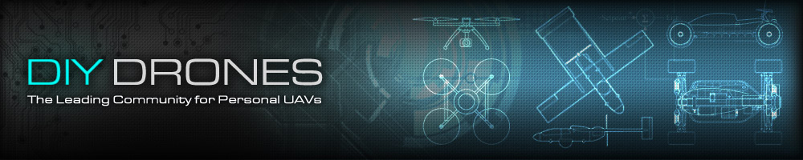

.. _home:

..  raw:: html

    <h1 style="text-align:center;">ArduPilot</h1>

    
ArduPilot aims to enable the creation and use of trusted, autonomous, unmanned vehicle systems for the peaceful benefit of all. Ardupilot is a project that can currently be described as an autopilot suite. As an open source project, it is constantly evolving and being developed. The development "DEV" team uses the community and commercial partners to add functionality to ardupilot that benefits everyone. Although ardupilot does not manufacture any hardware, ardupilot firmware works on many different boards (hardware) to control unmanned vehicles of all types. Coupled with ground control software, unmanned vehicles running ardupilot can have advanced functionality including real-time communication with operators. Ardupilot has the largest community dedicated to helping users with questions, problems, and solutions

    
    
Copter -- Plane -- Rover -- Sub -- Antenna Tracker

.. image:: ../../images/home_ardupilot.jpg
    :target: _images/home_ardupilot.jpg

..  raw:: html

    <table>
    <tr>
    <td width="27%">

:ref:`Hardware <stores>`  is the peripheral sensors, controller, and output
devices that act as the vehicle's eyes, ears, brain, arms etc.

Almost any mobile machine can be transformed into an autonomous vehicle, 
by simply integrating a small hardware package into it. Hardware 
packages begin with a controller.

Using inputs from sensors, the controller is able to send outputs to 
devices such as ESC's, servos, gimbals, etc.

.. image:: ../../images/pixhawk_small.jpg
    :target: _images/pixhawk_small.jpg
    :width: 211px

..  raw:: html

    </td>
    <td width="4%">
    </td>
    <td width="27%">

:ref:`Firmware <common-downloads_firmware>`- is the code or "skill set"
running on the controller. You choose the firmware to match your vehicle and
mission: :ref:`Copter <copter:home>`, :ref:`Plane <plane:home>`,
:ref:`Rover <rover:home>`, Sub, or :ref:`Antenna Tracker <antennatracker:home>`.

The choice is yours -- one autopilot for any mission. A firmware
update is all it takes to repurpose your hardware into a different role.

.. image:: ../../images/firmware_types.jpg
    :target: _images/firmware_types.jpg
    :width: 211px

..  raw:: html

    </td>
    <td width="4%">
    </td>
    <td width="27%">

:ref:`Software <common-choosing-a-ground-station>` is your interface to the
controller. Also called a Ground Control Station (GCS), the software can run
on PC's or mobile devices.

A GCS allows users to set-up, configure, test, and tune the vehicle. Advanced
packages allow autonomous mission planning, operation,
and post-mission analysis.

:ref:`Mission Planner <planner:home>` is a full-featured GCS supported by Ardupilot. It offers
point-and-click interaction with your hardware, custom scripting, and simulation. 

.. image:: ../../images/mission_planner_spline_waypoint.jpg
    :target: _images/mission_planner_spline_waypoint.jpg
    :width: 211px

..  raw:: html

    </td>
    </tr>
    </table>
    

--------------

Community:
==========
.. tip::

   Keep up with the latest ArduPilot related blogs on `ArduPilot.org! <https://discuss.ardupilot.org/c/blog>`__
   
Community is what really sets ArduPilot apart from other proprietary offerings in the market. Ardupilot offers areas for open discourse on the project's direction.  Here are some of the places you can find ardupilot users and developers:

`Discussion Forums: <http://discuss.ardupilot.org/>`__

.. image:: ../../images/ArduPilotDiscuss.png
    :target: http://discuss.ardupilot.org/
    :width: 640px

`Facebook ArduPilot group <https://www.facebook.com/groups/ArduPilot.org/>`__

.. image:: ../../images/main/FaceBookArduPilot.png
    :target: https://www.facebook.com/groups/ArduPilot.org/

Developer Community:
====================

`Developers Portal <http://ardupilot.org/dev/index.html>`__

All things for those who want to get into the nuts and bolts of ArduPilot development can be found in the developer portal. ie. `meeting times <http://ardupilot.org/dev/docs/ardupilot-mumble-server.html#ardupilot-mumble-server>`__, `Gitter Chat <https://gitter.im/ArduPilot/ardupilot/>`__ and `email groups <https://groups.google.com/forum/#!forum/drones-discuss>`__

History:
========
A constantly evolving repository of knowledge and innovation. The DIY
Drones community provided a home and now still provides inspiration for ArduPilot.
A comprehensive list of features that are continually born from the
needs of the community.

--------------

Features:
=========

..  raw:: html

    <table>
    <tr>
    <td width="48%">

-  Thorough documentation of the basic features backed by a community
   to help you set up any vehicle to fit your needs
-  Many command modes to fit every type of vehicle: Acro, Stabilize, Loiter,
   Alt-hold, Return To Launch, Land, Follow Me,
   GeoFence, etc.
-  Autonomous flight modes that execute fully scripted missions with advanced
   features.
-  Advanced failsafe options bring peace of mind in the event of lost
   control signal, low battery conditions, or other system failures.
-  Three Axis camera control and stabilization, shutter control, live
   video link with programmable on-screen-display

..  raw:: html

    </td>
    <td width="4%">
    </td>
    <td width="48%">

-  Real-time two-way communication between your GCS and controller, 
   including GPS position, battery status, and other live information.
-  Full data logging for comprehensive post mission analysis, with
   graphing and Google Earth mapping tools
-  No dead ends -- Advanced users will find endless options for
   customization and expanded mission capabilities

..  raw:: html

    </td>
    </tr>
    </table>

--------------

.. toctree::
   :hidden:

   News <http://www.ardupilot.org>
   Community <http://discuss.ardupilot.org>
   Copter <http://ardupilot.org/copter/index.html>
   Plane <http://ardupilot.org/plane/index.html>
   Rover <http://ardupilot.org/rover/index.html>
   Sub <http://ardusub.com/>
   Mission Planner <http://ardupilot.org/planner/index.html>
   APM Planner 2 <http://ardupilot.org/planner2/index.html>
   AntennaTracker <http://ardupilot.org/antennatracker/index.html>
   Companion Computers <http://ardupilot.org/dev/docs/companion-computers.html>
   Developers <http://ardupilot.org/dev/index.html>

