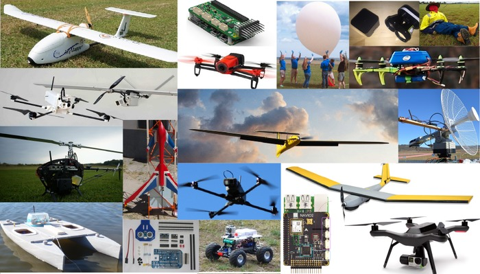
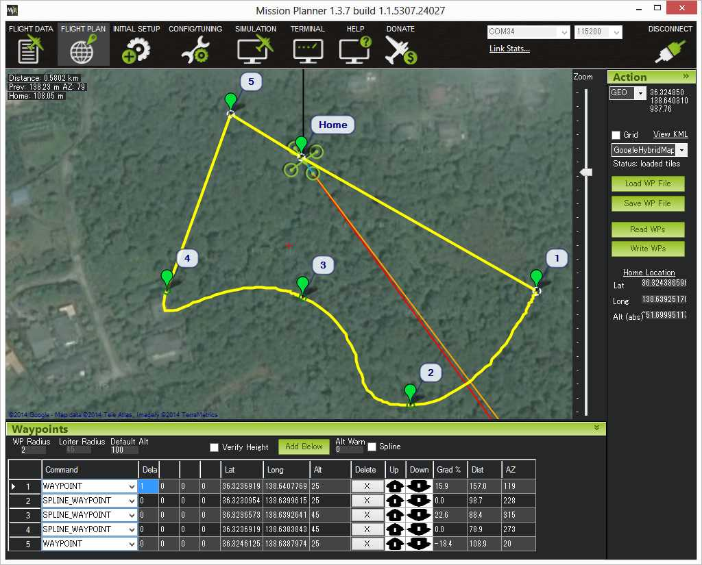

.. _home:

..  raw:: html

    <h1 style="text-align:center;">ArduPilot</h1>

    

    ArduPilot enables the creation and use of trusted, autonomous,
    unmanned vehicle systems for the peaceful benefit of
    all. ArduPilot provides a comprehensive suite of tools suitable
    for almost any vehicle and application. As an open source project,
    it is constantly evolving based on rapid feedback from a large
    community of users. The Development Team works with the community
    and commercial partners to add functionality to ArduPilot that
    benefits everyone. Although ArduPilot does not manufacture any
    hardware, ArduPilot firmware works on a wide variety of different
    hardware to control unmanned vehicles of all types. Coupled with
    ground control software, unmanned vehicles running ArduPilot can
    have advanced functionality including real-time communication with
    operators. ArduPilot has a huge online community dedicated to
    helping users with questions, problems, and solutions 

    
Copter -- Plane -- Rover -- Sub -- Antenna Tracker

..  raw:: html

    <table>
    <tr>
    <td width="27%">

:ref:`Hardware <stores>`  is the peripheral sensors, controller, and output
devices that act as the vehicle's eyes, ears, brain and arms.

Almost any mobile machine can be transformed into an autonomous vehicle,
by simply integrating a small hardware package into it. Hardware
packages begin with a controller.

Using inputs from sensors, the controller is able to send outputs to
devices such as ESC's, servos, gimbals and other peripherals.

.. image:: ../../images/pixhawk_small.jpg
    :target: _images/pixhawk_small.jpg
    :width: 211px

..  raw:: html

    </td>
    <td width="4%">
    </td>
    <td width="27%">

:ref:`Firmware <common-downloads_firmware>`- is the code running on the controller.
You choose the firmware to match your vehicle and mission: :ref:`Copter <copter:home>`, `Plane <https://ardupilot.org/plane/index.html>`__,
:ref:`Rover <rover:home>`, Sub, or :ref:`Antenna Tracker <antennatracker:home>`.

The choice is yours -- one autopilot for any mission.

.. image:: ../../images/firmware_types.jpg
    :target: _images/firmware_types.jpg
    :width: 211px

..  raw:: html

    </td>
    <td width="4%">
    </td>
    <td width="27%">

:ref:`Software <common-choosing-a-ground-station>` is your interface to the
controller. Also called a Ground Control Station (GCS), the software can run
on PC's or mobile devices.

A GCS allows users to set-up, configure, test, and tune the vehicle. Advanced
packages allow autonomous mission planning, operation,
and post-mission analysis.

:ref:`Mission Planner <planner:home>` is a full-featured GCS supported by ArduPilot. It offers
point-and-click interaction with your hardware, custom scripting, and simulation.

..  raw:: html

    </td>
    </tr>
    </table>

--------------

ArduPilot Documentation
=======================

See sidebar for links to ArduPilot documents.

Quickstart
==========

- Select your vehicle type to the left
- Select your "AutoPilot Hardware" and "Peripheral Hardware" for your application
- Follow vehicle's "First Time Setup"  for installing the firmware and Ground Station software, connecting the components, and calibration steps
- Prepare for "First Flight(/Drive)" completing setup prior to first flight/drive
- Advanced Configuration offers setup of more advanced features of the firmware and hardware peripherals

Regulations
===========

Every country has different regulations governing the operation of remote controlled and/or autonomous vehicles. `This database <https://droneregulations.info>`__  has country specific information, but it is every operator's responsibility to be seek out and be aware of local, regional, and federal regulations.

Community
=========
.. tip::

   Keep up with the latest ArduPilot related blogs on `ArduPilot.org! <https://discuss.ardupilot.org/c/blog>`__

Community is what really sets ArduPilot apart from many other offerings in the market. Here are some of the places you can find ArduPilot users and developers:

`Discussion Forum: <https://discuss.ardupilot.org/>`__

.. image:: ../../images/ArduPilotDiscuss.png
    :target: https://discuss.ardupilot.org/
    :width: 640px

`Facebook ArduPilot group <https://www.facebook.com/groups/ArduPilot.org/>`__

.. image:: ../../images/main/FaceBookArduPilot.png
    :target: https://www.facebook.com/groups/ArduPilot.org/

Developer Community
===================

`Developers Chat <https://ardupilot.org/discord>`__
Working on the code?  Ask questions of the team in Discord.

`Developers Guide <https://ardupilot.org/dev/index.html>`__
All things for those who want to get into the nuts and bolts of ArduPilot development can be found in the Developer Guide.

We have weekly `meeting times <https://ardupilot.org/dev/docs/ardupilot-discord-server.html#ardupilot-discord-server>`__.

We also have `forums <https://discuss.ardupilot.org/>`__

History
=======

The DIYDrones community provided an initial home for ArduPilot.
From those hobbyist beginnings, ArduPilot led the professionalisation of the Open Source drone community by creating DroneCode.
Since leaving DroneCode in 2016 ArduPilot has grown further to stand as an independent, open, global project.
The comprehensive and ever growing list of ArduPilot features are continually born from the
needs of the community - be they hobbyists, commercial users, academics, or the largest of enterprises.
See the :ref:`history-of-ardupilot` for more information.

Features
========

..  raw:: html

    <table>
    <tr>
    <td width="48%">

-  Thorough documentation of the available features backed by a community
   to help you set up any vehicle to fit your needs
-  Many command modes to fit every type of vehicle: Acro, Stabilize, Loiter,
   Alt-hold, Return To Launch, Land, Follow Me,
   GeoFence, etc.
-  Autonomous flight modes that execute fully scripted missions with advanced
   features.
-  Advanced failsafe options bring peace of mind in the event of lost
   control signal, low battery conditions, or other system failures.
-  Three Axis camera control and stabilization, shutter control, live
   video link with programmable on-screen-display

..  raw:: html

    </td>
    <td width="4%">
    </td>
    <td width="48%">

-  Real-time two-way communication between your GCS and controller,
   including GPS position, battery status, and other live information.
-  Full data logging for comprehensive post mission analysis, with
   graphing and Google Earth mapping tools
-  Industry leading control algorithms for vehicles of all types, with
   robust sensor compensation algorithms, filtering and tuning
   capabilities
-  No dead ends -- Advanced users will find endless options for
   customization and expanded mission capabilities

..  raw:: html

    </td>
    </tr>
    </table>

--------------

.. toctree::
   :hidden:

   Home <https://ardupilot.org>
   Copter <https://ardupilot.org/copter/index.html>
   Plane <https://ardupilot.org/plane/index.html>
   Rover <https://ardupilot.org/rover/index.html>
   Sub <http://ardusub.com/>
   AntennaTracker <https://ardupilot.org/antennatracker/index.html>
   Mission Planner <https://ardupilot.org/planner/index.html>
   APM Planner 2 <https://ardupilot.org/planner2/index.html>
   MAVProxy <https://ardupilot.org/mavproxy/index.html>
   Companion Computers <https://ardupilot.org/dev/docs/companion-computers.html>
   Developers <https://ardupilot.org/dev/index.html>
   Firmware Downloads <docs/common-downloads_firmware>
   The ArduPilot Team <docs/common-team>
   The History of ArduPilot<docs/common-history-of-ardupilot>
   ArduPilot Partners Program <docs/common-partners-program>
   Commercial Support <docs/common-commercial-support>
   Acknowledgements <docs/common-acknowledgments>
   Hardware Vendors <docs/common-stores>
   Contact Us <docs/common-contact-us>
   docs/common-appendix
   Full Table of Contents <docs/common-table-of-contents>
