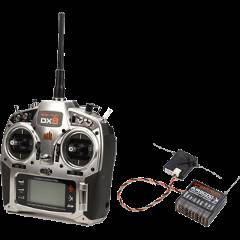

.. _getting-started:

====================================
Getting Started
====================================

This article provides an overview of the main components you will need
when building and using an Ardupilot-based blimp.

ArduPilot-capable blimp
=======================================================

As there are currently no commercially-available ArduPilot-compatible blimps
available, you will need to :ref:`build your own <building-a-blimp>`.

6+ channel RC transmitter and receiver
======================================

You'll need a radio control transmitter to manually control your BLimp
and to activate its flight modes. You can use any RC
transmitter/receiver system with at least six channels. Some of the
options are discussed in the topic :ref:`Compatible RC Transmitter and Receiver Systems <common-rc-systems>`.

Autopilot (Autopilot hardware)
==============================

Blimp's autopilot board determines its capabilities for autonomous
flight. 

If building an indoor blimp, weight will usually be the main consiteration,
thus the "FPV quadcopter" flight controllers such as the Matek F405-STD are recommended.

For more options, see the topic :ref:`Choosing an Autopilot <common-choosing-a-flight-controller>`.

Global position
===============

In order to use any of the position-controlled flight modes, Blimp requires global position information.

For outdoor use, the simplest option is a :ref:`GPS module <common-installing-3dr-ublox-gps-compass-module>` 
generally with a compass. 

For indoor use, please see :ref:`the non-GPS options. <common-non-gps-navigation-landing-page>`

.. image:: ../../../images/GPS_TopAndSide.jpg
    :target: ../_images/GPS_TopAndSide.jpg

LiPo batteries and charger
==========================

.. image:: ../images/lipo_battery.jpg
    :target: ../_images/lipo_battery.jpg

Blimp requires a rechargeable lithium polymer (LiPo) battery. Blimps have much
lower power requirements than most UAVs but also lower payload capacity for their size.
Since blimps must always be neutrally buoyant (i.e. any extra payload capacity will need
to be compensated for by weights), it is a good idea to use as big a battery as the blimp
can use.

For example, a blimp that is approximately 50 cm in diameter would
likely be able to fly at a slow pace for about 10-20 minutes on 150 mAh 1S. However it likely has
enough lift to carry double the capacity or more if there aren't any cameras or other 
payload added.

While a blimp generally uses only one battery at a time, we recommend having a few batteries in stock; more batteries means more flight time. You'll also need a charger for your batteries.

Ground Control Station (GCS)
============================

The (free and open source) :ref:`Mission Planner <planner:home>` is recommended if you're going
to be loading new versions of Blimp onto the autopilot, and for
first-flight tuning and calibration. It runs on a PC.

.. image:: ../../../images/groundstation-with-MP.jpg
    :target: ../_images/groundstation-with-MP.jpg

Alternatively, you may find it more convenient to
choose a different ground station - running on the tablet, phone or
computer of your choice. The main options are discussed in the topic
:ref:`Choosing a Ground Station <common-choosing-a-ground-station>`.

Telemetry Radio
===============

A telemetry radio allows your blimp to communicate with your ground
station from the air using the MAVLink protocol. This allows you to
interact with Blimp in real time and receive streaming data from
your blimps.

We recommend the telemetry radio solutions linked from the 
:ref:`Telemetry Landing Page <common-telemetry-landingpage>`. Remember that if using
the :ref:`SIK Radio <common-sik-telemetry-radio>` you will need the version
at the permitted frequency for your country - 915 MHz (Americas) and 433
MHz (Europe).

.. image:: ../../../images/Telemetry_store.jpg
    :target: ../_images/Telemetry_store.jpg
