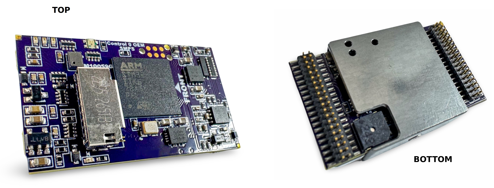
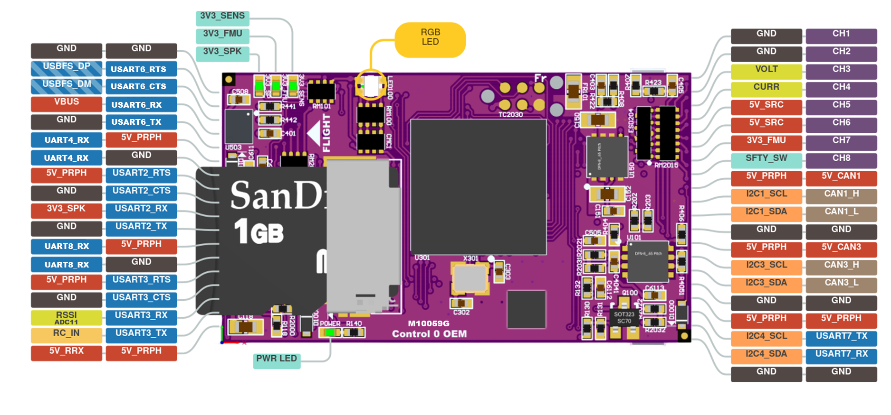

.. _common-3DR_Control_Zero_OEM_G:

=========================
3DR_Control_Zero_H7_OEM_G
=========================

The Control Zero H7 OEM revision G is a flight controller produced by `3DR (mRo)] <https://store.3dr.com/control-zero-h7-oem-g/>`__

Specifications
==============

-  **Processor**
    - STM32H743IIK6 32-bit processor
    - 256KB FRAM

-  **Sensors**
    - BMI088, ICM20602 Acc/Gyro
    - ICM20948 Acc/Gyro/Mag
    - DPS368 Barometer

-  **Power**
    - External 5V , 1A supply is required
    - Internal 3.3V BEC for sensors is provided on-board

-  **Interfaces**
    - One 36pin and one 40pin Samtec Connector for signals on bottom
    - 8x PWM outputs BiDirDShot capable
    - 1x RC input
    - 5x UARTs (2 with flow control)
    - 3x I2C ports for external compass, airspeed, etc.
    - 2x CAN
    - 1x SPI
    - SWD via TC2030 header
    - MicroSD card socket
    - External battery monitor inputs for current and voltage

-  **Size and Dimensions**

    - 34mm x 20mm 
    - 3.66g
  
Where to Buy
============

 - `3DR (mRo)] <https://store.3dr.com/control-zero-h7-oem-g/>`__

Pinouts
==============

Default UART order
==================

The UARTs are marked Rn and Tn in the above pinouts. The Rn pin is the
receive pin for UARTn. The Tn pin is the transmit pin for UARTn.

 - SERIAL0 -> USB
 - SERIAL1 -> USART2 (TELEM1) (DMA enabled) with CTS/RTS
 - SERIAL2 -> USART3 (TELEM2) (DMA enabled)
 - SERIAL3 -> UART4 (GPS) (DMA enabled)
 - SERIAL4 -> UART8 (GPS2) (DMA enable)
 - SERIAL5 -> UART5 (User) (DMA capable)
 - SERIAL6 -> USART6 (User) (DMA enabled) with CTS/RTS
 - SERIAL7 -> USB (SLCAN)

Serial protocols shown are defaults, but can be adjusted to personal preferences.

Servo/Motor Outputs
===================
The KakuteH7 supports up to 14 PWM outputs. All outputs support DShot and BiDirDshot. Outputs are grouped and all outputs within their group must be the same protocol.

The PWM is in 5 groups:

- PWM 1-4 in group1
- PWM 5,6 in group2
- PWM 7,8 in group3

RC Input
========

RC input is configured on the RC_IN pin. All unidirectional RC protocols are supported. For bi-directional protocols, like CRSF a normal UART is required. For example, USART6 (SERAIL6) could be used.

With this option, :ref:`SERIAL6_PROTOCOL<SERIAL6_PROTOCOL>` must be set to "23", and:

- PPM is not supported.

- SBUS/DSM/SRXL connects to the RX6  pin.

- FPort requires connection to TX6 and RX6 via a bi-directional inverter. See :ref:`common-FPort-receivers`.

- CRSF also requires a TX6 connection, in addition to RX6, and automatically provides telemetry.

- SRXL2 requires a connection to TX6 and automatically provides telemetry.  Set :ref:`SERIAL6_OPTIONS<SERIAL6_OPTIONS>` to "4".

Any UART can be used for RC system connections in ArduPilot also, and is compatible with all protocols except PPM. See :ref:`common-rc-systems` for details.

## Analog Inputs

The Control Zero H7 OEM revision G has 4 ADC inputs:

- ADC1 Pin11 -> RSSI IN
- ADC1 Pin14 -> Battery Voltage
- ADC1 Pin15 -> Battery Current
- ADC1 Pin18 -> 5V Sensor\

CAN
===

There are two CAN ports which are pre-configured for DroneCAN, which may be changed by the user as desired.
See :ref:`common-canbus-setup-advanced` for more information on setup.

Battery Monitor Configuration
=============================
The board has a built-in voltage and external current sensor input.

The following settings are set by default on the board to work with a Power Zero Module (M10077)

:ref:`BATT_MONITOR<BATT_MONITOR>` =4

:ref:`BATT_VOLT_PIN<BATT_VOLT_PIN>` 14

:ref:`BATT_CURR_PIN<BATT_CURR_PIN>` 15

:ref:`BATT_VOLT_MULT<BATT_VOLT_MULT>` 15.3

:ref:`BATT_AMP_PERVLT<BATT_AMP_PERVLT>` 50

Other Power Module will need to adjust these values.

Firmware
========
This board comes with ArduPilot firmware pre-installed and other vehicle/revision Ardupilot firmware can be loaded using most Ground Control Stations.

Firmware for this board can be found `here <https://firmware.ardupilot.org>`_ in  sub-folders labeled
"3DRControlZeroG".

[copywiki destination="plane,copter,rover,blimp"]

