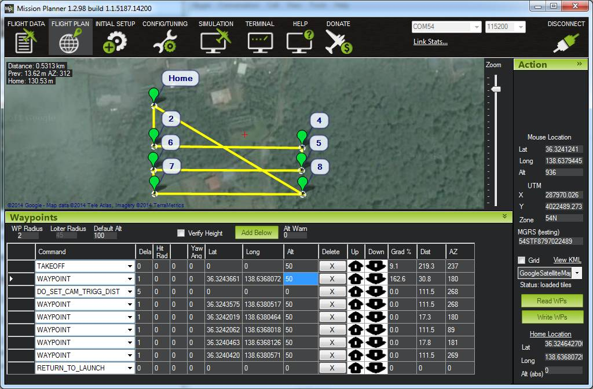

.. _common-3d-mapping:

==========
3d Mapping
==========

Overview
========

This page introduces how Copter/Plane along with the right equipment can
be used to create 3d maps.

.. image:: ../../../images/3d_mapping_the_fallen_blockhouse.jpg
    :target:  https://sketchfab.com/models/ca785239f99643499fab7c62e1944f95

The image above is
`Sylvain <http://www.diydrones.com/profile/Sylvain793>`__'s `"the fallen
blockhouse" <https://www.diydrones.com/profiles/blogs/the-fallen-blockhouse-t3-entry>`__ and `the winner <https://www.diydrones.com/profiles/blogs/announcing-the-winner-of-the-13th-t3-competition>`__\ of
the Feb 2014 T3 competition.

Equipment you will need
=======================

`Plane <https://ardupilot.org/plane/index.html>`_ or
:ref:`Multicopter <copter:home>`

A digital still camera:

`Canon cameras capable of CHDK <http://chdk.wikia.com/wiki/For_Developers>`__ including the S100,
S110, Elph 110 HS and SX230HS

Other camera types including Canon ELPH 520 HS (not CHDK capable) with
some method of triggering the camera shutter

GoPro cameras are not recommended because of their fish-eye lenses

A downward facing :ref:`gimbal <common-cameras-and-gimbals>` or hard
mount to attach a camera to the vehicle.

Sample Mission
==============

.. image:: ../../../images/3dMapping_FlightPlanExample.jpg
    :target: ../_images/3dMapping_FlightPlanExample.jpg

A good 3d rendering can be accomplished with 60 ~ 100 still pictures.
There should be at least 65% overlap between consecutive pictures but
aiming for 80% or even higher is recommended.  The aerial photographs
can also be combined with photos taken from the ground.

The altitude of the mission depends upon the subject.  For large flat
areas, flying 40m ~ 80m above the surface should provide very detailed
images (and thus a detailed final product) but for buildings flying
higher (i.e. 100m above the building) reduces distortion.

It is recommended to fly a mission that is made up of parallel tracks
with each track between 25m and 100m apart.  The higher the vehicle, the
wider apart the tracks can be.  In general you should aim for 65%
overlap in pictures from adjacent tracks.

The camera shutter needs to be triggered throughout the mission (i.e
every 2 to 5 seconds or at regular distance intervals).  Many cameras
include a feature to take pictures at regular time intervals.  `Canon cameras loaded with CHDK can run a script <http://chdk.wikia.com/wiki/User_Written_Scripts>`__ that does
this.  Alternatively :ref:`Copter/Plane/Rover can trigger a Canon CHDK camera at timed or distance based intervals <common-chdk-camera-control-tutorial>`.

A mission to accomplish this would include some or all of these
commands:

**TAKEOFF** - will cause the vehicle to climb straight to the target
altitude provided in the "Alt" column (normally in meters)

**WAYPOINT** - provide as many waypoints as required to fly over the
scene in a grid pattern.  Altitude should be entered in the "Alt"
column.  Adding "1" to the "Delay" columns will cause the copter to
momentarily stop at each waypoint.

**DO_DIGICAM_CONTROL** will cause the camera shutter to be pushed once
immediately if the APM/Pixhawk have been connected using CHDK or a
servo.  This command takes no arguments and like other "do" commands it
executes immediately after the preceding waypoint command begins.

**DO_TRIGG_DISTANCE** is the same as do-digicam-control (above) except
the camera shutter will trigger every X meters.  Where X can be defined
in the first column labelled "Dist (m)".  Note: in AC3.1.2 there is no
mission command to stop the command from running so the shutter will be
triggered continuously until the vehicle is switched out of AUTO mode.

**RETURN_TO_LAUNCH** should be the last command in the mission so the
vehicles returns home.

**DO_SET_ROI** can be used to point the nose of the vehicle and gimbal
at a specific point on the map.

Recommended Desktop 3d mapping software
=======================================

MicMac based toolchain together with
(`ImageJ/Fiji <http://fiji.sc/>`__, `QGIS <https://qgis.org/en/site/>`__,
`SAGA GIS <https://sourceforge.net/projects/saga-gis/>`__): open source
and free!

`VisualSFM <http://ccwu.me/vsfm/>`__ : free for non-commercial use

`Agisoft Photscan <http://www.agisoft.com/>`__ : $179 for the
standard edition, $3,499 for the pro edition including georeferencing,
orthopotos, etc

`Pix4d <https://www.pix4d.com/>`__ : 6500 euros or 260 euros per month

`OpenDroneMap <http://opendronemap.github.io/odm/>`__ : open source and
free! (`user intro video <https://www.youtube.com/watch?v=e2qp3o8caPs>`__)

All of these software packages work in generally the same way in that
they consume the still images you've taken from the vehicle (and you may
also choose to add pictures taken by hand from the ground as well) and
produce a 3d image (in what format?).  This is accomplished by
automatically matching up the images, it does not rely upon knowing the
actual location from where the image was taken.

Sharing your model
==================

`Sketchfab <https://sketchfab.com/>`__ allows you to upload your
completed 3d models so that others can interactively view the model in
their web browsers.  Click on the image at the top of the blog post to
see an example.

`Three.js <http://threejs.org/>`__ allows you to provide 3D models on
your own webpage.

`Blender <https://www.blender.org/>`__ can be used to create video files
of virtual fly throughs of the 3d model which can then be posted to
YouTube.  Here is an example by
`Richard <http://www.diydrones.com/profile/Richard721>`__.

`Dronemapper <https://dronemapper.com/>`__ allows uploading and managing
raw images.

..  youtube:: MlON0X_nxBw
    :width: 100%

Additional resources and Examples
=================================

-  `T3 season 2 - "the model" blog post <https://www.diydrones.com/profiles/blogs/t3-season-2-the-model>`__
   and `winner announcement <https://www.diydrones.com/profiles/blogs/announcing-the-winner-of-the-13th-t3-competition>`__
-  `Sylvain's "fallen blockhouse" T3 entry blog post <https://diydrones.com/profiles/blogs/the-fallen-blockhouse-t3-entry>`__
-  `Thorsten's "resconstruction of largest hallstatt tumulus grave" T3 entry blog post <https://diydrones.com/profiles/blogs/3d-reconstruction-of-largest-hallstatt-tumulus-grave-in-central>`__
-  `Stephen Gienow's "Octocopter scan of UMBC" T3 entry blog post <https://diydrones.com/profiles/blogs/apm-octocopter-build-and-mission>`__
-  `Krasiczyn Castle 3D model, Poland <https://diydrones.com/profiles/blogs/krasiczyn-castle-3d-model-poland>`__
-  `MyDrone's "Buisante Chapel" T3 entry <http://prebut.free.fr/>`__
-  `Creating Maps from Drone Imagery - 3DRobotics and Aero drone <https://www.mapbox.com/blog/processing-drone-imagery/>`__
-  `Ecosynth wiki - a suite of tools used to map vegetation in 3d using
   off-the-shelf digital cameras and open-source computer vision software <http://wiki.ecosynth.org/index.php?title=Main_Page>`__ 
