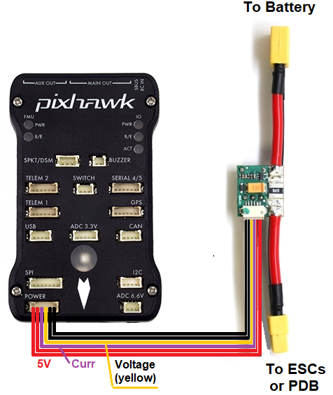
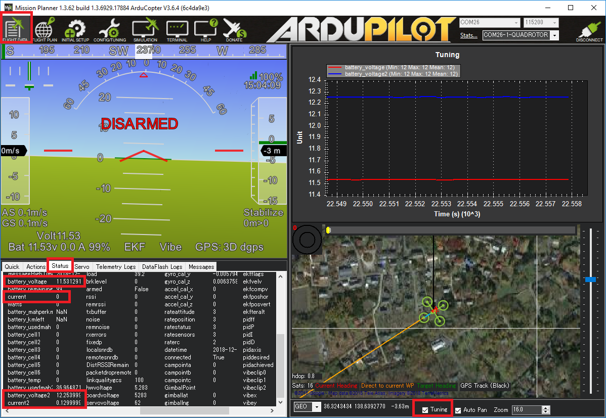
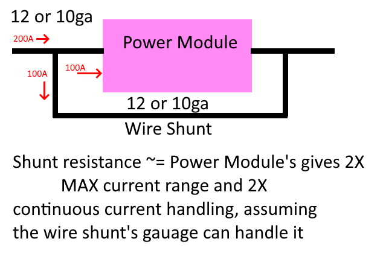
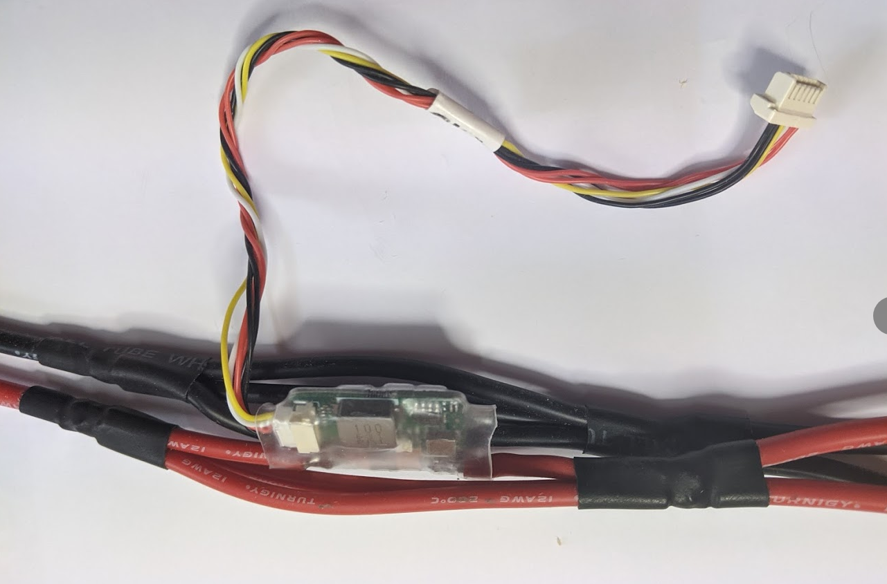

.. _common-3dr-power-module:

===================
Common Power Module
===================

.. image:: ../../../images/3DR-current-sensor-top.jpg
    :target: ../_images/3DR-current-sensor-top.jpg
    :width: 450px

Many autopilots can be purchased with an analog power module that provides a stable power supply to the autopilot and also supports measuring the battery voltage and current consumption.

Specifications
--------------

Below are typical limits, but it is best to confirm directly with the vendor:

- Maximum input voltage of 18V (4S lipo)
- Maximum of 90 Amps (but only capable of measuring up to 60 Amps)
- Provides 5.37V and 2.25Amp power supply to the autopilot

.. warning::

   The Power Module provides enough power for the autopilot, receiver, and a few low powered peripherals (lidar, telemetry) but does not have enough power for servos or high current devices like FPV transmitters or the RFD900 radios.  More information on :ref:`powering the Pixhawk can be found here <common-powering-the-pixhawk>`

.. warning:: Power Modules of this type (resistive shunt) cannot continuously support their maximum rated current. Excessive and destructive heat can be generated at continuous current levels exceeding 33% to 66% of the maximum rated current (instantaneous rating). Check with manufacturer for ratings.

Connecting to the autopilot
-----------------------------------

The 6 pin cable from the power module plugs into the POWER port of the autopilot

The battery is connected to the power module's male connector.  The ESC or Power Distribution Board should be connected to the power module's female connector.

Configuration
-------------

Most ground stations provide a battery monitor interface but the parameters can also be set manually:

- :ref:`BATT_MONITOR <BATT_MONITOR>` = **3** to measure only voltage or **4** to measure both voltage and current (you will need to reboot the board after changing this)
- :ref:`BATT_VOLT_PIN <BATT_VOLT_PIN>` = **2**. The autopilot pin connected to the power module's voltage pin
- :ref:`BATT_VOLT_MULT <BATT_VOLT_MULT>` converts the analog voltage received from the power module's voltage pin to the battery's voltage
- :ref:`BATT_CURR_PIN <BATT_CURR_PIN>` = **3**. The autopilot pin connected to the power module's current pin
- :ref:`BATT_AMP_PERVLT <BATT_AMP_PERVLT>` converts the analog voltage received from the power module's current pin to the battery's current
- :ref:`BATT_AMP_OFFSET <BATT_AMP_OFFSET>` voltage offset received from the power module's current pin when ther is no current being pulled from the battery

Instructions for setup and calibration using the :ref:`Mission Planner can be found here <common-power-module-configuration-in-mission-planner>`
A Blog post with instructions for `set-up using QGC can be found here <https://discuss.ardupilot.org/t/power-monitor-setup-on-ardupilot-copter-3-6/35441>`__

Dual Battery Monitoring
-----------------------

If the autopilot has additional analog-to-digital pins available, a second battery can be monitored by setting up the ``BATT2_`` parameters.  The values below allow reading a second battery's voltage and current using :ref:`The Cube's <common-thecube-overview>` POWER2 port.

- :ref:`BATT2_MONITOR <BATT_MONITOR>` = **4** to measure both voltage and current (you will need to reboot the board after changing this)
- :ref:`BATT2_VOLT_PIN <BATT_VOLT_PIN>` = **13**
- :ref:`BATT_CURR_PIN <BATT_CURR_PIN>` = **14**

The :ref:`BATT2_VOLT_MULT <BATT_VOLT_MULT>` and :ref:`BATT2_AMP_PERVLT <BATT_AMP_PERVLT>` should also be set by comparing the reported values vs values collected using a hand held voltage meter

Failsafe
--------

[site wiki="copter"]
Instructions for :ref:`battery failsafe can be found here <failsafe-battery>`
[/site]
[site wiki="plane"]
Instructions for :ref:`battery failsafe can be found here <apms-failsafe-function>`
[/site]
[site wiki="rover"]
Instructions for :ref:`battery failsafe can be found here <rover-failsafes>`
[/site]

Extending Current Measurement Capacity
--------------------------------------

Shunt resistor power monitors of this variety can be used to measure higher currents if setup in a current sharing configuration, as shown below:

Design points:

- The shunt should be approximately the same resistance as the power module. For example, a 120A module usually uses a 0.5 milliohm sense resistor. Therefore the wire shunt should be ~ 0.5 milliohm for equal sharing of the total current. This can be determined from a reference such as `this <https://www.engineeringtoolbox.com/wire-gauges-d_419.html>`_ . For 12ga wire, that would be ~ 4 inches.
- The wire gauge (and, of course, the wire used to connect the power module) should be rated to handle the expected continuous current for the length of wiring utilized.
- Try to keep the leads from the shunt junctions to power module short. Longer leads to the module there will increase resistance in that branch. This will unbalance the current split. Not an large issue, but will effectively increase the max resistance capability and decrease the incremental sensitivity of the measurement more than needed.

In the photo above, by providing two bypasses, the current is shared such that the power monitor sees a little less than 1/3 the total current flowing, and reports a value ~1/3 normal, extending its range ~3X.

.. note:: Due to variations in materials, length, etc. it is mandatory that the monitor be calibrated using a precision current meter of some kind. It is best to calibrate at a value greater than 50% of the maximum current expected.
