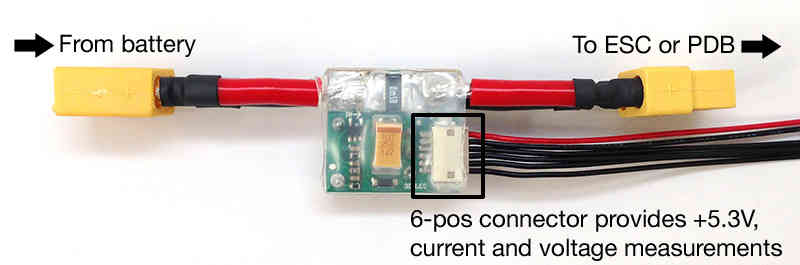

.. _common-3dr-power-module:

===================
Common Power Module
===================

This page explains how to set up the Common Power Module to measure battery voltage and current consumption. 
The information will also be useful for setting up other types of Power Module.

Overview
========

Most flight controllers including the Pixhawk have a dedicated connector for attaching the
`Power Module <http://store.jdrones.com/APM25_PSU_XT60_p/pwrapm25x1.htm>`__. 
This is useful because it:

-  Provides a stable 5.37V and 2.25Amp power supply which reduces the
   chances of a brown-out
-  Allows monitoring of the battery's voltage and current and triggering
   a return-to-launch when the voltage becomes low or the total power
   consumed during the flight approaches the battery's capacity
-  Allows the autopilot firmware to more accurately compensate for the
   interference on the compass from other components

The PM accepts a maximum input voltage of 18V (up to 4S LiPo battery) and maximum current of 90Amps. 
When used with an APM board the full 90Amp current sensing range can be used, 
with the Pixhawk-series boards up to 60Amps can be measured.

There is more general information on powering in :ref:`Powering the Pixhawk <common-powering-the-pixhawk>` and :ref:`Powering the APM2 <common-powering-the-apm2>`.

.. warning::

   Most Power Module's maximum input voltage is 18V. This is the
   maximum allowed by the on-board regulator. (4 cell LiPo max).

.. warning::

   The Power Module provides enough power for the flight controller, receiver, lower power peripherals like a low power lidar and telemetry radio but it does not have
   sufficient power for servos or high current devices like FPV transmitters and the RFD900 telemetry radios.

Connecting the PM to a flight controller board
==============================================

The 6-pos cable plugs into the 6-pos connector on both the Power Module
and Pixhawk/APM.

.. figure:: ../../../images/pixhawkpower-port.jpg
   :target: ../_images/pixhawkpower-port.jpg

   Pixhawk Power Port

.. figure:: ../../../images/3DR-current-sensor-APM-conn.jpg
   :target: ../_images/3DR-current-sensor-APM-conn.jpg

   APM2.x Power Port

Your battery connects to the Power Module's male connector, and its
female connector plugs into your ESC or Power Distribution Board.

.. note::

   **APM 2.x Power Module Notes:**

   -  You should normally remove the APM's JP1 jumper when using the Power
      Module so that only your APM board and your receiver are powered from
      the Power Module's on-board regulator and not from your ESCs.

      -  Removing the jumper allows you to use the APM's servo output rail
         to distribute power from your ESC's BEC or separate UBEC to any
         servos or external equipment.
      -  If you are using servos, plug an ESC BEC or stand alone UBEC power
         wire and ground wire into two of the power and ground pins on the
         APM's servo output rail to provide a common power and ground bus
         for servo power.

   -  You can leave the jumper present if you are using ESCs that have no
      BECs or if all the ESC BECs power wires are cut and you are not
      powering any servos from the servo out rail.
   -  You can also individually power each servo from each individual
      ESC-BEC.

      -  Simply run the power and ground from each ESC-BEC individually and
         directly to each servo (very handy for multicopters).

Setup through Mission Planner
=============================

:ref:`Power Module Configuration in Mission Planner <common-power-module-configuration-in-mission-planner>`
explains how to configure a Power Module and get low battery alerts from
Mission Planner.
