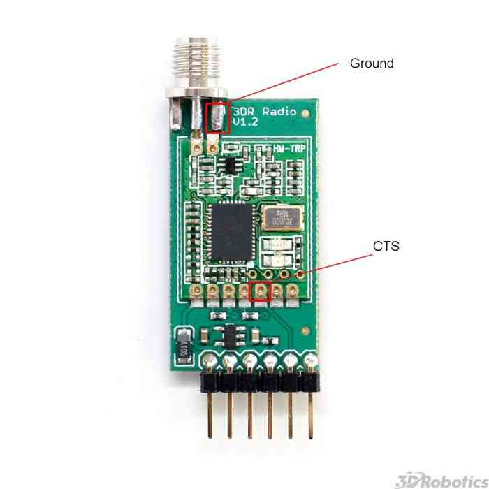

.. _common-3dr-radio-advanced-configuration-and-technical-information:

==================================
SiK Radio — Advanced Configuration
==================================

This article provides advanced configuration information for the 
:ref:`SiK Telemetry Radio <common-sik-telemetry-radio>`. It is intended for
"power users", and those who wish to gain a better understanding of how
the radios operate.

.. tip::

   Most users will only need the basic guide and feature overview
   provided in :ref:`SiK Radio v2 <common-sik-telemetry-radio>`. 

.. image:: ../../../images/Telemetry_Ver1Ver2.jpg
    :target: ../_images/Telemetry_Ver1Ver2.jpg

Monitoring the link quality
===========================

You can use the MAVLink support in the SiK Radios to monitor the link
quality while flying, if your ground station supports it.

The two key message parameters are ``RADIO.rssi`` and ``RADIO.remrssi``.
The first is the RSSI (signal strength) level that the local radio is
receiving at. The remrssi parameter is the RSSI that the remote radio is
receiving at.

Here is a typical graph of the RSSI levels for a flight at my local
flying field.

.. image:: ../../../images/rssi-distance.jpg
    :target: ../_images/rssi-distance.jpg

The RSSI value scales approximately as 1.9x the dBm signal strength,
plus an offset. See the Si1000 data sheet for the exact mapping between
RSSI and dBm received signal strength, or use this approximate formula

::

    signal_dBm = (RSSI / 1.9) - 127

.. note::

   The reason the RSSI varies so much during this flight is that the
   signal is attenuated when the plane is rolled over in a turn as I was
   using a simple wire antenna in the plane. The RSSI values for this
   flight were plenty high enough for the link quality to be excellent
   throughout the flight using the default radio parameters.

.. _common-3dr-radio-advanced-configuration-and-technical-information_diagnosing_range_problems:

Diagnosing range problems
=========================

If you get less range than you would expect from the above information
then what you need to do is graph the noise and signal levels from a
flight to work out what the problem is.

The most common source of range problems is noise. Noise is unwanted
radio emissions in the same frequency range that your radio is using
that interferes with the operation of your radio. The radios have
telemetry logging built in to help you diagnose the source of the noise.

There are three key types of noise that are likely to affect your
radios:

-  Noise from the electronics in your aircraft (such as your motor, ESC,
   autopilot etc)
-  Noise from your ground station computer, especially its USB bus
-  Noise from other people operating radios nearby that are on the same
   frequency as your radios

To work out what sort of noise you have, open up mission planner and
choose the "telemetry logs" tab. Then choose **Tlog> Kml or Graph**.
When the window pops up choose **Graph Log** and select a log from a
test flight with your radios. Wait for the log to load, then choose the
following items to log:

-  rssi
-  remrssi
-  noise
-  remnoise

Put all 4 values on the one graph. You will end up with a plot like
this:

That graph shows you 4 things:

-  the amount of signal being received on the ground
-  the amount of signal being received in the aircraft
-  the amount of noise being received on the ground
-  the amount of noise being received in the aircraft

For the best possible range you want the two noise lines to be low, and
the two signal lines to be high. In the above graph (taken from my
SkyFun with a pair of 3DR 433 radios) you can see that the noise levels
in the plane are higher than the noise levels on the ground. Also note
that at the start of the flight (before I started the motor) the noise
levels on the plane were lower, then they went up after I started the
motor. That shows I'm getting some noise from my motor. If I wanted more
range I would need to move the radio further from the motor and ESC.

Perhaps the most common source of noise with the 3DR-433 is noise from
the USB bus on your ground station. That shows up as high values for the
RADIO.noise value. If you get this, then you could try using a different
USB cable, or a different laptop. You can also try using a USB hub
between your laptop and your radio.

If the 'rssi' and 'noise' levels meet on the graph then you will lose
the link. To determine what your range would be, a rough rule of thumb
is to subtract the 'rssi' and 'noise' numbers, then divide by 2. That
tells you your "fade margin" in decibels. For each 6dB of fade margin
your range doubles. So if you have 18dB of fade margin, then you will be
able to do roughly 8x whatever range you were at when you measured the
margin.

Another key source of range problems is the antenna placement. Your
ground station antenna should be well clear of obstructions and a couple
of meters off the ground. You may need to build a stand to hold it to
get the best range.

Serial and air rates 'one byte form'
====================================

The ``SERIAL_SPEED`` and ``AIR_SPEED`` parameters are in the same form
that ArduPilot uses for the ``SERIAL3_SPEED`` parameter. If the number is
greater than 2000, it is the baud rate.  Otherwise, it is the rate in
kbps, truncated to an integer. So '9' means 9600 baud, '38' means
38400, '115' means 115200 etc.

Choosing the air data rate
==========================

The key parameter that controls the range of your radios is the
``AIR_SPEED``. The default is 64 (which is 64kbps) will give you a range
of over a kilometre with small omni antennas. The lower you set the
``AIR_SPEED`` the longer your range, although lowering the ``AIR_SPEED``
also lowers how much data you can send over the link.

The radio firmware can only support 13 possible air data rates, which
are 2, 4, 8, 16, 19, 24, 32, 48, 64, 96, 128, 192 and 250. If your
application needs a different air rate for some reason then we can
potentially add it to the register tables. If you choose an unsupported
air rate then the next highest rate from the supported list will be
chosen.

What air data rate you choose will depend on the following factors:

-  What range you need
-  What data rate you will be sending
-  Whether you primarily send in one direction, or both
-  Whether you have ECC enabled

For most telemetry applications you will primarily be sending data
mostly in one direction, from the aircraft to the ground station. For
most people, the amount of data sent from the ground station to the
aircraft is small, just an occasional control packet plus heartbeat
packets.

If you are using a joystick to control your aircraft then you will be
sending a lot more data from the ground station to the aircraft, and in
that case you may find a higher ``AIR_SPEED`` is needed, although your
range will be reduced.

The ``ECC`` parameter makes a big difference to the data rate you can
support at a given ``AIR_SPEED``. If you have ECC set to zero, then no
error correcting information is sent, and the radio uses a simple 16 bit
CRC to detect transmission errors. In that case your radio will be able
to support data transfers in one direction of around 90% of the
``AIR_SPEED``.

If you enable ECC, then the data rate you
can support is halved. The ECC system doubles the size of the data sent
by the radios. It is worth it however, as the bit error rate will drop
dramatically, and you are likely to get a much more reliable link at
longer ranges.

ArduPilot will automatically adapt its telemetry rates to
what the radio can handle, by using MAVLink RADIO packets injected into
the MAVLink streams by the radio's firmware. That allows you to
'oversubscribe' your link, by setting up a ``SERIAL_SPEED`` larger than
what the radios can actually handle.

The other factor in choosing the air data rate is the TDM 'sync time'.
The two radios need to work out each others frequency hopping pattern.
They do this by slowly changing the receive channel while rapidly
changing the transmit channel. This process of getting in sync with the
other radio takes just a few seconds at high air data rates, but gets
slower for low air data rates.

For most amateur UAV applications the default ``AIR_SPEED`` of 64 with
no ECC enabled will be good.

Error correction
================

As mentioned above, the radios support a 12/24 Golay error correcting
code if you set the ECC parameter to 1. This means that for every 12
bits of data the radio will send 24 bits, calculating the bits using
Golay code lookup tables. The process is reversed on the receiving end,
and allows the radio to correct bit errors of up to 3 bits in every 12
bits send (i.e. 25% bit error rate).

The downside of the ECC option is that it halves your available data
bandwidth.  In some cases this is worth it, as you are able to
sustain a reliable link over longer ranges. You will also get a lot less
'noise' in the serial stream.

MAVLink framing
===============

If you set the MAVLINK option to 1 or 2 then the radio will do 'MAVLink
framing'. The MAVLink protocol is used by ArduPilot for transmitting telemetry
date to a ground station. When MAVLink framing is used, the radio will
try to align radio packets with MAVLink packet boundaries. This means
that if a packet is lost you don't end up with half a MAVLink packet
being seen by the receiver. That partial packet would appear as line
noise on your ground stations console.

If you set MAVLINK to 2, then in addition to doing MAVLink framing the
radio will look for ``RC_OVERRIDE`` packets (used for joysticks) and
ensure that those packets get sent as quickly as possible. This option
is useful if you are using a tablet based joystick for control.

The radio firmware will try to fit multiple MAVLink packets into one
radio packet where possible for maximum efficiency. The highest radio
packet size is 252 bytes.

The radio firmware supports both the MAVLink 1.0 and the MAVLink 2.0
transmission formats.

MAVLink reporting
=================

If you have MAVLINK set to 1, then the radio firmware will also look for
MAVLink HEARTBEAT messages coming from the serial connection. If it sees
a HEARTBEAT message then it knows that the MAVLink protocol is in use,
and it will start injecting MAVLink 'RADIO' status packets into the the
serial stream.

The RADIO packets contain information about the RSSI (Received Signal
Strength Indicator) level at both ends of the link, allowing the ground
station or aircraft to take action in case the link quality falls too
low.

The RADIO packets also contain information about error rates, and how
full the serial transmit buffer is (as a percentage). ArduPilot can
use this information to automatically adapt the telemetry stream rates
to the data rate that the radios can sustain.

Power levels
============

You need to be very careful to configure your radios to stay within the
legal power limits of the country you are operating in. The default
power level of 20dBm is fine for the US and Australia, as up to 30dBm is
allowed by the LIPD class licenses there in the 915-928MHz frequency
band for a frequency hopping radio. So as long as your antennas have a
gain of less than 10dBi you should be within the ISM rules.

The radio cannot support arbitrary power levels. It can only support the
power levels given in the following table

.. raw:: html

   <table>
   <tbody>
   <tr>
   <th>Power (dBm)</th>
   <th>Power (milliWatts)</th>
   </tr>
   <tr>
   <td>1</td>
   <td>1.3</td>
   </tr>
   <tr>
   <td>2</td>
   <td>1.6</td>
   </tr>
   <tr>
   <td>5</td>
   <td>3.2</td>
   </tr>
   <tr>
   <td>8</td>
   <td>6.3</td>
   </tr>
   <tr>
   <td>11</td>
   <td>12.5</td>
   </tr>
   <tr>
   <td>14</td>
   <td>25</td>
   </tr>
   <tr>
   <td>17</td>
   <td>50</td>
   </tr>
   <tr>
   <td>20</td>
   <td>100</td>
   </tr>
   </tbody>
   </table>

If you choose an unsupported power level the radio will choose the next
highest power level from the above table.

Please carefully check the EIRP (Equivalent isotropically radiated
power) power limits for your country, making sure you take into account
the antenna gain. The radio is a 'DIY' radio part and it is entirely
your responsibility to ensure any use of it is compliant with local
rules.

For example, if your local rules allow for a maximum of 30dBm (1W) EIRP,
then if you use a amplifier with a 12dB transmit gain, and an antenna
with 3dBi gain, then you will need to set TXPOWER to at most 14.

If you don't know how to calculate it, we've made a tutorial for you
here: :ref:`Understanding dB, Watts and dBm <common-antenna-design_understanding_db_watts_and_dbm>`.

Using the AT command set
========================

The radios support a variant of the Hayes 'AT' modem command set for
configuration.

If you connect with a serial console to a radio at the current serial
baud rate, you can tell the radio to enter AT command mode by entering
the sequence '+++'. To prevent data being seen as the command sequence
there is a guard time required, so make sure you type nothing on the
serial link for 1 second before and after you enter the sequence.

When you enter AT command mode you will receive a 'OK' prompt from the
radio and it will stop displaying data sent from the other radio.

Once in AT command mode, you can give the radio either 'AT' commands to
control the local radio, or (if successfully connected) you can use 'RT'
commands to control the remote radio.

The AT commands available are:

-  ATI - show radio version
-  ATI2 - show board type
-  ATI3 - show board frequency
-  ATI4 - show board version
-  ATI5 - show all user settable EEPROM parameters
-  ATI6 - display TDM timing report
-  ATI7 - display RSSI signal report
-  ATO - exit AT command mode
-  ATSn? - display radio parameter number 'n'
-  ATSn=X - set radio parameter number 'n' to 'X'
-  ATZ - reboot the radio
-  AT&W - write current parameters to EEPROM
-  AT&F - reset all parameters to factory default
-  AT&T=RSSI - enable RSSI debug reporting
-  AT&T=TDM - enable TDM debug reporting
-  AT&T - disable debug reporting

all of these commands, except for ATO, may be used on a connected remote
radio by replacing 'AT' with 'RT'.

Perhaps the most useful command is 'ATI5' which displays all user
settable EEPROM parameters. That will produce a report like this:

::

    S0: FORMAT=22
     S1: SERIAL_SPEED=57
     S2: AIR_SPEED=64
     S3: NETID=25
     S4: TXPOWER=20
     S5: ECC=1
     S6: MAVLINK=1
     S7: OPPRESEND=1
     S8: MIN_FREQ=915000
     S9: MAX_FREQ=928000
     S10: NUM_CHANNELS=50
     S11: DUTY_CYCLE=100
     S12: LBT_RSSI=0 
     S13: MANCHESTER=0
     S14: RTSCTS=0
     S15: MAX_WINDOW=131

The first column is the S register to set if you want to change that
parameter. So for example, to set the transmit power to 10dBm, use
'ATS4=10'.

Most parameters only take effect on the next reboot. So the usual
pattern is to set the parameters you want, then use 'AT&W' to write the
parameters to EEPROM, then reboot using 'ATZ'. The exception is the
transmit power, which changes immediately (although it will revert to
the old setting on reboot unless you use AT&W).

The meaning of the parameter is as follows:

-  ``FORMAT`` - this is for EEPROM format version. Don't change it
-  ``SERIAL_SPEED`` - this is the serial speed in 'one byte form' (see
   below)
-  ``AIR_SPEED`` - this is the air data rate in 'one byte form'
-  ``NETID`` - this is the network ID. It must be the same for both your
   radios
-  ``TXPOWER`` - this is the transmit power in dBm. The maximum is 20dBm
-  ``ECC`` - this enables/disables the golay error correcting code
-  ``MAVLINK`` - this controls MAVLink framing and reporting. 0=no
   MAVLink framing, 1=frame mavlink, 2=low latency mavlink
-  ``MIN_FREQ`` - minimum frequency in kHz
-  ``MAX_FREQ`` - maximum frequency in kHz
-  ``NUM_CHANNELS`` - number of frequency hopping channels
-  ``DUTY_CYCLE`` - the percentage of time to allow transmit
-  ``LBT_RSSI`` - Listen Before Talk threshold (see docs below)
-  ``MAX_WINDOW`` - max transmit window in msecs, 131 is the default, 33
   recommended for low latency (but lower bandwidth)

For two radios to communicate the following must be the same at both
ends of the link:

-  the radio firmware version
-  the AIR_SPEED
-  the MIN_FREQ
-  the MAX_FREQ
-  the NUM_CHANNELS
-  the NETID
-  the ECC setting
-  the LBT_RSSI setting
-  the MAX_WINDOW setting

the other settings may be different at either end of the link, although
you will usually set them up the same at both ends.

Available frequency ranges
==========================

The following table may be helpful matching your local radio regulations
to the two radio models available

.. raw:: html

   <table>
   <tbody>
   <tr>
   <th>Radio</th>
   <th>Minimum Frequency (MHz)</th>
   <th>Maximum Frequency (MHz)</th>
   </tr>
   <tr>
   <td>433</td>
   <td>414.0</td>
   <td>454.0</td>
   </tr>
   <tr>
   <td>900</td>
   <td>895.0</td>
   <td>935.0</td>
   </tr>
   </tbody>
   </table>

DUTY_CYCLE setting
==================

Most users will want to set the ``DUTY_CYCLE`` to 100. The
``DUTY_CYCLE`` is the maximum percentage of time that the radio will
transmit packets.

The reason the duty cycle is included is that some regions of the world
allow for higher transmit power or more frequencies if you have a duty
cycle below a given threshold. So for example in Europe you can transmit
on a wider range of frequencies in the 433 band if your duty cycle is
below 10%.

When you set a duty cycle below 100% then your available bandwidth will
be reduced, so you will find it will only work well for telemetry at
higher baud rates. It is still quite practical to get good telemetry
from ArduPilot with a 10% duty cycle, as telemetry traffic is quite
'bursty', so the average transmit time is not generally high anyway.

For example, you can easily receive all telemetry streams at 2Hz with
``AIR_SPEED`` set to 128, ECC enabled and ``DUTY_CYCLE`` set to 10.

You can also set a radio to receive only by setting the ``DUTY_CYCLE``
to 0. That will work best if you set ``NUM_CHANNELS`` to a low number,
as otherwise the clock synchronisation will be poor.

.. _common-3dr-radio-advanced-configuration-and-technical-information_low_latency_mode:

Low latency mode
================

The radio can be configured to use 'low latency mode' to improve
performance for things like tablet based joysticks etc... The two
parameters you should set to enable this mode are as follows:

-  Set ``MAVLINK`` to 2. This turns on special checking for the
   ``RC_OVERRIDE`` packets used in joystick control, to allow those
   packets to always be sent first. If you are using MAVLink (you
   probably are) there are no downsides for choosing this setting.
-  Change ``MAX_WINDOW`` from the default of 131 to 33. This will ensure
   that the GCS can send a packet to the vehicle at least once every 33
   msecs. It is worth noting that this will lower the available
   bandwidth, so if you need absolute maximum bandwidth you are best off
   with the default of 131. **Both radios on a channel must have the
   same value for this parameter, or they will not be able to talk to
   each other.**

Listen Before Talk (LBT)
========================

The radio can implement 'listen before talk' (LBT) functionality to
allow it to comply with a wider range of regional regulatory
requirements. LBT is a system where the radio is required to listen for
a period of time and see no signal from other radios before it is
allowed to transmit. By using a non-zero ``LBT_RSSI`` value your radio
will become more 'polite', by waiting until everyone else has stopped
transmitting before starting to transmit itself.

To enable LBT in your radio you need to set the ``LBT_RSSI`` threshold.
This is the signal strength that the radio considers to be an indication
that the channel is busy. If you set ``LBT_RSSI`` to zero then LBT is
disabled.

The minimum non-zero setting is 25 which is a few dB above the receive
sensitivity of the radio (-121 dBm). To setup ``LBT_RSSI`` you need to
know what signal level your local radio regulations require for LBT
functionality. Each increment in LBT_RSSI above 25 is roughly equal to
0.5dB above the radios receive sensitivity. So if you set LBT_RSSI to
40 then the radio will consider the channel to be free if the signal
strength is less than 7.5dB above the receiver sensitivity.

Alternatively, you can use this formula to get the received signal
strength in dBm:

::

    signal_dBm = (RSSI / 1.9) - 127

This formula is approximate, but quite close. See the Si1000 data sheet
for a more precise graph.

You will need to lookup your local regulatory requirements to see what
``LBT_RSSI`` setting you should use.

The LBT implementation in the radio uses a minimum listen time of 5ms,
plus randomised listen time as per the European 9.2.2.2 rules.

Note that in many regions you need to implement LBT in conjunction with
AFA (Adaptive Frequency Agility). The radio implements AFA as long as
you have ``NUM_CHANNELS`` set to more than 1.

Upgrading radio firmware
========================

The firmware for the radios is `open source <https://github.com/ArduPilot/SiK>`__, and new features are
sometimes added.

The easiest way to upgrade is to:

-  Connect the radio to be upgraded to your computer using the micro USB
   cable
-  Open the Mission Planner and go to the **Initial Setup \| Optional
   Hardware \| SiK Radio** page.
-  Select the correct COM port and set the baud rate to 57600. Ensure
   the "Connect" button is in a disconnected state as shown in the image
   below..
-  Press the **Upload Firmware (Local)** button and after a short delay,
   the "programming" message should appear and the green bar should
   slowly increase from the left to right.

.. image:: ../../../images/Telemetry_3DR_Radio_UploadFirmware.png
    :target: ../_images/Telemetry_3DR_Radio_UploadFirmware.png

The above process should be performed for both radios.

.. note::

   Occasionally a new firmware update will modify some settings so it
   might be a good idea to compare the settings before and after and look
   for changes.

Using a FTDI-to-USB cable to configure SiK radios
=================================================

The recommended approach for configuring 3D Radios is to use Mission Planner, 
:ref:`as discussed here <common-configuring-a-telemetry-radio-using-mission-planner>`.

If that approach doesn't work do the following:

#. Connect everything and configure the ground radio:

   -  Connect your air radio with FTDI-to-USB cable to your computer USB
      port & note Com port #

      -  Use **Windows \| Device Manager\| Ports** to identify com port #
      -  You'll know the FTDI cable is correctly oriented on the air
         radio when a green LED blinks.

   -  Connect the ground radio to a USB port on your PC & note COM port #
      In MP Flight Data tab, at top right, set baud to 57600 &
      select ground radio COM port #
   -  In MP Flight, press **Ctrl + A** to open the radio configuration
      window. Click on **Load Settings** (from the ground radio)
   -  In Mission Planner radio configuration window, (MP) check the
      **Advanced Options** box
   -  If loaded values aren't the same as above recommended settings,
      make it so, then click on **Save**

#. Configure air radio:

   -  In MP at top right, select the **air** radio's COM port
   -  In MP radio configuration window, click on **Load Settings** (from
      **air** radio)
   -  Edit the air radio's settings (including Advanced Options) so they
      are **exactly** the same as the ground radio's, then click on
      **Save Settings** (to air radio)
   -  You may not be able to add a value in the Format field, that's OK
   -  In MP, press **Configure \| SiK Radio** and enter exact same
      settings including advanced > click **Save Settings**.

#. Wait for both radios to connect (solid green LED)
#. Update firmware if above doesn't work:

   -  Click on **Update Firmware** while connected to each radio in
      turn. Then repeat the above.

#. To verify wireless telemetry:

   -  Remove the FTDI to USB cable from the autopilot
   -  Connect the air radio to the autopilot & LIPO
   -  In **MP \| Flight Data** tab select the ground radio COM port then
      click on **Connect**

.. note::

   Keep in mind that while you are physically connected to a radio
   via a specific COM port, you can't use the 'Copy Required items to
   Remote' button (there is no remote until you go wireless)

*This section of the wiki was contributed by the Documentation User
Group (DUG)*.

Forcing bootloader mode
=======================

If you somehow manage to get your radio in a state where you can't
upload a new firmware via the Mission Planner then you may need to force
the radio into bootloader mode.

The way firmware upload normally works is the planner connects to the
radio and sends a AT&UPDATE command to put the radio into bootloader
mode ready to receive a new firmware. That only works if the planner can
send AT commands to the radio.

If you can't send AT commands, then you can force bootloader mode by
shorting the CTS and GROUND pins on the radio while powering on. The red
LED will light up when in bootloader mode.

On the air radios the CTS and GROUND pins are easy to find, as they are
marked on the back of the radio (they are two of the FTDI connector
pins). On the USB radios it isn't as obvious, so this diagram may help:

After you have the radio in bootloader mode you should be able to upload
a firmware.

Technical Details
=================

When evaluating if this radio meets your local regulations it may be
helpful to know what technology it uses.

The firmware implements frequency hopping spread spectrum (FHSS) with
synchronous adaptive time division multiplexing (TDM).

Specifically, the radio divides up the frequency range between
MIN_FREQ+delta and MAX_FREQ-delta into ``NUM_CHANNELS`` channels. The
'delta' value is a guard range to ensure that we stay well away from the
edges of the allowed band. The guard range is set to half a channel
width. The channel width is defined as:

::

    channel_width = (MAX_FREQ - MIN_FREQ) / (NUM_CHANNELS+2)

Additionally, the radio skews the base frequency by up to one channel
using a random seed based on ``NETID``. This means that two radios using
different ``NETID`` numbers use slightly different frequencies.

The radios use GFSK (Gaussian Frequency Shift Keying) for transmission
on a particular frequency.

The TDM works by dividing up time into slices, based on multiples of 16
microsecond ticks. The time slicing is designed to give a maximum dwell
time on any frequency of 0.4s (this is to meet US regulations). The TDM
algorithm then works as follows:

-  the EEPROM parameters determine a set of TDM parameters, particularly
   the transmit window and silence period, both are in 16 microsecond
   units. You can view the results using ATI6.
-  the transmit window is scaled to allow for 3 full sized packets to be
   transmitted
-  the silence period is equal to twice the packet latency, for the
   given data rate
-  The two radios synchronise their clocks automatically by adding 13
   bits of timestamp information to all packets. The timestamp is in 16
   microsecond units.
-  Each radio only transmits when it is 'their turn'. So a radio gets
   one transmit window worth of time, then there is a silence period
   when neither radio transmits, then the other radio gets its turn. We
   never have the situation where both radios transmit at the same time
-  the transmit channels are organised into a random sequence based on
   the ``NETID``
-  the frequency is changed to the next channel twice for each full TDM
   round, during the silence periods
-  when not transmitting, data that comes in over the serial port is
   buffered in a 2048 byte buffer
-  to prevent the buffer from getting too much data (which increases
   latency and risks overflow) the radios send information on how full
   the buffer is to the connected device. ArduPilot adapts its
   telemetry rates by small amounts to keep the amount of buffered data
   reasonable.
-  The TDM algorithm is also adaptive, in the sense that when it is the
   turn of radio A to transmit, it can send a small token to radio B
   saying "I don't need to send anything right now, you can take the
   rest of my timeslice". That is how the link auto-balances for
   asymmetric loads
-  during the initial search for another radio, and any time the link is
   lost, the radios go into a mode where they move the receiving
   frequency very slowly but move the transmit frequency at the normal
   rate. This allows the two radios to find each other for initial clock
   sync. How long this takes depends on the number of channels, the air
   data rate and the packet loss rate.

In some regions you may need to know the distribution of radiated energy
within each channel. That depends on a number of factors, but mostly the
frequency deviation used for the GFSK modulation. The following formula
will give you an estimate of the frequency deviation:

::

    frequency_deviation = air_data_rate * 1.2    min freq deviation = 40    max freq deviation = 159

where frequency_deviation is in kHz and the air_data_rate is in kilo
bits per second.
