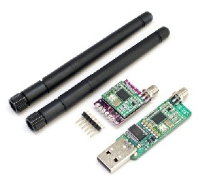

.. _common-3dr-radio-v1:

============
3DR Radio v1
============

This article explains how to connect the *3DR Radio v1* to your flight
controller. You should also read :ref:`SiK Radio v2 <common-sik-telemetry-radio>`, which contains a more detailed user
guide and feature list.

   3DR Radio v1

Overview
========

The *3DR Radio* is the easiest way to setup a telemetry connection
between your autopilot and a ground station.

There are two versions of the 3DR Radio (version 2 is more recent). The
radios have slightly different form factors and connections (v2 comes
with a built-in FTDI cable) but otherwise their behaviour is very
similar.

.. image:: ../../../images/Telemetry_Ver1Ver2.jpg
    :target: ../_images/Telemetry_Ver1Ver2.jpg

.

This article only covers the main difference between the two radios —
connecting the radios.

Connecting the radio
====================

3DR Radio v1 has different radio modules for air and ground:

-  The "ground" module has a USB connector making it easy to connect
   directly to your ground station. On a windows 7 or higher machine,
   the require drivers should be automatically installed the first time
   you plug in the ground module but if it does not install for some
   reason or the ground computer is running Windows XP (or earlier) you
   can get the D2XX FTDI driver
   `here. <http://www.ftdichip.com/Drivers/D2XX.htm>`__
-  The 'aircraft' module has a FTDI six pin header, allowing it to be
   directly connected to your Autopilot's telemetry port as shown
   in the following sections.

Connecting to Pixhawk
---------------------

The Pixhawk 1 telemetry ports use a *DF13 6 pin connector cable (15cm)*
instead of the 5 pins used on the APM2. This allows flow control but
unfortunately means that you will need to hack a cable to get a Version1
radio to a Pixhawk. The connections required are shown below.

.. image:: ../../../images/3drRadioV1_pixhawk1.jpg
    :target: ../_images/3drRadioV1_pixhawk1.jpg

Connecting to APM 2.5
---------------------

Use the included cable and plug it into the telemetry port on APM 2.5
and on the 3DR radio side, plug the connector with the red cable on the
+5v pin and the black cable on the end on GND as shown:

.. note::

   You cannot connect via the radios when your APM 2.x is also
   connected via USB (they share the same port) so make sure you disconnect
   your USB cable from the autopilot before attempting a wireless
   connection.

.. image:: ../../../images/APM2_telemcable.jpg
    :target: ../_images/APM2_telemcable.jpg

