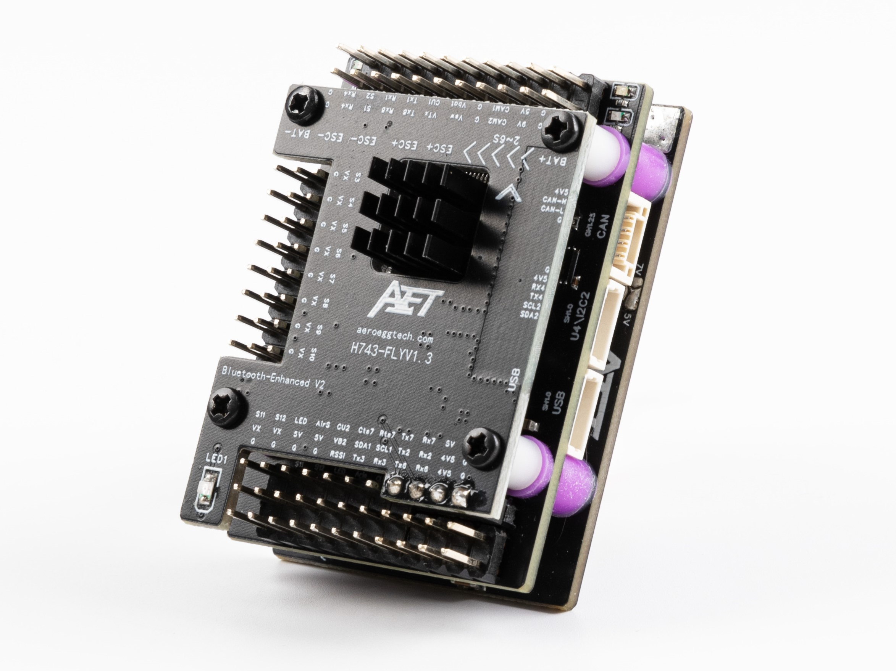
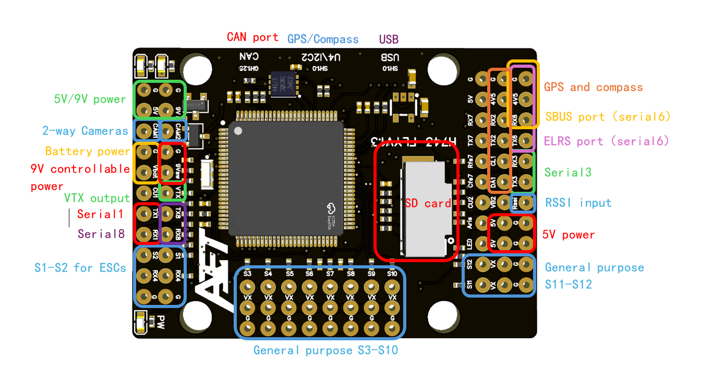
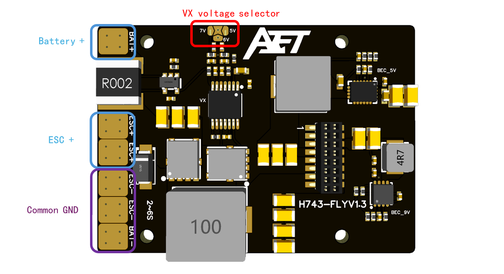

.. _common-AET-H743-Basic:

================================
AET-H743-Basic Flight Controller
================================

The AET-H743-Basic is a flight controller designed and produced by `AeroEggTech <https://www.aeroeggtech.com/>`__

Features
========

* STM32H743 microcontroller
* Dual ICM42688P IMUs
* 13s PWM / Dshot outputs (13th is setup for serial LED)
* 8s UARTs, one with CTS/RTS flow control pins
* 1s CAN
* Dedicated USB board
* DPS310 or SPL06 barometer
* 5V/6V/7V 10A Servo rail BEC
* 9V 2A BEC for VTX, GPIO controlled
* 5V 4A BEC
* MicroSD Card Slot
* Selectable dual camera input
* AT7456E OSD
* 2x I2Cs
* Integrated power monitor

Mechanical
==========
* Dimensions: 36 x 47 x 17 mm
* Weight: 45g

Pinouts
=======

Power
=====
The AET-H743-Basic supports 2-6s Li battery input. It has 3 BECs, which result in power outputs:

.. list-table::
   :header-rows: 1

   * - Power symbol
     - Power source
     - Max power (current)
   * - 5V
     - from 5V BEC
     - 20W (4A)
   * - 9V
     - from 9V BEC
     - 18W (2A)
   * - 9Vsw
     - from 9V BEC, controlled by MCU with an NPN MOS
     - 10W (1A)
   * - 4V5
     - from USB or 5V BEC, with a diode
     - 5W (1A)
   * - VX
     - from Servo rail VX BEC, default 5V, can be changed to 6V or 7V
     - 50W (10A)
   * - BAT
     - directly from battery
     - (5A)

UART Mapping
============
All UARTs are DMA capable. The UARTs are marked Rn and Tn in the above pinouts. The Rn pin is the receive pin for UARTn. The Tn pin is the transmit pin for UARTn.

* SERIAL0 -> USB
* SERIAL1 -> UART1 (MAVLink2)
* SERIAL2 -> UART2 (GPS)
* SERIAL3 -> UART3 (MAVLink2)
* SERIAL4 -> UART4 (GPS2, RX4 is also available as ESC telem if protocol is changed for this UART)
* SERIAL5 -> USB (SLCAN)
* SERIAL6 -> UART6 (RCIN)
* SERIAL7 -> UART7 (MAVLink2, Integrated Bluetooth module)
* SERIAL8 -> UART8 (User)

Serial protocols shown are defaults, but can be adjusted to personal preferences.

RC Input
========

The default RC input is configured on the UART6 and supports all RC protocols except PPM. The SBUS pin is inverted and connected to RX6.

RC can be attached to any UART port as long as the serial port protocol is set to ``SERIALn_PROTOCOL=23`` and SERIAL6_Protocol is changed to something other than '23'.

* FPort requires connection to TX6. See ref:`common-fport-receivers`.
* SRXL2 requires a connection to TX6 and automatically provides telemetry. Set SERIAL6_OPTIONS to “4”.

OSD Support
===========
The AET-H743-Basic supports onboard analog SD OSD using a AT7456 chip. The analog VTX should connect to the VTX pin.

PWM Output
==========
The AET-H743-Basic supports up to 13 PWM outputs.

All the channels support DShot.

Outputs are grouped and every output within a group must use the same output protocol:

* 1, 2 are Group 1;
* 3, 4, 5, 6 are Group 2;
* 7, 8, 9, 10 are Group 3;
* 11, 12 are Group 4;
* 13(LED) is Group 5;

Output 13 is configured by default parameters to be used as LED neopixel output, but can be changed.

Battery Monitoring
==================
The board has two internal voltage sensors and one integrated current sensor, and a second external current sensor input.

The voltage sensors can handle up to 6S LiPo batteries.

The first voltage/current sensor is enabled by default and the pin inputs and voltage scale for the second, un-enabled sensor are also set by default:

* :ref:`BATT_MONITOR<BATT_MONITOR>` = 4
* :ref:`BATT_VOLT_PIN<BATT_VOLT_PIN__AP_BattMonitor_Analog>` = 10
* :ref:`BATT_CURR_PIN<BATT_CURR_PIN__AP_BattMonitor_Analog>` = 11
* :ref:`BATT_VOLT_MULT<BATT_VOLT_MULT__AP_BattMonitor_Analog>` = 11
* :ref:`BATT_AMP_PERVLT<BATT_AMP_PERVLT__AP_BattMonitor_Analog>` = 40
* :ref:`BATT2_VOLT_PIN<BATT2_VOLT_PIN__AP_BattMonitor_Analog>` = 18
* :ref:`BATT2_CURR_PIN<BATT2_CURR_PIN__AP_BattMonitor_Analog>` = 7
* :ref:`BATT2_VOLT_MULT<BATT2_VOLT_MULT__AP_BattMonitor_Analog>` = 11

Compass
=======
The AET-H743-Basic has no built-in compass, so if needed, you should use an external compass.

Analog cameras
==============
The AET-H743-Basic supports up to 2 cameras, connected to pin CAM1 and CAM2. You can select the video signal to VTX from camera by an RC channel. Set the parameters below:

* RELAY2_FUNCTION = 1
* RELAY_PIN2 = 82
* RC8_OPTION = 34

9V video power switch
=====================
The 9Vsw power supply can be controlled by an RC channel. Set the parameters below:

* RELAY1_FUNCTION = 1
* RELAY_PIN = 81
* RC7_OPTION = 28

Bluetooth
=========
The AET-H743-Basic support both legacy bluetooth SPP and BLE serial. The bluetooth uses UART7 as serial port. Search for ``AET-H743-SPP`` or ``AET-H743-BLE`` to connect.

Note: you need to connect a battery to the board to power the bluetooth module.

Loading Firmware
================
Initial firmware load can be done with DFU by plugging in USB with the bootloader button pressed. Then you should load the "with_bl.hex" firmware, using your favorite DFU loading tool, such as Mission Planner.

Once the initial firmware is loaded you can update the firmware using any ArduPilot ground station software. Updates should be done with the "\*.apj" firmware files.

[copywiki destination="plane,rover,copter,blimp"]