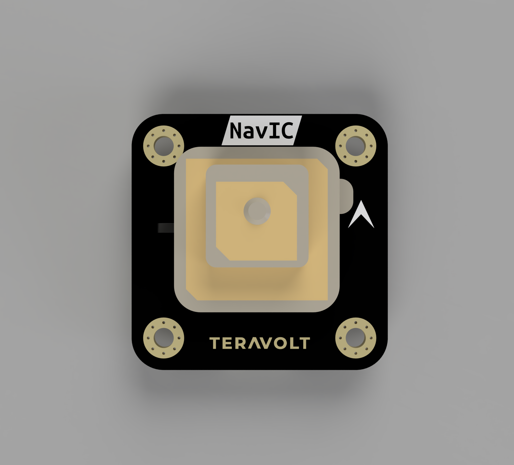

.. _common-aeronav1-gps:

AeroNav-1 Dual-Band GNSS (NavIC Supported)
==========================================

The **AeroNav-1** is an industrial-grade, dual-band GNSS module **designed and manufactured in India** by TeraVolt Labs. It is specifically engineered to support the **NavIC (IRNSS) constellation**, making it fully compliant with DGCA requirements for indigenous drone manufacturing. 
It features a high-sensitivity L1 + L5 receiver (**Ublox-F10N**) and an integrated **Bosch BMM350** 3-axis magnetometer for precise heading.

Key Features
------------

* **NavIC Support:** Native support for Indian Regional Navigation Satellite System (IRNSS) on L5 band.
* **Dual-Band Precision:** Simultaneously tracks L1 and L5 signals for superior multipath rejection in urban environments.
* **Compass:** Integrated Bosch BMM350 (Industrial Grade).
* **Compliance:** Suitable for DGCA-compliant drone builds in India.

Specifications
--------------

* **GNSS Receiver:** Dual-Band L1 + L5
* **Constellations:**
    - **NavIC (L5)**
    - GPS (L1/L5)
    - Galileo (E1/E5)
    - BeiDou (B1/B2a) 
    - QZSS (L1/L5)
* **Compass:** Bosch BMM350 (I2C)
* **Update Rate:** Up to 10Hz
* **Accuracy:** < 1.5m CEP (Standalone)
* **Input Voltage:** 3.3V - 5.0V
* **Interface:** UART (GNSS) + I2C (Compass)

Pinout
------

The AeroNav-1 uses a standard **6-pin JST-GH connector** (Pixhawk Standard) for the primary interface.

.. image:: ../../../images/Teravolt/AeroNav-1/AeroNav-1_3.png
    :target: ../images/images/Teravolt/AeroNav-1/AeroNav-1_3.png
    :width: 450px

.. list-table:: JST-GH 6-Pin Connector
   :widths: 5 10 15 50
   :header-rows: 1

   * - Pin
     - Name
     - Direction
     - Description
   * - 1
     - 5V
     - Input
     - Power Input (Regulated 5V)
   * - 2
     - RX
     - Input
     - UART RX (Connects to Autopilot **TX**)
   * - 3
     - TX
     - Output
     - UART TX (Connects to Autopilot **RX**)
   * - 4
     - SCL
     - Bidirectional
     - I²C Clock for BMM350 (3.3V logic)
   * - 5
     - SDA
     - Bidirectional
     - I²C Data for BMM350 (3.3V logic)
   * - 6
     - GND
     - Input
     - Ground

Useful Links
------------

* `Official AeroNav-1 Documentation <https://teravolt.gitbook.io/teravolt/gps/aeronav-1>`__
* `TeraVolt Labs - Official Store <https://www.teravolt.in/product-page/aeronav-1>`__