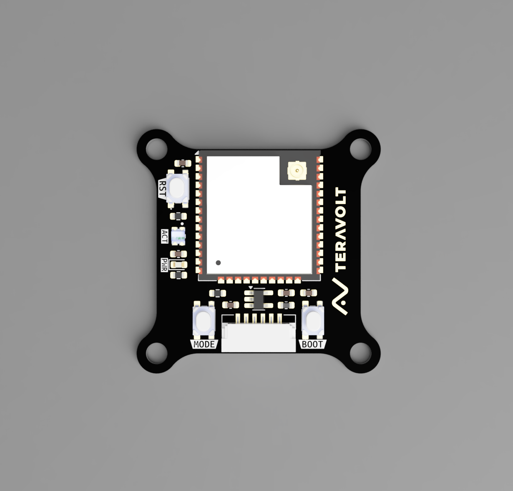
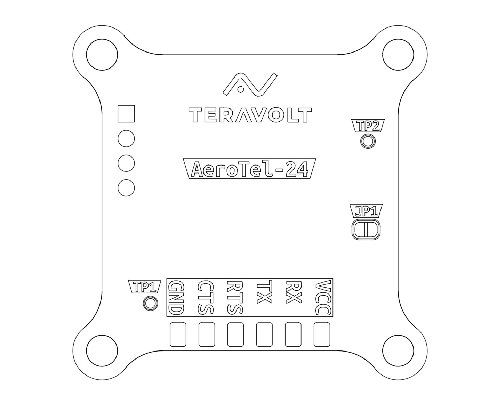

.. _common-aerotel-24:

======================================
TeraVolt AeroTel 2.4 - Telemetry Radio
======================================

The **AeroTel 2.4** by **TeraVolt Labs** is a professional, plug-and-play telemetry module powered by the industry-proven **DroneBridge** communication core.

While standard DroneBridge boards require manual wiring and soldering, the AeroTel 2.4 is engineered specifically for ArduPilot integration. It features a custom "mounting-friendly" PCB, pre-installed JST-GH connectors matching the Pixhawk standard, and dedicated onboard controls for mode switching.

Key Features
------------

* **Plug & Play:** Pre-installed JST-GH 6-pin connector (Direct fit for Pixhawk/Cube TELEM ports).
* **Hardware Mode Button:** Dedicated button to cycle between WiFi AP, WiFi Client, and ESP-NOW Long Range modes (no web interface required).
* **Smart Status LED:** Onboard multi-color LED provides instant visual feedback on connection status and operating mode.
* **OTA Firmware Updates:** Native support for wireless firmware updates via WiFi.
* **Mounting Friendly:** Custom form factor with standard M3 mounting holes for secure chassis installation.
* **Security:** AES-256 encryption for secure data links.

Specifications
--------------

* **Frequency:** 2.4 GHz (WiFi-6 / ESP-NOW)
* **Input Voltage:** 5V DC
* **Connector:** JST-GH 6-Pin (Standard Telemetry)
* **Range:** > 300m (Standard WiFi) / > 1km (ESP-NOW Long Range)
* **Protocol:** MAVLink / Transparent Serial Bridge
* **Dimensions:** 32mm x 32mm 
* **Weight:** 10g

Pinout
------

The module utilizes the standard ArduPilot Telemetry pinout:

* **VCC:** 5V Input
* **TX:** Connect to Autopilot RX
* **RX:** Connect to Autopilot TX
* **CTS:** Clear to Send (Flow Control)
* **RTS:** Request to Send (Flow Control)
* **GND:** Ground

Status LED & Controls
---------------------

**Mode Selection Button:**
Press the Mode button to cycle through operating modes:

1. **Access Point (AP):** Creates a WiFi Hotspot (Default).
2. **Client Mode:** Connects to an existing router.
3. **ESP-NOW:** Long-range bridge mode (Requires second unit).

**LED Indicators:**

* **Blink Green:** WiFi AP Mode (Connected)
* **Blink Yellow:** Client Mode (Connected to router)
* **Fast Blink Red:** Module Disconnected

Configuration
-------------

If you set these parameters, AeroTel-24 will work out of the box.
Connect AeroTel to any available SERIAL port (e.g., SERIAL2) and configure the following parameters in Mission Planner:
The module is plug and play and does not require any configuration changes via web interface.

- :ref:`SERIAL2_PROTOCOL <SERIAL2_PROTOCOL>` = 2 (MAVLink2)
- :ref:`SERIAL2_BAUD <SERIAL2_BAUD>` = 115 (115200 baud)

Useful Links
------------

* `Official AeroTel Documentation <https://teravolt.gitbook.io/teravolt/radio/aerotel-2.4>`__
* `TeraVolt Labs Store <https://www.teravolt.in/product-page/aerotel-24-secure-telemetry-radio>`__