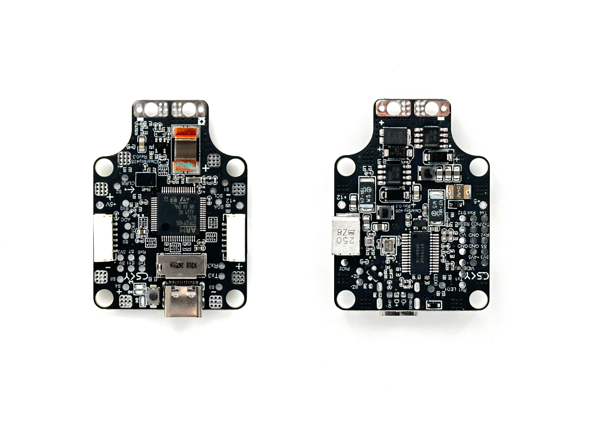
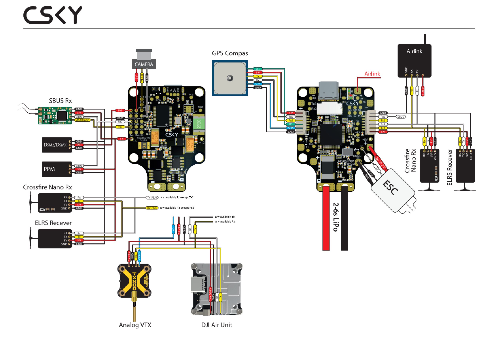

.. _common-CSKYF405:

=======
CSKY405
=======

.. note::

	Due to flash memory limitations, this board does not include all ArduPilot features.
        See :ref:`Firmware Limitations <common-limited_firmware>` for details.

Specifications
==============

-  **Processor**

   -  STM32F405RGT6 ARM (168MHz)
   -  AT7456E OSD

-  **Sensors**

   -  BMI088 IMU (accel, gyro)
   -  BMP390 barometer
   -  Voltage & 90A(215A PEak) current sensor

-  **Power**

   -  2S-6S DC input power
   -  5V, 2.5A BEC for servos
   -  12V, 2A BEC for video

-  **Interfaces**

   -  6x UARTS
   -  10x PWM outputs
   -  1x RC input with inverter for SBUS/PPM 
   -  I2C port for external compass and airspeed sensor
   -  Type-C USB port
   -  SD Card Slot

Where to Buy
============
`CSKY <https://csky.space/products>`__

Typical Wiring Diagram
======================

Default UART order
==================

- SERIAL0 = console = USB
- SERIAL1 = UART4 (MAVLink2)
- SERIAL2 = USART1 (MAVLink2, DMA capable)
- SERIAL3 = UART5 (GPS)
- SERIAL4 = USART3 (GPS, TX3 DMA capable)
- SERIAL5 = USART6 ((User, TX3 DMA capable)
- SERIAL6 = USART2 (RCinput on RX2, to use as normal UART input use :ref:`BRD_ALT_CONFIG<BRD_ALT_CONFIG>` = 1)

Serial protocols shown are defaults, but can be adjusted to personal preferences.

OSD Support
===========
The CSKY405 supports using its internal OSD using OSD_TYPE 1 (MAX7456 driver). External OSD support such as DJI or DisplayPort can be supported using USART6 or any other free UART. See :ref:`common-msp-osd-overview-4.2` for more info.

PWM Outputs
===========

The CSKY405 supports up to 10 PWM outputs. All outputs support DShot.

The PWM is in 5 groups:

 - PWM 1 in group1
 - PWM 2 in group2
 - PWM 3,4 in group3
 - PWM 5,6,10 in group4
 - PWM 7 in group5
 - PWM 8,9 in group6

RC Input
========

RC input is configured on the RX2 pin. It supports all single wire RC
protocols except bi-directional serial protocols such as CRSF, ELRS, etc. Instead, these devices can be connected using both TX2 and RX2 if if :ref:`BRD_ALT_CONFIG<BRD_ALT_CONFIG>` = 1 and :ref:`SERIAL6_PROTOCOL<SERIAL6_PROTOCOL>` set to "23".

- PPM is not supported.

- DSM/SRXL connects to the RX2  pin.

- FPort requires connection to TX2 and RX2 via a bi-directional inverter. See :ref:`common-FPort-receivers`.

- CRSF also requires a TX2 connection, in addition to RX2, and automatically provides telemetry. Set :ref:`SERIAL6_PROTOCOL<SERIAL6_PROTOCOL>` to "23"

- SRXL2 requires a connection to TX2 and automatically provides telemetry.  Set :ref:`SERIAL6_OPTIONS<SERIAL6_OPTIONS>` to "4" and :ref:`SERIAL6_PROTOCOL<SERIAL6_PROTOCOL>` set "23".

Battery Monitor Configuration
=============================
These settings are set as defaults when the firmware is loaded (except :ref:`BATT_AMP_PERVLT<BATT_AMP_PERVLT>` which needs to be changed from the default value). However, if they are ever lost, you can manually set the parameters:

Enimages/CSKY405_wiring.pngable Battery monitor.

- :ref:`BATT_MONITOR<BATT_MONITOR>` =4

Then reboot.

- :ref:`BATT_VOLT_PIN<BATT_VOLT_PIN>` 14
- :ref:`BATT_CURR_PIN<BATT_CURR_PIN>` 7
- :ref:`BATT_VOLT_MULT<BATT_VOLT_MULT>` 21
- :ref:`BATT_AMP_PERVLT<BATT_AMP_PERVLT>` 10.35

VTX power control
=================

GPIO 84 controls the VTX BEC output to pins marked "12V". Setting this GPIO high using an :ref:`common-auxiliary-functions` or :ref:`common-relay` removes voltage supply to pins.

Connecting a GPS/Compass module
===============================

This board does not include a GPS or compass so an :ref:`external GPS/compass <common-positioning-landing-page>` should be connected as shown below in order for autonomous modes to function.

Firmware
========

Firmware for this board can be found `here <https://firmware.ardupilot.org>`_ in  sub-folders labeled
"CSKYF405".

Loading Firmware
================
Firmware for these boards can be found at https://firmware.ardupilot.org in sub-folders labeled CSKY405.

Initial firmware load can be done with DFU by plugging in USB with the
boot button pressed. Then you should load the "CSKY405_bl.hex"
firmware, using your favorite DFU loading tool.

Subsequently, you can update firmware with Mission Planner.

[copywiki destination="plane,copter,rover,blimp"]

