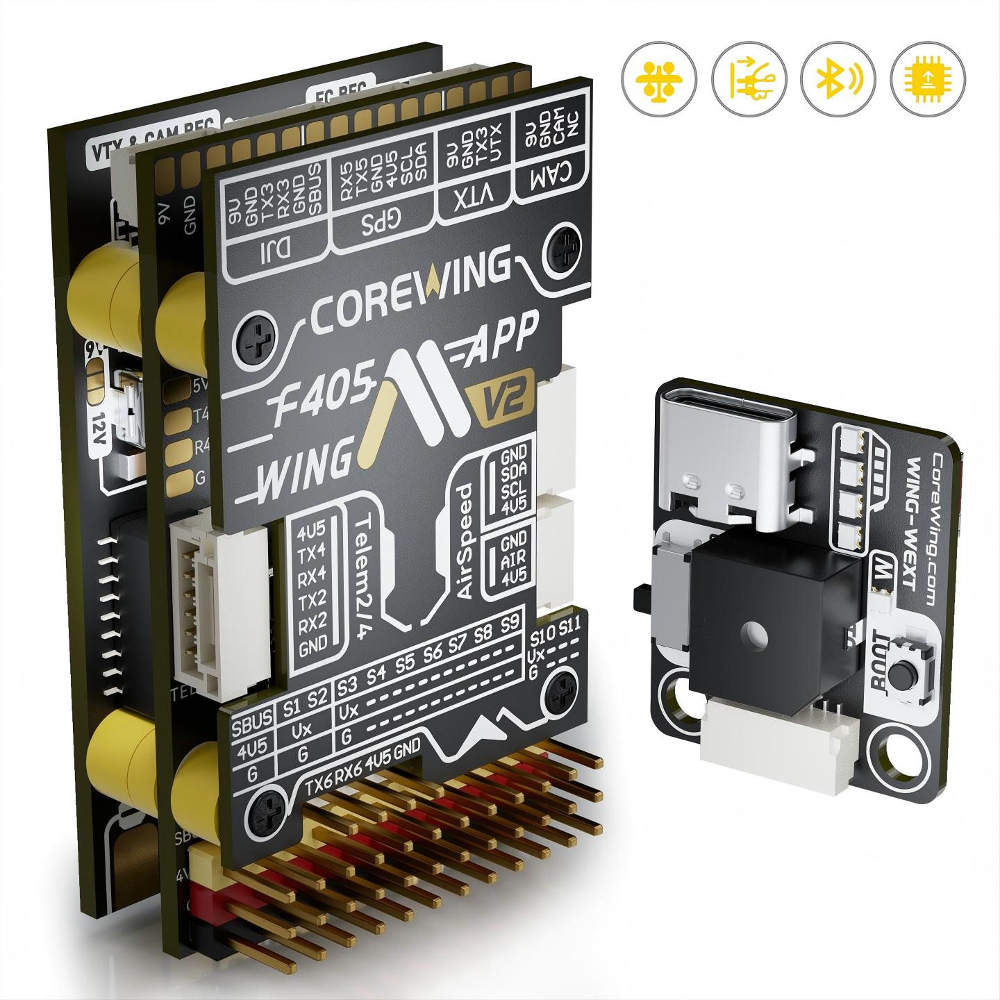
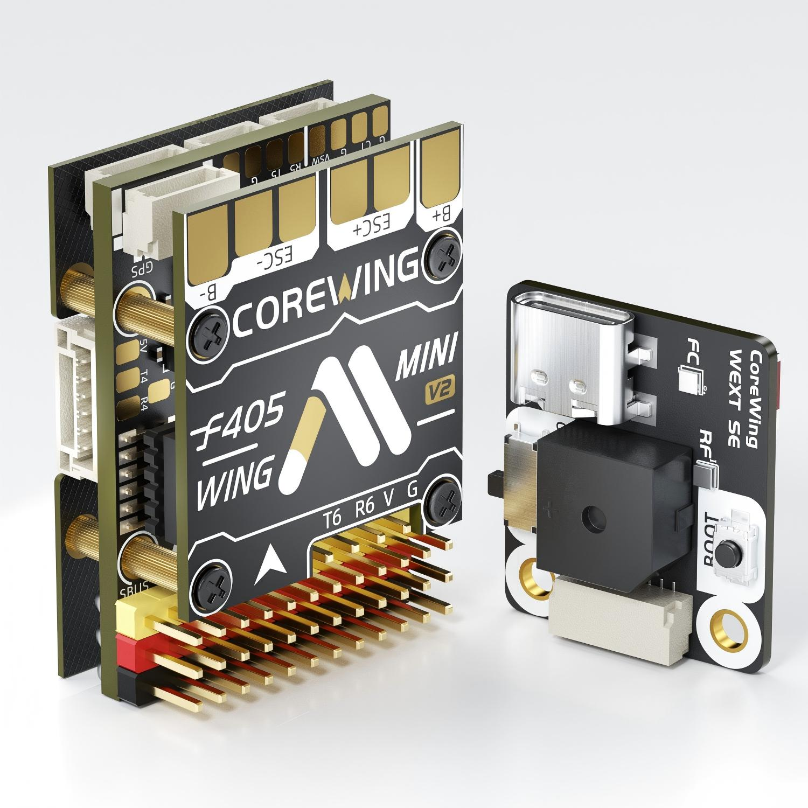
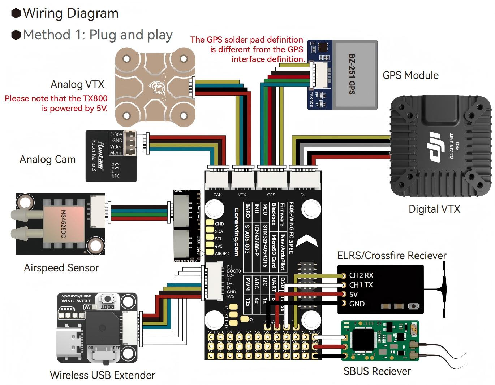
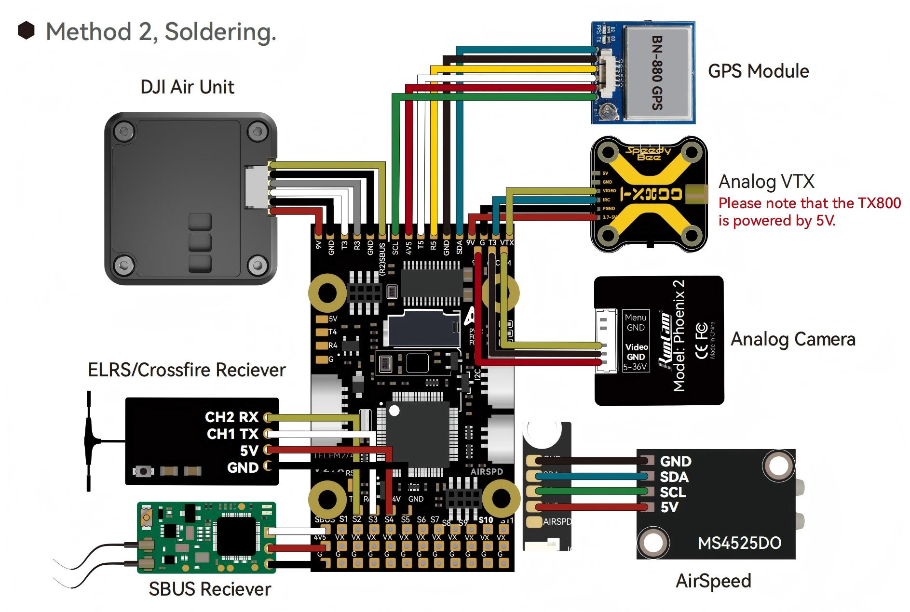
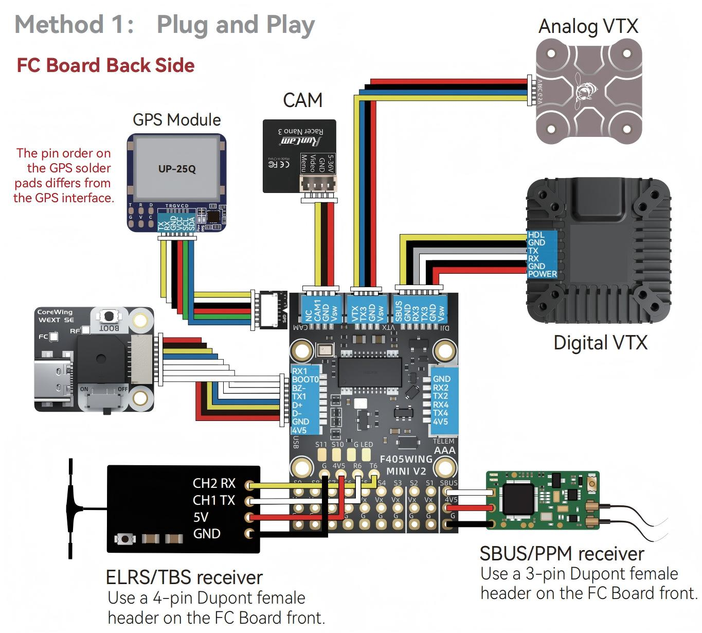
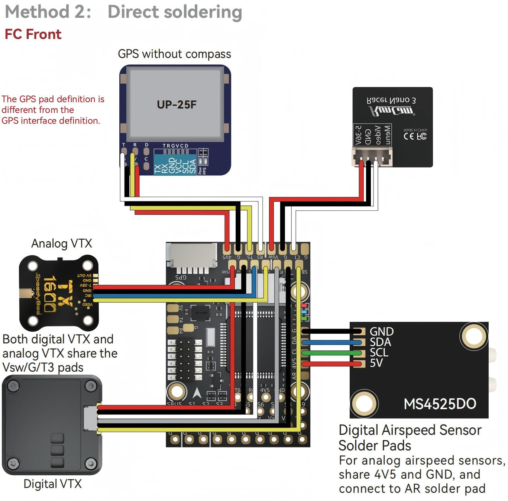
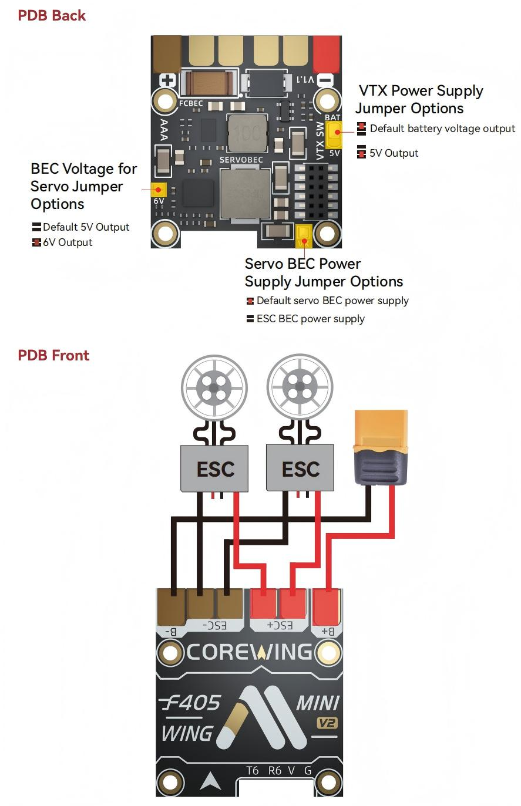

.. _common-CoreWingF405WingV2:

====================================
CoreWing F405 Wing V2 / Wing Mini V2
====================================

The CoreWing F405 Wing V2 and CoreWing F405 Wing Mini V2 are compact ArduPilot Plane flight controllers for fixed-wing and QuadPlane/VTOL aircraft, designed to simplify wiring, setup, and field configuration through integrated power, video/OSD, peripheral, and wireless features.

- 12 servo / motor outputs for conventional fixed-wing and QuadPlane configurations

- Integrated PDB with servo / VTX power and voltage / current monitoring

- Integrated AT7456 analog OSD, with a dedicated HD VTX interface

- GPS, telemetry, RC receiver, compass, airspeed, and rangefinder ports

- Included wireless module with BLE/Wi-Fi support for CoreWing app and Mission Planner connection

.. note::

    Due to flash memory limitations, this board does not include all ArduPilot features. See :ref:`Firmware Limitations <common-limited_firmware>` for details.

Specifications
==============

-  **Processor**

   -  STM32F405RGT6 ARM, 168MHz
   -  AT7456E  OSD
   -  ESP-S3 on Wing V2 / ESP8685 on Mini V2 for BLE/WiFi Telemetry

-  **Sensors**

   -  ICM-42688P or BMI270 IMU, depending on board variant
   -  SPA06-003 barometer
   -  Voltage and current sensors

-  **Power Input**

   -  Wing V2: 3S to 6S LiPo input, 10 V to 28 V
   -  Mini V2: 2S to 6S LiPo input, 7 V to 28 V
   -  90 A continuous / 215 A peak current sensing

-  **Power Outputs**

+-------+--------------+----------------+--------------------+
|Board  | Typical Use  |   Voltage      |  Current(cont/peak)|
+=======+==============+================+====================+
|WingV2 | Peripherals  |   5.2V         |  4A / 5A           |
+       +--------------+----------------+--------------------+
|       | Servos       |5V, 6V, or 7.2V |  8A / 14A          |
|       +--------------+----------------+--------------------+
|       | VTX/CAM      | 5V,9V or 12V   |  2A / 3A           |
+-------+--------------+----------------+--------------------+
|MiniV2 | Peripherals  |   5V           |  2A / 3A           |
+       +--------------+----------------+--------------------+
|       | Servos       | 5V or 6V       |  4A / 5A           |
|       +--------------+----------------+--------------------+
|       | VTX/CAM      | shared with 5V |                    |
|       |              |    or BATin    |  1.5A / 2A         |
+-------+--------------+----------------+--------------------+

-  **Interfaces**

   -  12x PWM outputs
   -  10x DShot-capable outputs and 2x standard PWM outputs
   -  1x SBUS/PPM input
   -  Dedicated serial RC input for CRSF/ELRS/TBS Crossfire
   -  6x UARTs for GPS, telemetry, RC, display, VTX, and other peripherals, UART1 internally tied to Wireless board
   -  1x I2C port for external compass, digital airspeed, and other I2C peripherals
   -  4x ADC inputs: voltage, current, RSSI, analog airspeed, VB2 and CU2
   -  Analog airspeed input
   -  microSD card slot
   -  USB-C port
   -  Onboard BLE / WiFi wireless board
   -  Switchable VTX supply

-  **Size and Dimensions**

   - Wing V2      : 52 mm x 32 mm x 17 mm, 40 g
   - Wing Mini V2 : 37 mm x 26 mm x 14 mm, 19 g

Where to Buy
============

`CoreWing official website <https://www.corewing.com/en/>`__

`GetFPV <https://www.getfpv.com/corewing-f405-wing-v2-flight-controller-stack.html>`__

User Manual
===========

`Wing V2 User Manual <https://docs.corewing.com/en/plane/manual/corewingf405wingv2.html>`__

`Mini V2 User Manual <https://docs.corewing.com/en/plane/manual/corewingf405wingminiv2.html>`__

Wiring Diagram
==============

Default UART order
==================

The UARTs are marked Rn and Tn in the above pinouts. The Rn pin is the
receive pin for UARTn. The Tn pin is the transmit pin for UARTn.

 - SERIAL0 = console  = USB
 - SERIAL1 = MAVLink2 = USART1, tied to the wireless module, DMA capable
 - SERIAL2 = USER     = USART2, RX tied to inverted SBUS RC input, but can be used as normal UART if :ref:`BRD_ALT_CONFIG<BRD_ALT_CONFIG>` =1
 - SERIAL3 = USER     = USART3, available on DJI air unit connector, TX DMA capable
 - SERIAL4 = USER     = UART4, TX DMA capable
 - SERIAL5 = GPS      = UART5, available on GPS connector, TX DMA capable
 - SERIAL6 = RCIN     = USART6, Serial RC input, DMA capable

Serial protocols shown are defaults, but can be adjusted to personal preferences.

RC Input
========

The SBUS input is passed through an inverter to RX2 (UART2 RX). By default, RX2 is mapped to a timer input instead of the UART and can be used for SBUS, PPM, and other receiver protocols that do not require a true UART.

Serial receiver protocols such as CRSF, ELRS, MAVLink RC input, and SRXL2 should be connected to UART6 using the TX6 and RX6 pins. :ref:`SERIAL6_PROTOCOL<SERIAL6_PROTOCOL>` is set to 23 by default for serial RC input.

Recommended receiver connections:

 - PPM: connect to the SBUS input

 - SBUS: connect to the SBUS input

 - CRSF / TBS Crossfire: connect to TX6 and RX6

 - ELRS: connect to TX6 and RX6, same as CRSF. Set bit 13 of
    :ref:`RC_OPTIONS<RC_OPTIONS>` if required

 - DSM / SRXL: connect to RX6.

 - SRXL2: connect to TX6 and set :ref:`SERIAL6_OPTIONS<SERIAL6_OPTIONS>` to 4.

 - FPort: connect to TX6 and RX6 through a bidirectional inverter. See :ref:`common-FPort-receivers`.

.. note:: UART6 is configured by default for serial receivers. You can also have more than one receiver in the system at a time (usually used for long range hand-offs to a remote TX). See :ref:`common-multiple-rx` for details.

Any UART can be used for RC system connections in ArduPilot also, and is compatible with all protocols except PPM (SBUS requires external inversion on other UARTs). See :ref:`common-rc-systems` for details.

.. note:: the "4V5" pin above the SBUS pin and the 4V5 pins in the GPS, Airspeed, and Telem connectors are powered when USB is connected. Be careful not to present too much load to the USB source or voltage droop may occur. All other 5V pins are only powered when battery is present.

Servo/Motor Outputs
===================

All motor/servo outputs are PWM capable. PWM outputs 1 to 10 are also DShot capable. On the Wing V2, PWM outputs 1 to 4 additionally support bi-directional DShot; the Wing Mini V2 does not support bi-directional DShot. However, mixing DShot, serial LED, and normal PWM operation for outputs is restricted into groups, i.e. enabling DShot for an output in a group requires that all DShot-capable outputs in that group be configured and used as DShot, rather than PWM outputs.

 - PWM 1,2   in group 1  (TIM4)
 - PWM 3,4   in group 2  (TIM3)
 - PWM 5-7   in group 3  (TIM8)
 - PWM 8-10  in group 4  (TIM2)
 - PWM 11,12 in group 5  (TIM1)

.. note::

   PWM 11 and PWM 12 only support normal PWM output. They do not support DShot.

Integrated PDB and Power Wiring
===============================

The board includes an integrated PDB with separate power rails for the flight controller/peripherals, servos, and VTX/camera equipment. This reduces the need for an external PDB or separate BEC modules in typical fixed-wing builds.

Wing V2 includes three onboard BECs: an FC BEC, a servo BEC, and a VTX/CAM BEC. 
Wing Mini V2 includes two onboard BECs: an FC BEC and a servo BEC. Its VTX/CAM power output is selectable between 5V and battery input, but it is not a separate third BEC.

CoreWing F405 Wing V2
---------------------

.. image:: ../../../images/CoreWing/CoreWingF405WingV2_pdb.jpg
    :target: ../_images/CoreWingF405WingV2_pdb.jpg

CoreWing F405 Wing Mini V2
--------------------------

.. note::

   On CoreWing F405 Wing Mini V2, if the VTX power output is set to battery voltage, make sure the connected camera or VTX supports the battery voltage.

.. note::

   The servo rail is powered by the onboard servo BEC. Do not connect an ESC BEC red wire to the servo rail unless the board power jumper configuration allows an external BEC input.

Wireless Connection
===================

The onboard CoreWing wireless board supports BLE and WiFi AP/STA modes. The `CoreWing app <https://www.corewing.com/en/app/>`__ can be used for wireless parameter setup, wireless firmware flashing, and wireless board settings.
Mission Planner can connect through WiFi using TCP or UDP.

WiFi AP default settings:

 - SSID: ``CoreWing WING-WiFi`` or ``CoreWing WING MINI-WiFi``
 - Password: ``88888888``
 - IP address: ``192.168.1.1``
 - TCP port: ``4278``
 - UDP port: ``14550``

In WiFi STA mode, connect using the IP address assigned by the router or hotspot.

OSD Support
===========

The CoreWing F405 Wing V2 / Mini V2 supports using its internal OSD using OSD_TYPE 1 (MAX7456 driver). External OSD support such as DJI or DisplayPort is supported using UART3 or any other free UART. See :ref:`common-msp-osd-overview-4.2` for more info.

VTX Control
===========

UART3 TX is located in the Video Output connector to provide IRC Tramp or Smart Audio control of video transmitters. See :ref:`common-vtx` for more information.

VTX Power Control
=================

GPIO 81 controls the VTX/CAM power output. Setting this GPIO high removes voltage supply from the VTX/CAM power pins.

Set a ``RELAYx_PIN`` to 81 to control the switching. Then select an RC channel for control (Chx) and set its ``RCx_OPTION`` to the appropriate Relay (1-6) that you had set its pin parameter above.

For example, use Channel 7 to control the switch using Relay 1:

    :ref:`RELAY1_PIN<RELAY1_PIN>` = 81

    :ref:`RC7_OPTION<RC7_OPTION>` = 28 (Relay1 Control)

Battery Monitor Settings
========================

These should already be set by default. However, if lost or changed:

Enable Battery monitor with these parameter settings :

:ref:`BATT_MONITOR<BATT_MONITOR>` = 4

Then reboot.

:ref:`BATT_VOLT_PIN<BATT_VOLT_PIN__AP_BattMonitor_Analog>` = 10

:ref:`BATT_CURR_PIN<BATT_CURR_PIN__AP_BattMonitor_Analog>` = 11

:ref:`BATT_VOLT_MULT<BATT_VOLT_MULT__AP_BattMonitor_Analog>` = 11.05 

:ref:`BATT_AMP_PERVLT<BATT_AMP_PERVLT__AP_BattMonitor_Analog>` = 64 for Wing V2, or 51 for Wing Mini V2

.. note::  This autopilot uses a sensitive analog current sensor. ESC switching noise can affect current readings. A 35 V 470 uF electrolytic capacitor is included in the package and should be installed on the power input. In some cases, the ESCs themselves may need additional 200 uF to 470 uF low-ESR capacitors on their power inputs if they do not already include them.

Connecting a GPS/Compass module
===============================

These boards do not include a built-in GPS or compass module. An external GPS/compass module should be connected for autonomous modes that require position and heading information.

The GPS connector provides UART5, I2C, and 4V5 power. UART5 is GPS1 by default, and the I2C bus can be used for an external compass.

.. note::

   The 4V5 pins are also powered when USB is connected. Avoid connecting    high-current loads to 4V5 when powered only from USB.

Airspeed
========

The boards supports both analog and digital airspeed sensors.

 - Analog airspeed: use the AIR analog input, 0 V to 6.6 V range (ARSPD_PIN 15, set by default)
 - Digital airspeed: use the I2C airspeed connector

The MS4525DO, ASP5033, MS5525, SDP3X and NMEA digital airspeed sensors are enabled by default, in addition to analog airspeed. Other digital airspeed sensor drivers require a custom firmware build using the `Custom Firmware Build Server <https://custom.ardupilot.org>`__.

Logging
=======

The boards support microSD card logging.

Use a microSD card formatted as FAT16 or FAT32. SDSC and SDHC cards are recommended.

Firmware
========

Firmware for these boards can be found in the ArduPilot firmware server in sub-folders named:

 - CoreWingF405WingV2
 - CoreWingF405WMiniV2

These boards do not come with ArduPilot firmware pre-installed. Use the instructions here to load ArduPilot the first time:

:ref:`common-loading-firmware-onto-chibios-only-boards`

The CoreWing app can also be used for wireless firmware flashing after the wireless board is connected and configured.

[copywiki destination="plane,copter,rover,blimp,sub"]