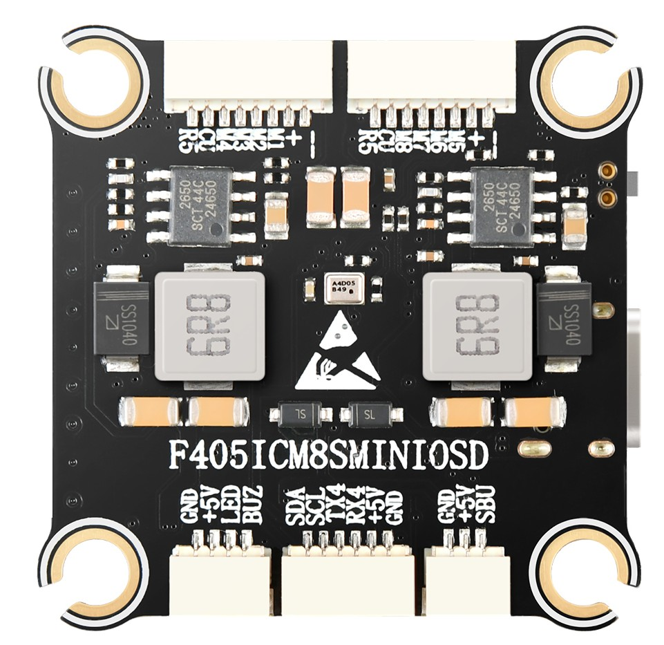
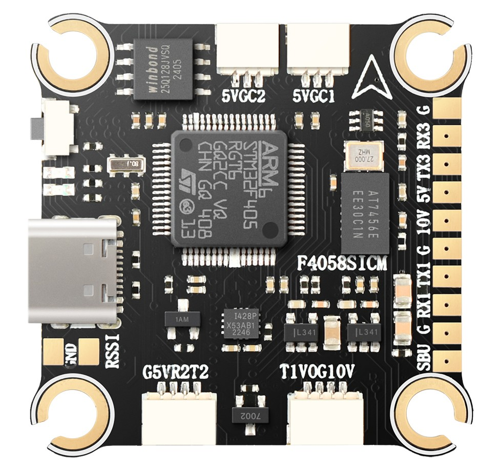
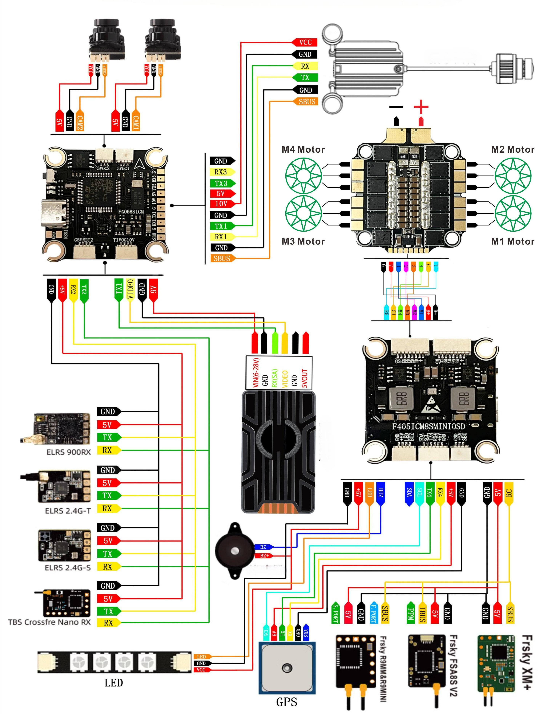

.. _common-DroneerF405:
[copywiki destination="plane,copter,rover,blimp,sub"]
==============================
Droneer F405 Flight Controller
==============================

The Droneer F405 is a flight controller produced by `Droneer <http://www.droneer.co/>`_.

Features
========

* STM32F405 microcontroller
* ICM42688-P IMU
* max7456 OSD
* 5 UARTs
* 9 PWM outputs
* Dual Camera inputs
* 3S to 8S LIPO operation
* 5V,3A BEC, 10V,2A VTX BEC
* Physical: 37x37mm, 7g

Pinout
======

Typical Wiring Diagram
======================

UART Mapping
============
The UARTs are marked Rn or RXn and Tn or TXn in the above pinouts. The Rn pin is the
receive pin for UARTn. The Tn pin is the transmit pin for UARTn.

* SERIAL0 -> USB
* SERIAL1 -> UART1 (Tramp)
* SERIAL2 -> UART2 (RCIN, DMA-enabled) 
* SERIAL3 -> UART3 (User)
* SERIAL4 -> UART4 (GPS)
* SERIAL5 -> UART5 (ESC Telem, RX5(only)on ESC connector)

Serial protocols shown are defaults, but can be adjusted to personal preferences.

RC Input
========
The SBUS pin (SBU), is passed by an inverter to RX2 (UART2 RX), which can be used for all ArduPilot supported receiver protocols, except PPM, CRSF/ELRS, and SRXL2. CRSF/ELRS and SRXL2 require the RX2 and TX2s pin be connected instead of the SBUS pin.

* SRXL2 requires :ref:`SERIAL2_OPTIONS<SERIAL2_OPTIONS>` be set to “4”.
* Fport should be connected to TX2 via a bi-directional inverter and :ref:`SERIAL2_OPTIONS<SERIAL2_OPTIONS>` be set to “4”. See :ref:`common-connecting-sport-fport`.

Any UART can also be used for RC system connections in ArduPilot and is compatible with all protocols except PPM (SBUS requires external inversion on other UARTs). See :ref:`common-rc-systems` for details.

FrSky Telemetry
===============
FrSky Telemetry is supported using the Tx pin of any UART. You need to set the following parameters to enable support for FrSky S.PORT (example shows SERIAL3).

* :ref:`SERIAL3_PROTOCOL<SERIAL3_PROTOCOL>` = 10
* :ref:`SERIAL3_OPTIONS<SERIAL3_OPTIONS>` = 7

OSD Support
===========
The Droneer F405 supports analog OSD using its integrated MAX7456. Simultaneous HD TVX OSD operation can also be obtained using an available UART whose protocol is set to "DisplayPort (42)" and :ref:`OSD_TYPE2<OSD_TYPE2>` set to "5".

The JST-GH-4P connector supports a standard "Tramp" VTX connection. Pin 1 of the connector is 10v so be careful not to connect this to a peripheral requiring 5v.

PWM Output
==========
The Droneer F405 supports up to 9 PWM outputs. The ESC connectors have M1-8 outputs, plus M9(marked LED) for LED strip or another PWM output.

The PWM is in 3 groups:

* PWM 1-4 in group1
* PWM 5-8 in group2
* PWM 9 in group3

Channels within the same group need to use the same output rate. If
any channel in a group uses DShot then all channels in the group need
to use DShot. Channels 1-4 support bi-directional DShot.

Battery Monitoring
==================
The board has a internal voltage sensor and connections on the ESC connector for an external current sensor input. The voltage sensor can handle up to 8S LiPo batteries.

The default battery parameters are:

* :ref:`BATT_MONITOR<BATT_MONITOR>` = 4
* :ref:`BATT_VOLT_PIN<BATT_VOLT_PIN__AP_BattMonitor_Analog>` = 12
* :ref:`BATT_CURR_PIN<BATT_CURR_PIN__AP_BattMonitor_Analog>` = 11
* :ref:`BATT_VOLT_MULT<BATT_VOLT_MULT__AP_BattMonitor_Analog>` = 11
* :ref:`BATT_AMP_PERVLT<BATT_AMP_PERVLT__AP_BattMonitor_Analog>` = 30.2 (will need to be adjusted for whichever current sensor is attached)

Compass
=======
The Droneer F405 does not have a builtin compass, but you can attach an external compass using I2C on the SDA and SCL pads.

Firmware
========
Firmware for this board can be found here in sub-folders labeled “DroneerF405”.

Loading Firmware
================
Initial firmware load can be done with DFU by plugging in USB with the
bootloader button pressed. Then you should load the "with_bl.hex"
firmware, using your favourite DFU loading tool.

Once the initial firmware is loaded you can update the firmware using
any ArduPilot ground station software. Updates should be done with the
\*.apj firmware files.
