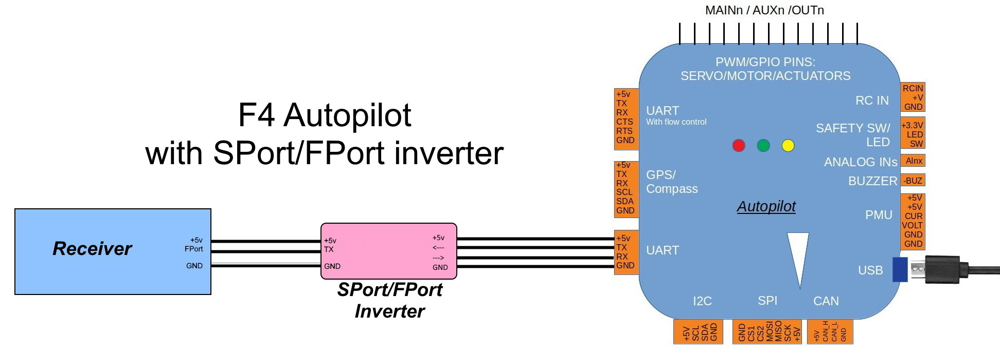
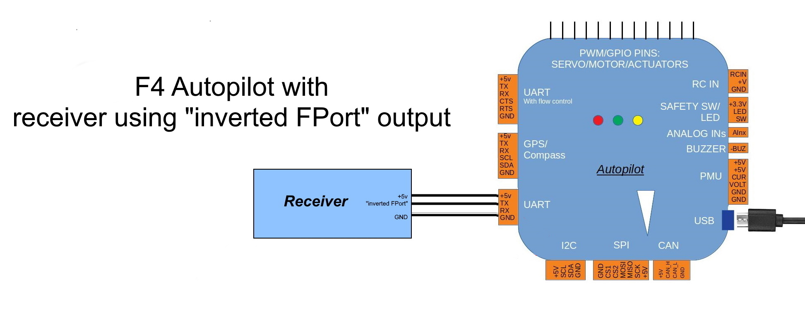
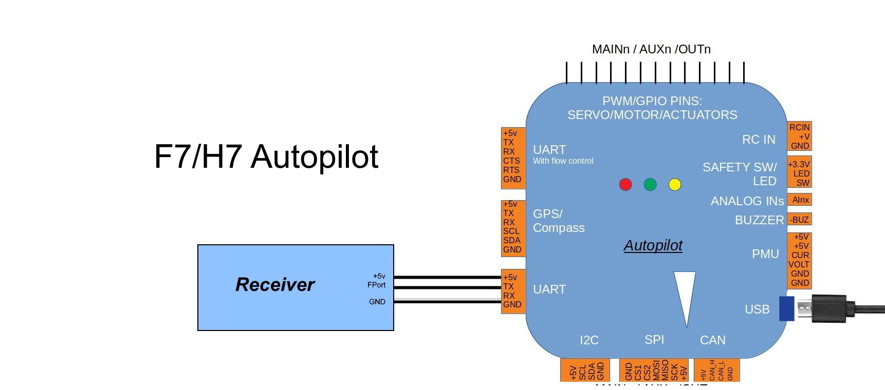

.. _common-FPort-receivers:

===============
FPort Receivers
===============

Support for FPort will be in firmware revs 4.1 and later.

FPort protocol combines SBus RC control information being sent to the autopilot with bi-directional telemetry information to/from the autopilot on a single wire high baud rate bus.

Many FRSky X series and R series receivers have this capability, either natively or with firmware upgrade.

Connection to the autopilot and configuration varies from autopilot to autopilot since their UART capabilities vary. Most F4 cpu based autopilots do not have controllable inverters in front of the UART TX and RX, and require either an external bi-directional inverter, as SPort connections do (see :ref:`frsky_cables` ), or the use of the "uninverted FPort pad/pin" some receivers provide since the FPort protocol has opposite signaling levels than normal UART operation.
Most F7 and H7 autopilots, on the other hand, have internal inverters, and can be directly connected from the receiver's FPort to their UARTs TX input line, as shown below:

Connections
===========

.. note:: some boards can have the FPort connected to the UARTs RX pin instead of TX pin as shown above. See below:

Configuration
=============

Configuration depends on the autopilot and connection method.

.. note:: Any configuration change to a UART requires a re-boot to take effect. Reminder: UART numbers do not necessarily map to SERIALx numbers. Check the :ref:`board's description<common-autopilots>`

In general, F4 based autopilots using an external bi-directional inverter can use any UART with the following configuration:

-   ``SERIALx_PROTOCOL`` =23
-   ``SERIALx_OPTIONS`` =160 (enable pull-up/pull-downs on TX and RX pins for those external inverter circuits that may require it)
-   ``RSSI_TYPE`` =3

F4 based autopilots using an "inverted FPort" output from the receiver can connect it to any  UART's TX pin with the configuration:

-   ``SERIALx_PROTOCOL`` =23
-   ``SERIALx_OPTIONS`` = 4 (Half Duplex) 
-   ``RSSI_TYPE`` =3

.. note:: F4 based autopilots cannot use the RX pin with an "inverted FPort" output since the SWAP capability is only available in F7/H7 based autopilots.

F7/H7 based autopilots can directly connect to the TX pin of any UART and use this configuration:

-   ``SERIALx_PROTOCOL`` =23
-   ``SERIALx_OPTIONS`` =  7 (invert TX/RX,Half Duplex)
-   ``RSSI_TYPE`` =3

    OR to the RX pin:

-   ``SERIALx_PROTOCOL`` =23
-   ``SERIALx_OPTIONS`` =  15 (invert TX/RX,Half Duplex, SWAP TX/RX pins)
-   ``RSSI_TYPE`` =3

.. note:: Some F7/H7 autopilots have level/shifters on their UARTs that cause a delay in Half Duplex operation, like CubeOrange. If the above configuration does not, try setting :ref:`RC_OPTIONS<RC_OPTIONS>` = 8 which will add padding in the protocol to accomodate this. However, using this option when not required will break operation.

Enhanced Configurations
=======================

Since many autopilots have a UART tied to the normal RC input pin for that autopilot which has been disabled, partially or totally, to allow that pins use as a GPIO for RC protocol decodes, including the PWM based ones, several boards now have alternate pin assignment which can be selected with the :ref:`BRD_ALT_CONFIG<BRD_ALT_CONFIG>` parameter. This allows the use of those previously disabled UARTs for FPort, without consuming an additional UART.

.. note:: CUAVv5Nano can use its normal RCinput for FPort. Setup configuration for SERIAL5 for a normal F7/H7 autopilot, as above.

The following autopilots have this capability using :ref:`BRD_ALT_CONFIG<BRD_ALT_CONFIG>` =1 :

MatekF405
--------------------------
UART2 RX can now be tied to receiver FPort through external SPort/FPort bi-directional inverter or by using "inverted FPort" output from receiver, if available.

- Configure SERIAL5 as above for F4 autopilots

MatekF405-Wing
--------------
UART2 RX can now be tied to receiver FPort through external SPort/FPort bi-directional inverter or by using "inverted FPort" output from receiver, if available.

- Configure SERIAL7 as above for F4 autopilots

MatekF765-Wing
--------------
UART6 RX can now be tied to receiver FPort. This board requires a unique configuration:

- :ref:`BRD_ALT_CONFIG<BRD_ALT_CONFIG>`  =1
- :ref:`SERIAL7_PROTOCOL<SERIAL7_PROTOCOL>` =23
- :ref:`SERIAL7_OPTIONS<SERIAL7_OPTIONS>` =15
- :ref:`RC_OPTIONS<RC_OPTIONS>` =8
- :ref:`RSSI_TYPE<RSSI_TYPE>` =3

KakuteF7 and KakuteF7Mini
-------------------------
The normal RC input, UART6 RX, can now be used for FPort with the following configuration:

- :ref:`BRD_ALT_CONFIG<BRD_ALT_CONFIG>` =1
- :ref:`SERIAL6_PROTOCOL<SERIAL6_PROTOCOL>` =23
- :ref:`SERIAL6_OPTIONS<SERIAL6_OPTIONS>` =15
- :ref:`RSSI_TYPE<RSSI_TYPE>` =3

