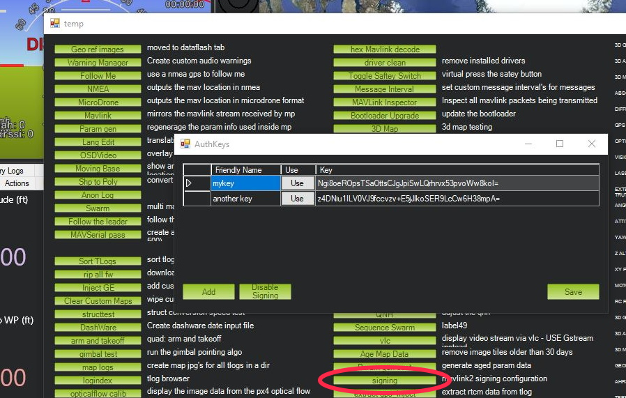

.. _common-MAVLink2-signing:

================
MAVLink2 Signing
================

ArduPilot and Mission Planner have the ability to add security to over-the-air MAVLink transmissions by adding packet signing using an encrypted key. This does NOT encrypt the data, just merely controls if the autopilot will respond to MAVLink commands or not.

When active in the autopilot, any non-USB serial port can be configured only to respond to MAVLink command requests from Mission Planner if they contain the passkey. This prevents other Ground Control Stations (GCS) that do not know the passkey from reading or writing parameters and sending commands. Something that is possible otherwise.

Telemetry downlink data is unaffected.

USB connections are unaffected, allowing full connection to an autopilot using an unknown passkey and allowing the user to erase (disable signing) or change the passkey it uses.

Configuration
=============

- Make sure the telemetry port protocol is set to option = 2 (MAVLink2). Communication with any serial port using MAVLink 1 is not protected.

- In Mission Planner, connect the autopilot, use the SETUP menu  and the Advanced submenu, and press "Mavlink Signing"

The dialog will show a list of all the passkeys already setup for Mission Planner. 

- This dialog can be used to create new keys using the ``ADD`` button.A key may be removed from the list by selecting and pressing delete on the PC and then the ``SAVE`` button5350. You can also do this while unconnected.

- To setup the autopilot to use a key from the list, press the ``USE`` button on a key while connected.

You can check if the link is now signing by clicking "Stats..." under the comm port drop down box used for selecting which port to connect.

- To remove and disable signing for a connected autopilot, press the ``Disable Signing`` button.

Use
===

Once the autopilot is using signing, USB connections are unaffected, but any link via a SERIAL port using MAVLink2 protocol will only respond to MAVLink commands if they are signed with the key the autopilot is using. But links will still receive telemetry updates even if they are not using singing with the active key.

When you connect Mission Planner over a link that is signing, it will see if it has the correct key stored in its keys table that you would have setup previously. If it does, the connection will use that key and commands will be acted upon by the autopilot, including parameter download at connection. If you connect, but parameter download does not occur, then the key was not present. Add the key, and re-connect.

[copywiki destination="plane,copter,rover,planner"]

