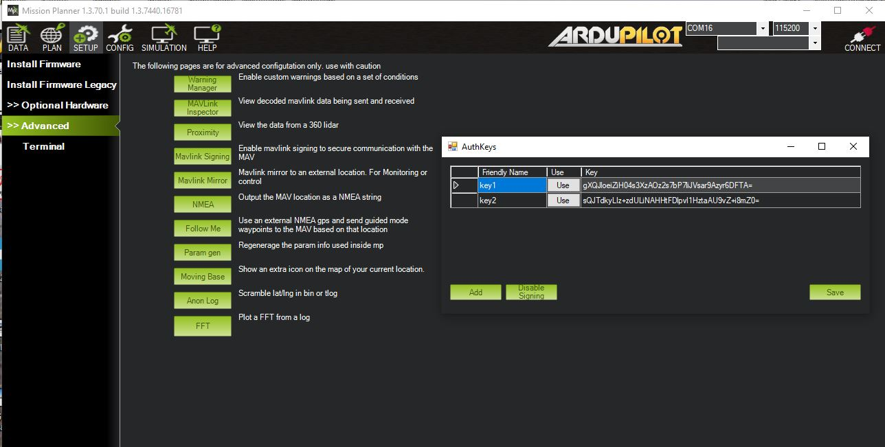

.. _common-mavlink2-signing:

================
MAVLink2 Signing
================

ArduPilot and Mission Planner have the ability to add security to over-the-air MAVLink transmissions by adding packet signing using an encrypted key. This does NOT encrypt the data, just merely controls if the autopilot will respond to MAVLink commands or not.

When active in the autopilot, any non-USB serial port can be configured only to respond to MAVLink command requests from Mission Planner if they contain the passkey. This prevents other Ground Control Stations (GCS) that do not know the passkey from reading or writing parameters and sending commands. Something that is possible otherwise.

Telemetry downlink data is unaffected.

USB connections are unaffected, allowing full connection to an autopilot using an unknown passkey and allowing the user to erase (disable signing) or change the passkey it uses.

Configuration
=============

- Make sure the telemetry port protocol is set to option = 2 (MAVLink2). Communication with any serial port using MAVLink 1 is not protected.

- In Mission Planner, connect the autopilot, press Ctrl-F to show the advance menu and press "signing"

The dialog will show a list of all the passkeys already setup for Mission Planner. 

- This dialog can be used to create new keys using the ``ADD`` button.A key may be removed from the list by selecting and pressing delete on the PC and then the ``SAVE`` button5350. You can also do this while unconnected.

- To setup the autopilot to use a key from the list, press the ``USE`` button on a key while connected.

- To remove and disable signing for a connected autopilot, press the ``Disable Signing`` button.

