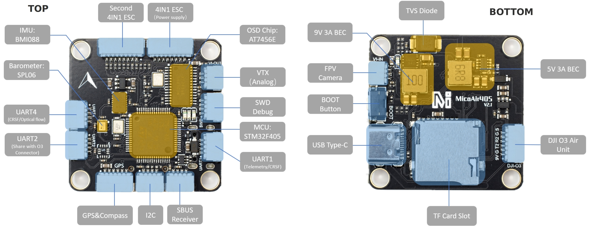
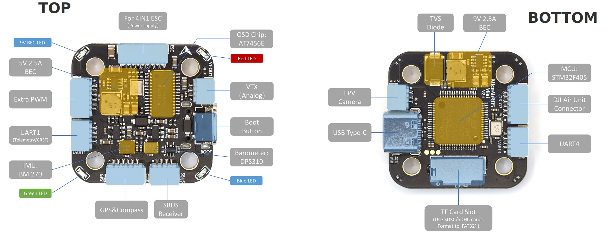
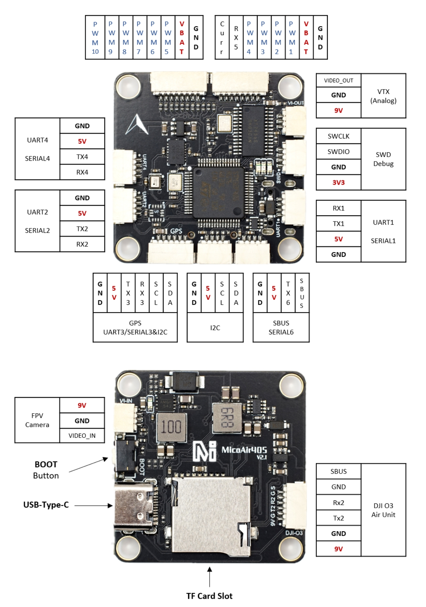
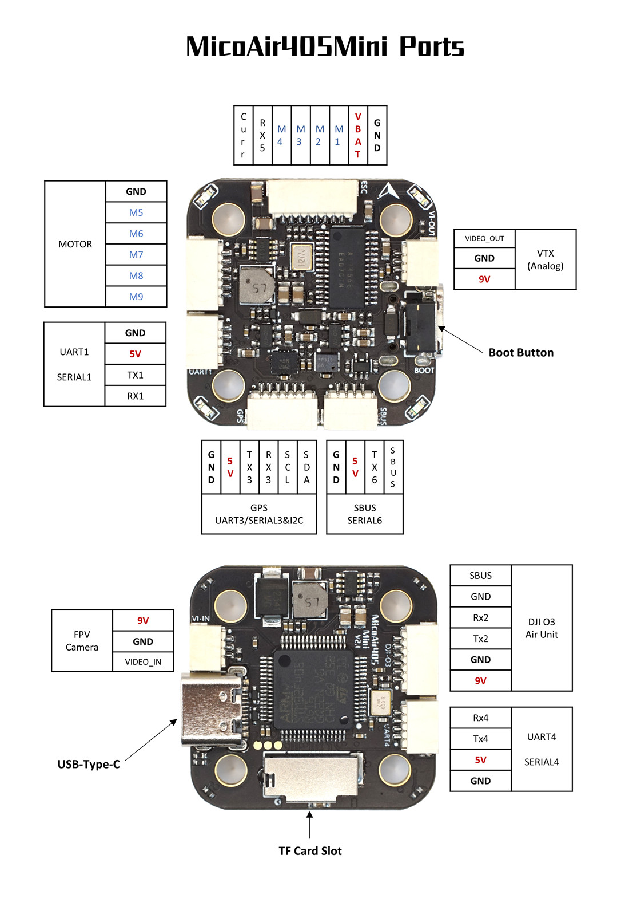

.. _common-MicoAir405v2:

==================
MicoAir405v2/ Mini
==================
The MicoAir405v2 is a autopilot produced by `MicoAir <http://micoair.com/>`_.

MINI

Where to Buy
============

 - `AliExpress <https://www.aliexpress.com/item/3256805966810380.html>`__

Mini

 - `AliExpress <https://www.aliexpress.com/item/3256806534166770.html>`__

Specifications
==============

-  **Processor**

   -  STM32F405 microcontroller
   -  AT7456E OSD

-  **Sensors**

   -  BMI088 IMU (accel and gyro)/ Mini: BMI270 IMU
   -  SPL06 barometer / Mini: DPS310

-  **Power**

   -  2S  - 6S Lipo input voltage with voltage monitoring
   -  9V 3A (Mini: 2.5A) BEC for powering Video Transmitter
   -  5V 3A (Mini:2.5A) BEC for peripherals

-  **Interfaces**

   -  10x PWM outputs/ Mini: 9 PWM outputs
   -  1x SBUS RC input
   -  6x UARTs/serial for GPS and other peripherals
   -  1x I2C port for external compass
   -  Camera/VTX/HD(DJI) VTX connectors
   -  Micro-C USB port
   -  MicroSD Card Slot for logging
   -  External current monitor input

Pinout
======

Mini

UART Mapping
============

The UARTs are marked Rxn and Tn in the above pinouts. The Rxn pin is the
receive pin for UARTn. The Txn pin is the transmit pin for UARTn.

   -  SERIAL0 -> USB
   -  SERIAL1 -> UART1 (MAVLink2, DMA-enabled)
   -  SERIAL2 -> UART2 (DisplayPort, TX2 only DMA-enabled) 
   -  SERIAL3 -> UART3 (GPS)
   -  SERIAL4 -> UART4 (MAVLink2, TX only DMA-enabled)
   -  SERIAL5 -> UART5 (RX pin only,ESC Telemetry)
   -  SERIAL6 -> UART6 (RX6 is inverted from SBUS pin, no DMA on TX6)

RC Input
========

The default RC input is SBUS only on SBUS pin. PPM is not supported. Other RC protocols must use another UART port such as UART1 or UART4, and set its protocol to receive RC data: ``SERIALx_PROTOCOL=23`` and change :ref:`SERIAL6_PROTOCOL<SERIAL6_PROTOCOL>` to something other than its default protocol of '23'. If using CRSF/ELRS, UART1 should be used since it has full DMA. If using another UART for RC input:

- FPort requires connection to the TX of the UART and ``SERIALx_OPTIONS`` be set to "7".

- CRSF also requires a TX connection, and automatically provides telemetry. Set ``SERIALx_OPTIONS`` to "0".

- SRXL2 requires a connection to TX and automatically provides telemetry.  Set ``SERIALx_OPTIONS>`` to "4".

OSD Support
===========

The MicoAir405v2 supports analog OSD using OSD_TYPE 1 (MAX7456 driver) using the CAM and VTX connectors. DisplayPort HD OSD via the DJI connector can be enabled simultaneously by setting :ref:`OSD_TYPE<OSD_TYPE>` = 5. See below.

HD VTX Support
==============

The SH1.0-6P connector supports a standard DJI HD VTX connection. Pin 1 of the connector is 9v so be careful not to connect this to a peripheral requiring 5v.

PWM Output
==========

The MicoAir405v2 supports up to 10 PWM outputs(Mini supports 9). Outputs 1-8 also support DShot. Outputs 1-4 support bi-directional DShot. Outputs are grouped and each group must use the same output protocol:

- 1,2,5,6 are group1
- 3, 4 are group 2
- 7,8 are group 3
- 9,10 are in group 4

.. note:: for users migrating from BetaflightX quads, the first four outputs M1-M4 have been configured for use with existing motor wiring using these default parameters:

- :ref:`FRAME_CLASS<FRAME_CLASS>` = 1 (Quad)
- :ref:`FRAME_TYPE<FRAME_TYPE>` = 12 (BetaFlightX) 

Battery Monitoring
==================

The board has a built-in voltage sensor via the VBAT pin, but no internal current sensor. An external current sensor can be connected to the Curr pin. Default parameters for both internal voltage and external current monitoring are set by default to :

 - :ref:`BATT_MONITOR<BATT_MONITOR>` 4
 - :ref:`BATT_VOLT_PIN<BATT_VOLT_PIN>` 10
 - :ref:`BATT_CURR_PIN<BATT_CURR_PIN>` 11
 - :ref:`BATT_VOLT_MULT<BATT_VOLT_MULT>` 21.2
 - :ref:`BATT_AMP_PERVLT<BATT_AMP_PERVLT>` 40.2

Compass
=======

The MicoAir405v2/Mini do not have a built-in compass, but you can attach an external compass using I2C on the SDA and SCL connector.

Firmware
========

Firmware for this board can be found `here <https://firmware.ardupilot.org>`_ in  sub-folders labeled "MicoAir405v2" or MicoAir405Mini".

Loading Firmware
================

Initial firmware load can be done with DFU by plugging in USB with the bootloader button pressed. Then you should load the "with_bl.hex" firmware, using your favorite DFU loading tool.

Once the initial firmware is loaded you can update the firmware using any ArduPilot ground station software. Updates should be done with the "\*.apj" firmware files.

[copywiki destination="plane,copter,rover,blimp"]