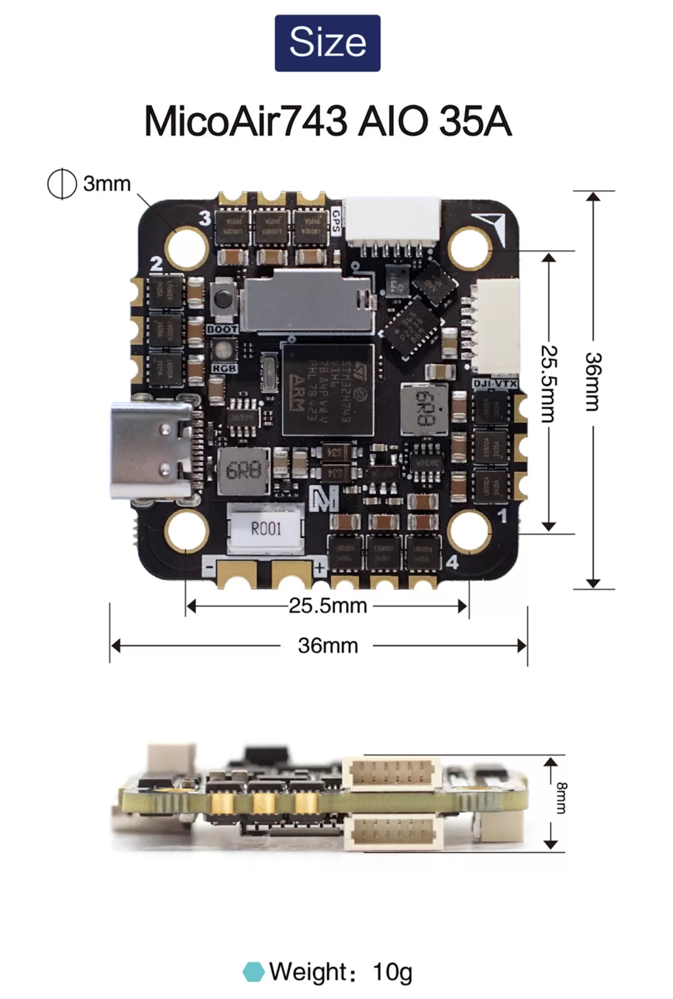
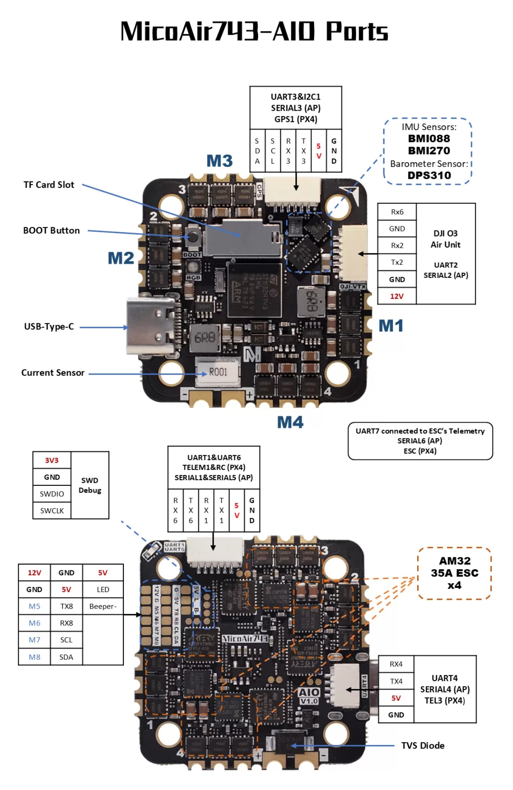

.. _common-MicoAir743-AIO:
[copywiki destination="plane,copter,rover,blimp,sub"]

==============
MicoAir743-AIO
==============

The MicoAir743-AIO is a flight controller designed and produced by `MicoAir Tech <http://micoair.com/>`_.

Features
========

* STM32H743 microcontroller
* BMI088/BMI270 dual IMUs
* DPS310 barometer
* 12V 2A BEC; 5V 2A BEC
* MicroSD Card Slot
* 7 UARTs
* Integrated 4-in-1 AM32 35A ESC, 5 additional PWM outputs, one defaulted as serial LED
* 1 I2C
* 1 SWD

Connectors
==========

UART Mapping
============

* SERIAL0 -> USB
* SERIAL1 -> UART1 (MAVLink2, DMA-enabled)
* SERIAL2 -> UART2 (DisplayPort, DMA-enabled)
* SERIAL3 -> UART3 (GPS, DMA-enabled)
* SERIAL4 -> UART4 (MAVLink2, DMA-enabled)
* SERIAL5 -> UART6 (RCIN, DMA-enabled)
* SERIAL6 -> UART7 (RX only, ESC Telemetry, DMA-enabled)
* SERIAL7 -> UART8 (User, DMA-enabled)

Serial protocols shown are defaults, but can be adjusted to personal preferences.

RC Input
========
The default RC input is configured on the UART6 RX6 input and can be used for all ArduPilot supported unidirectional receiver protocols. The SBus input on the HD VTX connector is tied to RX6 so disconnect its wire if using RX6 for a different RC receiver.

* PPM is not supported.
* SBUS/DSM/SRXL connects to the RX6 pin.
* FPort requires connection to TX6 and RX6 via a bi-directional inverter. See :ref:`common-FPort-receivers`.
* CRSF also requires a TX6 connection, in addition to RX6, and automatically provides telemetry.
* SRXL2 requires a connection to TX6 and automatically provides telemetry. Set :ref:`SERIAL5_OPTIONS<SERIAL5_OPTIONS>` to “4”.

OSD
===
MicoAir743-AIO supports using its internal OSD using OSD_TYPE 1 (MAX7456 driver). External OSD support such as DJI or DisplayPort can be used simultaneously and is pre-configured on SERIAL2 but can be supported on any spare UART. See :ref:`common-msp-osd-overview-4.2` for more info.

VTX Support
===========

The SH1.0-6P connector supports a DJI Air Unit / HD VTX connection. Protocol defaults to DisplayPort. Pin 1 of the connector is 12v so be careful not to connect this to a peripheral requiring 5v.

PWM Output
==========
The MicoAir743-AIO supports up to 9 PWM outputs.

All the channels support DShot. Channels 1-8 support bi-directional DShot. PWM outputs are grouped and every group must use the same output protocol:

* 1, 2, 3, 4 are Group 1;
* 5, 6 are Group 2;
* 7, 8, 9 are Group 3;

PWM1-4 are internally tied to the 4-in-1 ESC. PWM 9 is labeled as LED output on the board.

Battery Monitoring
==================
The board has internal voltage and current sensors for the battery.
The voltage input is compatible with 3~6S LiPo batteries.

The default battery parameters are:

* :ref:`BATT_MONITOR<BATT_MONITOR>` = 4
* :ref:`BATT_VOLT_PIN<BATT_VOLT_PIN__AP_BattMonitor_Analog>` = 10
* :ref:`BATT_CURR_PIN<BATT_CURR_PIN__AP_BattMonitor_Analog>` = 11
* :ref:`BATT_VOLT_MULT<BATT_VOLT_MULT__AP_BattMonitor_Analog>` = 21.2
* :ref:`BATT_AMP_PERVLT<BATT_AMP_PERVLT__AP_BattMonitor_Analog>` = 14.14

Compass
=======
The MicoAir743-AIO does not have a built-in compass, but you can attach an external compass using I2C on the SDA and SCL connector.

Firmware
========
Firmware for this board can be found `here <firmware.ardupilot.org>`_ in sub-folders labeled “MicoAir743-AIO”.

Loading Firmware
================

Initial firmware load can be done with DFU by plugging in USB with the bootloader button pressed. Then you should load the "\*xxxxx_with_bl.hex" firmware, using your favorite DFU loading tool.

Once the initial firmware is loaded you can update the firmware using any ArduPilot ground station software. Updates should be done with the "\*.apj" firmware files.
