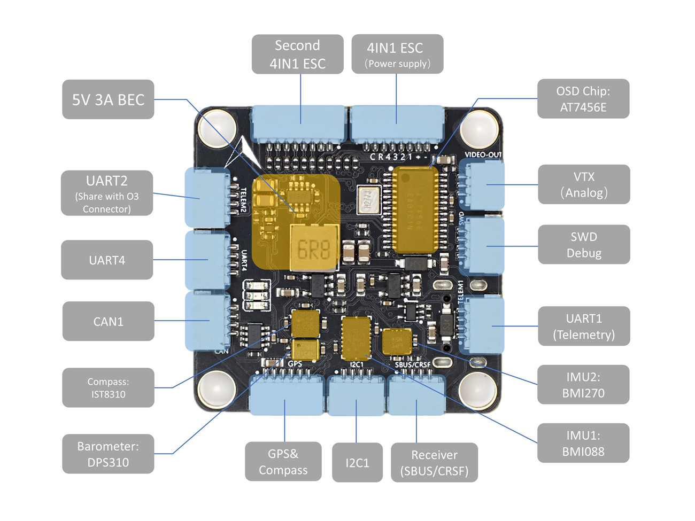
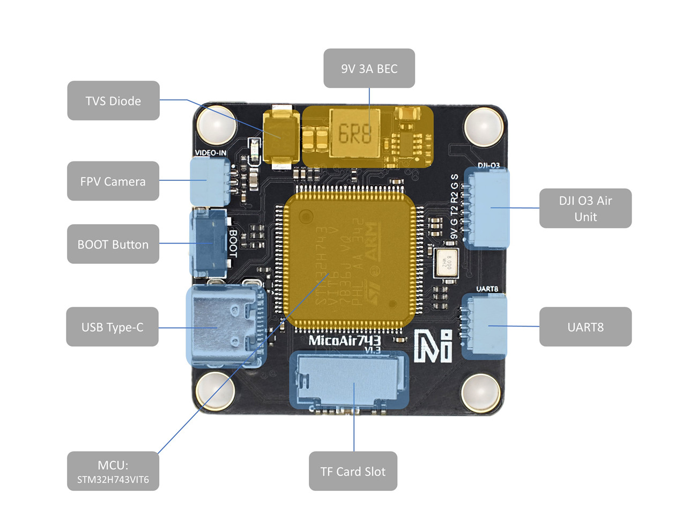
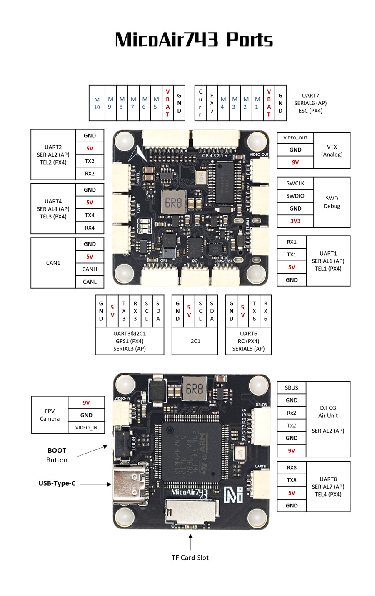

.. _common-MicoAir743:

==========
MicoAir743
==========

The MicoAir743 is a flight controller designed and produced by `MicoAir Tech. <http://micoair.com/>`_.

Where to Buy
============

- `AliExpress <https://www.aliexpress.com/item/3256806743599300.html>`__

Specifications
==============

-  **Processor**
    - STM32H743 microcontroller
    - AT7456E OSD

-  **Sensors**
    - BMI088/BMI270 dual IMUs
    - DPS310 barometer
    - IST8310 magnetometer

-  **Power**
    - 2S  - 6S Lipo input voltage with voltage monitoring
    - 9V 3A BEC; 5V 3A BEC

-  **Interfaces**
    - 10 PWM outputs
    - 7x UARTs/serial for GPS and other peripherals
    - 1x CAN port
    - micro USB port
    - All UARTS support hardware inversion. SBUS, SmartPort, and other inverted protocols work on any UART without "uninvert hack"
    - 1x I2C port for external compass
    - microSD Card Slot for logging
    - External current monitor input
    - 1x SWD port

-  **Mechanical**
    - Mounting: 30.5 x 30.5mm, Φ4mm
    - Dimensions: 36 x 36 x 8 mm
    - Weight: 9g

Pinout
======

UART Mapping
============

The UARTs are marked RXn and TXn in the above pinouts. The RXn pin is the
receive pin for UARTn. The TXn pin is the transmit pin for UARTn.

   - SERIAL0 -> USB
   - SERIAL1 -> UART1 (MAVLink2, DMA-enabled)
   - SERIAL2 -> UART2 (DisplayPort, DMA-enabled)
   - SERIAL3 -> UART3 (GPS, DMA-enabled)
   - SERIAL4 -> UART4 (MAVLink2, DMA-enabled)
   - SERIAL5 -> UART6 (RCIN, DMA-enabled)
   - SERIAL6 -> UART7 (RX only, ESC Telemetry, DMA-enabled)
   - SERIAL7 -> UART8 (User, DMA-enabled)

RC Input
========

The default RC input is configured on the UART6. The SBUS pin is inverted and connected to RX6. Non SBUS, single wire serial inputs can be directly tied to RX6 if SBUS pin is left unconnected. RC could  be applied instead at a different UART port such as UART1, UART4 or UART8, and set the protocol to receive RC data: ``SERIALn_PROTOCOL=23`` and change SERIAL5 _Protocol to something other than '23'.

OSD Support
===========

The MicoAir743 supports onboard OSD using OSD_TYPE 1 (MAX7456 driver). Simultaneously, DisplayPort HD OSD is enabled by default and available on the HD VTX connector, See below.

VTX Support
===========

The SH1.0-6P connector supports a DJI Air Unit / HD VTX connection. Protocol defaults to DisplayPort. Pin 1 of the connector is 9v so be careful not to connect this to a peripheral requiring 5v.

PWM Output
==========

The MicoAir743 supports up to 10 PWM outputs. All the channels support DShot. Channels 1-8 support bi-directional DShot. PWM outputs are grouped and every group must use the same output protocol:

- 1, 2, 3, 4 are Group 1
- 5, 6 are Group 2
- 7, 8, 9, 10 are Group 3

.. note:: for users migrating from BetaflightX quads, the first four outputs M1-M4 have been configured for use with existing motor wiring using these default parameters:

- :ref:`FRAME_CLASS<FRAME_CLASS>` = 1 (Quad)
- :ref:`FRAME_TYPE<FRAME_TYPE>` = 12 (BetaFlightX) 

Battery Monitoring
==================

The board has a internal voltage sensor and connections on the ESC connector for an external current sensor input.
The voltage sensor can handle up to 6S LiPo batteries.

The default battery parameters are:

   - :ref:`BATT_MONITOR<BATT_MONITOR>` = 4
   - :ref:`BATT_VOLT_PIN<BATT_VOLT_PIN>` = 10
   - :ref:`BATT_CURR_PIN<BATT_CURR_PIN>` = 11
   - :ref:`BATT_VOLT_MULT<BATT_VOLT_MULT>` = 21.2
   - :ref:`BATT_AMP_PERVLT<BATT_AMP_PERVLT>` = 40.2

Compass
=======

The MicoAir743 has a built-in compass sensor (IST8310), and you can also attach an external compass using I2C on the SDA and SCL connector.

Firmware
========

Firmware for this board can be found `here <https://firmware.ardupilot.org>`__ in  sub-folders labeled "MicoAir743".

Loading Firmware
================

Initial firmware load can be done with DFU by plugging in USB with the bootloader button pressed. Then you should load the "with_bl.hex" firmware, using your favorite DFU loading tool.

Once the initial firmware is loaded you can update the firmware using any ArduPilot ground station software. Updates should be done with the "\*.apj" firmware files.

[copywiki destination="plane,copter,rover,blimp"]