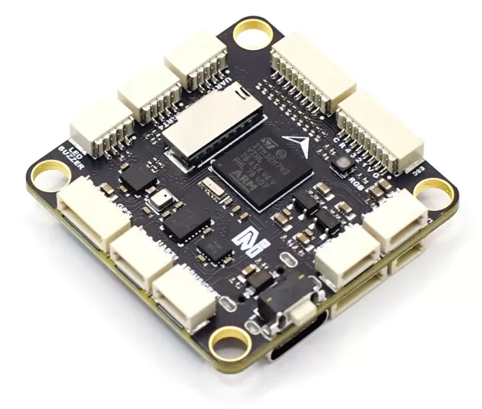
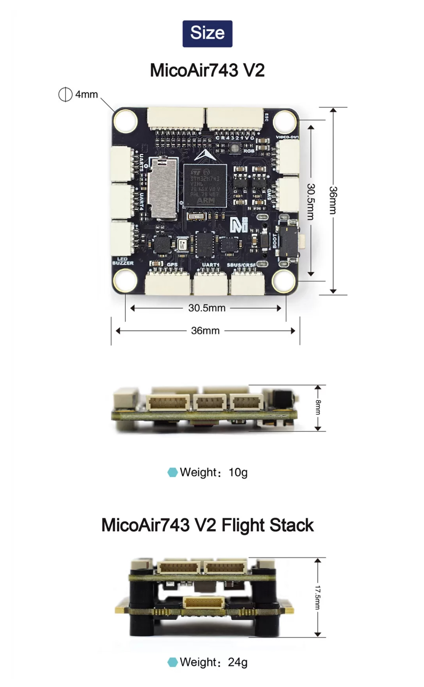
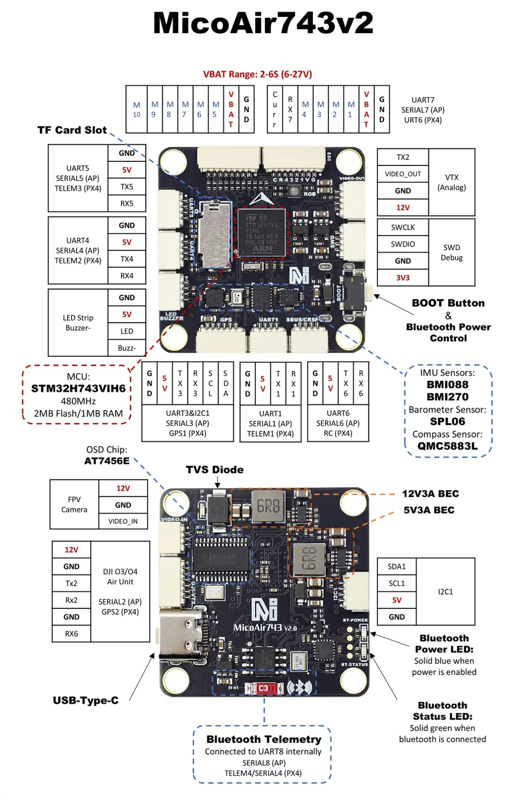

.. _common-MicoAir743v2:

[copywiki destination="plane,copter,rover,blimp,sub']
============
MicoAir743v2
============
The MicoAir743v2 is a flight controller designed and produced by `MicoAir Tech <http://micoair.com/>`_.

Features
========

* STM32H743 microcontroller
* BMI088/BMI270 dual IMUs
* Integrated BlueTooth module for telemetry
* SPL06 barometer
* QMC5883L magnetometer
* AT7456E OSD
* 9V 3A BEC; 5V 3A BEC
* MicroSD Card Slot
* 8 UARTs
* 11 PWM outputs
* 1 I2C
* 1 SWD

Physical
========

Pinout
======

UART Mapping
============

* SERIAL0 -> USB
* SERIAL1 -> UART1 (MAVLink2, DMA-enabled)
* SERIAL2 -> UART2 (DisplayPort, DMA-enabled)
* SERIAL3 -> UART3 (GPS, DMA-enabled)
* SERIAL4 -> UART4 (MAVLink2, DMA-enabled)
* SERIAL5 -> UART5 (User, DMA-enabled)
* SERIAL6 -> UART6 (RCIN, DMA-enabled)
* SERIAL7 -> UART7 (RX only, ESC Telemetry, DMA-enabled)
* SERIAL8 -> UART8 (MAVLink2, connected to on board BlueTooth module)

RC Input
========
The UART6  is compatible with all ArduPilot supported receiver protocols. 

* PPM is not supported.
* SBUS/DSM/SRXL connects to the RX6 pin.
* FPort requires connection to TX6 . See FPort Receivers.
* CRSF also requires a TX6 connection, in addition to RX6, and automatically provides telemetry.
* SRXL2 requires a connection to TX6 and automatically provides telemetry. Set :ref:`SERIAL6_OPTIONS<SERIAL6_OPTIONS>` to “4”.

Any UART can also be used for RC system connections in ArduPilot and is compatible with all protocols except PPM. See :ref:`Radio Control Systems <common-rc-systems>` for details.

OSD Support
===========
The MicoAir743v2 supports onboard OSD using OSD_TYPE 1 (MAX7456 driver). Simultaneously, DisplayPort OSD is available on the HD VTX connector, set OSD_TYPE2 = "5".

VTX Support
===========
The SH1.0-6P connector supports a DJI Air Unit / HD VTX connection. Protocol defaults to DisplayPort. Pin 1 of the connector is 9v so be careful not to connect this to a peripheral requiring 5v.

PWM Output
==========
The MicoAir743v2 supports up to 11 PWM outputs. All the channels support DShot. Channels 1-8 support bi-directional DShot.

PWM outputs are grouped and every group must use the same output protocol:

* 1, 2, 3, 4 are Group 1
* 5, 6 are Group 2
* 7, 8, 11 are Group 3
* 9, 10 are Group 4

Note: PWM11 is the "LED" pin. If this is configured for serial LED use then PWM 7 and 8 can only be used as serial LED also.

Battery Monitoring
==================
The board has a internal voltage sensor and connections on the ESC connector for an external current sensor input.
The voltage sensor can handle up to 6S LiPo batteries.

The default battery parameters are:

* :ref:`BATT_MONITOR<BATT_MONITOR>` = 4
* :ref:`BATT_VOLT_PIN<BATT_VOLT_PIN__AP_BattMonitor_Analog>` = 10
* :ref:`BATT_VOLT_MULT<BATT_VOLT_MULT__AP_BattMonitor_Analog>` = 21.12
* :ref:`BATT_CURR_PIN<BATT_CURR_PIN__AP_BattMonitor_Analog>` = 11
* :ref:`BATT_AMP_PERVLT<BATT_AMP_PERVLT__AP_BattMonitor_Analog>` = 40.2

Compass
=======
The MicoAir743v2 has a built-in compass. Due to potential interference, the autopilot is usually used with an external I2C compass as part of a GPS/Compass combination and the internal compass disabled.

BlueTooth
=========
The MicoAir743v2 has an on board BlueTooth module connected to UART8(SERIAL8). The BlueTooth id is MicoAir743v2-xxxxxx and you can connect to it without pairing id.

Firmware
========

Firmware for this board can be found `here <https://firmware.ardupilot.org>`__ in sub-folders labeled “MicoAir743v2”

Loading Firmware
================
Initial firmware load can be done with DFU by plugging in USB with the bootloader button pressed. Then you should load the "arduXXXX_with_bl.hex" firmware, using your favorite DFU loading tool.

Once the initial firmware is loaded you can update the firmware using any ArduPilot ground station software. Updates should be done with the "\*.apj" firmware files.
