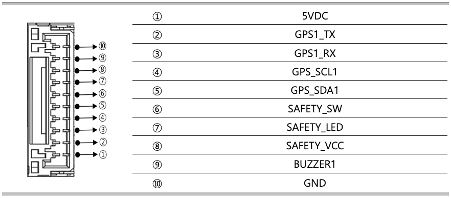
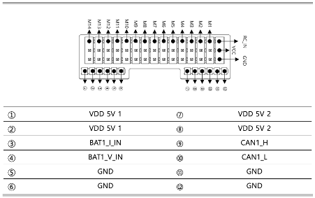

.. _common-NarinFC-H7:

=========================
NarinFC-H7
=========================

The NarinFC-H7 is a flight controller designed and produced by `VOLOLAND Co., Ltd. <https://vololand.com/>`_

.. image:: ../../../images/NarinFC/NarinFC_Header.jpg
  :target: ../../../images/NarinFC/NarinFC_Header.jpg

Specifications
==============

-  **Processor**
    - STM32H743

-  **Sensors**
    - Accelerometer/Gyroscope: ADIS16470
    - Accelerometer/Gyroscope: ICM-20649
	- Accelerometer/Gyroscope: BMI088
	- Magnetometer: RM3100
	- Barometer: MS5611*2

-  **Interfaces**
    - 14 PWM Output
	- Support multiple RC inputs (SBus / CPPM / DSM)
	- 2 GPS ports (GPS and UART4 ports)
	- 4 ⅹ I2C
	- 2 ⅹ CAN bus ports
	- 2 ⅹ Power ports
	- 2 ⅹ ADC ports
	- 1 ⅹ USB ports

-  **Power**
    - Power 4.3V ~ 5.4V
    - USB Input 4.75V ~ 5.25V

-  **Size and Dimensions**
    - 93.4mm x 46.4mm x 34.1mm
    - 106g

Where to Buy
============
 - `NarinFC-H7 VOLOLAND Co., Ltd. <https://vololand.com/>`

Outline Dimensions
==================
.. image:: ../../../images/NarinFC/2.Outline_Dimensions.png
  :target: ../../../images/NarinFC/2.Outline_Dimensions.png
  :width: 750px

Wire Diagram
============
.. image:: ../../../images/NarinFC/3.Wire_Diagram.png
  :target: ../../../images/NarinFC/3.Wire_Diagram.png
  :width: 750px

Port Diagram & Pinouts
======================
.. image:: ../../../images/NarinFC/4.Port_Diagram_Pin_outs_Diagram-A.png
  :target: ../../../images/NarinFC/4.Port_Diagram_Pin_outs_Diagram-A.png
  :width: 375px

.. image:: ../../../images/NarinFC/4.Port_Diagram_Pin_outs_Diagram-B.png
  :target: ../../../images/NarinFC/4.Port_Diagram_Pin_outs_Diagram-B.png
  :width: 410px

-  **1. TELEM1, TELEM2 Port (JST GH 6P Connector)**
.. image:: ../../../images/NarinFC/4.1.TELEM1,TELEM2_Port_JST_GH_6P_Connector.png
  :target: ../../../images/NarinFC/4.1.TELEM1,TELEM2_Port_JST_GH_6P_Connector.png

-  **2. CAN1, CAN2 Port (JST GH 4P Connector)**
.. image:: ../../../images/NarinFC/4.2.CAN1,CAN2_Port_JST_HG_4P_Connector.png
  :target: ../../../images/NarinFC/4.2.CAN1,CAN2_Port_JST_HG_4P_Connector.png

-  **3. I2C, I2C2, I2C3, I2C4 Port (JST GH 4P Connector)**
.. image:: ../../../images/NarinFC/4.3.I2C1,I2C2,I2C3,I2C4_Port_JST_GH_4P_Connector.png
  :target: ../../../images/NarinFC/4.3.I2C1,I2C2,I2C3,I2C4_Port_JST_GH_4P_Connector.png

-  **4. UART4 Port (JST GH 6P Connector)**
.. image:: ../../../images/NarinFC/4.4.UART4_Port_JST_GH_6P_Connector.png
  :target: ../../../images/NarinFC/4.4.UART4_Port_JST_GH_6P_Connector.png

-  **5. GPS & Safety Port (JST GH 10P Connector)**

-  **6. PWM Out (M1-M14)**
The NarinFC-H7 supports up to 14 PWM outputs. 
All outputs support DShot and BiDirDshot. 
Outputs are grouped and all outputs within their group must be the same protocol.

.. image:: ../../../images/NarinFC/4.6.PWM_Out_M1-M14.png
  :target: ../../../images/NarinFC/4.6.PWM_Out_M1-M14.png

-  **7. Power Input**

-  **8. DEBUG Port(JST GH 6P Connector)**
.. image:: ../../../images/NarinFC/4.8.DEBUG_Port_JST_HG_6P_Connector.png
  :target: ../../../images/NarinFC/4.8.DEBUG_Port_JST_HG_6P_Connector.png

-  **9. USB Port(USB C Type)**

-  **10. SPI Port (JST GH 7P Connector)**
.. image:: ../../../images/NarinFC/4.10.SPI_Port_JST_GH_7P_Connector.png
  :target: ../../../images/NarinFC/4.10.SPI_Port_JST_GH_7P_Connector.png

-  **11. SD CARD**

Firmware
========
This board comes with ArduPilot firmware pre-installed and other vehicle/revision Ardupilot firmware can be loaded using most Ground Control Stations.
Firmware for this board can be found here in sub-folders labeled “NarinFC-H7”.
