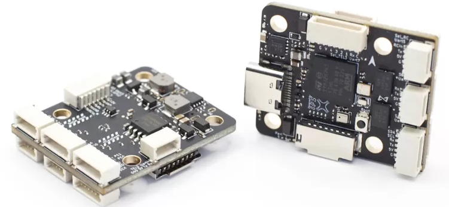
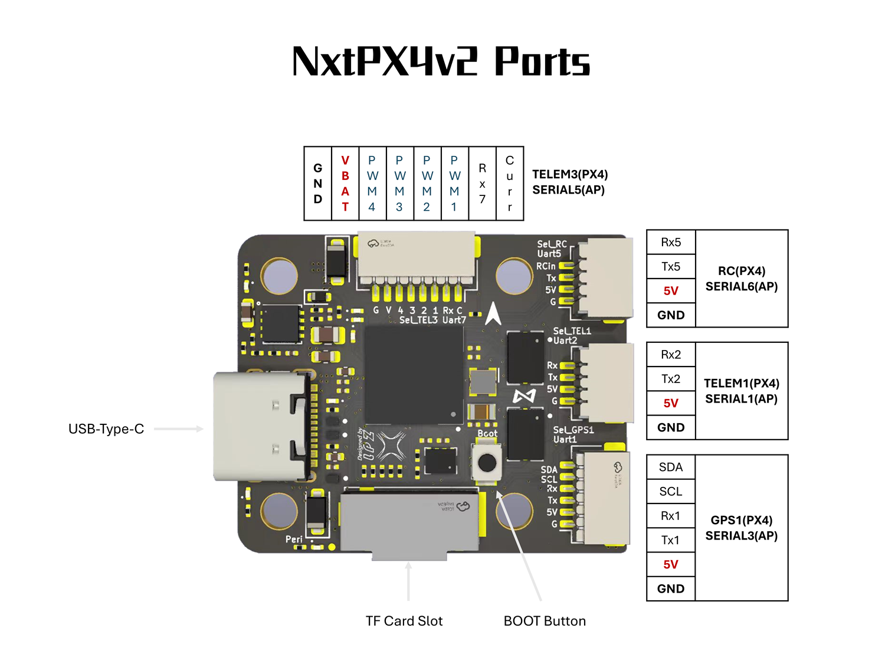
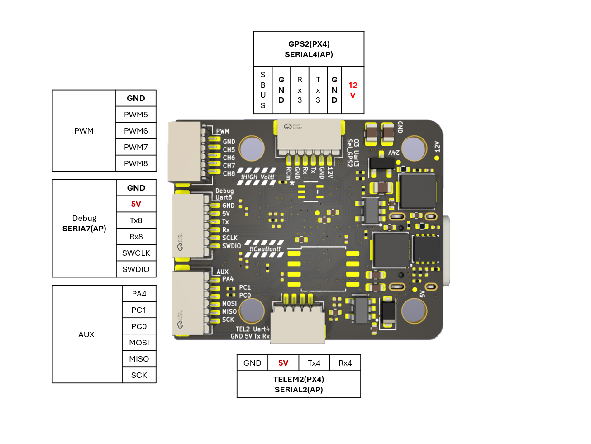

.. _NxtPX4v2:

========
NxtPX4v2
========

The NxtPX4v2 is an open-source hardware designed and maintained by `HKUST UAV-Group <https://github.com/HKUST-Aerial-Robotics/Nxt-FC>`_. And it is produced by `MicoAir Tech. <http://micoair.com/>`_.

Where to Buy
============

- `AliExpress <https://www.aliexpress.com/item/3256805858003783.html>`__

==============
Specifications
==============

-  **Processor**

   -  STM32H743 microcontroller

-  **Sensors**

   -  BMI088+BMI088(DUAL) IMU (accel and gyro)
   -  SPL06 barometer

-  **Power**

   -  2S  - 6S Lipo input voltage with voltage monitoring
   -  12V 2.5A BEC for powering Video Transmitter
   -  5V 2.5A BEC for peripherals

-  **Interfaces**

   -  8x PWM outputs 
   -  1x SBUS RC input
   -  7x UARTs/serial for GPS and other peripherals
   -  1x I2C port for external compass
   -  1x SPI
   -  1x SWD port
   -  Camera/VTX/HD(DJI) VTX connectors
   -  Micro-C USB port
   -  MicroSD Card Slot for logging
   -  External current monitor input

-   **Physical**

   -  Mounting: 20 x 20mm, Φ3mm
   -  Dimensions: 27 x 32 x 8 mm
   -  Weight: 6.5g

Pinout
======

UART Mapping
============

The UARTs are marked Rxn and Tn in the above pinouts. The Rxn pin is the
receive pin for UARTn. The Txn pin is the transmit pin for UARTn.

* SERIAL0 -> USB
* SERIAL1 -> UART2 (MAVLink2, DMA-enabled)
* SERIAL2 -> UART4 (MAVLink2, DMA-enabled)
* SERIAL3 -> UART1 (GPS, DMA-enabled)
* SERIAL4 -> UART3 (DisplayPort, DMA-enabled)
* SERIAL5 -> UART7 (RX only, ESC Telemetry, DMA-enabled)
* SERIAL6 -> UART5 (RCIN, DMA-enabled)
* SERIAL7 -> UART8 (User, DMA-enabled)

RC Input
========

The default RC input is configured on the UART5 by default. The SBUS pin is inverted and connected to RX5. Non SBUS,  single wire serial inputs can be directly tied to RX5 if SBUS pin is left unconnected. RC could  be applied instead at a different UART port such as UART2, UART4 or UART8, and set the protocol to receive RC data: ``SERIALn_PROTOCOL=23`` and change SERIAL6 _Protocol to something other than '23'.

- PPM is not supported.

- FPort requires connection to the Tx5 of the UART and :ref:`SERIAL6_OPTIONS<SERIAL6_OPTIONS>` be set to "7".

- CRSF/ELRS also requires a TXx5 connection, and automatically provides telemetry. Set  :ref:`SERIAL6_OPTIONS<SERIAL6_OPTIONS>` = "0".

- SRXL2 requires a connection to Tx5 and automatically provides telemetry.  Set :ref:`SERIAL6_OPTIONS<SERIAL6_OPTIONS>` =  "4".

HD VTX Support
==============

The SH1.0-6P connector supports a DJI Air Unit / HD VTX connection. Protocol defaults to DisplayPort. Pin 1 of the connector is 12v so be careful not to connect this to a peripheral requiring 5v.

PWM Output
==========

The NxtPX4v2 supports up to 8 PWM outputs. All channels support bi-directional DShot. PWM outputs are grouped and within each group the same same output protocol must be used:

- 1 - 4 are Group1;
- 5, 6 are Group2;
- 7, 8 are Group3;

Battery Monitoring
==================

The board has a internal voltage sensor and connections on the ESC connector for an external current sensor input.
The voltage sensor can handle up to 6S LiPo batteries.

The default battery parameters are:

Battery Monitoring
==================

The board has a built-in voltage sensor via the VBAT pin, but no internal current sensor. An external current sensor can be connected to the Curr pin. Default parameters for both internal voltage and external current monitoring are set by default to :

 - :ref:`BATT_MONITOR<BATT_MONITOR>` 4
 - :ref:`BATT_VOLT_PIN<BATT_VOLT_PIN>` 4
 - :ref:`BATT_CURR_PIN<BATT_CURR_PIN>` 8
 - :ref:`BATT_VOLT_MULT<BATT_VOLT_MULT>` 10.2
 - :ref:`BATT_AMP_PERVLT<BATT_AMP_PERVLT>` 20.4

Compass
=======

The NxtPX4v2 does not have a built-in compass, but you can attach an external compass using I2C on the SDA and SCL connector.

GPIOs
=====

GPIO 3 outputs are available on the AUX connector. These are directly attached to the STM32H743. The numbering of the GPIOs for use in ArduPilot Relay and other GPIO functions are:

- PA4 :  pin 81
- PC1 :  pin 82
- PC0 :  pin 83

Firmware
========

Firmware for this board can be found `here <https://firmware.ardupilot.org>`_ in  sub-folders labeled "NxtPX4v2".

Loading Firmware
================

Initial firmware load can be done with DFU by plugging in USB with the bootloader button pressed. Then you should load the "with_bl.hex" firmware, using your favorite DFU loading tool.

Once the initial firmware is loaded you can update the firmware using any ArduPilot ground station software. Updates should be done with the "\*.apj" firmware files.

[copywiki destination="plane,copter,rover,blimp"]
