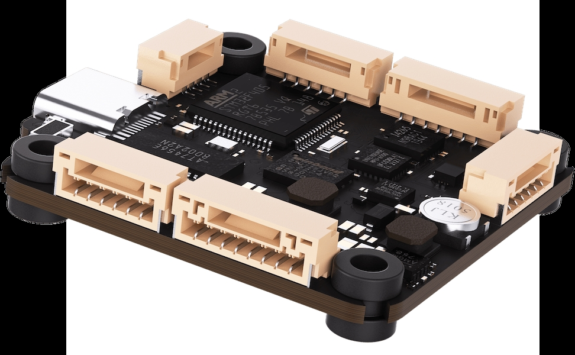
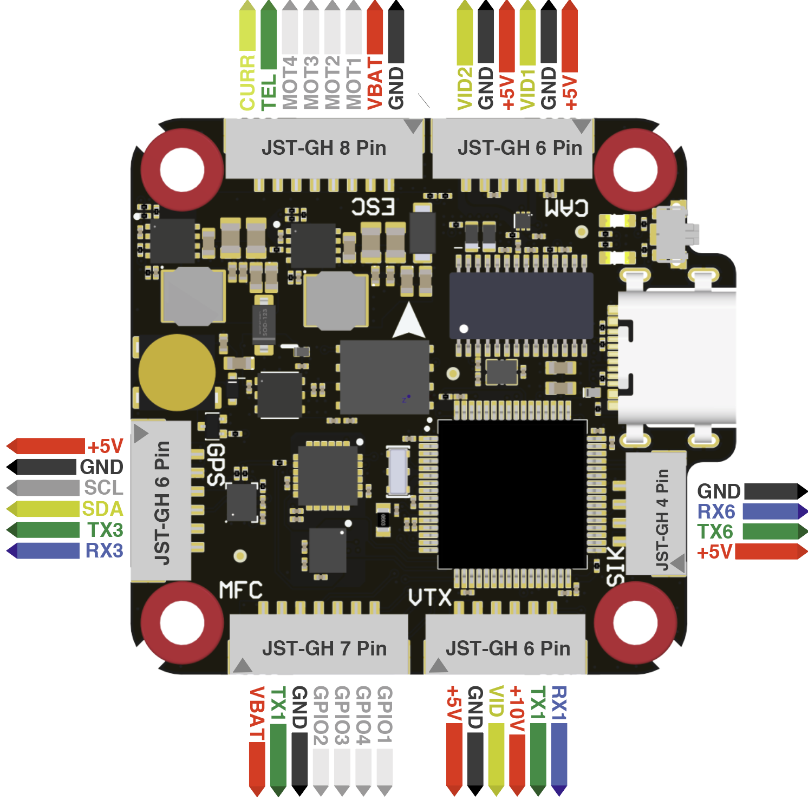

.. _common-OrqaF405:

========
OrqaF405
========
The Orqa FC 3030 F405 is an NDAA compliant flight controller produced by `Orqa <https://enterprise.orqafpv.com/>`__

Where to Buy
============

 - `Orqa <https://shop.orqafpv.com/products/orqa-orqa-drone-flight-controller>`__

Specifications
==============

-  **Processor**

   -  STM32F405 microcontroller
   -  AT7456E OSD
   -  16Mbyte dataflash for logging

-  **Sensors**

   -  MPU6000 IMU (accel and gyro)
   -  DPS310 Barometer

-  **Power**

   -  2S  - 6S Lipo input voltage with voltage monitoring
   -  10V 2A  BEC for powering Video Transmitter
   -  5V 2A (Mini:2.5A) BEC for peripherals

-  **Interfaces**

   -  8x PWM outputs
   -  4x UARTs/serial for RCin, GPS, and other peripherals
   -  1x I2C port for external compass
   -  VTX connector
   -  Switchable dual camera inputs
   -  Micro-C USB port
   -  MicroSD Card Slot for logging
   -  External current monitor input

Pinout
======

UART Mapping
============

The UARTs are marked Rxn and Tn in the above pinouts. The Rxn pin is the
receive pin for UARTn. The Txn pin is the transmit pin for UARTn.

   -  SERIAL0 -> USB
   -  SERIAL1 -> UART1 (RCin, DMA-enabled)
   -  SERIAL3 -> UART3 (GPS)
   -  SERIAL4 -> UART4 (MAVLink2, TX only DMA-enabled)
   -  SERIAL5 -> UART5 (RX pin only,ESC Telemetry)
   -  SERIAL6 -> UART6 (MAVLink2)

RC Input
========

RC input is configured for GHST by default on the TX1 (UART1_TX) pin using half-duplex. To support other RC protocols set SERIAL1_OPTIONS to 0. This will support all serial RC protocols except SBUS.

- FPort requires connection to the TX of the UART and ``SERIALx_OPTIONS`` be set to "7".

- CRSF also requires a TX connection, and automatically provides telemetry. Set ``SERIALx_OPTIONS`` to "0".

For PPM and SBUS support on UART1_RX set BRD_ALT_CONFIG to 1.

OSD Support
===========

The Orqa FC 3030 F405 supports analog OSD using OSD_TYPE 1 (MAX7456 driver) using the CAM and VTX connectors. DisplayPort HD OSD can be enabled simultaneously by setting :ref:`OSD_TYPE<OSD_TYPE>` = 5 and using USART6 for telemtry to the HD air unit by setting :ref:`SERIAL6_PROTOCOL<SERIAL6_PROTOCOL>` = 42.

PWM Output
==========

The Orqa FC 3030 F405 supports up to 8 PWM outputs(Mini supports 9). Outputs 1-8 also support DShot. Outputs 1-4 support bi-directional DShot. Outputs are grouped and each group must use the same output protocol:

- 1,4-6 are group1
- 2 3 are group 2
- 7,8 are group 3

.. note:: for users migrating from BetaflightX quads, the first four outputs M1-M4 have been configured for use with existing motor wiring using these default parameters:

- :ref:`FRAME_CLASS<FRAME_CLASS>` = 1 (Quad)
- :ref:`FRAME_TYPE<FRAME_TYPE>` = 12 (BetaFlightX) 

Battery Monitoring
==================

The board has a built-in voltage sensor via the VBAT pin, but no internal current sensor. An external current sensor can be connected to the Curr pin. Default parameters for both internal voltage and external current monitoring are set by default to :

 - :ref:`BATT_MONITOR<BATT_MONITOR>` 4
 - :ref:`BATT_VOLT_PIN<BATT_VOLT_PIN>` 13
 - :ref:`BATT_CURR_PIN<BATT_CURR_PIN>` 12
 - :ref:`BATT_VOLT_MULT<BATT_VOLT_MULT>` 8.3
 - :ref:`BATT_AMP_PERVLT<BATT_AMP_PERVLT>` 92.6

Compass
=======

The Orqa FC 3030 F405 does not have a built-in compass, but you can attach an external compass using I2C on the SDA and SCL connector.

Firmware
========

Firmware for this board can be found `here <https://firmware.ardupilot.org>`_ in  sub-folders labeled "OrcaF405Pro".

Loading Firmware
================

Initial firmware load can be done with DFU by plugging in USB with the bootloader button pressed. Then you should load the "with_bl.hex" firmware, using your favorite DFU loading tool.

Once the initial firmware is loaded you can update the firmware using any ArduPilot ground station software. Updates should be done with the "\*.apj" firmware files.

[copywiki destination="plane,copter,rover,blimp"]