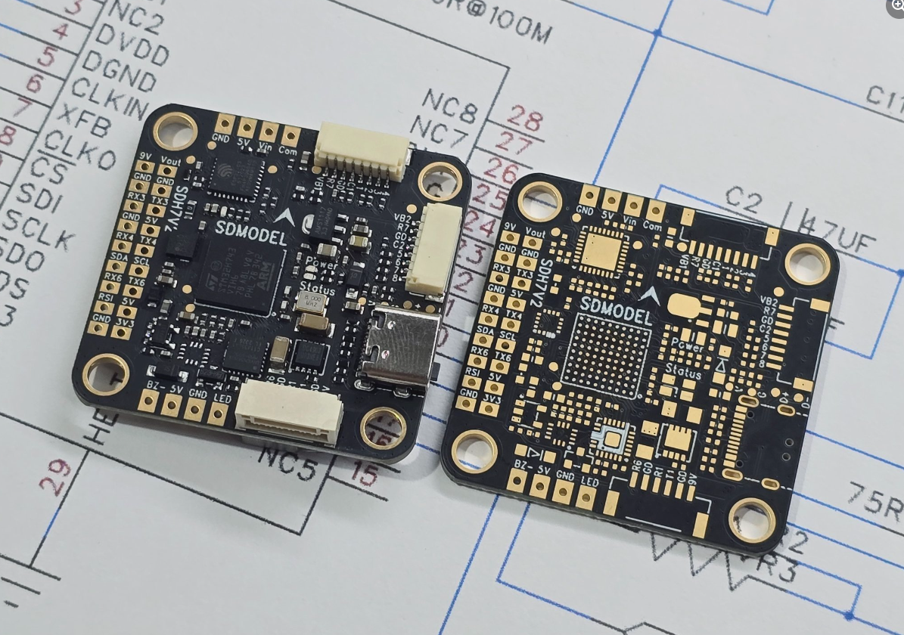
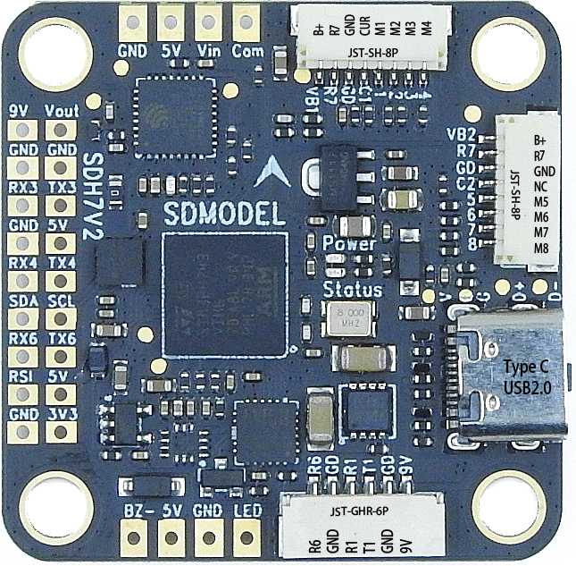
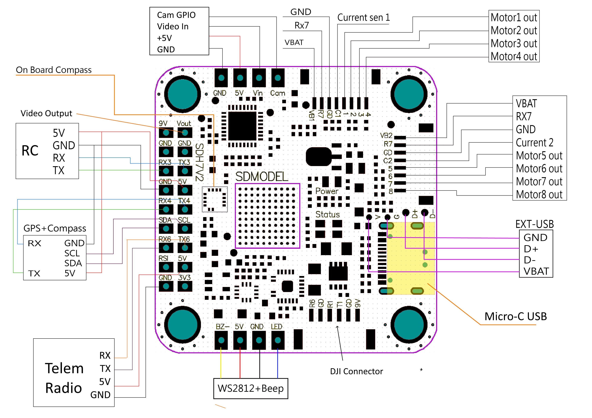

.. _common-SDMODELH7V2:

===========
SDMODELH7V2
===========

Where to Buy
============

- Available from `SDMODEL <https://www.sdmodel.com.tw>`__

Specifications
==============

-  **Processor**

   -  STM32H743 32-bit processor
   -  AT7456E OSD

-  **Sensors**

   -  InvenSense MPU6000 IMU (accel and gyro only, no compass)
   -  IST8310 Compass
   -  BMP280 barometer

-  **Power**

   -  2S  - 6S Lipo input voltage with voltage monitoring
   -  9V, 1.5A BEC for powering Video Transmitter

-  **Interfaces**

   -  9x PWM outputs (9th pwm output is for NeoPixel LED string via the LED pad)
   -  1x RC input
   -  6x UARTs/serial for GPS and other peripherals
   -  1x I2C port for external compass
   -  Micro-C USB port
   -  All UARTS support hardware inversion. SBUS, SmartPort, and other inverted protocols work on any UART without "uninvert hack"
   -  MicroSD Card Slot for logging
   -  External current monitor input

Pinout
======

Typical Wiring
==============

UART Mapping
============

The UARTs are marked Rn and Tn in the above pinouts. The Rn pin is the
receive pin for UARTn. The Tn pin is the transmit pin for UARTn.

   -  SERIAL0 -> USB
   -  SERIAL1 -> UART1 (MSP DisplayPort)(DMA Capable)
   -  SERIAL2 -> UART2 (TMAVLink) (connected to internal BT module, not useable by ArduPilot)
   -  SERIAL3 -> UART3 (RCinput)(DMA Capable)
   -  SERIAL4 -> UART4 (GPS)
   -  SERIAL5 -> not available
   -  SERIAL6 -> UART6 (MAVLink2)
   -  SERIAL7 -> UART7 (RX7 only available, ESC telemetry)(DMA Capable)

The SERIAL7 port (UART7) is normally for ESC telemetry, and has an R7 pin on
both of the ESC connectors.

RC Input
========

RC input is configured on the R3 (UART3_RX) pin for unidirectional protocols. The T3 pin must also be used for bi-directional protocols, such as CRSF/ELRS.

- PPM is not supported.

- SBUS/DSM/SRXL connects to the R3 pin

- FPort requires connection to T3 and :ref:`SERIAL6_OPTIONS<SERIAL6_OPTIONS>` be set to "7".

- CRSF also requires a T3 connection, in addition to R6, and automatically provides telemetry. Set :ref:`SERIAL3_OPTIONS<SERIAL3_OPTIONS>` to "0".

- SRXL2 requires a connection to T6 and automatically provides telemetry.  Set :ref:`SERIAL6_OPTIONS<SERIAL6_OPTIONS>` to "4".

Any UART can be used for RC system connections in ArduPilot also, and is compatible with all protocols except PPM. See :ref:`common-rc-systems` for details. CRSF/ELRS requires full DMA for maximum reliability.

OSD Support
===========

The SDMODELH7V2  supports OSD using :ref:`OSD_TYPE<OSD_TYPE>` 1 (MAX7456 driver). Simultaneous DisplayPort OSD option is also available and SERIAL1 defaults to DisplayPort protocol.

VTX Power Switch
================

The JST-GH-6P connector supports a standard DJI HD VTX connection. Pin 1 of the connector is 9v so be careful not to connect this to a peripheral requiring 5v. The 9v supply is controlled by RELAY_PIN2 set to GPIO 81 and is on by default. It can be configured to be operated by an RC switch by selecting the function RELAY2.

Camera Control Pin
==================

The Cam pin is GPIO 84 and is set to be controlled by RELAY4 by default. Relay pins can be controlled either by an RC switch or GCS command. See :ref:`common-relay` for more information.

PWM Output
==========

The SDMODELH7V2 supports up to 8 PWM outputs. Outputs are available via two JST-SH connectors. All 8 outputs support DShot as well as all PWM types. Ouputs 1-4 also support Bi-Directional DSHOT.

The PWM is in 3 groups:

 - PWM 1, 2 in group1
 - PWM 3, 4 in group2
 - PWM 5, 6 in group3
 - PWM 7, 8 in group4
 - PWM 9(LED) in group5

Channels within the same group need to use the same output rate, whether PWM or Dshot. If
any channel in a group uses DShot then all channels in the group need
to use DShot.

.. note:: for users migrating from BetaflightX quads, the first four outputs M1-M4 have been configured for use with existing motor wiring using these default parameters:

- :ref:`FRAME_CLASS<FRAME_CLASS>` = 1 (Quad)
- :ref:`FRAME_TYPE<FRAME_TYPE>` = 12 (BetaFlightX) 

LED Output
==========

The LED output (PWM9) is configured by default to support :ref:`NeoPixel LED strings<common-serial-led-neopixel>`.

Battery Monitoring
==================

The board has a built-in voltage sensor via the B+ pin, but no internal current sensor. An external current sensor can be connected to the CUR pin. Default parameters for both internal voltage and external current monitoring are set by default to the below for use with any Holybro Tekko32 F4 4in1 ESC.

The correct battery setting parameters are:

 - :ref:`BATT_MONITOR<BATT_MONITOR>` 4
 - :ref:`BATT_VOLT_PIN<BATT_VOLT_PIN>` 10
 - :ref:`BATT_CURR_PIN<BATT_CURR_PIN>` 11
 - :ref:`BATT_VOLT_MULT<BATT_VOLT_MULT>` 11
 - :ref:`BATT_AMP_PERVLT<BATT_AMP_PERVLT>` 59.5

Compass
=======

The SDMODELH7V2 has a built-in compass. However, often motor/battery current interference can be too high on small vehicles to adequately calibrate the compass and it may be disabled using :ref:`COMPASS_USE<COMPASS_USE>` = 0, an you can attach an external compass using I2C on the SDA and SCL pads.

Firmware
========

Firmware for this board can be found `here <https://firmware.ardupilot.org>`_ in  sub-folders labeled "SDMODELH7V2".

Loading Firmware
================

Initial firmware load can be done with DFU by plugging in USB with the
bootloader button pressed. Then you should load the "with_bl.hex"
firmware, using your favourite DFU loading tool.

Once the initial firmware is loaded you can update the firmware using
any ArduPilot ground station software. Later updates should be done with the
\*.apj firmware files.

[copywiki destination="plane,copter,rover,blimp"]
