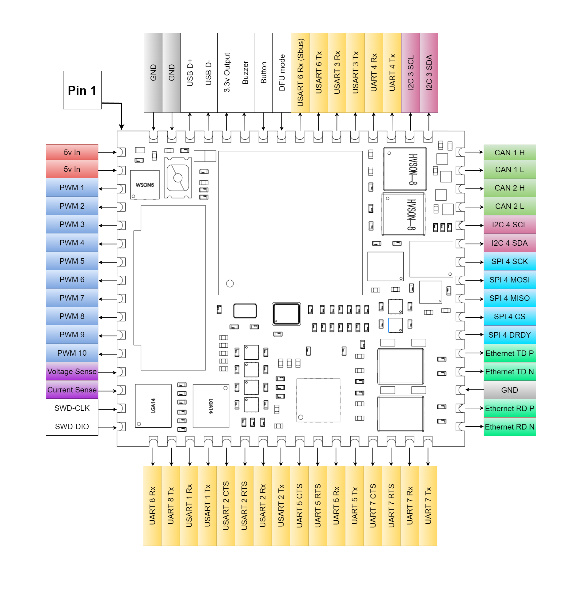

.. _common-StampH743:

=====================
CBUnmanned H743 Stamp
=====================

The `CBUnmanned H743 Stamp <https://cbunmanned.com/store>`_ is a flight controller loosely based on the FMUv6 standards & is designed for low volume OEMs as a drop in way to add ArduPilot to their custom hardware builds. It is a part of CBUnmanned's wider `"Stamp" Eco-System <https://wiki.cbunmanned.com/wiki/cbunmanned-stamp-eco-system>`_ , which brings together all the typical avionics hardware into a neat custom carrier PCB. Mounting footprints and symbols are available along with examples of basic usage on the  `Wiki <https://wiki.cbunmanned.com/wiki/cbunmanned-stamp-eco-system/h743-flight-controller>`_.

.. image:: ../../../images/H743StampFrontBack.png
   :target: ../_images/H743StampFrontBack.png

Features
========

* Class leading H7 SOC.
* Triple IMU sensors for extra redundancy.
* Based on the FMU-V6 standards.
* Micro SD Card for Logging/LUA Scripting.
* Direct solder mounting or optional 1.27mm header.
* x1 Ethernet and x2 CAN for easy integration with the next generation of UAV accessories.
* All complicated/supporting circuitry is on-board, just power with 5v.
* Just 22mm x 24.25mm & 1.9g.

Specifications
==============

-  **Processor**

  * STM32H743IIK6 microcontroller
  * 480MHz
  * 2Mb Flash
  * 1Mb RAM

-  **Sensors**

  * x2 Ivensense ICM-42688 IMU
  * x1 Ivensense ICM-42670 IMU
  * x1 Infineon DPS310 Barometer
  * x1 Bosch BMM150 Magnetometer

-  **Power**

  * 5v Main Power in
  * x6 Independent Power Regulators
  * x2 ADC Inputs for Voltage and Current Sense

-  **Interfaces**

  * x1 MicroSD card slot
  * x8 UARTs inc RC, x3 with flow control
  * x10 PWM outputs
  * x2 I2C 
  * x2 CAN
  * x1 External SPI
  * x1 Ethernet
  * External Buzzer
  * External Safety Switch 
  * External USB connectors 

Pinout
======

UART Mapping (Yellow Fade)
==========================

* SERIAL0 -> USB
* SERIAL1 -> USART1
* SERIAL2 -> USART2    (With RTS/CTS, DMA-enabled)
* SERIAL3 -> USART3    (GPS1, DMA-enabled)
* SERIAL4 -> UART4     (GPS2, DMA-enabled)
* SERIAL5 -> UART5     (With RTS/CTS, DMA-enabled)
* SERIAL6 -> USART6    (RCIN / IO coprocessor if fitted, DMA-enabled)
* SERIAL7 -> UART7     (With RTS/CTS, DMA-enabled) 
* SERIAL8 -> UART8

RC Input
========

RC input is configured on the USART 6 Rx Pin. This pin allows all unidirectional RC protocols supported by ArduPilot. PPM is NOT supported. USART 6 Tx is available for use with bi-directional protocols, such as CRSF/ELRS.

An optional IOMCU can be connected to this serial port, but a compatible custom build of the firmware would be required.

CAN Ports (Light Green Fade)
============================

2 CAN buses are available, each with a built in 120 ohm termination resistors.

I2C (Maroon Fade)
=================

- I2C 3 - External With internal 2.2k Pull Up.
- I2C 4 - External With internal 2.2k Pull Up.

SPI (Cyan Fade)
===============

SPI 4 is available for use with external sensors alongside a Chip Select and Data Ready pin using custom built firwmare.

PWM Output (Blue Fade)
======================

The Stamp supports up to 10 PWM outputs with D-Shot. The PWM outputs are in 3 groups:

* PWM 1 - 4 in group 1 (Timer 5)
* PWM 5 - 8 in group 2 (Timer 4)
* PWM 9 & 10 in group 3 (Timer 2)

Channels within the same group need to use the same output rate. If any channel in a group uses D-Shot then all channels in the group need to use D-Shot. BiDirectional DShot available on the first 8 outputs.

Analog Inputs (Purple Fade)
===========================

The board has two ADC input channels for Voltage (0-3.3v) and Current (0-3.3v) measurement. Settings are dependent on the external hardware used. 

Ethernet (Green Fade)
=====================

Ethernet is available on 4 output pads and has internal magnetics supporting direct connection to external equipment, no need for a large RJ45 connector.

Compass
=======

The H743 Stamp has a built in compass, the BMM150. Due to potential interference the board is usually used with an external I2C or CAN compass as part of a GPS/Compass combination.

USB
===

USB Signals D+ & D- are available to route to a suitable connector for your project.

Safety Button
=============

Optional, if it is not fitted remove the check from arming mask. To activate short this pad to 3.3v with a momentary push button (Press & Hold).

Power
=====

A regulated 3.3v output is available from the stamp for use with the safety button. WARNING! This is shared with the main IC - Do NOT use for accessories. Keep current draw under 0.1A!

The Stamp requires a stable 5v supply input of at least 1.5A. This directly powers the 5v components and supplies the 3.3v LDOs with power. Typical idle usage is 0.35A @ 5v.

Battery Monitoring
==================

The board has a built-in voltage sensor via the ``Voltage Sense`` pin, but no internal current sensor. An external current sensor can be connected to the ``Current Sense`` pin. Default parameters for both internal voltage and external current monitoring are set by default to the below :

 - :ref:`BATT_MONITOR<BATT_MONITOR>` 4
 - :ref:`BATT_VOLT_PIN<BATT_VOLT_PIN>` 18
 - :ref:`BATT_CURR_PIN<BATT_CURR_PIN>` 19
 - :ref:`BATT_VOLT_MULT<BATT_VOLT_MULT>` 11.1
 - :ref:`BATT_AMP_PERVLT<BATT_AMP_PERVLT>` 64
 
Loading Firmware
================

The board comes pre-installed with an ArduPilot compatible bootloader, allowing the loading of \*.apj firmware files with any ArduPilot compatible ground station. 

Firmware Taget = CBU-H7-Stamp

A built in button can be used to activate DFU Mode by being pressed during power up. The DFU Activate pin is broken out to allow remote mounting of this button if required. 

[copywiki destination="plane,copter,rover,blimp"]
