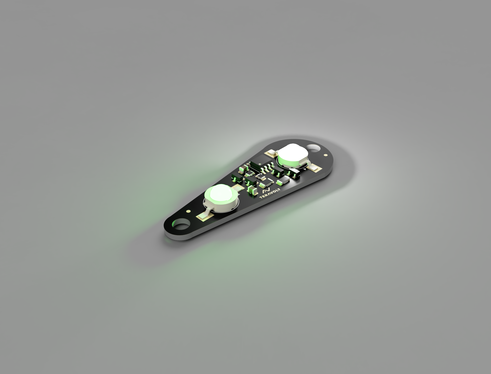
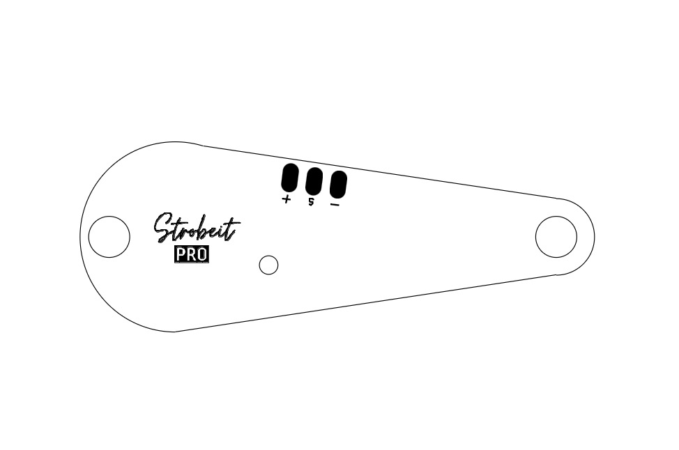

.. _common-strobeit-pro:

StrobeIT Pro - Professional UAV Strobe
======================================

The **StrobeIT Pro** is the industrial-grade evolution of the StrobeIT, designed by **TeraVolt Labs** for heavy-lift and long-range UAVs. It features enhanced brightness, ruggedized mounting.

Key Features
------------

* **Extreme Brightness:** Dual-emitter / High-power configuration for maximum visibility (>3km).
* **Robust Design:** Encased/Potting options for weather resistance.
* **Dual Control:** PWM and Lua Scripting support compatible with ArduPilot.

Specifications
--------------

* **Input Voltage:** **5V**
* **Power Output:** **6W MAX**
* **Signal Input:** **PWM** (1000–2000µs)
* **Dimensions:** **57 x 47mm**
* **Mounting:** Standard **M4** Mounting pattern
* **Weight:** **5g**

Pinout
------

* **VCC:** Power Input
* **Signal:** PWM Input
* **GND:** Ground

Operation Modes
---------------

The StrobeIT Pro utilizes standard PWM pulse widths to trigger different behaviors:

.. youtube:: 1E8gp-a47hI

.. list-table:: PWM Control Logic
   :widths: 20 50 30
   :header-rows: 1

   * - PWM Input
     - White LED Pattern
     - Color
   * - **1000 µs**
     - Solid ON
     - Green/Red
   * - **1200 µs**
     - Blink once (200ms), pause 1.5s
     - Green/Red
   * - **1500 µs**
     - Double Blink (2x), pause 1.5s
     - Green/Red
   * - **1800 µs**
     - Rapid Flicker (Strobe)
     - Green/Red
   * - **2000 µs**
     - Strobe OFF
     - Green/Red

Useful Links
------------

* `Official StrobeIT Pro Documentation <https://teravolt.gitbook.io/teravolt/strobes/strobeit-pro>`__
* `TeraVolt Labs Store <https://www.teravolt.in/>`__