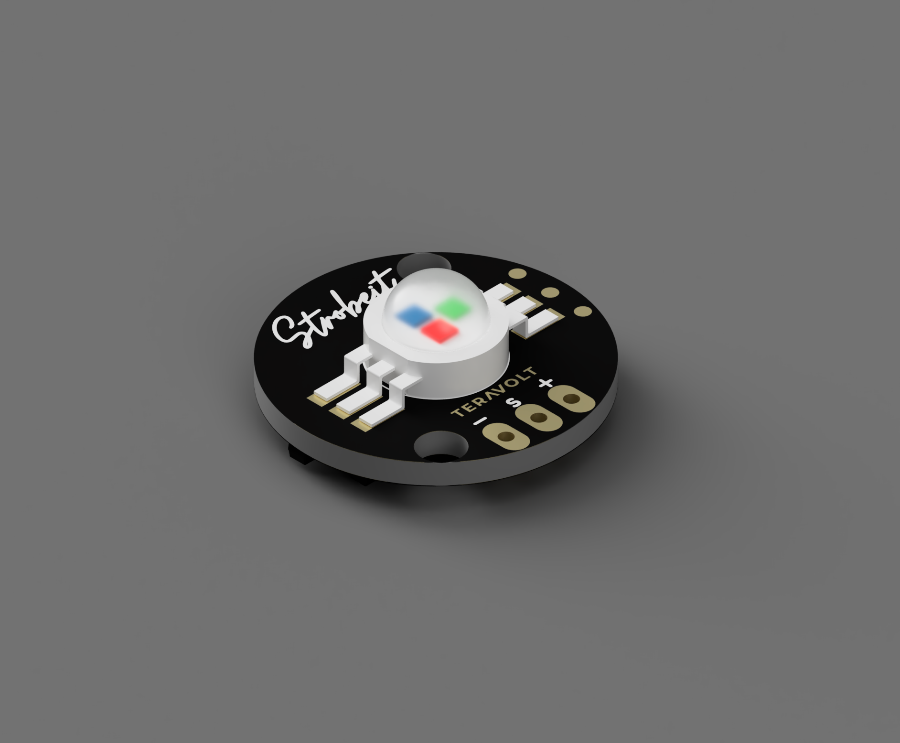

.. _common-strobeit:

StrobeIT - High Intensity Drone Strobe
======================================

The **StrobeIT** is a high-intensity, standalone or PWM-controlled LED strobe designed by **TeraVolt Labs**. It is engineered for long-range visibility and DGCA/FAA compliance for night operations.

Key Features
------------

* **High Power:** 3W Max RGB LED output for long-range visibility.
* **Magnetic Color Control:** Onboard Hall Sensor allows changing colors by simply tapping a magnet near the module (no computer required).
* **Dual Control Modes:**
    * **PWM:** Standard RC PWM control (1000us - 2000us).
    * **Lua Scripting:** Full support for ArduPilot Lua scripts for custom patterns.
* **Compact Design:** 20mm circular PCB with standard 2x M3 mounting holes.

Specifications
--------------

* **Input Voltage:** 5V DC (Regulated)
* **Current Draw:** 300mA (Average) / 800mA (Max Brightness)
* **Signal Input:** PWM (1000–2000µs)
* **Dimensions:** 20mm Circular PCB
* **Mounting:** 2x M3 Holes
* **Weight:** < 5g

Operation Modes
---------------

The StrobeIT changes its behavior based on the PWM signal received from the autopilot.

.. youtube:: V1odmniQY-s

.. list-table:: PWM Control Logic
   :widths: 20 50 30
   :header-rows: 1

   * - PWM Input
     - LED Pattern
     - Color
   * - **1000 µs**
     - Solid ON
     - Selected Color
   * - **1200 µs**
     - Blink once (200ms), pause 1.5s
     - Selected Color
   * - **1800 µs**
     - Double Blink (2x), pause 1.5s
     - Selected Color
   * - **1900 µs**
     - Rapid Flicker (Strobe)
     - **Forced Red**
   * - **2000 µs**
     - Strobe OFF
     - (None)

Color Selection (Hall Sensor)
-----------------------------

You can cycle through the available colors without using a computer. Simply pass a magnet over the **Hall Sensor** on the PCB to switch to the next color.

**Color Sequence:**
Green → Red → Blue → White → Green...

*Note: The selected color is saved in memory and persists after power cycling.*

Pinout
------

.. image:: ../../../images/Teravolt/StrobeIT/StrobeIT_2.png
    :target: ../images/Teravolt/StrobeIT/StrobeIT_2.png
    :width: 450px

The module uses a standard 3-pin servo connector:

* **GND (Black):** Ground
* **Signal (Yellow/White):** PWM Input (Connect to Autopilot Servo Output)
* **VCC (Red):** 5V Power

Useful Links
------------

* `Official StrobeIT Documentation <https://teravolt.gitbook.io/teravolt/strobes/strobeit>`__
* `TeraVolt Labs Store <https://www.teravolt.in/product-page/strobeit/>`__