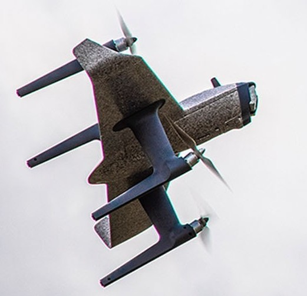

.. _common-Swan-K1:

=============
SWAN-K1 HWing
=============

This autopilot is a part of a :ref:`ready-to-fly vehicle <common-rtf>` in  the form of a control-surfaceless, quad-copter Tailsitter QuadPlane. It comes with customized PX4 firmware installed and an GCS application that is downloadable for smart phones. This page describes the conversion to ArduPilot firmware and its setup.

It was initially offered with a 10 channel RC transmitter using an external smart phone for GCS and video display, and the Pro version comes with a 12 channel system with an integrated screen for the GCS/Video.

ArduPilot Firmware Installation
===============================

You will need to remove the access cover in order to attach a USB cable to the autopilot. Installing a short 90 deg USB pigtail, routed into the battery compartment will allow easy USB connections in the future.

.. image:: ../../../images/Hwing-access-cover.jpg

Connect to Mission Planner or QGC, and upload the Plane firmware for the SWAN-K1 located `here <https://firmware.ardupilot.org>`__. 

The firmware has defaults already set for optimum tuning and operation.

Calibration
===========

Once the new ArduPilot firmware is loaded, you will only need to :ref:`calibrate the accelerometers <common-accelerometer-calibration>` and :ref:`calibrate the compass<common-compass-calibration-in-mission-planner>`. The level point for the accelerometer calibration should be normal fixed wing flight attitude.

System Setup
============

The defaults provide for basic operation:

- Flight modes are on the upper left three position switch: QHOVER/QLOITER/FBWA
- QRTL is on button "B". Note this, and other buttons, are locking toggle switches!
- Mode 2 AETR stick setup.
- Arming/Disarming is done via rudder at lowest throttle.

.. note:: once armed, and the center sprung throttle is allowed to return to center, the vehicle may start to  lift off slowly. Also, be sure to arm only in QHOVER or QLOITER!

- Failsafe is setup by default to execute the :ref:`Hybrid RTL/QRTL <quadplane_rtl>` function with :ref:`Q_RTL_MODE<Q_RTL_MODE>` = 3.

Customization
=============

One of the benefits of using ArduPilot is that you can set transmitter functions easily.

Some possibilities using :ref:`RC Auxiliary Functions<common-auxiliary-functions>`:

 - Set one of the switches as ARM/DISARM for quick disarming instead of the rudder/throttle combination.
 - Set other flight modes, such as CRUISE or QLAND, on one of the other switches or buttons 
 - Set AUTO mode, on a button
 - Set up :ref:`fences<common-geofencing-landing-page>` and enable/disable via switch or button.

Transmitter RC Channel Mapping
------------------------------

==============  ===    ===  ===================
Control         T10    H12  Default Setup
==============  ===    ===  ===================
Sticks          1-4    1-4  Mode2 AETR
Button A         7      7
Button B         8      8   QRTL
Button/Knob C*   9      9
Button/Knob D*   10     10
Knob G                  11
Knob H                  12
Switch E          5     5    Flight Mode Switch
Switch F          6     6
==============  ===    ===  ===================

* T10 this is a knob, H12 it is a locking button

Ground Control Station Connections
==================================

With the T10 transmitter, MAVLink is available for connection via BlueTooth connection from the transmitter. You can connect and run any GCS (Mission Planner, QGC, etc.).

With the H12 transmitter, you may load and use Mission Planner. The Android compatible Mission Planner applet (.apk) is located `here <https://github.com/ArduPilot/MissionPlanner/releases/tag/latest>`__. But first you must download and run this `HEQ .apk  application <https://firmware.ardupilot.org/Tools/misc/Heq_H12_20210526.apk>`__ before starting Mission Planner.

Video Display
=============

With the T10 transmitter you must connect a smart phone via the transmitters USB connector and use the `HEQ Fly app <https://www.pgyer.com/xpLb>`__ to display the video. You can connect the app via Bluetooth for limited GCS display in the same app, but usually connecting to another phone or PC for a GCS will allow the full GCS capabilities using MAVlink to be exploited.

The H12 transmitter has video display built in.

Where to Buy
============

`Holybro <https://shop.holybro.com/swan-k1_p1246.html>`__

[copywiki destination="plane,copter,rover,blimp"]