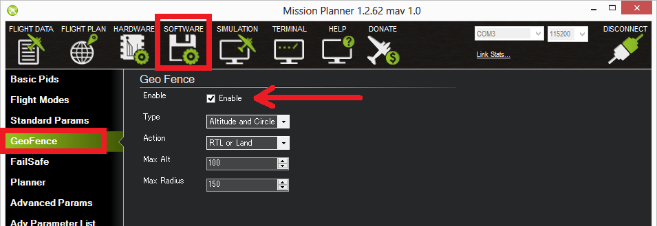
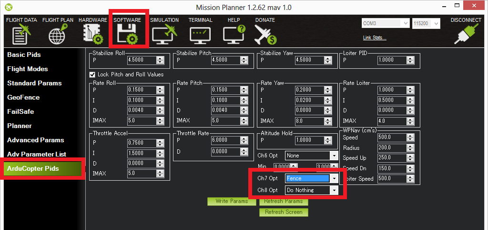

.. _common-ac2_simple_geofence:

[copywiki destination="copter,rover"]
=================
Cylindrical Fence
=================

Overview
========

Copter and Rover include a simple "tin can" shaped fence centered
on home that will attempt to stop your copter/rover from flying/driving too far away
by stopping at the fence or executing a configurable action.
The maximum circular distance and altitude (altitude used by Copter only) and the vehicle behavior when the fence is reached can be configured using Mission Planner.

Rover Actions
-------------

Rover has no altitude actions, but if it reaches the Cylindrical fence boundary in either Steering or Acro modes, it will simply stop and not move beyond it. These are the only modes affected by the fence.

Copter Actions
--------------

Copter will stop increasing altitude at :ref:`FENCE_ALT_MAX<FENCE_ALT_MAX>` in Loiter, PosHold, and AltHold modes.

In Loiter mode, it will stop at the horizontal boundaries.

In other modes, it will execute the :ref:`FENCE_ACTION<FENCE_ACTION>` below if the altitude or boundary is reached.

+------------+--------------------+-------------------+
+FENCE_ACTION|  Copter            | Rover             +
+============+====================+===================+
+     0      |   Report Only                          +
+------------+--------------------+-------------------+
+     1      | RTL/LAND           | RTL/HOLD          +
+------------+--------------------+-------------------+
+     2      |LAND                | HOLD              +
+------------+--------------------+-------------------+
+     3      |  SmartRTL/RTL/LAND | SmartRTL/RTL/HOLD +
+------------+--------------------+-------------------+
+     4      | BRAKE/LAND         |SmartRTL/RTL/HOLD  +
+------------+--------------------+-------------------+

.. note:: RTL/HOLD,etc. means it will attempt RTL first, but if it cant' switch to that mode (ie for RTL, GPS lock is lost), it will attempt to switch to the next,in this case HOLD.

At the moment the fence is breached a backup fence is erected 20m
further out (or up).  If the vehicle breaches this backup fence (for
example if the the vehicle is not set up correctly or the operator takes
control but is unable to bring the copter back towards home), the vehicle
will execute the :ref:`FENCE_ACTION<FENCE_ACTION>` again (and another backup fence an additional
20m further out will be created if this is breached again).

If the vehicle eventually proceeds 100m outside the configured fence
distance, despite the backup fences, the vehicle will switch into LAND mode (HOLD for Rover).  The idea being that it's clearly impossible to get the vehicle home so best to just bring it
down/stop it.  The pilot can still retake control of course with the flight mode
switches.  Like with the earlier fences, another fence is erected 20m
out which will again switch the vehicle to LAND (HOLD for Rover), if it continues away from
home.

Enabling the Fence in Mission Planner
=====================================

The Fence can be set-up by doing the following:

-  Connect your autopilot to the Mission Planner
-  Go to the **CONFIG/GeoFence** screen
-  Enable the FENCE: :ref:`FENCE_ENABLE<FENCE_ENABLE>` =1.

.. note:: The fence can be enabled/disabled by an RC channel, or Mission Command (DO_FENCE_EANBLE), but must be enabled with this parameter first.

-  Set :ref:`FENCE_TYPE<FENCE_TYPE>` = default of "ALL" is fine and will allow you to set up an additional :ref:`common-polygon_fence` , unless you want only a cylindrical fence to be active if a polygon fence has also been loaded. Then  you could select "Altitude" or "Circle" or both.
-  Set :ref:`FENCE_ACTION<FENCE_ACTION>` ="RTL or LAND" ,or whatever you wish for a breach action.
-  Set :ref:`FENCE_ALT_MAX<FENCE_ALT_MAX>` to the altitude limit you want (in meters). This is unavailable in Rover.
-  Set :ref:`FENCE_RADIUS<FENCE_RADIUS>` to the maximum distance from HOME you want (in
   meters).  This should normally be at least 50m.

.. note:: Currently Mission Planner does not support the GeoFences menu for Rover, so these parameters must be entered manually.

.. note:: Rover ignores any altitudes entered, or if a :ref:`FENCE_TYPE<FENCE_TYPE>` involving altitude is selected.

Enabling the fence with an RC Channel Auxiliary Switch
======================================================

It is not necessary to set-up a switch to enable or disable the fence
but if you wish to control the fence with a switch follow these
steps:

for firmware versions before 4.0:

-  Go to the Mission Planner's Config/Tuning > Extended Tuning screen and set
   either "Ch7 Opt" OR "Ch8 Opt" to Fence. These parameters can also be directly set from the Config/Tuning > Full Parameter List screen
   

   
alternatively, for firmware versions 4.0 or later, an RCx_OPTION can be set via the Config/Tuning > Full Parameter List screen:

-  Use an RCx_OPTION set to Fence
-  holding the switch high (i.e. PWM > 1800) will enable the fence, low
   (under 1800) will disable the fence.

Warnings:
=========

-  The minimum recommended fence radius is 30m
-  The fence requires the GPS to be functioning well so do not disable
   the :ref:`GPS arming check <common-prearm-safety-checks>` nor the :ref:`EKF failsafe <ekf-inav-failsafe>` while the fence is enabled. 
   Conversely if you disable either of these checks, disable the Fence.
-  For the best results, ensure RTL is working on your vehicle.
-  With the Fence enabled, the pre-arm checks will require you have GPS
   lock before arming the vehicle.
-  If GPS failsafe is not enabled and the Fence is enabled and you lose
   GPS lock while flying the fence will be disabled.
-  If GPS failsafe is enabled and the Fence is enabled and you lose GPS
   lock while piloting, the vehicle will switch to LAND (HOLD for Rover) because we no
   longer know the vehicle position and we want to ensure the vehicle
   never travels far outside the fence.  This behavior will occur
   regardless of the flight mode.  If this is not desired,
   the pilot can retake control by moving the flight mode switch.
-  The backup fences are created 20m out from the previous breached
   fence not 20m out from the vehicle's position.  This means if you
   choose to override the fence you may have less than 20m to regain
   vehicle control before the fence switches the vehicle to the :ref:`FENCE_ACTION<FENCE_ACTION>`
   again.  If you really want to override the fence, you should be ready
   to switch the flight mode twice or alternatively set-up the
   enable/disable fence switch.

Video overview of the Fence setup and Operation
===============================================

..  youtube:: HDnGdo54o-4
    :width: 100%
