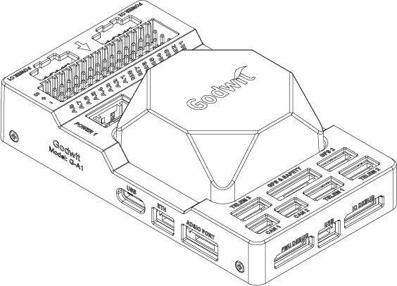
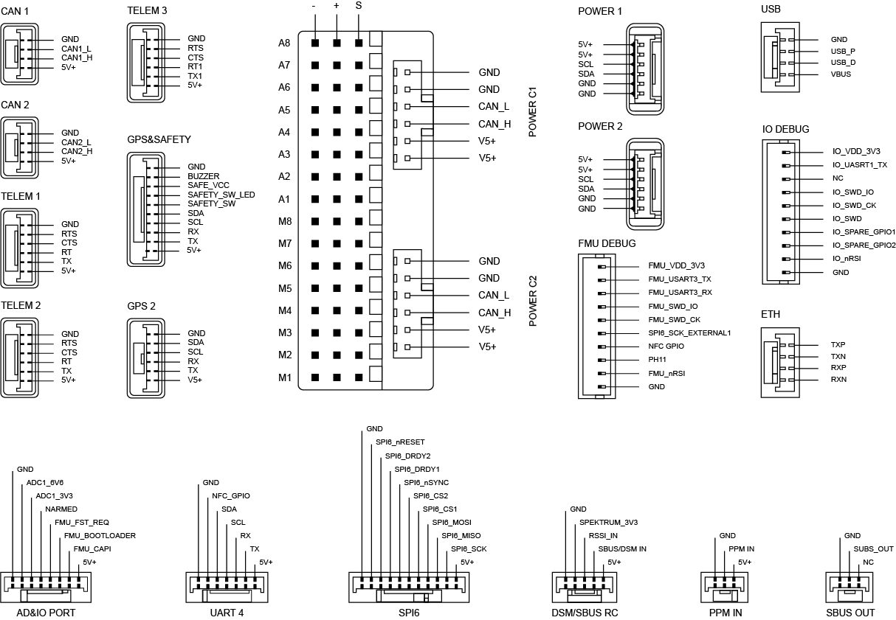

.. _common-accton-godwit-ga1-overview:

==================
Accton Godwit G-A1
==================

The G-A1 is a state-of-the-art universal
controller (flight controller) developed based
on the Pixhawk Autopilot v6X Standard. It adopts
an H7 double-precision floating-point arithmetic
unit, Cortex®-M3 coprocessor, independent bus,
and power supply. The IMU with its 6-axis
inertial sensor, pressure/temperature sensor,
and geomagnetic sensor is designed for safety
and rich expansion capabilities. With an
integrated 10/100M Ethernet Physical Layer
(PHY), the G-A1 can also communicate with the
mission computer (airborne computer), high-end
surveying and mapping cameras, and other
UxV-mounted equipment for high-speed
communications, meeting the needs of advanced
UxV systems.

Hardware Summary
================

+---------------------+---------------------------------------------------------------------------------------+
| Item                | Description                                                                           |
+=====================+=======================================================================================+
| FMU Processor       | STM32H753IIK (Arm® Cortex®-M7 480MHz)                                                 |
+---------------------+---------------------------------------------------------------------------------------+
| IO Processor        | STM32F103 (Arm® Cortex®-M3, 72MHz)                                                    |
+---------------------+---------------------------------------------------------------------------------------+
| Memory              | 2 Mbytes of flash and 1 Mbytes RAM                                                    |
+---------------------+---------------------------------------------------------------------------------------+
| IMU                 | - Bosch BMI088 (vibration isolated)                                                   |
|                     | - TDK InvenSense ICM-42688-P x 2 (one vibration isolated)                             |
|                     | - TDK Barometric Pressure and Temperature Sensor CP-20100 x 2 (one vibration isolated)|
|                     | - PNI RM3100 Geomagnetic Sensor (vibration isolated)                                  |
+---------------------+---------------------------------------------------------------------------------------+
| IO Interface        | - 2 CAN Buses (CAN1 and CAN2)                                                         |
|                     | - 3 TELEM Ports (TELEM1, TELEM2 and TELEM3)                                           |
|                     | - 2 GPS Ports (GPS1 with safety switch, LED, buzzer, and GPS2)                        |
|                     | - 1 PPM IN                                                                            |
|                     | - 1 SBUS OUT                                                                          |
|                     | - 2 USB Ports (1 TYPE-C and 1 JST GH1.25)                                             |
|                     | - 1 10/100Base-T Ethernet Port                                                        |
|                     | - 1 SM/SBUS RC                                                                        |
|                     | - 1 UART 4                                                                            |
|                     | - 1 AD&IO Port                                                                        |
|                     | - 2 Debug Ports (1 IO Debug and 1 FMU Debug)                                          |
|                     | - 1 SPI6 Bus                                                                          |
|                     | - 4 Power Inputs (Power 1, Power 2, Power C1 and Power C2)                            |
|                     | - 16 PWM Servo Outputs (A1-8 and M1-8)                                                |
|                     | - Micro SD Socket (supports SD 4.1 & SDIO 4.0 in two databus modes: 1 bit (default)   |
|                     |   and 4 bits)                                                                         |
+---------------------+---------------------------------------------------------------------------------------+
| SD Card             | Not included in the package                                                           |
+---------------------+---------------------------------------------------------------------------------------+
| Power Requirement   | 4.6V to 5.7V                                                                          |
+---------------------+---------------------------------------------------------------------------------------+
| Current Ratings     | - TELEM1 and GPS2 output current: 1.5A (max)                                          |
|                     | - All other port combined output current: 1.5A (max)                                  |
+---------------------+---------------------------------------------------------------------------------------+
| Operating           | -40°C to +55 °C                                                                       |
| Temperature         |                                                                                       |
+---------------------+---------------------------------------------------------------------------------------+
| Storage             | -40°C to +70 °C                                                                       |
| Temperature         |                                                                                       |
+---------------------+---------------------------------------------------------------------------------------+
| Operating           | 5% to 95% (Non-condensing)                                                            |
| Humidity            |                                                                                       |
+---------------------+---------------------------------------------------------------------------------------+
| Casing Material     | ABS (carrier board), Zinc Alloy (IMU cover)                                           |
+---------------------+---------------------------------------------------------------------------------------+
| Dimensions          | 92.2 (L) x 51.2 (W) x 28.3 (H) mm                                                     |
+---------------------+---------------------------------------------------------------------------------------+
| Weight              | 77.6g (carrier board with IMU)                                                        |
+---------------------+---------------------------------------------------------------------------------------+

Pin Definition
==============

Interface
=========

The table below shows G-A1 and the connections to its peripherals.

+----------------------+------------------------------------------------------------------------------------+
| Interface            | Function                                                                           |
+======================+====================================================================================+
| POWER C1             | Connect CAN PMU SE to POWER C1, it is connected to the UAVCAN power module         |
+----------------------+------------------------------------------------------------------------------------+
| POWER C2             | Connect CAN PMU SE to POWER C2, it is connected to the UAVCAN power module         |
+----------------------+------------------------------------------------------------------------------------+
| POWER 1              | Connect to a SMbus (I2C) power module                                              |
+----------------------+------------------------------------------------------------------------------------+
| POWER 2              | Connect to a SMbus (I2C) power module                                              |
+----------------------+------------------------------------------------------------------------------------+
| GPS&SAFETY           | Connect to a GPS module, which includes GPS, safety switch, and a buzzer interface |
+----------------------+------------------------------------------------------------------------------------+
| GPS2                 | Connect to a GPS/RTK module                                                        |
+----------------------+------------------------------------------------------------------------------------+
| UART 4               | Supports user customization                                                        |
+----------------------+------------------------------------------------------------------------------------+
| TELEM1/TELEM2/TELEM3 | Connect to telemetry or mavlink devices                                            |
+----------------------+------------------------------------------------------------------------------------+
| SD CARD              | Insert a SD card for log storage                                                   |
+----------------------+------------------------------------------------------------------------------------+
| A1-A8                | Can be defined as PWM/GPIO. Supports Bdshot, used to connect a camera shutter/hot  |
|                      | shoe, servo, etc.                                                                  |
+----------------------+------------------------------------------------------------------------------------+
| M1-M8                | PWM output from IO, connect to ESC and Servo                                       |
+----------------------+------------------------------------------------------------------------------------+
| USB                  | Connect to a computer for communication between the universal controller and the   |
|                      | computer, such as loading firmware                                                 |
+----------------------+------------------------------------------------------------------------------------+
| CAN1/CAN2            | Connect to Dronecan/UAVCAN devices                                                 |
+----------------------+------------------------------------------------------------------------------------+
| DSM/SUB/RSSI         | This is a DSM/SBUS/RSSI signal input interface. It can be connected to DSM         |
|                      | satellite receiver, SBUS remote control receiver or RSSI signal strength           |
|                      | return module.                                                                     |
+----------------------+------------------------------------------------------------------------------------+
| PPM                  | Connect to a PPM RC receiver                                                       |
+----------------------+------------------------------------------------------------------------------------+
| ETH                  | Connect to Ethernet devices                                                        |
+----------------------+------------------------------------------------------------------------------------+
| AD&IO                | Connect to an analog input (ADC3.3 or ADC6.6), usually not used.                   |
+----------------------+------------------------------------------------------------------------------------+

Serial Port Mapping
===================

+------------+------------+----------------+
| UART       | Device     | Port           |
+============+============+================+
| USART1     | /dev/ttyS0 | GPS            |
+------------+------------+----------------+
| USART2     | /dev/ttyS1 | TELEM3         |
+------------+------------+----------------+
| USART3     | /dev/ttyS2 | Debug Console  |
+------------+------------+----------------+
| UART4      | /dev/ttyS3 | UART4          |
+------------+------------+----------------+
| UART5      | /dev/ttyS4 | TELEM2         |
+------------+------------+----------------+
| USART6     | /dev/ttyS5 | PX4IO/RC       |
+------------+------------+----------------+
| UART7      | /dev/ttyS6 | TELEM1         |
+------------+------------+----------------+
| UART8      | /dev/ttyS7 | GPS2           |
+------------+------------+----------------+

Power Consumption
=================

+---------------+---------+---------+---------+
|               | Min     | Typical | Max     |
+===============+=========+=========+=========+
| Voltage       | 4.6V    | 5V      | 5.4V    |
+---------------+---------+---------+---------+
| Current       | N/A     | 3.0A    | 3.44A   |
| (Godwit+      |         |         |         |
| Components)   |         |         |         |
+---------------+---------+---------+---------+
| Current       | N/A     | 0.44A   | 0.58A   |
| (Godwit Only) |         |         |         |
+---------------+---------+---------+---------+

Vehicle Front
=============

.. image:: ../../../images/accton/ga1/orientation.png

**Note:**
If the controller cannot be mounted in the recommended/default 
orientation (e.g. due to space constraints), you will need to 
configure the autopilot software with the orientation that you 
actually used.

GPS
===

We recommend that you use CAN/UAVCAN GPS/RTK and 
you only need to connect it to the CAN 1/2 interface.
Alternatively, you can also use an ordinary GPS/RTK 
module and connect it to the GPS interface. The GPS 
module generally integrates GPS, compass, safety 
switch, buzzer, and a LED status light. When installing 
the module, it should be mounted on a bracket, 
positioned away from other electronic devices, and 
oriented towards the front of the carrier.

Radio Control
=============

Connect the handheld remote control to monitor and 
control drones in flight. The airborne end of the 
radio system should be connected to the 
TELEM1/TELEM2/TELEM3 interface.

For DMS/SBUS receivers, connect them to the DSM/SBUS 
interface, while PPM receivers should be connected to 
the PPM interface. For other protocols, refer to the 
Ardupilot Radio Control System documentation for details.

Power
=====

This universal controller features a CAN PMU module 
that supports 3 to 14s lithium batteries. To ensure 
proper connection, attach the module’s 6-pin connector 
to the flight control Power C1 and Power C2 interface.

When running Ardupilot, the universal controller 
operates as a plug-and-play device, requiring no 
further configuration.

SD Card
=======

The SD card is NOT included in the package, you need 
to prepare the SD card and insert it into the slot.

Motors/Servo
============

The motor and servo system should be connected to the 
A1-A8/M1-M8 ports according to the order outlined 
in the fuselage reference for your carrier.

Servo Power Supply
==================

This universal controller does not provide power to 
the servos. To power them, an external BEC must be 
connected to the positive and negative terminals of 
any A1-A8 or M1-M8 port.

More Information
================

Please visit https://www.accton-iot.com/godwit/index.html 
for more information
