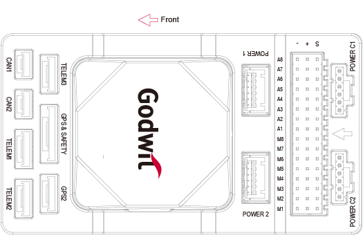
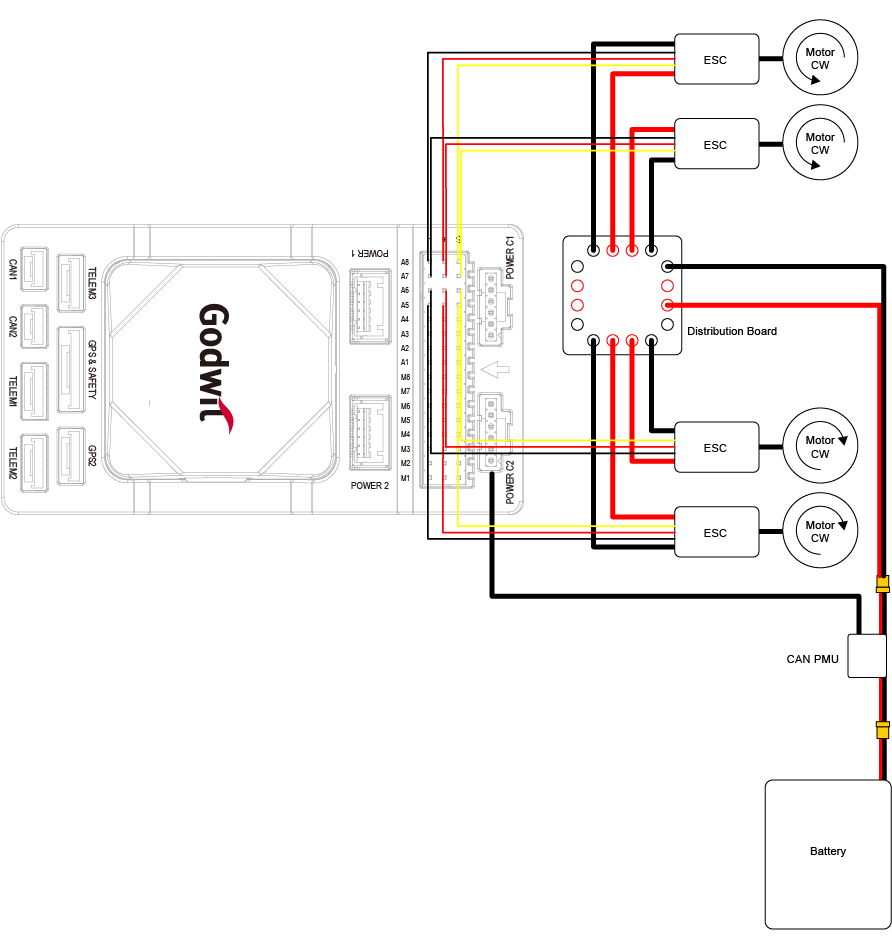
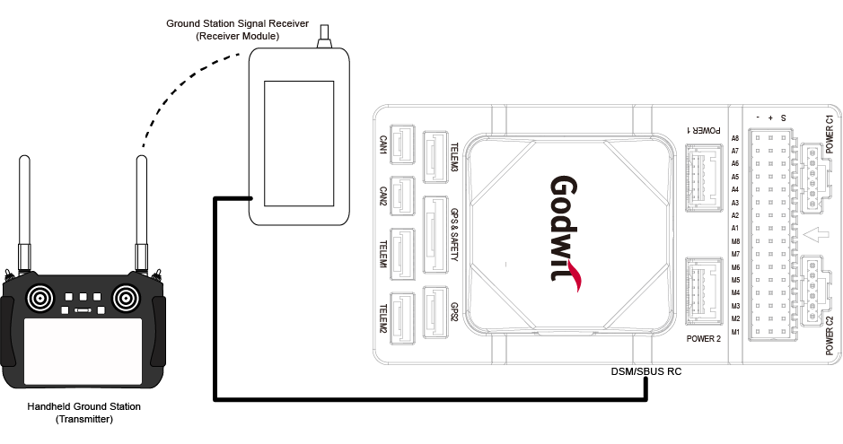
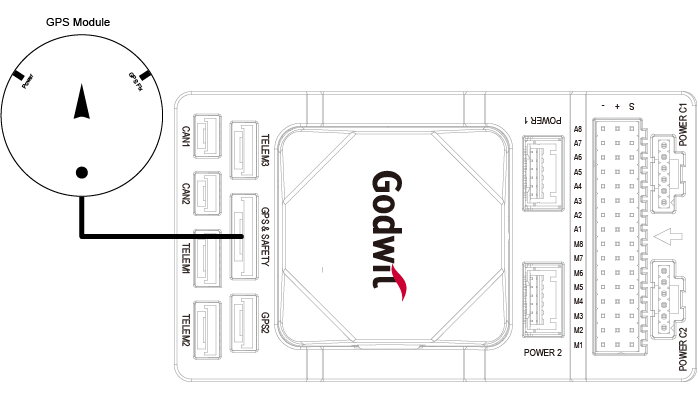

.. _common-accton-godwit-ga1-overview:

==================
Accton Godwit G-A1
==================

The G-A1 is a state-of-the-art universal controller (flight controller) developed based on the 
`Pixhawk Autopilot v6X Standard <https://github.com/pixhawk/Pixhawk-Standards/blob/master/DS-012%20Pixhawk%20Autopilot%20v6X%20Standard.pdf>`__.
It adopts an STM32H753 double-precision floating-point FMU processor and an STM32F103 IO coprocessor. 
There are also independent buses and power supplies. Multiple IMUs with its 6-axis inertial sensors, 
two pressure/temperature sensors, and a geomagnetic sensor are designed for safety and rich expansion capabilities. 
With an integrated 10/100M Ethernet Physical Layer (PHY), the G-A1 can also communicate with the mission computer 
(airborne computer), high-end surveying and mapping cameras, and other UxV-mounted equipment for high-speed communications, 
meeting the needs of advanced UxV systems.

Visit `Accton-IoT Godwit <https://www.accton-iot.com/godwit/index.html>`__ for more information

.. image:: ../../../images/accton/ga1/outlook.png

Specifications
==============

+---------------------+---------------------------------------------------------------------------------------+
| Item                | Description                                                                           |
+=====================+=======================================================================================+
| FMU Processor       | STM32H753IIK (Arm® Cortex®-M7 480MHz)                                                 |
+---------------------+---------------------------------------------------------------------------------------+
| IO Processor        | STM32F103 (Arm® Cortex®-M3, 72MHz)                                                    |
+---------------------+---------------------------------------------------------------------------------------+
| Memory              | 2 Mbytes of flash and 1 Mbytes RAM                                                    |
+---------------------+---------------------------------------------------------------------------------------+
| Sensors             | - Bosch BMI088 (vibration isolated)                                                   |
|                     | - TDK InvenSense ICM-42688-P x 2 (one vibration isolated)                             |
|                     | - TDK Barometric Pressure and Temperature Sensor CP-20100 x 2 (one vibration isolated)|
|                     | - PNI RM3100 Geomagnetic Sensor (vibration isolated)                                  |
+---------------------+---------------------------------------------------------------------------------------+
| Power               | 4.6V to 5.7V                                                                          |
+---------------------+---------------------------------------------------------------------------------------+
| External ports      | - 2 CAN Buses (CAN1 and CAN2)                                                         |
|                     | - 3 TELEM Ports (TELEM1, TELEM2, and TELEM3)                                          |
|                     | - 2 GPS Ports (GPS1 with safety switch, LED, buzzer, and GPS2)                        |
|                     | - 1 PPM IN                                                                            |
|                     | - 1 SBUS OUT                                                                          |
|                     | - 2 USB Ports (1 TYPE-C and 1 JST GH1.25)                                             |
|                     | - 1 10/100Base-T Ethernet Port                                                        |
|                     | - 1 DSM/SBUS RC                                                                       |
|                     | - 1 UART 4                                                                            |
|                     | - 1 AD&IO Port                                                                        |
|                     | - 2 Debug Ports (1 IO Debug and 1 FMU Debug)                                          |
|                     | - 1 SPI6 Bus                                                                          |
|                     | - 4 Power Inputs (Power 1, Power 2, Power C1 and Power C2)                            |
|                     | - 16 PWM Servo Outputs (A1-A8 from FMU and M1-M8 from IO)                             |
|                     | - Micro SD Socket (supports SD 4.1 & SDIO 4.0 in two databus modes: 1 bit (default)   |
|                     |   and 4 bits)                                                                         |
+---------------------+---------------------------------------------------------------------------------------+
| MicroSD Card        | Not included in the package                                                           |
+---------------------+---------------------------------------------------------------------------------------+
| Current Ratings     | - TELEM1 and GPS2 output current: 1.5A (max)                                          |
|                     | - All other port combined output current: 1.5A (max)                                  |
+---------------------+---------------------------------------------------------------------------------------+
| Operating           | -40°C to +55 °C                                                                       |
| Temperature         |                                                                                       |
+---------------------+---------------------------------------------------------------------------------------+
| Storage             | -40°C to +70 °C                                                                       |
| Temperature         |                                                                                       |
+---------------------+---------------------------------------------------------------------------------------+
| Operating           | 5% to 95% (Non-condensing)                                                            |
| Humidity            |                                                                                       |
+---------------------+---------------------------------------------------------------------------------------+
| Casing Material     | ABS (carrier board), Zinc Alloy (IMU cover)                                           |
+---------------------+---------------------------------------------------------------------------------------+
| Dimensions          | 92.2 (L) x 51.2 (W) x 28.3 (H) mm                                                     |
+---------------------+---------------------------------------------------------------------------------------+
| Weight              | 77.6g (carrier board with IMU)                                                        |
+---------------------+---------------------------------------------------------------------------------------+

Where to Buy
============

You can purchase the Godwit G-A1 from `Accton-IoT Godwit <https://www.accton-iot.com/godwit/index.html>`__ 
or the sales email `sales@accton-iot.com <sales@accton-iot.com>`__

Connectors and Pin Definition
=====================

The table below shows G-A1 and the connections to its peripherals.

+----------------------+------------------------------------------------------------------------------------+
| Interface            | Function                                                                           |
+======================+====================================================================================+
| POWER C1             | Connect CAN PMU to POWER C1, it is connected to the UAVCAN power module            |
+----------------------+------------------------------------------------------------------------------------+
| POWER C2             | Connect CAN PMU to POWER C2, it is connected to the UAVCAN power module            |
+----------------------+------------------------------------------------------------------------------------+
| POWER 1              | Connect to a SMbus (I2C) power module                                              |
+----------------------+------------------------------------------------------------------------------------+
| POWER 2              | Connect to a SMbus (I2C) power module                                              |
+----------------------+------------------------------------------------------------------------------------+
| GPS&SAFETY           | Connect to a GPS module, which includes GPS, safety switch, and a buzzer interface |
+----------------------+------------------------------------------------------------------------------------+
| GPS2                 | Connect to a GPS/RTK module                                                        |
+----------------------+------------------------------------------------------------------------------------+
| UART 4               | Supports user customization                                                        |
+----------------------+------------------------------------------------------------------------------------+
| TELEM1/TELEM2/TELEM3 | Connect to telemetry or mavlink devices                                            |
+----------------------+------------------------------------------------------------------------------------+
| MicroSD CARD         | Insert a MicroSD card for log storage                                              |
+----------------------+------------------------------------------------------------------------------------+
| A1-A8                | Can be defined as PWM/GPIO. Supports Bdshot, used to connect a camera shutter/hot  |
|                      | shoe, servo, etc.                                                                  |
+----------------------+------------------------------------------------------------------------------------+
| M1-M8                | PWM output from IO, connect to ESC and Servo                                       |
+----------------------+------------------------------------------------------------------------------------+
| USB                  | Connect to a computer for communication between the universal controller and the   |
|                      | computer, such as loading firmware                                                 |
+----------------------+------------------------------------------------------------------------------------+
| CAN1/CAN2            | Connect to Dronecan/UAVCAN devices                                                 |
+----------------------+------------------------------------------------------------------------------------+
| DSM/SBUS/RSSI        | This is a DSM/SBUS/RSSI signal input interface. It can be connected to DSM         |
|                      | satellite receiver, SBUS remote control receiver or RSSI signal strength           |
|                      | return module.                                                                     |
+----------------------+------------------------------------------------------------------------------------+
| PPM IN               | Connect to a PPM RC receiver                                                       |
+----------------------+------------------------------------------------------------------------------------+
| ETH                  | Connect to Ethernet devices                                                        |
+----------------------+------------------------------------------------------------------------------------+
| AD&IO                | Connect to an analog input (ADC3.3 or ADC6.6), usually not used.                   |
+----------------------+------------------------------------------------------------------------------------+
| FMU Debug            | For use by professionals and developers.                                           |
+----------------------+------------------------------------------------------------------------------------+
| IO Debug             | For use by professionals and developers.                                           |
+----------------------+------------------------------------------------------------------------------------+

Serial Port Mapping
===================

+---------+-----------+--------+--------------+
| Serial# | Protocol  | Port   | Notes        |
+=========+===========+========+==============+
| SERIAL1 | Telem1    | UART7  | CTS/RTS, DMA |
+---------+-----------+--------+--------------+
| SERIAL2 | Telem2    | UART5  | CTS/RTS, DMA |
+---------+-----------+--------+--------------+
| SERIAL3 | GPS1      | USART1 | DMA          |
+---------+-----------+--------+--------------+
| SERIAL4 | GPS2      | UART8  | DMA          |
+---------+-----------+--------+--------------+
| SERIAL5 | Telem3    | USART2 | CTS/RTS, DMA |
+---------+-----------+--------+--------------+
| SERIAL6 | UART4     | UART4  | No DMA       |
+---------+-----------+--------+--------------+
| SERIAL7 | FMU Debug | USART3 | No DMA       |
+---------+-----------+--------+--------------+
| SERIAL8 | OTG2      | USB    | DMA          |
+---------+-----------+--------+--------------+

Power Consumption
=================

+-------------------------------+---------+---------+---------+
|                               | Min     | Typical | Max     |
+===============================+=========+=========+=========+
| Voltage                       | 4.6V    | 5V      | 5.4V    |
+-------------------------------+---------+---------+---------+
| Current (Godwit + Components) | N/A     | 3.0A    | 3.44A   |
+-------------------------------+---------+---------+---------+
| Current (Godwit Only)         | N/A     | 0.44A   | 0.58A   |
+-------------------------------+---------+---------+---------+

Wiring Diagram
==============

**Note:**
If the controller cannot be mounted in the recommended/default 
orientation (e.g. due to space constraints), you will need to 
configure the autopilot software with the orientation that you 
actually used.

PWM Output
==========

PWM M1-M8 (IO Main PWM), A1-A8(FMU PWM). All these 16 support normal PWM output formats. 
FMU PWM A1-A6 can support DShot and B-Directional DShot. A1-A8(FMU PWM) are grouped as:

 - Group 1: A1, A2, A3, A4
 - Group 2: A5, A6
 - Group 3: A7, A8

The motor and servo system should be connected to these ports according to the order 
outlined in the fuselage reference for your carrier.

GPIO
====

All 8 IO and 8 FMU PWM outputs can be used as GPIOs (relays, buttons, RPM etc). 
To use them you need to set the servo output function to "GPIO". The mapping of PIN numbers are:

 - M1 101
 - M2 102
 - M3 103
 - M4 104
 - M5 105
 - M6 106
 - M7 107
 - M8 108
 - A1 50
 - A2 51
 - A3 52
 - A4 53
 - A5 54
 - A6 55
 - A7 56
 - A8 57

RC Input
========

Connect the handheld remote control to monitor and control drones in flight. 
The airborne end of the radio system should be connected to the TELEM1/TELEM2/TELEM3 interface.

For DSM/SBUS receivers, connect them to the DSM/SBUS interface which provides 
dedicated 3.3V and 5V power pins respectively, and check above "Pinout" for 
detailed pin definition. PPM receivers should be connected to the PPM interface. 
For other protocols a UART is required to be used, refer to the 
`Ardupilot Radio Control System documentation <https://ardupilot.org/copter/docs/common-rc-systems.html#common-rc-systems>`__ for details.

GPS/Compass
===========

The Godwit G-A1 has a built-in compass. Due to potential interference, the autopilot 
is usually used with an external I2C compass as part of a GPS/Compass combination.

Power Connection and Battery Monitor
====================================

This universal controller features a CAN PMU module that supports 3 to 14s lithium batteries. 
To ensure proper connection, attach the module’s 6-pin connector to the flight control 
Power C1 and/or Power C2 interface.

When running Ardupilot, the universal controller operates as a plug-and-play device, 
requiring no further configuration.

This universal controller does not provide power to the servos. To power them, 
an external BEC must be connected to the positive and negative terminals of any A1–A8 or M1–M8 port.

.. image:: ../../../images/accton/ga1/power.png

The autopilot defaults are setup to DroneCAN BatteryInfo:

 - BATT_MONITOR = 8
 - CAN_P1_DRIVER = 1
 - CAN_P2_DRIVER = 1
 - CAN_D1_PROTOCOL = 1
 - CAN_D2_PROTOCOL = 1

MicroSD Card
============

The MicroSD card is NOT included in the package, you need to prepare the MicroSD card and insert it into the slot.

.. image:: ../../../images/accton/ga1/sdcard.png

Firmware
========

The autopilot is shipped with ArduPilot firmware.  

To upgrade firmware use any ArduPilot GCS.  Firmware for the Godwit G-A1 is located in folders labeled "**AcctonGodwit_GA1**" 
in `Ardupilot firmware server <https://firmware.ardupilot.org/>`__

More Information and Support
============================

Please visit `Accton-IoT Godwit <https://www.accton-iot.com/godwit/index.html>`__
for more information

- Sales Inquiry: `sales@accton-iot.com <sales@accton-iot.com>`__
- Technical support: `support@accton-iot.com <support@accton-iot.com>`__
