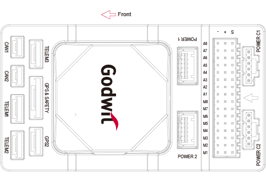
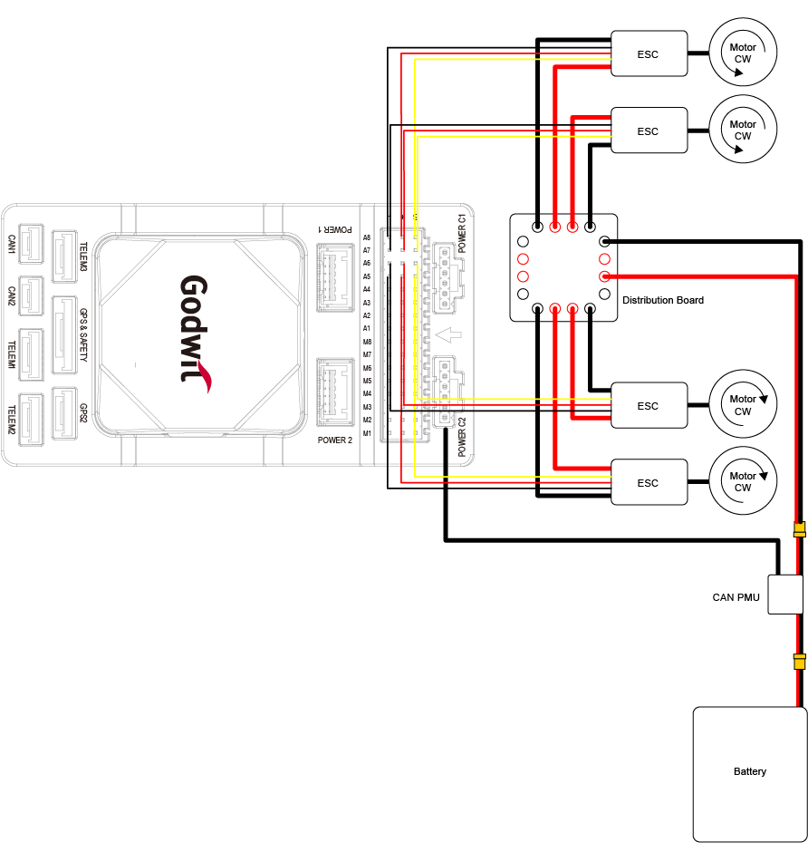
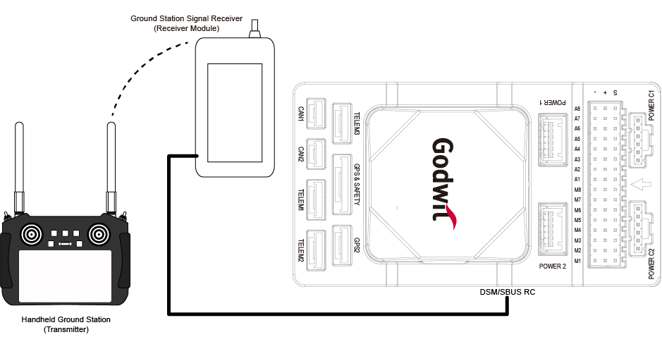
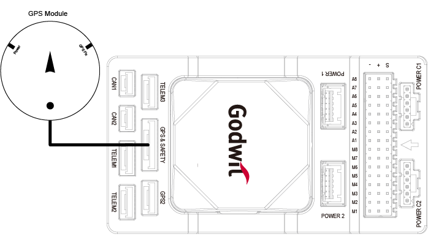
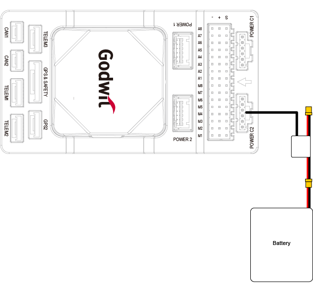
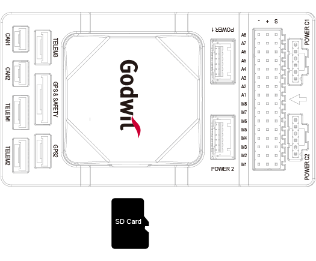

.. _common-acctongodwit-ga1:

[copywiki destination="plane,copter,rover,blimp,sub"]
==================
Accton Godwit G-A1
==================

The G-A1 is a state-of-the-art autopilot (flight controller) developed based on the `Pixhawk Autopilot v6X Standard <https://github.com/pixhawk/Pixhawk-Standards/blob/master/DS-012%20Pixhawk%20Autopilot%20v6X%20Standard.pdf>`_. It adopts an STM32H753 double-precision floating-point FMU processor and an STM32F103 IO coprocessor. There are also independent buses and power supplies. Multiple IMUs with its 6-axis inertial sensors, two pressure/temperature sensors, and a geomagnetic sensor are designed for safety and rich expansion capabilities. With an integrated 10/100M Ethernet Physical Layer (PHY), the G-A1 can also communicate with the mission computer (airborne computer), high-end surveying and mapping cameras, and other UxV-mounted equipment for high-speed communications, meeting the needs of advanced UxV systems.

Visit `Accton-IoT Godwit <https://www.accton-iot.com/godwit/>`_ for more information.

.. image:: ../../../images/acctongodwitga1-../../../images/acctongodwitga1-outlook.png
   :target: ../_images/acctongodwitga1-outlook.png

Specifications
==============
**Processor**
^^^^^^^^^^^^^
* STM32H753IIK (Arm Cortex-M7 480MHz)
* STM32F103 (Arm Cortex-M3, 72MHz)

**Sensors**
^^^^^^^^^^^
* Bosch BMI088 (vibration isolated)
* TDK InvenSense ICM-42688-P x 2 (one vibration isolated)
* TDK Barometric Pressure and Temperature Sensor CP-20100 x 2 (one vibration isolated)
* PNI RM3100 Geomagnetic Sensor (vibration isolated)

**Power**
^^^^^^^^^
* 4.6V to 5.7V, 0.58A max (autopilot alone)

**External ports**
^^^^^^^^^^^^^^^^^^
* 2 CAN Buses (CAN1 and CAN2)
* 3 TELEM Ports (TELEM1, TELEM2 and TELEM3)
* 2 GPS Ports (GPS1 with safety switch, LED, buzzer, and GPS2)
* 1 PPM IN
* 1 SBUS OUT
* 2 USB Ports (1 TYPE-C and 1 JST GH1.25)
* 1 10/100Base-T Ethernet Port
* 1 DSM/SBUS RC
* 1 UART 4
* 1 AD&IO Port
* 2 Debug Ports (1 IO Debug and 1 FMU Debug)
* 1 SPI6 Bus
* 4 Power Inputs (Power 1, Power 2, Power C1 and Power C2)
* 16 PWM Servo Outputs (A1-A8 from FMU and M1-M8 from IO)
* Micro SD Socket (supports SD 4.1 & SDIO 4.0 in two databus modes: 1 bit (default) and 4 bits)

**Size and Dimensions**
^^^^^^^^^^^^^^^^^^^^^^^
* 92.2 (L) x 51.2 (W) x 28.3 (H) mm
* 77.6g (carrier board with IMU)

Where to Buy
============
* `Accton-IoT Godwit <https://www.accton-iot.com/godwit/>`_
* `sales@accton-iot.com <sales@accton-iot.com>`_

Pinout
======
.. image:: ../../../images/acctongodwitga1-pin_definition.png
   :target: ../_images/acctongodwitga1-pin_definition.png

UART Mapping
============
.. list-table::
   :header-rows: 1

   * - Serial#
     - Protocol
     - Port
     - Notes
   * - SERIAL1
     - Telem1
     - UART7
     - CTS/RTS, DMA
   * - SERIAL2
     - Telem2
     - UART5
     - CTS/RTS, DMA
   * - SERIAL3
     - GPS1
     - USART1
     - DMA
   * - SERIAL4
     - GPS2
     - UART8
     - DMA
   * - SERIAL5
     - Telem3
     - USART2
     - CTS/RTS, DMA
   * - SERIAL6
     - UART4
     - UART4
     - No DMA
   * - SERIAL7
     - FMU Debug
     - USART3
     - No DMA
   * - SERIAL8
     - OTG2
     - USB
     - DMA

Wiring Diagram
==============
.. image:: ../../../images/acctongodwitga1-wiring.png
   :target: ../_images/acctongodwitga1-wiring.png

PWM Output
==========
PWM M1-M8 (IO Main PWM), A1-A8(FMU PWM). All these 16 support normal PWM output formats. FMU PWM A1-A6 can support DShot and B-Directional DShot. A1-A8(FMU PWM) are grouped as:

* Group 1: A1, A2, A3, A4
* Group 2: A5, A6
* Group 3: A7, A8

The motor and servo system should be connected to these ports according to the order outlined in the fuselage reference for your carrier.

GPIOs
=====
All 8 IO and 8 FMU PWM outputs can be used as GPIOs (relays, buttons, RPM etc). To use them you need to set the servo output function to "GPIO". The mapping of PIN numbers are:

* M1 101
* M2 102
* M3 103
* M4 104
* M5 105
* M6 106
* M7 107
* M8 108
* A1 50
* A2 51
* A3 52
* A4 53
* A5 54
* A6 55
* A7 56
* A8 57
* FMU_CAP1 58
* NFC_GPIO       60

RC Input
========
RC can be connected to the PPM input. All unidirectional RC protocols are supported.

For DSM/SBUS receivers, connect them to the DSM/SBUS interface which provides dedicated 3.3V and 5V power pins respectively, and check above "Pinout" for detailed pin definition. 

For bi-directional protocols a UART whose ``SERIALx_PROTOCOL`` is set to "23" is required to be used and connection to the UART's TX pin, refer to the :ref:`ArduPilot Radio Control System documentation <common-rc-systems>` for details.

GPS/Compass
===========
The Godwit G-A1 has a built-in compass. Due to potential interference, the autopilot is usually used with an external I2C compass as part of a GPS/Compass combination.

Power Connection and Battery Monitor
====================================
This autopilot features a CAN PMU module that supports 3 to 14s lithium batteries. To ensure proper connection, attach the module's 6-pin connector to the flight control Power C1 or Power C2 interface. Two additional power module connectors are also supplied if connection to an I2C based module is desired.

This autopilot does not provide power to the servos. To power them, an external BEC must be connected to the positive and negative terminals of any A1-A8 or M1-M8 port.

The autopilot defaults are setup to DroneCAN BatteryInfo:

- :ref:`BATT_MONITOR<BATT_MONITOR>` = 8
- :ref:`CAN_P1_DRIVER<CAN_P1_DRIVER>` = 1
- :ref:`CAN_P2_DRIVER<CAN_P2_DRIVER>` = 1
- :ref:`CAN_D1_PROTOCOL<CAN_D1_PROTOCOL>` = 1
- :ref:`CAN_D2_PROTOCOL<CAN_D2_PROTOCOL>` = 1

SD Card
=======
The SD card is NOT included in the package, you need to prepare the SD card and insert it into the slot.

Firmware
========
The autopilot is shipped with ArduPilot firmware. To upgrade firmware use any ArduPilot GCS.  Firmware for the Godwit G-A1 is located in folders labeled "AcctonGodwit_GA1" on the `ArduPilot firmware server <https://firmware.ardupilot.org/>`_

More Information and Support
============================
* `Accton-IoT Godwit <https://www.accton-iot.com/godwit/>`_
* `sales@accton-iot.com <sales@accton-iot.com>`_
* `support@accton-iot.com <support@accton-iot.com>`_
