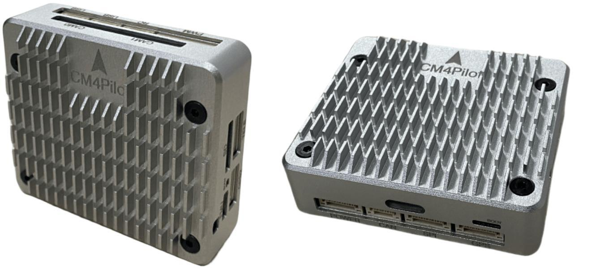
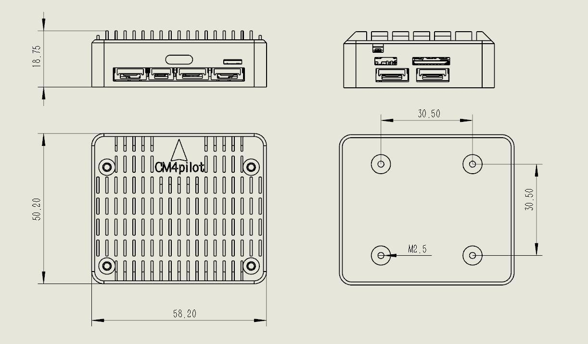
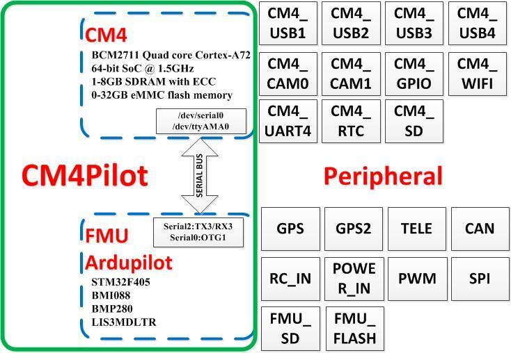
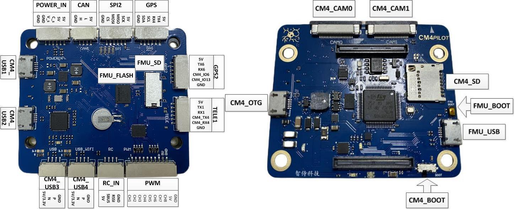

.. _common-acns-cm4pilot:

=============
ACNS-CM4Pilot
=============

The ACNS-CM4Pilot is a low-cost and compact flight controller which integrates a Raspberry Pi CM4 onboard as its :ref:`Companion computer <companion-computers>`.

Specifications
==============

-  **Processor**

   -  STM32F405 ARM (168MHz)
   -  Broadcom BCM2711, quad-core Cortex-A72 (ARM v8) 64-bit SoC @ 1.5GHz (Raspberry Pi CM4)

-  **Sensors**

   -  BMI088 IMU (accel, gyro)
   -  BMP280 barometer
   -  LIS3MDLTR magnetometer

-  **Interfaces (Autopilot)**

   -  8x PWM outputs DShot capable
   -  1 CAN
   -  1x RC input
   -  5x UARTs/serial for GPS and other peripherals, one normally used for RC input, one for CM4 connection
   -  I2C port for external compass, airspeed, etc.
   -  Power module input
   -  microSDCard for logging, etc.
   -  USB-C port
   -  Analog RSSI/Airspeed input
   -  DFU boot button

-  **Interfaces (CM4)**

   -  4 USB, 1 OTG USB-C ports
   -  microSDCard
   -  2x GPIO
   -  UART
   -  2x Camera Interfaces

-  **Size and Dimensions**

Where to Buy
============
???

Block Diagram
=============

Pinouts
=======

Default UART order
==================

The UARTs are marked RXn and TXn in the above pinouts. The RXn pin is the
receive pin for UARTn. The TXn pin is the transmit pin for UARTn.

 - SERIAL0 -> USB(OTG1)
 - SERIAL1 -> USART1(Telem1)(DMA capable)
 - SERIAL2 -> USART3 (CM4)(DMA capable)
 - SERIAL3 -> UART4 (GPS)(DMA capable)
 - SERIAL4 -> UART6 (GPS2)(DMA capable)
 - SERIAL5 -> USART2 (SBUS)(RC input, not DMA capable)(RX2 can be re-configured as a normal UART input using :ref:`BRD_ALT_CONFIG<BRD_ALT_CONFIG>` = 1

Serial protocols shown are defaults, but can be adjusted to personal preferences.

Servo/Motor Outputs
===================

All motor/servo outputs are Dshot and PWM capable. However, mixing Dshot, serial LED, and normal PWM operation for outputs is restricted into groups, ie. enabling Dshot for an output in a group requires that ALL outputs in that group be configured and used as Dshot, rather than PWM outputs.

 - PWM 1-2 in group1
 - PWM 5,6 in group2
 - PWM 7,8 in group3
 - PWM 8-10 in group4

RC Input
========

The SBUS pin can be used for all ArduPilot supported receiver protocols, except CRSF/ELRS and SRXL2 which require a true UART connection. However, FPort, when connected in this manner, can provide RC without telemetry. 

To allow CRSF and embedded telemetry available in Fport, CRSF, and SRXL2 receivers a UART must be configured and used (USART1 , UART4, or UART6) and their ``SERAILx_PROTOCOL`` set to "23".
 
With this option:

- PPM is not supported. SBUS requires an inverter.

- FPort requires connection to TX2 and RX2 via a bi-directional inverter. See :ref:`common-FPort-receivers`.

- SRXL2 requires :ref:`SERIAL2_OPTIONS<SERIAL2_OPTIONS>` to "4".

Battery Monitor Configuration
=============================
These settings are set as defaults when the firmware is loaded for a typical external analog power monitor. You will need to adjust :ref:`BATT_VOLT_MULT<BATT_VOLT_MULT>` and  :ref:`BATT_AMP_PERVLT<BATT_AMP_PERVLT>` 17 for whichever monitor is used.

Enable Battery monitor.

:ref:`BATT_MONITOR<BATT_MONITOR>` =4

Then reboot.

:ref:`BATT_VOLT_PIN<BATT_VOLT_PIN>` 11

:ref:`BATT_CURR_PIN<BATT_CURR_PIN>` 12

:ref:`BATT_VOLT_MULT<BATT_VOLT_MULT>` 10.1

:ref:`BATT_AMP_PERVLT<BATT_AMP_PERVLT>` 17

Buzzer
======

An internal buzzer to play ArduPilot musical notification tones is provided on board. 

.. warning:: sometimes it is possible that integrated tone alarms will inject noise into the on board IMUs. Users may want to set :ref:`NTF_BUZZ_TYPES<NTF_BUZZ_TYPES>` to disable the built in buzzer to assure this does not occur inflight.

Firmware
========
This board does not come with ArduPilot firmware pre-installed. Use instructions here to load ArduPilot the first time :ref:`common-loading-firmware-onto-chibios-only-boards`.

Firmware for this board can be found `here <https://firmware.ardupilot.org>`_ in  sub-folders labeled
"ACNS-CM4Pilot".

[copywiki destination="plane,copter,rover,blimp"]

