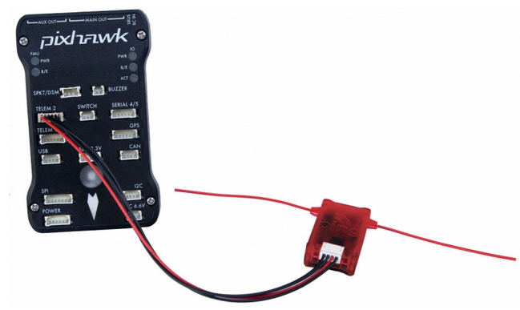
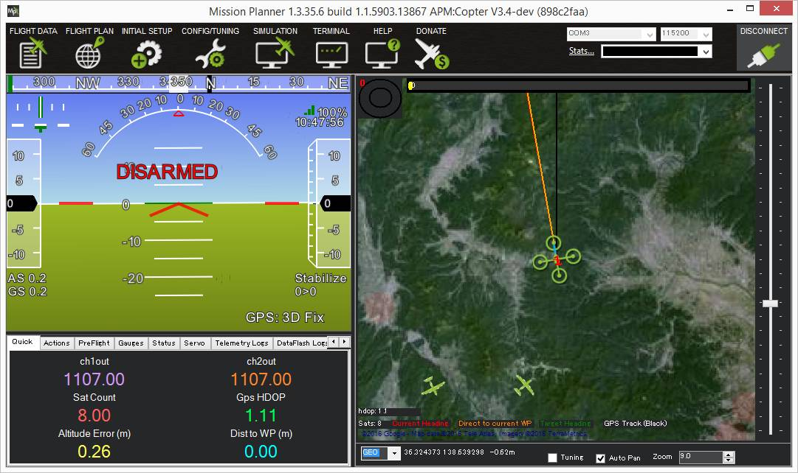

.. _common-ads-b-receiver:

[copywiki destination="copter,plane"]

==============
ADS-B Receiver
==============

This article describes how to attach and configure the MAVLink enabled `uAvionix ADS-B PING™ <http://www.uavionix.com/products/pingrx/>`__ sensor so that the pilot is aware of nearby manned aircraft and optionally to allow the vehicle to automatically avoid near misses.

   ..  youtube:: boe-25OI4bM
    :width: 100%

ADS-B (aka `Automatic Dependent Surveillance Broadcast <https://en.wikipedia.org/wiki/Automatic_dependent_surveillance_%E2%80%93_broadcast>`__) is an air traffic surveillance technology that enables aircraft to be accurately tracked by air traffic controllers and other pilots without the need for conventional radar.

.. note::

   uAvionix ADS-B Ping support was introduced in Plane-3.5 and Copter-3.4. Simple avoidance was added to Plane-3.5 and a more advanced avoidance was added to Plane-3.7 and Copter-3.4.

.. warning::

   The avoidance features are new features still under development and should be used with caution.

Required Hardware
=================

The uAvionix Ping sensor can be purchased directly from `uAvionix <http://www.uavionix.com/products/>`__ or from the following vendors:

   -  USA: `Unmanned Systems Source <https://www.unmannedsystemssource.com/shop/atc-devices/pingrx-ads-b-receiver/>`__
   -       `R Cubed Engineering <http://www.rcubedengineering.com/ecommerce/>`__
   -  U.K.: `Unmanned Tech <http://www.unmannedtech.co.uk/>`__
   -  Germany: `UAV Store <http://www.uav-store.de/ads-b-receivers/>`__
   -  Asia: `jDrones pingRX <http://store.jdrones.com/ping_ads_b_receiver_p/adsbping01.htm>`__
   -  Japan: `Japan Drones <http://japandrones.com/shopdetail/000000000124/004/X/page1/order/>`__

The full reseller list can be found at `uAvionix <http://www.uavionix.com/resellers/>`__

Connecting to the flight controller
===================================

The ADSB receiver comes with a DF13 serial cable that can be plugged
directly into a Pixhawk serial port.
The Ping sensor should be mounted so that the antenna is oriented
vertically.

Setup through the ground station
================================

Set the :ref:`ADSB_ENABLE <ADSB_ENABLE>` parameter to "1" to enable receiving data from the ADSB sensor

If you are using one of the UARTs on your board which defaults to MAVLink (i.e. Telem1, Telem2 on a Pixhawk) then the default settings will work fine for the PingRx. Alternatively you
can connect the Ping to one of the other UARTs, such as the GPS UART (if it is unused) or the serial4/5 UART. In that case you will need to configure the UART as MAVLink at a baudrate of 57600.

For example, if you plugged the Ping into "serial4/5" on a
Pixhawk you would set:

-  :ref:`SERIAL4_PROTOCOL <SERIAL4_PROTOCOL>` to 1 (meaning MAVLink)
-  :ref:`SERIAL4_BAUD <SERIAL4_BAUD>` 57 (meaning 57600)

For the Ping2020 you'll need to set the _PROTOCOL value to 2. For example, when connected to Telem2 you would set:

-  :ref:`SERIAL2_PROTOCOL <SERIAL4_PROTOCOL>` to 2 (meaning MAVLink v2.0)

You will need to reboot your board after making those changes.

To enable streaming the ADSB data to the GCS you'll want to check your StreamRate param. In some cases it is already set but it's good to check. These rates are adjustable per telemetry like in the case of having both a high-bandwidth and a low-bandwitdh link attached. The param to adjust the rate would depend on which one your GCS is connected to. In most cases, it is telem1.

-  :ref:`SR1_ADSB <SR1_ADSB>` 5 (meaning 5Hz)

Once operational aircraft within about 50km should appear on the ground
station map.

To test the system you can compare with flights shown on
`flightradar24.com <https://www.flightradar24.com/>`__.

Enabling Manned Vehicle Avoidance
=================================

Copter-3.4 (and higher) and very recent versions of Plane include a new flight mode AVOID_ADSB that attempts to avoid manned vehicles based on the ADS-B sensor's output.
To enable this feature connect with a Ground Station and set the following parameters:

-  :ref:`AVD_ENABLE <AVD_ENABLE>` : set to "1" to enable ADS-B based avoidance (param refresh may be necessary after setting this)
-  :ref:`AVD_F_DIST_XY <AVD_F_DIST_XY>` : the horizontal distance in meters that should be considered a near-miss
-  :ref:`AVD_F_DIST_Z <AVD_F_DIST_Z>` : the vertical distance in meters above or below the vehicle that should be considered a near-miss
-  :ref:`AVD_F_TIME <AVD_F_TIME>` : how many seconds in advance of a projected near-miss (based on the vehicle's current position and velocity) the vehicle should begin the :ref:`AVD_F_ACTION <AVD_F_ACTION>`
-  :ref:`AVD_F_ACTION <AVD_F_ACTION>` : controls how the vehicle should respond to a projected near-miss (i.e. 2:Climb Or Descend, 3:Move Horizontally, 4:Move Perpendicularly in 3D, 5:RTL or 6:Hover)
-  :ref:`AVD_F_RCVRY <AVD_F_RCVRY>` : sets how the vehicle will behave after the vehicle has cleared the near-miss area (i.e. 1 = resume previous flight mode)

Note: there are equivalent "Warn" parameters (i.e. AVD_W_DIST_XY) that can be used to adjust when warnings to the pilot will appear on the ground station.

.. warning::

   The avoidance features are still under development and should be used with caution.  They may not yet be useful for real-life manned vehicle avoidance.

   ..  youtube:: quomxCIPP74
    :width: 100%
   
Older version of ADS-B based avoidance in Plane-3.5
===================================================

Plane's earlier version of ADS-B based avoidance used these different parameters:

-  ADSB_BEHAVIOR=0, NONE. Objects are detected and the GCS is notified but no action is taken.
-  ADSB_BEHAVIOR=1, LOITER. If another vehicle is nearby, switch from AUTO to LOITER mode. When the vehicle leaves, switch back to AUTO and resume.
-  ADSB_BEHAVIOR=2, LOITER_AND_DESCEND. Same as (1) but decrease the altitude 1 m/s. If the other vehicle location persists, you will eventually loiter into the ground.

The older behavior was to check the detected vehicle list once per second
and determine if any other aircraft were within 200m. The altitude was
ignored. At that point, a behavior is performed in an effort to avoid
it. The behavior persists until no vehicles are within 400m.

Vehicle Database
================

When enabled, the ADS-B library will store information for up to 50 vehicles
detected by the ADS-B receiver but can be further limited using the
:ref:`ADSB_LIST_SIZE <ADSB_LIST_SIZE>` parameter. Due to some experimental work
in other features, such as EKF2, available RAM may be limited. It is
important to note that when ADS-B is disabled (ADSB_ENABLE=0) then the
memory is released, effectively freeing up about 1KB of RAM. When
enabled, the detected vehicle list is checked once per second for
potential conflicts.

Developer information including Simulation
==========================================
The data is transmitted via the `ADSB_VEHICLE message <http://mavlink.org/messages/common#ADSB_VEHICLE>`__. When
received by ArduPilot, it is streamed out using the SRx_ADSB value where x is the telemetry port number and the
value is how many vehicles per second to be streamed. If using telem1 the streamrate param would be ``SR1_ADSB``. The list will not repeat any faster than 1 second. This
flexibility is useful to conserve bandwidth on data links but also allow maximum update rate for high-speed links
such as an on-board companion computer.

Ardupilot's SITL includes the simulation of ADS-B enabled aircraft.
To enable this you must have pymavlink v1.1.70 or greater. If you have
an older version, use:

::

    sudo pip install --upgrade pymavlink MAVProxy

Set the number of aircraft to simulate using the ``SIM_ADSB_COUNT`` parameter. Ping2020 simulation support
can be enabled by setting parameter ``SIM_ADSB_TX``. Other simulation options for ADS-B are present, all
starting with ``SIM_ADSB_``.

Plugging in a hardware ADS-B receiver to your computer using a USB-to-Serial converter, or using the PingUSB, will allow you to overlay real ADS-B
traffic into the simulation.  You might invoke SITL in this way to achieve this effect:

::

   sim_vehicle.py -v ArduCopter -A "--uartC uart:$SERIAL_DEVICE:57600"

Where SERIAL_DEVICE might be /dev/serial/by-id/usb-FTDI_FT232R_USB_UART_A4008ZND-if00-port0 on a Linux system (find a list of valid serial devices with the command ``ls /dev/serial/by-id/*`` or ``ls /dev/ttyS*`` for a COM port on Cygwin).  Once SITL has started it may be necessary to set the ``SERIAL3_`` parameters:

::

   SERIAL3_PROTOCOL 1
   SERIAL3_BAUD 57600

