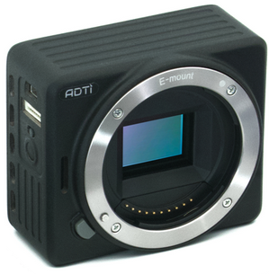

.. _common-adti-cameras-and-gimbals:

[copywiki destination="plane,copter,rover"]

========================
ADTi Cameras and Gimbals
========================

The `ADTi <https://www.adti.camera/>`__ manufactures and sells a `range of high resolution cameras <https://www.adti.camera/adti-products>`__ which are most often paired with :ref:`Gremsy gimbals <common-gremsy-pixyu-gimbal>`

Where to Buy
------------

These gimbals can be purchased directly from `ADTi <https://www.adti.camera/contact>`__

Connecting to the Autopilot
---------------------------

Connect the camera's SHUTTER pin to one of the autopilot's PWM outputs (e.g. AUXOUT 5).  Below is the wiring for a ADTi 24sv3 but the port location may be different for each camera type.
Please open the `ADTi support site <https://www.adti.camera/support>`__, select your camera type and refer to the "Camera Engineer Drawings" to find the SHUTTER pin location for your camera

.. image:: ../../../images/adti-autopilot-wiring.png
    :target: ../_images/adti-autopilot-wiring.png
    :width: 450px

To control the camera shutter using PWM set the following parameters.  These parameters assume the autopilot's AUXOUT 5 is connected to the camera's shutter trigger

- :ref:`CAM1_TYPE <CAM1_TYPE>` = 1 (Servo)
- :ref:`CAM1_DURATION <CAM1_DURATION>` = 0.4 seconds
- :ref:`CAM1_SERVO_OFF <CAM1_SERVO_OFF>` = 1250
- :ref:`CAM1_SERVO_ON <CAM1_SERVO_ON>` = 1850
- :ref:`SERVO13_FUNCTION <SERVO13_FUNCTION>` = 10 (CameraTrigger)

To control the camera shutter using a :ref:`Relay <common-relay>` set the following parameters.  These parameters assume the autopilot's AUXOUT 5 is connected to the camera's shutter trigger

- :ref:`CAM1_TYPE <CAM1_TYPE>` = 2 (Relay)
- :ref:`CAM1_DURATION <CAM1_DURATION>` = 0.4 seconds
- :ref:`CAM1_RELAY_ON <CAM1_RELAY_ON>` = 0 (Low)
- :ref:`RELAY1_PIN <RELAY1_PIN>` = 54 (AUXOUT5)
- :ref:`SERVO13_FUNCTION <SERVO13_FUNCTION>` = -1 (GPIO)

Optionally the camera shutter can be triggered from a transmitter auxiliary switch.  The parameter below assumes the pilot wishes to use RC channel 9

- :ref:`RC9_OPTION <RC9_OPTION>` = 9 ("Camera Trigger") to take a picture

Configuring the Gimbal
----------------------

Please refer to the :ref:`Gremsy gimbal setup instructions <common-gremsy-pixyu-gimbal>` for details on how to configure the gimbal

Control and Testing
-------------------

See :ref:`Gimbal / Mount Controls <common-mount-targeting>` and :ref:`Camera Controls <common-camera-controls>`  for details on how to control the camera and gimbal using RC, GCS or Auto mode mission commands
