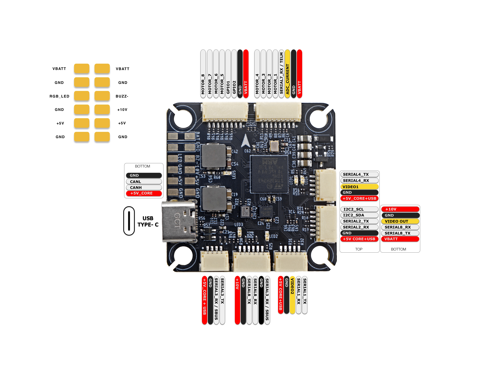

.. _aedroxh7:

[copywiki destination="plane,copter,rover,blimp,sub"]
=========
AEDROX H7
=========

The AEDROXH7 is an STM32H743-based FPV / racing flight controller from AEDROX.

For full hardware documentation and pinouts, see the `manufacturer documentation <https://aedrox.gitbook.io/docs>`__.

Where to Buy
============
`aedrox.com <https://www.aedrox.com>`__

Features
========
* STM32H743 microcontroller
* ICM42688-P IMU
* DPS368 barometer
* 10V 2.3A BEC, GPIO controlled; 5V 2.3A BEC
* 1Gbit Flash Memory for logging
* Dual camera inputs with built-in switch
* Analog (MAX7456) and HD OSD
* 6x UART
* 9x PWM
* 1x I2C
* 1x CAN
* 2x GPIOs
* Buzzer output

Physical
========
* Mounting: 30.5 x 30.5mm, 4mm
* Dimensions: 38 x 38 x 5 mm
* Weight: 8.5g

Pinout
======

UART Mapping
============
* SERIAL0 -> USB
* SERIAL1 -> UART1 (MAVLink2, DMA-enabled)
* SERIAL2 -> UART2 (GPS, DMA-enabled)
* SERIAL3 -> UART3 (RCIN, DMA-enabled)
* SERIAL4 -> UART4 (MAVLink2, DMA-enabled)
* SERIAL7 -> UART7 (ESC Telemetry, DMA-enabled)
* SERIAL8 -> UART8 (DisplayPort, DMA-enabled)

RC Input
========
The default RC input is configured on the UART3 (RX3/SBUS). Non SBUS,  single wire serial inputs can be directly tied to RX3 if SBUS pin is left unconnected. RC could  be applied instead at a different UART port such as UART4 or UART8, and set the protocol to receive RC data: ``SERIALn_PROTOCOL = 23`` and change :ref:`SERIAL3_PROTOCOL<SERIAL3_PROTOCOL>` to something other than '23'.

* PPM is not supported.
* SBUS/DSM/SRXL connects to the RX3 pin.
* FPort requires connection to TX3. Set :ref:`SERIAL3_OPTIONS<SERIAL3_OPTIONS>` = 7 
* CRSF/ELRS also requires both TX3 and RX3 connections and provides telemetry automatically.

OSD Support
===========
The onboard analog OSD using :ref:`OSD_TYPE<OSD_TYPE>` = 1 (MAX7456 driver) is enabled by default. Simultaneously, DisplayPort OSD is available on the HD VTX connector (SERIAL8) using :ref:`OSD_TYPE2<OSD_TYPE2>` = 5, which is also set by default.

VTX Support
===========
The SH1.0-6P connector supports a DJI Air Unit / HD VTX connection. Protocol defaults to DisplayPort. A second VTX connector is available for an analog VTX, and a digital VTX and an analog VTX can be used at the same time. Both connectors are wired to SERIAL8 (default protocol MSP DisplayPort), so set that UART's protocol for the device in use. The power pins on these connectors are 10V or VBATT, so be careful not to connect them to a peripheral requiring 5V.

VTX power control
=================
GPIO 83 controls the VTX BEC output to pins marked "10V" and is included on the HD VTX and analog VTX connectors. Setting this GPIO low removes voltage supply to this pin/pad. By default RELAY2 is configured to control this pin and sets the GPIO high at boot.

Camera Switch
=============
GPIO 84 selects which camera input is output to the analog VTX. Setting this GPIO high selects CAM1 and setting it low selects CAM2. By default RELAY3 is configured to control this pin and sets the GPIO low at boot.

PWM Output
==========
The autopilot supports up to 9 PWM (8 + LED) outputs. The pads for motor output
M1 to M8 are provided on both the motor connectors and on separate pads, plus
M9 on a separate pad for LED strip (default configuration) or another PWM output.

The PWM is in 4 groups:

* PWM 1-4 in group1
* PWM 5-8 in group2
* PWM 9 (serial LED by default, marked RGB_LED) in group3

Channels within the same group need to use the same output rate. If
any channel in a group uses DShot then all channels in the group need
to use DShot. Channels 1-8 support bi-directional dshot.

Battery Monitoring
==================
The board has a internal voltage sensor and connections on the ESC connector for an external current sensor input. The voltage sensor can handle up to 6S LiPo batteries.

The default battery parameters are:

* :ref:`BATT_MONITOR<BATT_MONITOR>` = 4
* :ref:`BATT_VOLT_PIN<BATT_VOLT_PIN__AP_BattMonitor_Analog>` = 10
* :ref:`BATT_CURR_PIN<BATT_CURR_PIN__AP_BattMonitor_Analog>` = 11 (CURR pin)
* :ref:`BATT_VOLT_MULT<BATT_VOLT_MULT__AP_BattMonitor_Analog>` = 11.0
* :ref:`BATT_AMP_PERVLT<BATT_AMP_PERVLT__AP_BattMonitor_Analog>` = 40

Compass
=======
The AEDROXH7 does not have a built-in compass, but you can attach an external compass using I2C on the SDA and SCL connector.

Additional GPIOs
================
The numbering of the two additional user GPIOs for PIN variables in ArduPilot parameters is:

* GPIO1 pin is ArduPilot GPIO 81
* GPIO2 pin is ArduPilot GPIO 82

Firmware
========

Firmware for the AEDROXH7 is available from `ArduPilot Firmware Server <https://firmware.ardupilot.org>`_ under the ``AEDROXH7`` target.

Loading Firmware
================
To flash firmware initially, connect USB while holding the bootloader button and use DFU to load the ``with_bl.hex`` file. Subsequent updates can be applied using ``.apj`` files through a ground station.
