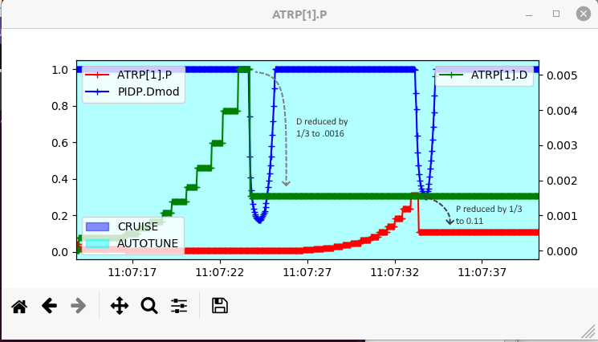

.. common-aerobatics-tuning:

[copywiki destination="plane"]
================================
Tuning for Autonomous Aerobatics
================================

First, be sure your plane is capable of precision aerobatics. It must be able to not only nose up hover in place, but accelerate vertically from a hover, ie have unlimited vertical climb capability. It must also be capable of sustained knife-edge flignt, ie have sufficient side area to fly knife-edge.

Second, the normal ArduPilot Autotune provides a safe, stable PID tune for most vehicles. As such, its not optimized for precision aerobatics which require a tight tune.

This article will discuss how to obtain a more optimized tune.

Setup
=====

- Be sure the COG is properly setup. Nose heavy vehicles will perform poorly. Tail heavy vehicles will involve significant repairs.
- Set :ref:`SCHED_LOOP_RATE<SCHED_LOOP_RATE>` = 200 
- Set :ref:`ONESHOT_MASK<ONESHOT_MASK>` to match the servos controlling the flying surfaces, assuming that they are digital servos capable of 200Hz signaling
- Set :ref:`INS_GYRO_FILTER<INS_GYRO_FILTER>` = 40Hz to increase phase margin. Be sure the motor/propeller is well balanced and control surface hinges slop-free to minimize vibration since the filtering is being raised.
- Depending on the amount of fuselage side area, adequate knife-edge performance may require setting the ``AEROM_KE_ANGLE`` plane_aerobatics.lua parameter to 5-15 degrees to get adequate altitude hold on knife-edges, rolling circles, etc.

Verifying the Rate Capabilities
===============================

The :ref:`ACRO_PITCH_RATE<ACRO_PITCH_RATE>`, :ref:`ACRO_ROLL_RATE<ACRO_ROLL_RATE>`, and :ref:`ACRO_YAW_RATE<ACRO_YAW_RATE>` must be set to less than what the airframe is capable of doing. Values of 180, 360, and 90 degress per second, respectively, are adequate for aerobatics, but they should be verified to be less than the vehicles's maximum capabilities. 

Do a flight in Manual mode, with full stick movements in all axes in order to determine the maximum rotation rates that can be obtained. Analysis of the flight logs using the IMU[0].GyrX for roll in radians/second, IMU[0].GyrY for pitch, and IMU[0].GyrZ for yaw log messages will show the obtained rates.

Below is a graph in MAVExplorer of those log messages (converted to degrees/s) from a flight log of a vehicle in MANUAL doing full stick moves to establish the maximum rate capabilities:

The vehicle is definitely capable of meeting the 360 deg/s for roll, while 180 deg/s would be acceptable for pitch (it varies as its looping due to varying airspeed, but 180 is the average), 90 deg/s for yaw is acceptable.

Note that Yaw rate checking should be done with short stick movements, instead of prolonged full stick deflections to prevent excessive speed bleed off while the vehicle is slipping hard into the airstream.

AutoTune
========

Set :ref:`AUTOTUNE_LEVEL<AUTOTUNE_LEVEL>` = 8, and do an :ref:`Autotuning <automatic-tuning-with-autotune>` flight. Be sure to have set :ref:`YAW_RATE_ENABLE<YAW_RATE_ENABLE>` =1, and tune all three axes.

.. note:: with yaw controller active, turns will require not only aileron but also rudder in Autotune!

Check PIDS
==========

From the the Autotuning flight, check the logs for proper FF PID, and to tighten up the P and D terms. For the following we will look at an actual log and check if how the Pitch portion of the Aututune turned out by comparing the "Target" (PIDP.Tar log message) rates demanded by the stick movements during the Autotune for pitch versus what the actual pitch rotation rates (PIDP.Act) where measured by the IMU. 

As the tune progressed adjusting FF throughout the tune, which begins by optimizing D and then P, the matching became better and better, as expected.

FF
--

This tune settled on a value of 0.285 for :ref:`PTCH_RATE_FF<PTCH_RATE_FF>`. We can check this by graphing the following using that value to verify its accuracy.

since the magnitudes of the two plots are very close, we know the FF term is correct, in this case. If there is a disparity, you can adjust the FF value in the first graph until a match is obtained. This is then the correct FF value for that axis.

P and D Tightening
------------------

Typically, the FF will be very pretty accurate from an Autotune, but in order to be safe for the majority of vehicles, the D and P values are tuned until instability occurs and then reduced by 1/3 for a large safety margin. This is illustrated in the log graphs below during the Autotune showing the D and P values being adjusted until instability occurs (PIDP.Dmod < 1), and then backed down by 1/3. While this is safe, its not optimum for response, so increasing these values back by a factor of 1.5-2X will increase responsiveness. Be prepared, however, to switch back to MANUAL if instability occurs.

so in this example we would change the :ref:`PTCH_RATE_D<PTCH_RATE_D>` from 0.0016 to 0.0032 and the :ref:`PTCH_RATE_P<PTCH_RATE_P>` from 0.11 to 0.22 and then test fly.

Confirming Test Flight
======================

Do the above analysis for all axes.

After verifying and modifying the PIDS, fly again, being ready to resume MANUAL control if unstable. A rolling circle trick is one of the most difficult to execute with a softly tuned vehicle, so try that trick. If it does not maintain altitude well, the pitch or yaw tuning during that maneuver should be analyzed and tuning tweaks performed, assuming there is not another issue like insufficient power or fuselage side surface area.

Video on Log Analysis
=====================

.. youtube:: vGgfyhUOZGk
