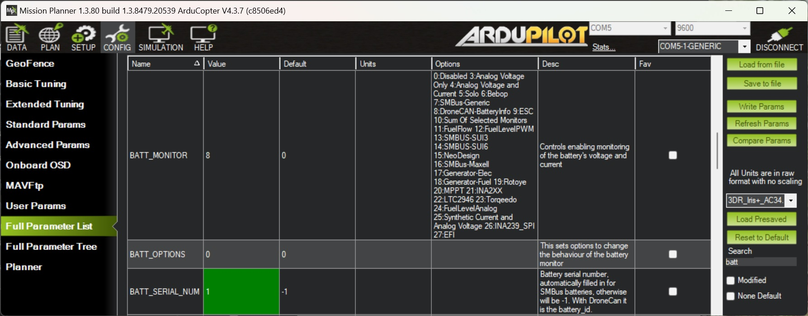

.. _common-aerotate-dronecan-battery:

=========================
Aerotate DroneCAN Battery
=========================

The `aeroPAX <https://aerotate.com/>`__ batteries are smart batteries, that communicate through DroneCAN, which gives the advantage of being able to set up several batteries in one system.

The Aerotate aeroPAX Smart Batteries come with a standard DroneCAN interface, through which the following information is transmitted:

- Stack-Voltage
- Current
- Cell-temperature
- Status flags (9 different flags)
- State of charge in % (SOC)
- Battery ID (number corresponding to the adapter the battery is connected to)
- Model instance ID (unique for each battery of one model)
- Model Name

The information below can be transmitted through the DroneCAN interface and will be usable in a future update:

- State of health in % (SOH)
- State of charge standard deviation
- Remaining capacity Wh
- Full charge capacity Wh
- Hours to full charge
- Average Power 10sec
 
When managing a fleet with a high number of drones, the battery status data. Data about the status of the individual cells as well as logging data of each individual flight can be uploaded using a wifi-capable interfacing hardware that can be integrated in the chargers.

When a software update is rolled out, you can easily update the batteries using the DroneCAN GUI Tool.

Connection and Configuration
============================

The aeroPAX batteries come with a standard adapter to attach to your drone. The adapter comes with standard JST-GH plugs to connect to one of the CAN buses. Current distribution can be done directly on the adapter board. The adapters are customizable, if there is the need, you can contact info@aerotate.de.

To setup the aeroPAX Smart Battery in Mission Planer for DroneCAN, go to Config/Tuning Full Parameter List, then search for “BATT” or scroll down to :ref:`BATT_MONITOR<BATT_MONITOR>`.

Connect to the autopilot with a ground station and set the following parameters and then reboot the autopilot

- Set :ref:`CAN_P1_DRIVER<CAN_P1_DRIVER>` to 1 (First Driver) or :ref:`CAN_P2_DRIVER<CAN_P2_DRIVER>` to 1 (Second Driver) for second CAN port
- Set :ref:`CAN_D1_PROTOCOL<CAN_D1_PROTOCOL>` to 1 (DroneCAN) or :ref:`CAN_D2_PROTOCOL<CAN_D2_PROTOCOL>` to 1 for second CAN port
- Set :ref:`BATT_MONITOR<BATT_MONITOR>` to 8 (DroneCAN)
- Set :ref:`BATT_SERIAL_NUM<BATT_SERIAL_NUM>` to the address you have set at the battery adapter. On each battery adapter, 4 bits can be set to encode this field resulting in 16 possible addresses, where addresses 0 and 15 are reserved and cannot be used. The DroneCAN parameter is battery_id.

The aeroPAX batteries can be setup in parallel and series, but max 2 in series. For parallel setups, a protected output is strongly recommended. It enables hot-swap-ability and protects against user errors.
For parallel setups an additional battery monitor can be added as :ref:`BATT_SUM_MASK<BATT_SUM_MASK>`, this will sum up the currents and average the voltages, for a better overview.

Safety
======

Using Mission Planner's preflight checklist can enhance your safety, by checking that the state of charge (SOC) is above a specific limit.

