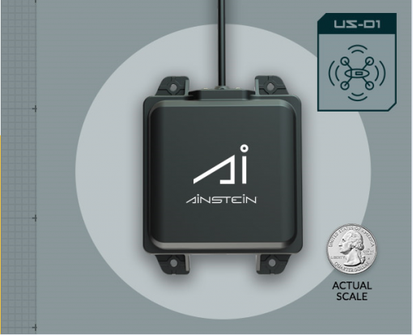

.. _common-aerotenna-usd1:

===============================
Aerotenna US-D1 Radar Altimeter
===============================

The `Aerotenna US-D1 Radar Altimeter <https://aerotenna.com/shop/%ce%bclanding-lite-microwave-radar-altimeter-device-only/>`__ has a range of 50m, an update rate of 82hz and weighs only 110g.

.. warning:: currently the manufacturer warns that operation indoors can be problematic due to multi-path reflections...caution is advised

The user manual for this radar unit can be found `here <https://cdn.shopify.com/s/files/1/0113/0414/0900/files/User_Manual_US-D1.pdf?16288212927919010227>`__

.. note::

   Support for this sensor is available in Ardupilot firmware versions 4.0 and later

Where to Buy
------------

Units can be purchased thru `Aerotenna <https://aerotenna.com/shop/>`__

Connecting to the Autopilot
-----------------------------------

For a serial connection you can use any spare Serial/UART port.  The example below shows how to connect to SERIAL4 as the first rangefinder.

-  :ref:`SERIAL4_PROTOCOL <SERIAL4_PROTOCOL>` = 9 (Lidar)
-  :ref:`SERIAL4_BAUD <SERIAL4_BAUD>` = 38 (38400 baud)
-  :ref:`RNGFND1_TYPE <RNGFND1_TYPE>` = 11 (uLanding...this device's name as a prototype)
-  :ref:`RNGFND1_MIN_CM <RNGFND1_MIN_CM>` = 50
-  :ref:`RNGFND1_MAX_CM <RNGFND1_MAX_CM>` = 4500
-  :ref:`RNGFND1_GNDCLEAR <RNGFND1_GNDCLEAR>` = 10 *or more accurately the distance in centimetres from the range finder to the ground when the vehicle is landed.  This value depends on how you have mounted the rangefinder.*

Testing the sensor
==================

Distances read by the sensor can be seen in the Mission Planner's Flight
Data screen's Status tab. Look closely for "sonarrange".

.. image:: ../../../images/mp_rangefinder_lidarlite_testing.jpg
    :target: ../_images/mp_rangefinder_lidarlite_testing.jpg
