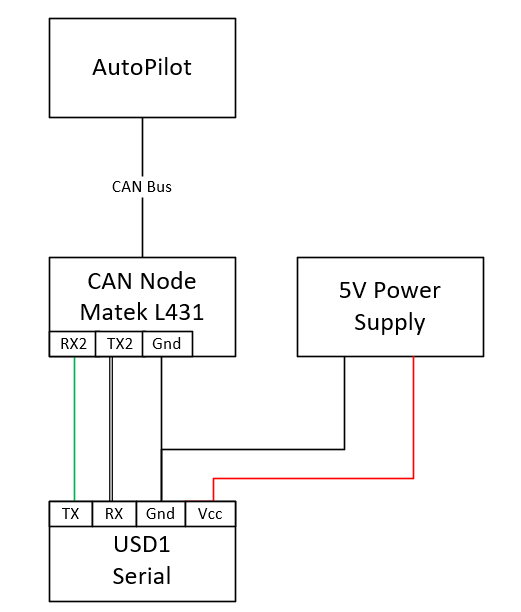

.. _common-aerotenna-usd1:

==============================
Ainstein US-D1 Radar Altimeter
==============================

The `Ainstein US-D1 Radar Altimeter <https://ainstein.ai/drone-makers-drone-service-providers/us-d1/>`__ has a range of 50m, an update rate of 100hz and weighs only 110g.

.. warning:: currently the manufacturer warns that operation indoors can be problematic due to multi-path reflections...caution is advised

The user manual for this radar unit can be found `here. <https://ainstein.ai/wp-content/uploads/US-D1-Technical-User-Manual-D00.02.05.docx.pdf>`__

.. image:: ../../../images/aerotenna-usd1.png

.. note::

   Support for this sensor is available in ArduPilot firmware versions 4.0 and later

Where to Buy
------------

Units can be purchased through `Ainstein's website. <https://ainstein.ai/>`__

Connecting to the Autopilot
-----------------------------------

The USD1 is available in serial and DroneCAN versions.

For a serial connection you can use any spare Serial/UART port.  The example below shows how to connect to SERIAL4 as the first rangefinder.

-  :ref:`SERIAL4_PROTOCOL <SERIAL4_PROTOCOL>` = 9 (Lidar)
-  :ref:`SERIAL4_BAUD <SERIAL4_BAUD>` = 115 (115200 baud)
-  :ref:`RNGFND1_TYPE <RNGFND1_TYPE>` = 11 (USD1-Serial)
-  :ref:`RNGFND1_MIN_CM <RNGFND1_MIN_CM>` = 50
-  :ref:`RNGFND1_MAX_CM <RNGFND1_MAX_CM>` = 4500
-  :ref:`RNGFND1_GNDCLEAR <RNGFND1_GNDCLEAR>` = 10 *or more accurately the distance in centimeters from the range finder to the ground when the vehicle is landed.  This value depends on how you have mounted the rangefinder.*

For the CAN version, connect via CAN to the autopilot and set the following parameters:

-  :ref:`CAN_P1_DRIVER<CAN_P1_DRIVER>` =  1 (first can port driver set to driver 1)
-  :ref:`CAN_D1_PROTOCOL<CAN_D1_PROTOCOL>` =  7 (USD1 protocol for driver 1)
-  :ref:`RNGFND1_TYPE <RNGFND1_TYPE>` = 33 (USD1_CAN)
-  :ref:`RNGFND1_MIN_CM <RNGFND1_MIN_CM>` = 50
-  :ref:`RNGFND1_MAX_CM <RNGFND1_MAX_CM>` = 4500
-  :ref:`RNGFND1_GNDCLEAR <RNGFND1_GNDCLEAR>` = 10 *or more accurately the distance in centimeters from the range finder to the ground when the vehicle is landed.  This value depends on how you have mounted the rangefinder.*

Testing the sensor
==================

Distances read by the sensor can be seen in the Mission Planner's Flight
Data screen's Status tab. Look closely for "sonarrange".

.. image:: ../../../images/mp_rangefinder_lidarlite_testing.jpg
    :target: ../_images/mp_rangefinder_lidarlite_testing.jpg

Using the sensor with an AP Periph DroneCAN Node
================================================
The USD1 is available in either CAN or Serial communication protocol versions. The USD1 CAN protocol is different than DroneCAN and hence requires a dedicated CAN port running this protocol. If the autopilot does not have a spare CAN port or spare serial port for conencting the USD1, but has a DroneCAN port setup, you can create another serial port in the system using an AP_Periph CAN node attached to the DroneCAN port. The USD1 MUST be the Serial version for this to work.

To use the USD1 with a CAN Node like the Matek AP_Periph CAN Node L431, use the following set up.

First, flash the AP_Periph device with a firmware that has the rangefinder features. For the Matek AP_Periph CAN Node L431, the latest stable firmware is `here. <https://firmware.ardupilot.org/AP_Periph/stable/MatekL431-Rangefinder/>`__

Set the parameters in the CAN Node to the following:

-  RNGFND_BAUDRATE = 115
-  RNGFND_MAX_RATE = 50
-  RNGFND_PORT = 1 (UART 2, i.e. TX2, RX2)
-  RNGFND1_ORIENT = 0 (No matter what orientation)
-  RNGFND1_TYPE = 11

.. warning::

   RNGFND_PORT is indexed differently than the UARTs on the board. For RNGFND_PORT = 0, use RX1 and TX1 on the board, etc.

Next, set the parameters on the autopilot:

-  RNGFND1_TYPE = 24 (DroneCAN) Then Restart
-  RNGFND1_ORIENT = 25 (Down)
-  RNGFND1_ADDR = 0 (For sensor_id = 0)

.. note::

   If there is more than one rangefinder in the system you will need to determine the Sensor ID for the USD1. Look in CAN inspector for a message "uavcan_equiment_range_sensor_Measurement" for its sensor_id.