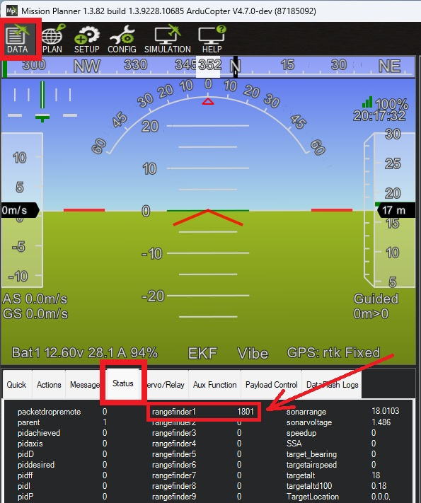

.. _common-ainstein-ldd1:

=========================================
Ainstein LR-D1 Long Range Radar Altimeter
=========================================

The `Ainstein LR-D1 Long Range Radar Altimeter <https://ainstein.ai/lr-d1-uav-long-range-radar-altimeter/>`__ has a range of 500m, an update rate of 40hz and weighs 300g.

.. note::

   Support for this sensor is available in ArduPilot firmware versions 4.6 and later

The user manual for this radar unit can be found `here. <https://ainstein.ai/wp-content/uploads/LR-D1-Technical-User-Manual.docx.pdf>`__

Where to Buy
============

Units can be purchased through `Ainstein's website. <https://ainstein.ai/>`__

Connecting to the Autopilot
===========================

The LR-D1 is available in serial and DroneCAN versions.

For a serial connection you can use any spare Serial/UART port.  The example below shows how to connect to SERIAL4 as the first rangefinder.

-  :ref:`SERIAL4_PROTOCOL <SERIAL4_PROTOCOL>` = 9 (Lidar)
-  :ref:`SERIAL4_BAUD <SERIAL4_BAUD>` = 115 (115200 baud)
-  :ref:`RNGFND1_TYPE <RNGFND1_TYPE>` = 42 (Ainstein_LR_D1)
-  :ref:`RNGFND1_MIN_CM <RNGFND1_MIN_CM>` = 100
-  :ref:`RNGFND1_MAX_CM <RNGFND1_MAX_CM>` = 50000
-  :ref:`RNGFND1_GNDCLEAR <RNGFND1_GNDCLEAR>` = 10 *or more accurately the distance in centimeters from the range finder to the ground when the vehicle is landed.  This value depends on how you have mounted the rangefinder.*

Testing the sensor
==================

Distances read by the sensor can be seen in the Mission Planner's Flight
Data screen's Status tab. Look closely for "sonarrange".

